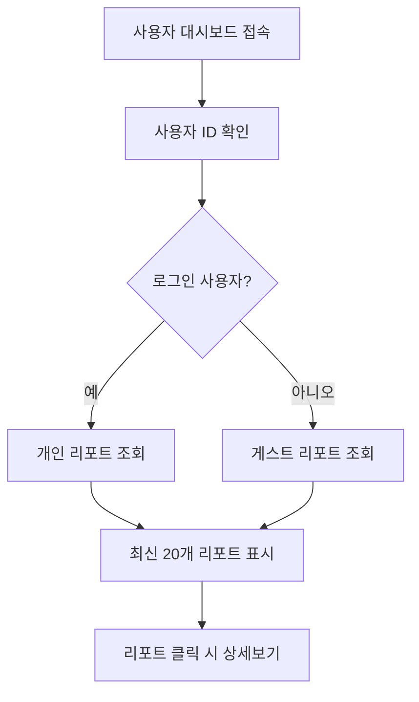

# AI 분석 리포트 DB 저장 개선 요구사항 문서

## 1. 프로젝트 개요
Patent-AI 시스템의 시장분석 및 비즈니스 인사이트 리포트 생성 기능에서 DB 저장 로직을 개선하고, 사용자 대시보드에 최신 리포트 목록을 표시하는 기능을 구현합니다.

- **목적**: AI 분석 리포트의 안정적인 DB 저장 및 사용자 접근성 향상
- **대상 사용자**: Patent-AI 플랫폼의 모든 사용자 (로그인 사용자 및 게스트)
- **비즈니스 가치**: 사용자 경험 개선 및 데이터 관리 효율성 증대

## 2. 핵심 기능

### 2.1 사용자 역할
| 역할 | 등록 방법 | 핵심 권한 |
|------|-----------|----------|
| 로그인 사용자 | 이메일 회원가입 | 개인 리포트 저장/조회, 무제한 히스토리 |
| 게스트 사용자 | 별도 등록 없음 | 임시 리포트 생성, 제한된 히스토리 |

### 2.2 기능 모듈
AI 분석 리포트 DB 저장 개선 요구사항은 다음 주요 페이지로 구성됩니다:
1. **AI 분석 API 개선**: 리포트 생성 시 DB 저장 로직 강화
2. **사용자 대시보드 개선**: 최신 리포트 목록 표시 기능 추가
3. **데이터 관리 시스템**: 100일 보관 원칙에 따른 자동 정리

### 2.3 페이지 세부사항
| 페이지명 | 모듈명 | 기능 설명 |
|---------|--------|----------|
| **AI 분석 API** | 리포트 저장 로직 | 시장분석/비즈니스 인사이트 리포트를 ai_analysis_reports 테이블에 저장. 사용자 ID 매핑, 에러 처리, 로깅 강화 |
| **사용자 대시보드** | 최신 리포트 섹션 | 최근 생성된 20개 리포트를 시간순으로 표시. 리포트 제목, 생성일, 다운로드 링크 제공 |
| **데이터 관리 시스템** | 자동 정리 기능 | 100일 이상 된 리포트 자동 삭제. 배치 작업으로 매일 실행 |

## 3. 핵심 프로세스

### 3.1 AI 리포트 생성 및 저장 플로우
```mermaid
graph TD
    A[사용자가 AI 분석 요청] --> B[특허 데이터 분석]
    B --> C[AI 리포트 생성]
    C --> D[구조화된 데이터 파싱]
    D --> E[DB 저장 시도]
    E --> F{저장 성공?}
    F -->|성공| G[사용자에게 리포트 반환]
    F -->|실패| H[에러 로깅 및 재시도]
    H --> I[사용자에게 리포트 반환 (저장 실패 알림)]
    G --> J[대시보드에 리포트 표시]
```

### 3.2 대시보드 리포트 조회 플로우


## 4. 사용자 인터페이스 설계

### 4.1 디자인 스타일
- **주요 색상**: 기존 Patent-AI 브랜딩과 일치 (파란색 계열)
- **버튼 스타일**: 둥근 모서리, 호버 효과
- **폰트**: Inter 폰트 패밀리, 14px-16px 기본 크기
- **레이아웃**: 카드 기반 디자인, 반응형 그리드
- **아이콘**: Lucide React 아이콘 세트 사용

### 4.2 페이지 디자인 개요
| 페이지명 | 모듈명 | UI 요소 |
|---------|--------|---------|
| **사용자 대시보드** | 최신 리포트 섹션 | 카드 형태의 리포트 목록, 제목/날짜/타입 표시, 다운로드 버튼, 페이지네이션 |
| **AI 분석 페이지** | 저장 상태 표시 | 리포트 생성 완료 시 "저장됨" 상태 표시, 에러 시 재시도 버튼 |

### 4.3 반응형 설계
데스크톱 우선 설계로 모바일 적응형 구현. 터치 인터랙션 최적화 고려.

## 5. 기술적 구현 요구사항

### 5.1 DB 스키마 개선
```sql
-- ai_analysis_reports 테이블 인덱스 추가
CREATE INDEX IF NOT EXISTS idx_ai_analysis_reports_user_created 
ON ai_analysis_reports(user_id, created_at DESC);

CREATE INDEX IF NOT EXISTS idx_ai_analysis_reports_created_at 
ON ai_analysis_reports(created_at DESC);
```

### 5.2 API 개선사항
- `saveReportToDatabase` 함수의 에러 처리 강화
- 재시도 로직 구현 (최대 3회)
- 상세한 로깅 시스템 구축
- 게스트 사용자 처리 로직 개선

### 5.3 자동 정리 시스템
```sql
-- 100일 이상 된 리포트 삭제 함수
CREATE OR REPLACE FUNCTION cleanup_old_reports()
RETURNS void AS $$
BEGIN
    DELETE FROM ai_analysis_reports 
    WHERE created_at < NOW() - INTERVAL '100 days';
END;
$$ LANGUAGE plpgsql;
```

### 5.4 성능 최적화
- 리포트 목록 조회 시 페이지네이션 구현
- 캐싱 전략 수립 (Redis 활용)
- 대용량 리포트 처리를 위한 청크 단위 저장

## 6. 데이터 관리 정책

### 6.1 보관 정책
- **일반 사용자**: 100일간 보관 후 자동 삭제
- **프리미엄 사용자**: 1년간 보관 (향후 확장)
- **관리자**: 영구 보관

### 6.2 백업 및 복구
- 일일 자동 백업 수행
- 중요 리포트는 별도 아카이브 저장
- 사용자 요청 시 삭제된 리포트 복구 가능 (30일 이내)

## 7. 보안 및 개인정보 보호

### 7.1 데이터 보안
- 리포트 내용 암호화 저장
- 사용자별 접근 권한 엄격 관리
- API 요청 시 사용자 인증 필수

### 7.2 개인정보 처리
- 게스트 사용자 데이터는 IP 기반 익명 처리
- 개인식별정보 최소화 원칙 적용
- GDPR 준수를 위한 데이터 삭제 요청 처리

## 8. 테스트 및 품질 보증

### 8.1 테스트 시나리오
1. **기능 테스트**: 리포트 생성 → DB 저장 → 대시보드 표시 전체 플로우
2. **성능 테스트**: 동시 사용자 100명 기준 리포트 생성 테스트
3. **에러 처리 테스트**: DB 연결 실패, 저장 공간 부족 등 예외 상황
4. **보안 테스트**: 권한 없는 리포트 접근 시도, SQL 인젝션 방어

### 8.2 모니터링 지표
- 리포트 저장 성공률 (목표: 99.5% 이상)
- 대시보드 로딩 시간 (목표: 2초 이내)
- DB 저장 실패 알림 시스템
- 사용자 만족도 피드백 수집