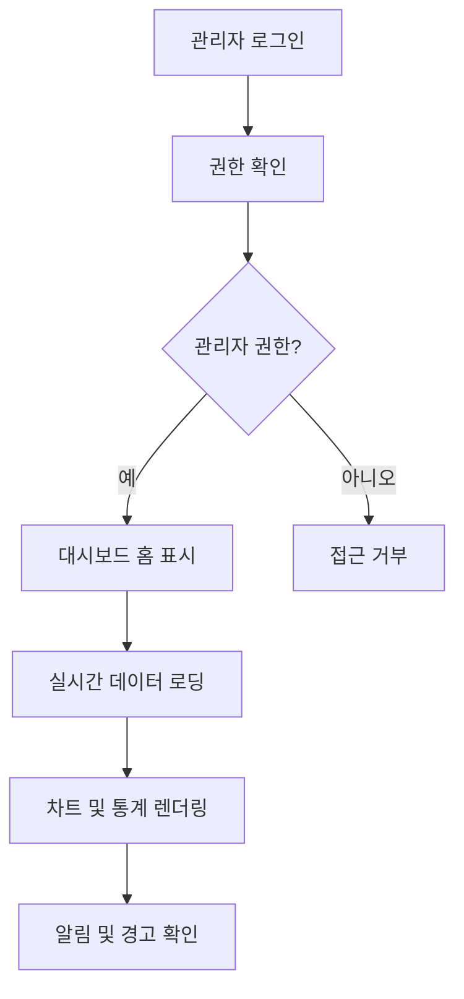
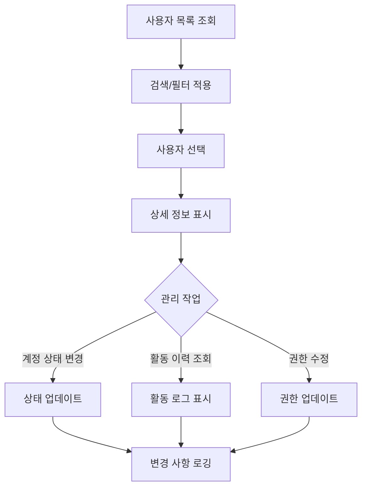
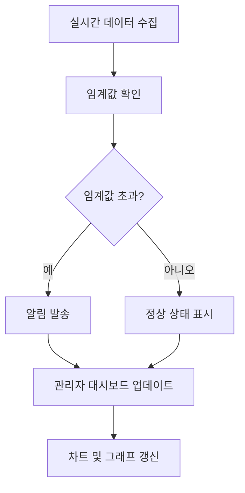

# 관리자 대시보드 완전 재설계 요구사항 문서

## 1. 프로젝트 개요
Patent-AI 시스템의 관리자 대시보드를 현재 사이트와 일관성 있는 모던한 디자인으로 완전히 재설계하여 직관적이고 효율적인 관리 환경을 제공합니다.

- **목적**: 관리자의 시스템 모니터링 및 관리 효율성 극대화
- **대상 사용자**: 시스템 관리자, 운영팀, 데이터 분석가
- **비즈니스 가치**: 운영 효율성 향상 및 데이터 기반 의사결정 지원

## 2. 핵심 기능

### 2.1 사용자 역할
| 역할 | 접근 방법 | 핵심 권한 |
|------|-----------|----------|
| 슈퍼 관리자 | 관리자 전용 로그인 | 모든 시스템 설정 및 사용자 관리 |
| 운영 관리자 | 권한 부여된 계정 | 사용자 활동 모니터링, 리포트 관리 |
| 데이터 분석가 | 읽기 전용 계정 | 통계 조회 및 분석 리포트 생성 |

### 2.2 기능 모듈
관리자 대시보드는 다음 주요 섹션으로 구성됩니다:
1. **대시보드 홈**: 핵심 지표 및 실시간 모니터링
2. **사용자 관리**: 사용자 목록, 활동 추적, 권한 관리
3. **시스템 모니터링**: 서버 상태, API 성능, 에러 추적
4. **리포트 관리**: AI 분석 리포트 통계 및 품질 관리
5. **설정 관리**: 시스템 설정 및 환경 변수 관리

### 2.3 페이지 세부사항
| 페이지명 | 모듈명 | 기능 설명 |
|---------|--------|----------|
| **대시보드 홈** | 실시간 통계 | 일일/주간/월간 핵심 지표 표시. 실시간 사용자 수, API 호출량, 에러율 모니터링 |
| **사용자 관리** | 사용자 목록 | 전체 사용자 목록, 검색/필터링, 활동 이력, 계정 상태 관리 |
| **사용자 관리** | 활동 추적 | 사용자별 상세 활동 로그, 검색 패턴 분석, 이상 행동 탐지 |
| **시스템 모니터링** | 서버 상태 | CPU, 메모리, 디스크 사용량, API 응답시간, 데이터베이스 성능 |
| **시스템 모니터링** | 에러 추적 | 실시간 에러 로그, 에러 분류 및 통계, 알림 설정 |
| **리포트 관리** | AI 분석 통계 | 리포트 생성 통계, 품질 지표, 사용자 만족도 분석 |
| **리포트 관리** | 품질 관리 | AI 응답 품질 모니터링, 부적절한 콘텐츠 탐지, 개선 제안 |
| **설정 관리** | 시스템 설정 | API 키 관리, 환경 변수 설정, 기능 토글, 유지보수 모드 |

## 3. 핵심 프로세스

### 3.1 관리자 대시보드 접근 플로우


### 3.2 사용자 관리 플로우


### 3.3 시스템 모니터링 플로우


## 4. 사용자 인터페이스 설계

### 4.1 디자인 스타일
- **주요 색상**: 
  - Primary: #3B82F6 (파란색)
  - Secondary: #10B981 (초록색)
  - Warning: #F59E0B (주황색)
  - Danger: #EF4444 (빨간색)
- **버튼 스타일**: 둥근 모서리 (8px), 그라데이션 효과, 마이크로 인터랙션
- **폰트**: Inter 폰트, 계층적 타이포그래피 (12px-32px)
- **레이아웃**: 사이드바 네비게이션, 카드 기반 콘텐츠, 그리드 시스템
- **아이콘**: Lucide React 아이콘, 일관된 스타일

### 4.2 페이지 디자인 개요
| 페이지명 | 모듈명 | UI 요소 |
|---------|--------|---------|
| **대시보드 홈** | 통계 카드 | 4x2 그리드 레이아웃, 실시간 차트, 진행률 바, 알림 배지 |
| **대시보드 홈** | 실시간 차트 | Line/Bar/Pie 차트, 인터랙티브 툴팁, 시간 범위 선택기 |
| **사용자 관리** | 사용자 테이블 | 정렬/필터링 가능한 데이터 테이블, 페이지네이션, 액션 버튼 |
| **사용자 관리** | 활동 타임라인 | 시간순 활동 로그, 필터링 옵션, 상세보기 모달 |
| **시스템 모니터링** | 상태 대시보드 | 실시간 게이지 차트, 상태 인디케이터, 알림 패널 |
| **리포트 관리** | 통계 차트 | 다양한 차트 타입, 드릴다운 기능, 데이터 내보내기 |

### 4.3 반응형 설계
- **데스크톱**: 사이드바 + 메인 콘텐츠 레이아웃
- **태블릿**: 접을 수 있는 사이드바, 적응형 그리드
- **모바일**: 하단 네비게이션, 스택형 레이아웃

## 5. 기술적 구현 요구사항

### 5.1 프론트엔드 아키텍처
```typescript
// 관리자 대시보드 컴포넌트 구조
interface AdminDashboardProps {
  user: AdminUser;
  permissions: AdminPermission[];
}

interface DashboardStats {
  totalUsers: number;
  activeUsers: number;
  totalReports: number;
  systemHealth: SystemHealth;
  recentActivities: Activity[];
}
```

### 5.2 실시간 데이터 처리
- **WebSocket 연결**: 실시간 통계 업데이트
- **Server-Sent Events**: 알림 및 경고 메시지
- **폴링 전략**: 중요하지 않은 데이터는 30초 간격 폴링

### 5.3 차트 및 시각화
```typescript
// Recharts 기반 차트 컴포넌트
interface ChartConfig {
  type: 'line' | 'bar' | 'pie' | 'area';
  data: ChartData[];
  colors: string[];
  responsive: boolean;
  animations: boolean;
}
```

### 5.4 상태 관리
- **Zustand**: 전역 상태 관리
- **React Query**: 서버 상태 캐싱 및 동기화
- **로컬 스토리지**: 사용자 설정 및 필터 상태 저장

## 6. 데이터 모델 및 API 설계

### 6.1 관리자 통계 API
```typescript
// GET /api/admin/dashboard-stats
interface DashboardStatsResponse {
  summary: {
    totalUsers: number;
    activeUsers: number;
    totalReports: number;
    systemHealth: 'healthy' | 'warning' | 'critical';
  };
  charts: {
    userGrowth: ChartData[];
    reportGeneration: ChartData[];
    systemPerformance: ChartData[];
  };
  alerts: Alert[];
}
```

### 6.2 사용자 관리 API
```typescript
// GET /api/admin/users
interface UsersResponse {
  users: AdminUserInfo[];
  pagination: PaginationInfo;
  filters: FilterOptions;
}

// GET /api/admin/users/:id/activities
interface UserActivitiesResponse {
  activities: UserActivity[];
  summary: ActivitySummary;
}
```

### 6.3 시스템 모니터링 API
```typescript
// GET /api/admin/system-health
interface SystemHealthResponse {
  server: {
    cpu: number;
    memory: number;
    disk: number;
  };
  database: {
    connections: number;
    queryTime: number;
    size: number;
  };
  api: {
    responseTime: number;
    errorRate: number;
    requestCount: number;
  };
}
```

## 7. 보안 및 권한 관리

### 7.1 접근 제어
- **역할 기반 접근 제어 (RBAC)**: 세분화된 권한 관리
- **IP 화이트리스트**: 관리자 접근 IP 제한
- **2단계 인증**: 관리자 계정 보안 강화
- **세션 관리**: 자동 로그아웃 및 동시 세션 제한

### 7.2 감사 로그
- **모든 관리 작업 로깅**: 사용자 관리, 설정 변경, 데이터 접근
- **변경 이력 추적**: 누가, 언제, 무엇을 변경했는지 기록
- **로그 보관**: 1년간 보관 후 아카이브

## 8. 성능 최적화

### 8.1 프론트엔드 최적화
- **코드 스플리팅**: 페이지별 번들 분리
- **가상화**: 대용량 테이블 렌더링 최적화
- **메모이제이션**: 불필요한 리렌더링 방지
- **이미지 최적화**: WebP 포맷, 지연 로딩

### 8.2 백엔드 최적화
- **데이터베이스 인덱싱**: 자주 조회되는 컬럼 인덱스 추가
- **캐싱 전략**: Redis 기반 통계 데이터 캐싱
- **API 응답 압축**: Gzip 압축 적용
- **배치 처리**: 대용량 데이터 처리 최적화

## 9. 모니터링 및 알림

### 9.1 실시간 알림
- **시스템 장애**: 서버 다운, DB 연결 실패
- **성능 저하**: 응답시간 증가, 에러율 상승
- **보안 이벤트**: 비정상 로그인 시도, 권한 변경
- **사용량 임계값**: 사용자 수 급증, 리소스 사용량 초과

### 9.2 알림 채널
- **이메일**: 중요한 시스템 알림
- **Slack**: 실시간 운영 알림
- **SMS**: 긴급 상황 알림
- **대시보드**: 실시간 알림 패널

## 10. 테스트 및 품질 보증

### 10.1 테스트 전략
- **단위 테스트**: 개별 컴포넌트 및 함수 테스트
- **통합 테스트**: API 연동 및 데이터 플로우 테스트
- **E2E 테스트**: 전체 관리자 워크플로우 테스트
- **성능 테스트**: 대용량 데이터 처리 성능 검증

### 10.2 품질 지표
- **페이지 로딩 시간**: 3초 이내
- **API 응답 시간**: 500ms 이내
- **에러율**: 0.1% 이하
- **사용자 만족도**: 4.5/5.0 이상

## 11. 배포 및 운영

### 11.1 배포 전략
- **블루-그린 배포**: 무중단 배포
- **카나리 배포**: 점진적 기능 롤아웃
- **롤백 계획**: 문제 발생 시 즉시 이전 버전 복구

### 11.2 운영 가이드
- **관리자 매뉴얼**: 기능별 사용법 가이드
- **트러블슈팅**: 일반적인 문제 해결 방법
- **정기 점검**: 주간/월간 시스템 점검 체크리스트