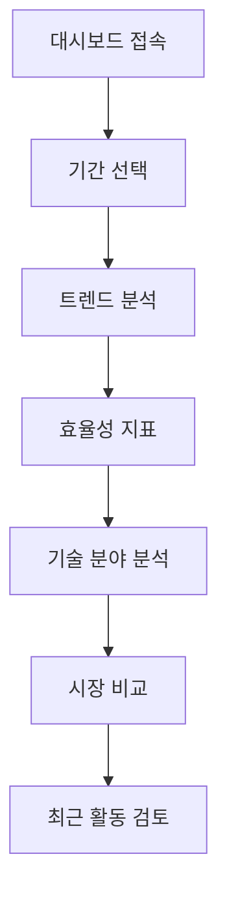

# 대시보드 분석 기능 개선 PRD

## 1. Product Overview
사용자의 활동 데이터를 기반으로 한 포괄적인 대시보드 분석 기능을 제공하여, 개인의 특허 검색 및 리포트 생성 패턴을 시각화하고 전체 사용자 대비 비교 분석을 통해 인사이트를 제공합니다.

- 실제 데이터베이스에 저장된 사용자 활동 내역을 기반으로 10가지 핵심 분석 지표를 제공
- 개인 vs 전체 사용자 비교를 통한 벤치마킹 기능 제공

## 2. Core Features

### 2.1 User Roles
| Role | Registration Method | Core Permissions |
|------|---------------------|------------------|
| 일반 사용자 | 이메일 회원가입 | 개인 대시보드 분석 데이터 조회 |
| 프리미엄 사용자 | 구독 업그레이드 | 고급 분석 및 상세 비교 데이터 조회 |

### 2.2 Feature Module
대시보드 분석 기능은 다음과 같은 주요 모듈로 구성됩니다:

1. **트렌드 분석 페이지**: 검색 및 리포트 생성 추이 시각화
2. **효율성 지표 페이지**: 로그인 대비 리포트 발행률, 검색 대비 리포트 발행률
3. **기술 분야 분석 페이지**: IPC/CPC 기반 도넛 그래프 및 비교 분석
4. **최근 활동 페이지**: 최근 리포트 및 검색어 목록

### 2.3 Page Details

| Page Name | Module Name | Feature description |
|-----------|-------------|---------------------|
| 대시보드 메인 | 트렌드 차트 | 일별 검색 건수 및 리포트 건수 추이를 라인 차트로 표시. 30일/90일 기간 선택 가능 |
| 대시보드 메인 | 효율성 지표 | 로그인 대비 리포트 발행률(%), 검색 대비 리포트 발행률(%) 표시. 진행률 바 형태로 시각화 |
| 대시보드 메인 | 기술 분야 분석 | 사용자 검색/리포트 IPC/CPC 분포를 도넛 차트로 표시. 전체 사용자 평균과 비교 |
| 대시보드 메인 | 시장 비교 분석 | 개인 vs 전체 사용자 검색/리포트 건수를 비교 차트로 표시 |
| 대시보드 메인 | 최근 활동 목록 | 최근 리포트 제목 20개, 최근 검색어 10개를 시간순으로 표시 |

## 3. Core Process

### 일반 사용자 Flow
1. 대시보드 접속 → 개인 통계 데이터 로드
2. 기간 선택 (7일/30일/90일) → 해당 기간 데이터 필터링
3. 트렌드 차트 확인 → 검색/리포트 패턴 분석
4. 효율성 지표 확인 → 개인 생산성 평가
5. 기술 분야 분석 → 관심 분야 파악
6. 시장 비교 → 전체 사용자 대비 위치 확인
7. 최근 활동 → 구체적인 활동 내역 검토



## 4. User Interface Design

### 4.1 Design Style
- **Primary Colors**: #3B82F6 (파란색), #10B981 (초록색)
- **Secondary Colors**: #6B7280 (회색), #F59E0B (주황색)
- **Button Style**: 둥근 모서리, 그라데이션 효과
- **Font**: Inter, 14px-18px 기본 크기
- **Layout Style**: 카드 기반 레이아웃, 상단 네비게이션
- **Chart Style**: Tremor UI 차트 컴포넌트 활용

### 4.2 Page Design Overview

| Page Name | Module Name | UI Elements |
|-----------|-------------|-------------|
| 대시보드 메인 | 트렌드 차트 | LineChart 컴포넌트, 기간 선택 탭, 범례 표시 |
| 대시보드 메인 | 효율성 지표 | ProgressBar, 백분율 표시, 색상 코딩 (녹색: 좋음, 주황색: 보통, 빨간색: 개선 필요) |
| 대시보드 메인 | 기술 분야 분석 | DonutChart, 범례, 개인 vs 시장 비교 토글 |
| 대시보드 메인 | 시장 비교 분석 | BarChart, 개인/시장 데이터 구분, 툴팁 표시 |
| 대시보드 메인 | 최근 활동 목록 | Table 컴포넌트, 페이지네이션, 검색 필터 |

### 4.3 Responsiveness
- 데스크톱 우선 설계, 태블릿 및 모바일 적응형
- 차트는 화면 크기에 따라 자동 조정
- 모바일에서는 카드 레이아웃을 세로 배치로 변경

## 5. Technical Implementation

### 5.1 Database Functions
```sql
-- 개선된 대시보드 통계 함수
get_enhanced_dashboard_stats(p_user_id UUID, p_period TEXT)

-- 반환 데이터 구조:
{
  "quota_status": {...},
  "efficiency_metrics": {
    "login_to_report_rate": 25.5,
    "search_to_report_rate": 15.2,
    "total_logins": 45,
    "total_searches": 120,
    "total_reports": 18
  },
  "daily_searches": [...],
  "daily_reports": [...],
  "search_fields_top10": [...],
  "report_fields_top10": [...],
  "market_search_fields_top10": [...],
  "market_report_fields_top10": [...],
  "recent_reports": [...],
  "recent_searches": [...]
}
```

### 5.2 Frontend Components
```typescript
// 새로운 컴포넌트 구조
interface DashboardAnalytics {
  TrendChart: React.FC<{data: DailyData[], period: string}>
  EfficiencyMetrics: React.FC<{metrics: EfficiencyData}>
  TechnologyFieldChart: React.FC<{userFields: FieldData[], marketFields: FieldData[]}>
  MarketComparison: React.FC<{userStats: Stats, marketStats: Stats}>
  RecentActivity: React.FC<{reports: Report[], searches: Search[]}>
}
```

### 5.3 API Integration
```typescript
// API 호출 구조
const fetchDashboardAnalytics = async (period: '7d' | '30d' | '90d') => {
  const response = await api.get(`/dashboard-stats?period=${period}`)
  return response.data
}
```

## 6. Success Metrics

### 6.1 사용자 참여도
- 대시보드 일일 방문자 수 20% 증가
- 평균 세션 시간 30% 증가
- 기간 필터 사용률 60% 이상

### 6.2 데이터 정확성
- 실시간 데이터 반영률 95% 이상
- 차트 로딩 시간 2초 이내
- 데이터 오류율 1% 미만

### 6.3 사용자 만족도
- 대시보드 유용성 평가 4.5/5.0 이상
- 기능 사용 편의성 평가 4.0/5.0 이상
- 시각화 만족도 4.3/5.0 이상

## 7. Implementation Timeline

### Phase 1 (1주차)
- 데이터베이스 함수 개발 및 테스트
- 기본 API 엔드포인트 구현

### Phase 2 (2주차)
- 프론트엔드 컴포넌트 개발
- 차트 라이브러리 통합

### Phase 3 (3주차)
- UI/UX 개선 및 반응형 디자인
- 성능 최적화

### Phase 4 (4주차)
- 테스트 및 버그 수정
- 사용자 피드백 반영