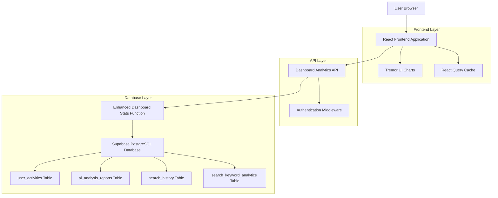
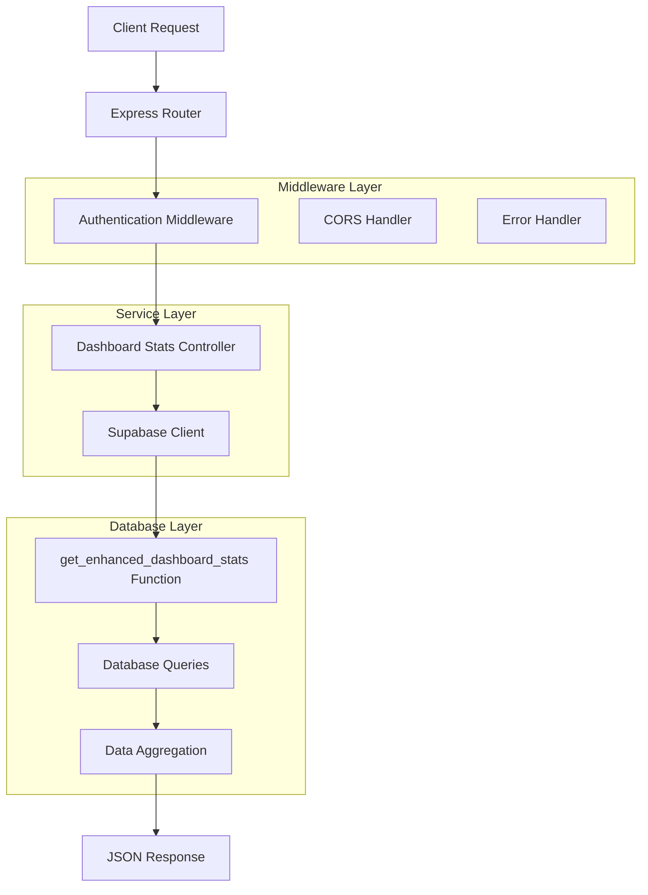
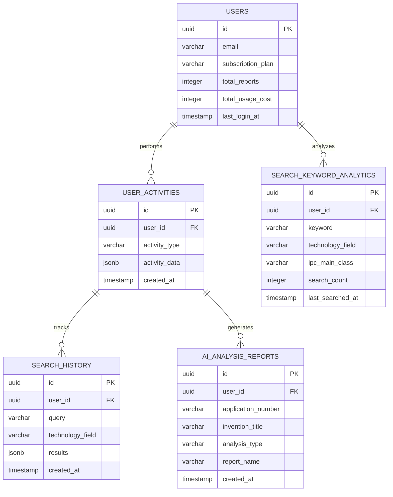

# 대시보드 분석 기능 기술 아키텍처

## 1. Architecture Design



## 2. Technology Description

* **Frontend**: React\@18 + TypeScript + Tremor UI + React Query + Tailwind CSS

* **Backend**: Node.js + Express.js

* **Database**: Supabase (PostgreSQL) + Custom Functions

* **Charts**: Tremor UI Chart Components

* **State Management**: React Query for server state, Zustand for client state

## 3. Route Definitions

| Route                | Purpose                      |
| -------------------- | ---------------------------- |
| /dashboard           | 메인 대시보드 페이지, 모든 분석 차트와 지표 표시 |
| /dashboard/analytics | 상세 분석 페이지 (향후 확장용)           |
| /api/dashboard-stats | 대시보드 통계 데이터 API 엔드포인트        |

## 4. API Definitions

### 4.1 Core API

대시보드 통계 조회

```
GET /api/dashboard-stats?period={period}
```

Request Parameters:

| Param Name | Param Type | isRequired | Description                            |
| ---------- | ---------- | ---------- | -------------------------------------- |
| period     | string     | false      | 조회 기간 ('7d', '30d', '90d'), 기본값: '30d' |

Response:

| Param Name | Param Type         | Description  |
| ---------- | ------------------ | ------------ |
| success    | boolean            | API 호출 성공 여부 |
| data       | DashboardStatsData | 대시보드 통계 데이터  |

### 4.2 Data Types

```typescript
interface DashboardStatsData {
  quota_status: {
    remaining_credits: number;
    remaining_reports: number;
    subscription_plan: string;
    last_login: string;
    expiry_date: string;
    days_until_expiry: number;
  };
  efficiency_metrics: {
    login_to_report_rate: number;
    search_to_report_rate: number;
    total_logins: number;
    total_searches: number;
    total_reports: number;
  };
  daily_searches: DailyData[];
  daily_reports: DailyData[];
  daily_logins: DailyData[];
  market_daily_searches: DailyData[];
  market_daily_reports: DailyData[];
  search_fields_top10: FieldData[];
  report_fields_top10: FieldData[];
  market_search_fields_top10: FieldData[];
  market_report_fields_top10: FieldData[];
  recent_reports: ReportData[];
  recent_searches: SearchData[];
}

interface DailyData {
  date: string;
  count: number;
}

interface FieldData {
  field: string;
  ipc_code: string;
  search_count?: number;
  report_count?: number;
  percentage: number;
}

interface ReportData {
  id: string;
  title: string;
  type: string;
  application_number: string;
  timestamp: string;
}

interface SearchData {
  keyword: string;
  timestamp: string;
}
```

Example Response:

```json
{
  "success": true,
  "data": {
    "quota_status": {
      "remaining_credits": 12500,
      "remaining_reports": 35,
      "subscription_plan": "premium",
      "last_login": "2024-01-29T10:30:00Z",
      "expiry_date": "2024-02-28",
      "days_until_expiry": 30
    },
    "efficiency_metrics": {
      "login_to_report_rate": 25.5,
      "search_to_report_rate": 15.2,
      "total_logins": 45,
      "total_searches": 120,
      "total_reports": 18
    },
    "daily_searches": [
      {"date": "2024-01-01", "count": 5},
      {"date": "2024-01-02", "count": 8}
    ],
    "search_fields_top10": [
      {
        "field": "Artificial Intelligence",
        "ipc_code": "G06N",
        "search_count": 25,
        "percentage": 35.2
      }
    ]
  }
}
```

## 5. Server Architecture Diagram



## 6. Data Model

### 6.1 Data Model Definition



### 6.2 Data Definition Language

Enhanced Dashboard Stats Function

```sql
-- 개선된 대시보드 통계 함수
CREATE OR REPLACE FUNCTION get_enhanced_dashboard_stats(
  p_user_id UUID, 
  p_period TEXT DEFAULT '30d'
)
RETURNS JSON AS $$
DECLARE
  result JSON;
  period_interval INTERVAL;
BEGIN
  -- 기간 설정
  CASE p_period
    WHEN '7d' THEN period_interval := INTERVAL '7 days';
    WHEN '30d' THEN period_interval := INTERVAL '30 days';
    WHEN '90d' THEN period_interval := INTERVAL '90 days';
    ELSE period_interval := INTERVAL '30 days';
  END CASE;

  -- 복잡한 CTE 쿼리로 모든 분석 데이터 생성
  WITH date_series AS (
    SELECT generate_series(
      (NOW()::date - (period_interval - INTERVAL '1 day')),
      NOW()::date,
      INTERVAL '1 day'
    )::date AS d
  ),
  -- ... (상세 구현은 별도 마이그레이션 파일 참조)
  
  SELECT json_build_object(
    'quota_status', ...,
    'efficiency_metrics', ...,
    'daily_searches', ...,
    'daily_reports', ...,
    -- ... 모든 분석 데이터
  ) INTO result;

  RETURN result;
END;
$$ LANGUAGE plpgsql SECURITY DEFINER;
```

Indexes for Performance

```sql
-- 성능 최적화를 위한 인덱스
CREATE INDEX IF NOT EXISTS idx_user_activities_user_type_date 
ON user_activities(user_id, activity_type, created_at DESC);

CREATE INDEX IF NOT EXISTS idx_ai_analysis_reports_user_date 
ON ai_analysis_reports(user_id, created_at DESC);

CREATE INDEX IF NOT EXISTS idx_search_history_user_date 
ON search_history(user_id, created_at DESC);

CREATE INDEX IF NOT EXISTS idx_search_keyword_analytics_user_field 
ON search_keyword_analytics(user_id, technology_field, last_searched_at DESC);
```

## 7. Frontend Component Architecture

### 7.1 Component Hierarchy

```
Dashboard/
├── index.tsx (메인 대시보드 페이지)
├── components/
│   ├── TrendAnalysis/
│   │   ├── SearchTrendChart.tsx
│   │   ├── ReportTrendChart.tsx
│   │   └── PeriodSelector.tsx
│   ├── EfficiencyMetrics/
│   │   ├── EfficiencyCard.tsx
│   │   └── MetricProgressBar.tsx
│   ├── TechnologyAnalysis/
│   │   ├── TechFieldDonutChart.tsx
│   │   ├── UserVsMarketToggle.tsx
│   │   └── FieldLegend.tsx
│   ├── MarketComparison/
│   │   ├── ComparisonBarChart.tsx
│   │   └── ComparisonMetrics.tsx
│   └── RecentActivity/
│       ├── RecentReports.tsx
│       ├── RecentSearches.tsx
│       └── ActivityTable.tsx
├── hooks/
│   ├── useDashboardStats.ts
│   ├── useChartData.ts
│   └── usePeriodFilter.ts
└── types/
    └── dashboard.ts
```

### 7.2 Key Hooks Implementation

```typescript
// useDashboardStats.ts
export const useDashboardStats = (period: Period) => {
  return useQuery({
    queryKey: ['dashboard-stats', period],
    queryFn: () => fetchDashboardStats(period),
    staleTime: 5 * 60 * 1000, // 5분
    cacheTime: 10 * 60 * 1000, // 10분
  });
};

// useChartData.ts
export const useChartData = (rawData: DashboardStatsData) => {
  return useMemo(() => ({
    searchTrendData: formatTrendData(rawData.daily_searches),
    reportTrendData: formatTrendData(rawData.daily_reports),
    efficiencyData: formatEfficiencyData(rawData.efficiency_metrics),
    techFieldData: formatFieldData(rawData.search_fields_top10),
  }), [rawData]);
};
```

## 8. Performance Optimization

### 8.1 Database Optimization

* 복합 인덱스를 통한 쿼리 성능 향상

* CTE(Common Table Expression) 활용으로 복잡한 집계 쿼리 최적화

* 함수 레벨 캐싱 및 SECURITY DEFINER 권한 설정

### 8.2 Frontend Optimization

* React Query를 통한 서버 상태 캐싱

* 차트 데이터 메모이제이션

* 컴포넌트 레벨 코드 스플리팅

* Tremor UI의 최적화된 차트 컴포넌트 활용

### 8.3 API Optimization

* 응답 데이터 압축

* 적절한 HTTP 캐시 헤더 설정

* 에러 처리 및 폴백 데이터 제공

## 9. Security Considerations

### 9.1 Authentication

* JWT 토큰 기반 사용자 인증

* Supabase Auth를 통한 안전한 사용자 세션 관리

### 9.2 Authorization

* 사용자별 데이터 접근 제한 (RLS 정책)

* 함수 레벨 보안 (SECURITY DEFINER)

### 9.3 Data Privacy

* 개인 데이터와 집계 데이터 분리

* 민감한 정보 마스킹 처리

