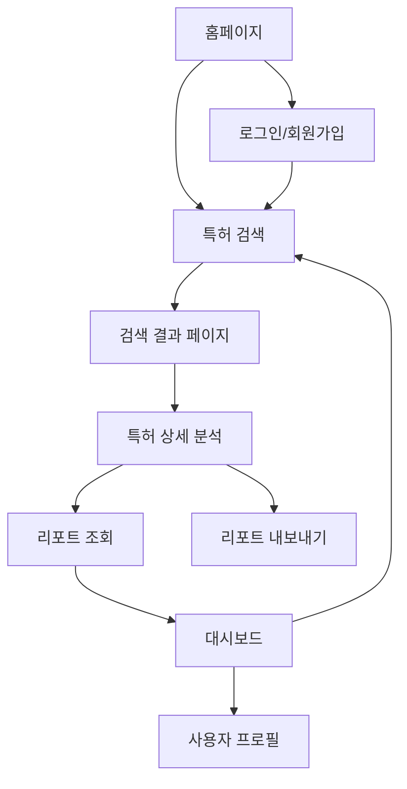

# IP-Insight AI 제품 요구사항 문서 (PRD)

## 1. Product Overview

IP-Insight AI는 KIPRIS API와 연동하여 특허 검색 및 AI 기반 시장 분석 리포트를 실시간으로 제공하는 SaaS 플랫폼입니다.
시스템 트레이더, 투자자, R&D 기획자, 기술 사업화 담당자들이 특허 기술의 시장성과 수익성을 빠르게 분석할 수 있도록 지원합니다.
전문적인 특허 분석 도구를 통해 기술 투자 의사결정과 사업화 전략 수립에 핵심적인 인사이트를 제공하는 것이 목표입니다.

## 2. Core Features

### 2.1 User Roles

| Role | Registration Method | Core Permissions |
|------|---------------------|------------------|
| 무료 사용자 | 이메일 회원가입 | 월 10회 검색, 기본 리포트 조회 |
| 프리미엄 사용자 | 유료 구독 업그레이드 | 무제한 검색, 고급 분석 리포트, 데이터 내보내기 |

### 2.2 Feature Module

IP-Insight AI는 다음과 같은 핵심 페이지들로 구성됩니다:

1. **홈페이지**: 서비스 소개, 검색 입력 폼, 최근 검색 기록
2. **로그인/회원가입 페이지**: 사용자 인증 및 계정 생성
3. **특허 검색 결과 페이지**: KIPRIS 검색 결과 목록, 필터링 옵션
4. **특허 상세 분석 페이지**: 개별 특허 정보, AI 생성 시장 분석 리포트, 비즈니스 인사이트 리포트
5. **대시보드 페이지**: 사용자 검색 기록, 저장된 리포트, 구독 관리
6. **사용자 프로필 페이지**: 계정 설정, 구독 정보, 사용량 통계

### 2.3 Page Details

| Page Name | Module Name | Feature description |
|-----------|-------------|---------------------|
| 홈페이지 | 히어로 섹션 | 서비스 가치 제안 표시, 주요 기능 소개 |
| 홈페이지 | 검색 입력 폼 | 키워드, 출원인, 출원일 등 다양한 검색 조건 입력 |
| 홈페이지 | 최근 검색 기록 | 사용자별 최근 검색 키워드 및 결과 바로가기 |
| 로그인/회원가입 | 인증 폼 | 이메일/비밀번호 기반 로그인, 소셜 로그인 옵션 |
| 로그인/회원가입 | 회원가입 폼 | 계정 생성, 이메일 인증, 약관 동의 |
| 특허 검색 결과 | 검색 결과 목록 | 특허 제목, 출원번호, 출원인, 요약 정보 표시 |
| 특허 검색 결과 | 필터링 및 정렬 | 출원일, 기술분야, 출원인별 필터링 및 정렬 기능 |
| 특허 검색 결과 | 페이지네이션 | 대량 검색 결과의 효율적인 탐색 |
| 특허 상세 분석 | 특허 기본 정보 | 발명의 명칭, 청구항, 발명의 설명, 도면 표시 |
| 특허 상세 분석 | 시장 분석 리포트 | Gemini AI 기반 시장 침투력, 경쟁 구도 분석 |
| 특허 상세 분석 | 비즈니스 인사이트 리포트 | 수익성 분석, 로열티 추정, 사업화 전략 제안 |
| 특허 상세 분석 | 데이터 시각화 | 시장 규모, 경쟁사 분포, 기술 트렌드 차트 |
| 특허 상세 분석 | 리포트 내보내기 | PDF, Excel 형태로 분석 결과 다운로드 |
| 대시보드 | 검색 기록 관리 | 과거 검색 내역 조회, 즐겨찾기 관리 |
| 대시보드 | 저장된 리포트 | 생성된 분석 리포트 목록 및 재조회 |
| 대시보드 | 사용량 통계 | 월별 검색 횟수, 리포트 생성 현황 |
| 사용자 프로필 | 계정 설정 | 개인정보 수정, 비밀번호 변경 |
| 사용자 프로필 | 구독 관리 | 요금제 변경, 결제 정보 관리 |

## 3. Core Process

**일반 사용자 플로우:**
1. 홈페이지 접속 → 검색 조건 입력 → 특허 검색 결과 확인 → 관심 특허 선택 → AI 분석 리포트 조회 → 리포트 저장/내보내기

**신규 사용자 플로우:**
1. 홈페이지 접속 → 회원가입 → 이메일 인증 → 로그인 → 검색 시작

**프리미엄 사용자 플로우:**
1. 로그인 → 대시보드 → 고급 검색 → 상세 분석 → 데이터 내보내기 → 검색 기록 관리

## 4. User Interface Design

### 4.1 Design Style

- **Primary Colors**: 다크 네이비 (#1a1a2e), 딥 블루 (#16213e)
- **Secondary Colors**: 아센트 블루 (#0f3460), 화이트 (#ffffff), 라이트 그레이 (#f8f9fa)
- **Button Style**: 둥근 모서리 (8px radius), 그라데이션 효과, 호버 시 미묘한 그림자
- **Font**: Pretendard (한글), Inter (영문), 기본 16px, 제목 24-32px
- **Layout Style**: 카드 기반 레이아웃, 상단 네비게이션, 사이드바 (대시보드)
- **Icon Style**: Outline 스타일 아이콘, 일관된 선 굵기, 미니멀한 디자인

### 4.2 Page Design Overview

| Page Name | Module Name | UI Elements |
|-----------|-------------|-------------|
| 홈페이지 | 히어로 섹션 | 다크 그라데이션 배경, 중앙 정렬 제목, CTA 버튼, 애니메이션 효과 |
| 홈페이지 | 검색 입력 폼 | 화이트 카드 컨테이너, 드롭다운 필터, 검색 버튼 (#0f3460) |
| 특허 검색 결과 | 결과 목록 | 카드 레이아웃, 호버 효과, 페이지네이션, 필터 사이드바 |
| 특허 상세 분석 | 리포트 섹션 | 탭 네비게이션, 차트 컨테이너, 다운로드 버튼, 스크롤 인디케이터 |
| 대시보드 | 통계 카드 | 그리드 레이아웃, 아이콘 + 숫자, 프로그레스 바, 컬러 코딩 |

### 4.3 Responsiveness

데스크톱 우선 설계로 1200px 이상에서 최적화되며, 태블릿(768px-1199px)과 모바일(767px 이하)에서 적응형 레이아웃을 제공합니다. 터치 인터랙션 최적화를 통해 모바일에서도 원활한 검색 및 리포트 조회가 가능하도록 설계됩니다.