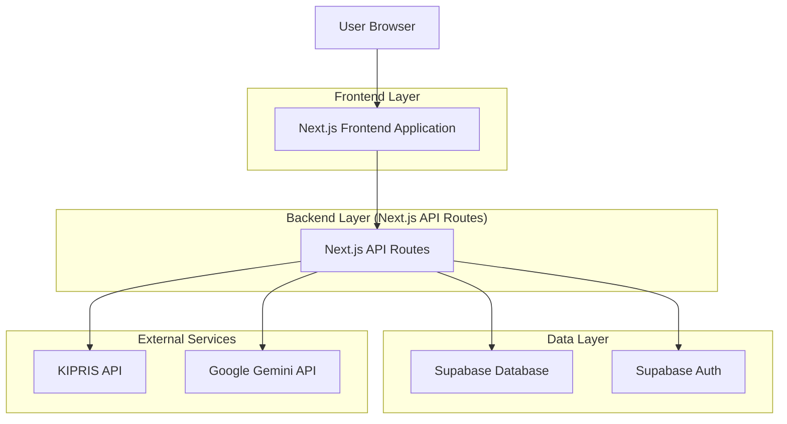
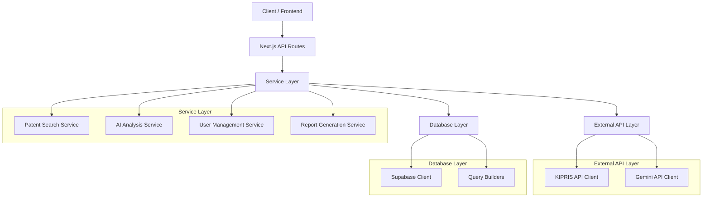
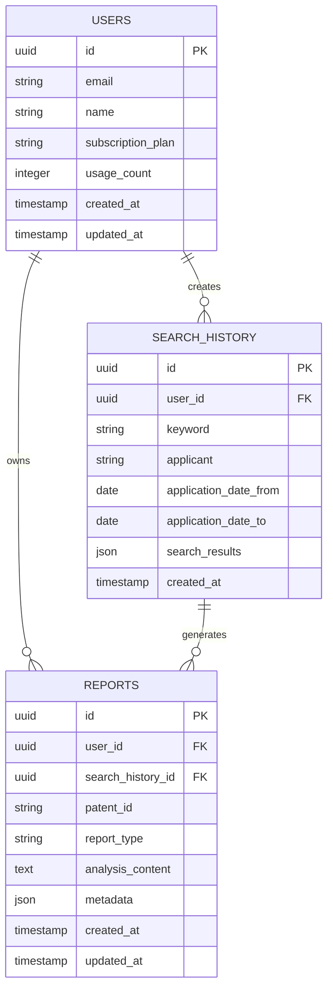

# IP-Insight AI 기술 아키텍처 문서

## 1. Architecture design



## 2. Technology Description

* **Frontend**: Next.js\@14 + React\@18 + TypeScript + Tailwind CSS\@3 + Recharts (데이터 시각화)

* **Backend**: Next.js API Routes + Node.js\@18

* **Database**: Supabase (PostgreSQL)

* **Authentication**: Supabase Auth

* **External APIs**: KIPRIS API, Google Gemini API

* **Deployment**: Vercel (Frontend & Backend), Supabase (Database)

## 3. Route definitions

| Route         | Purpose                       |
| ------------- | ----------------------------- |
| /             | 홈페이지, 서비스 소개 및 검색 입력 폼        |
| /login        | 로그인 페이지, 사용자 인증               |
| /register     | 회원가입 페이지, 새 계정 생성             |
| /search       | 특허 검색 결과 페이지, KIPRIS 검색 결과 표시 |
| /patent/\[id] | 특허 상세 분석 페이지, AI 리포트 조회       |
| /dashboard    | 사용자 대시보드, 검색 기록 및 저장된 리포트     |
| /profile      | 사용자 프로필 페이지, 계정 설정 및 구독 관리    |

## 4. API definitions

### 4.1 Core API

**특허 검색 API**

```
POST /api/patents/search
```

Request:

| Param Name          | Param Type | isRequired | Description         |
| ------------------- | ---------- | ---------- | ------------------- |
| keyword             | string     | true       | 검색 키워드              |
| applicant           | string     | false      | 출원인명                |
| applicationDateFrom | string     | false      | 출원일 시작 (YYYY-MM-DD) |
| applicationDateTo   | string     | false      | 출원일 종료 (YYYY-MM-DD) |
| page                | number     | false      | 페이지 번호 (기본값: 1)     |
| limit               | number     | false      | 페이지당 결과 수 (기본값: 20) |

Response:

| Param Name  | Param Type            | Description |
| ----------- | --------------------- | ----------- |
| success     | boolean               | 요청 성공 여부    |
| data        | PatentSearchResult\[] | 특허 검색 결과 배열 |
| totalCount  | number                | 전체 검색 결과 수  |
| currentPage | number                | 현재 페이지      |

**특허 상세 정보 API**

```
GET /api/patents/[patentId]
```

Response:

| Param Name | Param Type   | Description |
| ---------- | ------------ | ----------- |
| success    | boolean      | 요청 성공 여부    |
| data       | PatentDetail | 특허 상세 정보    |

**AI 분석 리포트 생성 API**

```
POST /api/reports/generate
```

Request:

| Param Name | Param Type | isRequired | Description                     |
| ---------- | ---------- | ---------- | ------------------------------- |
| patentId   | string     | true       | 특허 ID                           |
| reportType | string     | true       | 리포트 타입 ('market' 또는 'business') |

Response:

| Param Name | Param Type     | Description |
| ---------- | -------------- | ----------- |
| success    | boolean        | 요청 성공 여부    |
| data       | AnalysisReport | 생성된 분석 리포트  |

**사용자 검색 기록 API**

```
GET /api/user/search-history
```

Response:

| Param Name | Param Type       | Description  |
| ---------- | ---------------- | ------------ |
| success    | boolean          | 요청 성공 여부     |
| data       | SearchHistory\[] | 사용자 검색 기록 배열 |

Example Request:

```json
{
  "keyword": "인공지능",
  "applicant": "삼성전자",
  "applicationDateFrom": "2020-01-01",
  "applicationDateTo": "2023-12-31",
  "page": 1,
  "limit": 20
}
```

## 5. Server architecture diagram



## 6. Data model

### 6.1 Data model definition



### 6.2 Data Definition Language

**Users Table (users)**

```sql
-- create table
CREATE TABLE users (
    id UUID PRIMARY KEY DEFAULT gen_random_uuid(),
    email VARCHAR(255) UNIQUE NOT NULL,
    name VARCHAR(100) NOT NULL,
    subscription_plan VARCHAR(20) DEFAULT 'free' CHECK (subscription_plan IN ('free', 'premium')),
    usage_count INTEGER DEFAULT 0,
    created_at TIMESTAMP WITH TIME ZONE DEFAULT NOW(),
    updated_at TIMESTAMP WITH TIME ZONE DEFAULT NOW()
);

-- RLS policies
ALTER TABLE users ENABLE ROW LEVEL SECURITY;

CREATE POLICY "Users can view own profile" ON users
    FOR SELECT USING (auth.uid() = id);

CREATE POLICY "Users can update own profile" ON users
    FOR UPDATE USING (auth.uid() = id);

-- Grant permissions
GRANT SELECT, UPDATE ON users TO authenticated;
GRANT SELECT ON users TO anon;
```

**Search History Table (search\_history)**

```sql
-- create table
CREATE TABLE search_history (
    id UUID PRIMARY KEY DEFAULT gen_random_uuid(),
    user_id UUID REFERENCES users(id) ON DELETE CASCADE,
    keyword VARCHAR(500) NOT NULL,
    applicant VARCHAR(200),
    application_date_from DATE,
    application_date_to DATE,
    search_results JSONB,
    created_at TIMESTAMP WITH TIME ZONE DEFAULT NOW()
);

-- create indexes
CREATE INDEX idx_search_history_user_id ON search_history(user_id);
CREATE INDEX idx_search_history_created_at ON search_history(created_at DESC);
CREATE INDEX idx_search_history_keyword ON search_history USING GIN(to_tsvector('korean', keyword));

-- RLS policies
ALTER TABLE search_history ENABLE ROW LEVEL SECURITY;

CREATE POLICY "Users can view own search history" ON search_history
    FOR SELECT USING (auth.uid() = user_id);

CREATE POLICY "Users can insert own search history" ON search_history
    FOR INSERT WITH CHECK (auth.uid() = user_id);

-- Grant permissions
GRANT ALL PRIVILEGES ON search_history TO authenticated;
```

**Reports Table (reports)**

```sql
-- create table
CREATE TABLE reports (
    id UUID PRIMARY KEY DEFAULT gen_random_uuid(),
    user_id UUID REFERENCES users(id) ON DELETE CASCADE,
    search_history_id UUID REFERENCES search_history(id) ON DELETE SET NULL,
    patent_id VARCHAR(100) NOT NULL,
    report_type VARCHAR(20) NOT NULL CHECK (report_type IN ('market', 'business')),
    analysis_content TEXT NOT NULL,
    metadata JSONB DEFAULT '{}',
    created_at TIMESTAMP WITH TIME ZONE DEFAULT NOW(),
    updated_at TIMESTAMP WITH TIME ZONE DEFAULT NOW()
);

-- create indexes
CREATE INDEX idx_reports_user_id ON reports(user_id);
CREATE INDEX idx_reports_patent_id ON reports(patent_id);
CREATE INDEX idx_reports_created_at ON reports(created_at DESC);
CREATE INDEX idx_reports_type ON reports(report_type);

-- RLS policies
ALTER TABLE reports ENABLE ROW LEVEL SECURITY;

CREATE POLICY "Users can view own reports" ON reports
    FOR SELECT USING (auth.uid() = user_id);

CREATE POLICY "Users can insert own reports" ON reports
    FOR INSERT WITH CHECK (auth.uid() = user_id);

CREATE POLICY "Users can update own reports" ON reports
    FOR UPDATE USING (auth.uid() = user_id);

-- Grant permissions
GRANT ALL PRIVILEGES ON reports TO authenticated;

-- init data (sample for testing)
INSERT INTO users (email, name, subscription_plan) VALUES 
('test@example.com', '테스트 사용자', 'free'),
('premium@example.com', '프리미엄 사용자', 'premium');
```

