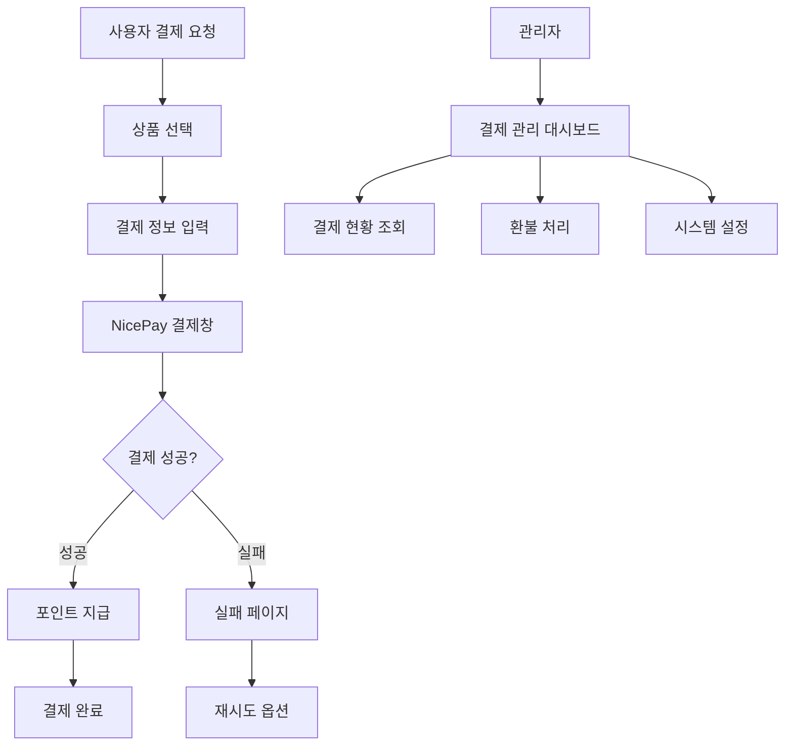

# NicePay 결제시스템 통합 PRD

## 1. Product Overview

NicePay를 활용한 완전한 결제 시스템 구축으로 특허 검색 서비스의 포인트 충전 및 구독 결제를 안전하고 효율적으로 처리합니다.
Server 승인 모델을 기반으로 대량 트래픽에 대응 가능한 확장성 있는 결제 인프라를 제공하며, 보안성과 안정성을 최우선으로 합니다.

## 2. Core Features

### 2.1 User Roles

| Role | Registration Method | Core Permissions |
|------|---------------------|------------------|
| 일반 사용자 | 이메일 회원가입 | 포인트 충전, 구독 결제, 결제 내역 조회 |
| 관리자 | 관리자 계정 | 결제 관리, 환불 처리, 결제 통계 조회, 시스템 설정 |

### 2.2 Feature Module

결제 시스템은 다음과 같은 핵심 페이지들로 구성됩니다:

1. **결제 페이지**: 포인트 충전 및 구독 선택, 결제 수단 선택, 결제창 호출
2. **결제 성공/실패 페이지**: 결제 결과 표시, 포인트 지급 확인, 다음 단계 안내
3. **결제 내역 페이지**: 개인 결제 기록 조회, 영수증 다운로드, 환불 신청
4. **관리자 결제 관리**: 전체 결제 현황, 환불 처리, 결제 통계 및 분석

### 2.3 Page Details

| Page Name | Module Name | Feature description |
|-----------|-------------|---------------------|
| 결제 페이지 | 상품 선택 | 포인트 패키지 및 구독 플랜 선택, 가격 표시, 할인 정보 제공 |
| 결제 페이지 | 결제 수단 | 신용카드, 계좌이체, 가상계좌 등 다양한 결제 수단 지원 |
| 결제 페이지 | 결제창 호출 | NicePay JS SDK를 통한 안전한 결제창 호출 및 인증 처리 |
| 결제 성공 페이지 | 결과 표시 | 결제 성공 메시지, 구매 내역, 포인트 지급 현황 표시 |
| 결제 성공 페이지 | 포인트 지급 | 자동 포인트 지급 처리, 만료일 설정, 지급 내역 기록 |
| 결제 실패 페이지 | 오류 처리 | 실패 사유 표시, 재시도 옵션, 고객센터 연결 |
| 결제 내역 페이지 | 거래 조회 | 개인 결제 기록 필터링 및 검색, 상세 정보 표시 |
| 결제 내역 페이지 | 영수증 관리 | 영수증 다운로드, 현금영수증 발급, 세금계산서 신청 |
| 관리자 결제 관리 | 결제 현황 | 실시간 결제 현황, 일별/월별 통계, 수익 분석 |
| 관리자 결제 관리 | 환불 처리 | 환불 신청 관리, 부분/전체 환불 처리, 환불 승인 워크플로우 |
| 관리자 결제 관리 | 시스템 설정 | 결제 설정 관리, 수수료 설정, 알림 설정 |

## 3. Core Process

### 일반 사용자 결제 플로우
1. 사용자가 포인트 충전 또는 구독 페이지 접근
2. 원하는 상품/플랜 선택 및 결제 수단 선택
3. NicePay 결제창을 통한 인증 및 결제 처리
4. 결제 성공 시 자동 포인트 지급 및 구독 활성화
5. 결제 내역 저장 및 이메일 알림 발송

### 관리자 결제 관리 플로우
1. 관리자가 결제 관리 대시보드 접근
2. 실시간 결제 현황 및 통계 확인
3. 환불 신청 검토 및 처리
4. 결제 시스템 설정 및 모니터링

## 4. User Interface Design

### 4.1 Design Style
- **Primary Color**: #3B82F6 (파란색 계열)
- **Secondary Color**: #10B981 (초록색 계열)
- **Button Style**: 둥근 모서리 (8px radius), 그라데이션 효과
- **Font**: Pretendard, 본문 16px, 제목 24px
- **Layout Style**: 카드 기반 레이아웃, 상단 네비게이션
- **Icon Style**: Heroicons, 일관된 선 굵기

### 4.2 Page Design Overview

| Page Name | Module Name | UI Elements |
|-----------|-------------|-------------|
| 결제 페이지 | 상품 선택 | 카드형 상품 목록, 가격 강조 표시, 추천 배지, 할인율 표시 |
| 결제 페이지 | 결제 수단 | 라디오 버튼 그룹, 결제 수단 아이콘, 보안 인증서 표시 |
| 결제 성공 페이지 | 결과 표시 | 성공 아이콘, 구매 요약 카드, 포인트 애니메이션, CTA 버튼 |
| 결제 내역 페이지 | 거래 목록 | 테이블 형태, 필터 드롭다운, 검색 입력창, 페이지네이션 |
| 관리자 결제 관리 | 대시보드 | 통계 카드, 차트 컴포넌트, 실시간 업데이트 표시 |

### 4.3 Responsiveness
데스크톱 우선 설계로 모바일 적응형 레이아웃을 제공하며, 터치 인터랙션 최적화를 고려합니다.

## 5. Security Requirements

### 5.1 결제 보안
- NicePay signature 검증을 통한 위변조 방지
- 금액 검증 로직으로 클라이언트 사이드 변조 차단
- HTTPS 통신 강제 및 민감 정보 암호화

### 5.2 데이터 보안
- 결제 정보는 NicePay에서 처리, 최소한의 메타데이터만 저장
- 개인정보 마스킹 처리 (카드번호, 계좌번호 등)
- 접근 로그 기록 및 모니터링

## 6. Performance Requirements

### 6.1 응답 시간
- 결제 페이지 로딩: 2초 이내
- 결제 승인 처리: 5초 이내
- 결제 내역 조회: 1초 이내

### 6.2 동시 처리
- 동시 결제 처리: 100건/분
- 대량 트래픽 대응을 위한 Server 승인 모델 사용

## 7. Integration Requirements

### 7.1 NicePay 연동
- Server 승인 모델 구현
- Basic 인증 방식 사용
- 웹훅을 통한 실시간 결제 상태 업데이트

### 7.2 내부 시스템 연동
- Supabase 데이터베이스와의 트랜잭션 처리
- 포인트 시스템과의 실시간 연동
- 이메일 알림 시스템 연동

## 8. Error Handling

### 8.1 결제 오류 처리
- 네트워크 타임아웃 시 자동 망취소 처리
- 결제 실패 시 사용자 친화적 오류 메시지 제공
- 중복 결제 방지 로직

### 8.2 시스템 오류 처리
- 서버 오류 시 graceful degradation
- 결제 데이터 불일치 시 자동 복구 메커니즘
- 24/7 모니터링 및 알림 시스템