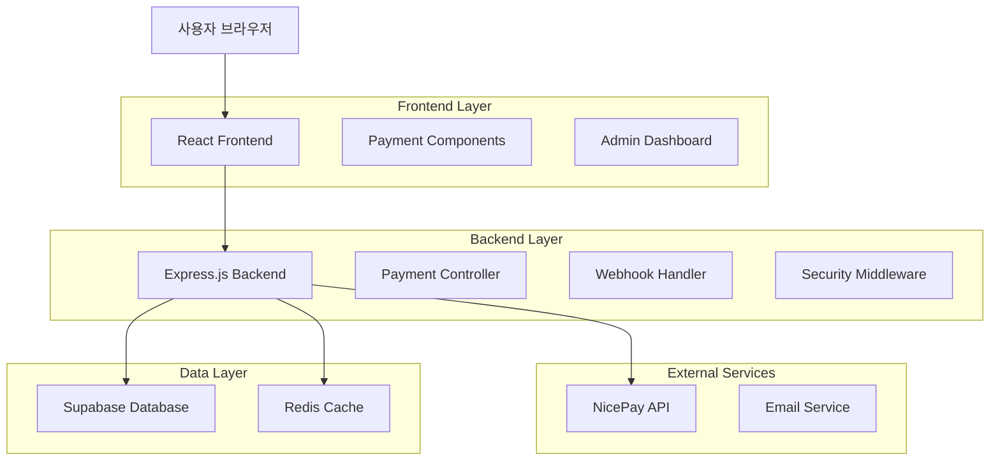
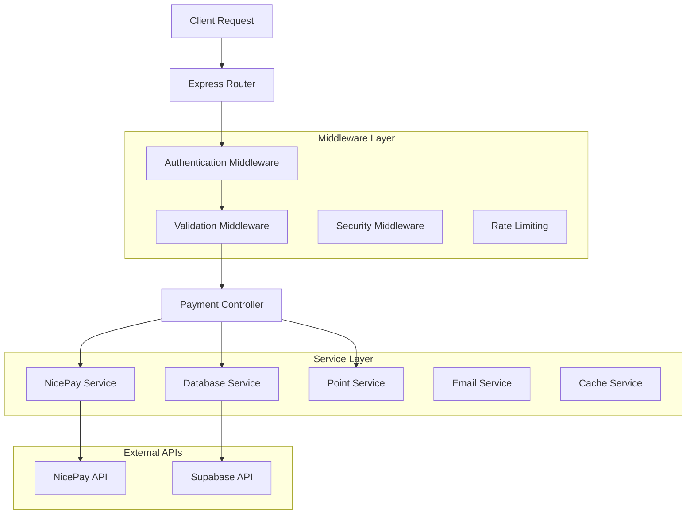
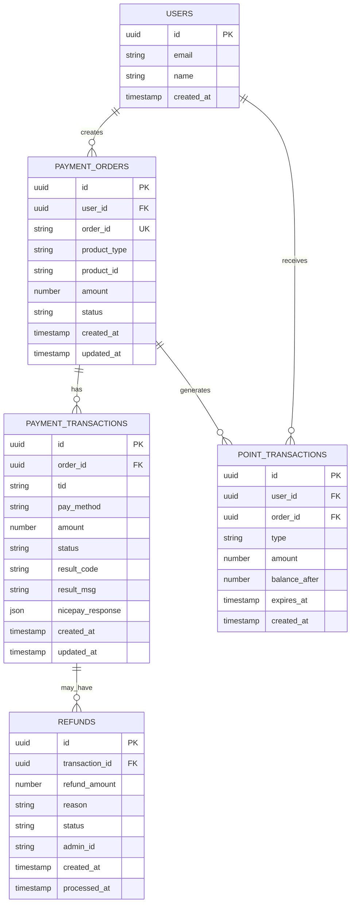

# NicePay 결제시스템 기술 아키텍처

## 1. Architecture Design



## 2. Technology Description

- Frontend: React@18 + TailwindCSS@3 + Vite + NicePay JS SDK
- Backend: Express.js@4 + Node.js
- Database: Supabase (PostgreSQL)
- Cache: Redis (결제 세션 관리)
- Payment Gateway: NicePay Server 승인 모델

## 3. Route Definitions

| Route | Purpose |
|-------|---------|
| /payment | 결제 페이지, 상품 선택 및 결제 수단 선택 |
| /payment/success | 결제 성공 페이지, 결과 표시 및 포인트 지급 확인 |
| /payment/fail | 결제 실패 페이지, 오류 메시지 및 재시도 옵션 |
| /payment/history | 결제 내역 페이지, 개인 거래 기록 조회 |
| /admin/payments | 관리자 결제 관리, 전체 결제 현황 및 통계 |
| /admin/refunds | 관리자 환불 관리, 환불 신청 처리 |

## 4. API Definitions

### 4.1 Core Payment API

결제 주문 생성
```
POST /api/payment/create-order
```

Request:
| Param Name | Param Type | isRequired | Description |
|------------|------------|------------|-------------|
| productType | string | true | 상품 타입 (points, subscription) |
| amount | number | true | 결제 금액 |
| productId | string | true | 상품 ID |
| payMethod | string | true | 결제 수단 (CARD, BANK, VBANK) |

Response:
| Param Name | Param Type | Description |
|------------|------------|-------------|
| orderId | string | 주문 ID |
| clientId | string | NicePay 클라이언트 ID |
| amount | number | 결제 금액 |
| signature | string | 서명 값 |

Example:
```json
{
  "productType": "points",
  "amount": 10000,
  "productId": "points_1000",
  "payMethod": "CARD"
}
```

결제 승인 처리
```
POST /api/payment/approve
```

Request:
| Param Name | Param Type | isRequired | Description |
|------------|------------|------------|-------------|
| tid | string | true | NicePay 거래 ID |
| orderId | string | true | 주문 ID |
| amount | number | true | 결제 금액 |
| signature | string | true | NicePay 서명 |

Response:
| Param Name | Param Type | Description |
|------------|------------|-------------|
| success | boolean | 승인 성공 여부 |
| message | string | 결과 메시지 |
| pointsGranted | number | 지급된 포인트 |

결제 내역 조회
```
GET /api/payment/history
```

Request:
| Param Name | Param Type | isRequired | Description |
|------------|------------|------------|-------------|
| page | number | false | 페이지 번호 (기본값: 1) |
| limit | number | false | 페이지당 항목 수 (기본값: 20) |
| startDate | string | false | 조회 시작일 (YYYY-MM-DD) |
| endDate | string | false | 조회 종료일 (YYYY-MM-DD) |

Response:
| Param Name | Param Type | Description |
|------------|------------|-------------|
| payments | array | 결제 내역 배열 |
| totalCount | number | 전체 결제 건수 |
| totalPages | number | 전체 페이지 수 |

### 4.2 Admin Payment API

관리자 결제 현황 조회
```
GET /api/admin/payments/dashboard
```

Response:
| Param Name | Param Type | Description |
|------------|------------|-------------|
| todayRevenue | number | 오늘 매출 |
| monthlyRevenue | number | 월 매출 |
| totalPayments | number | 총 결제 건수 |
| recentPayments | array | 최근 결제 내역 |

환불 처리
```
POST /api/admin/payments/refund
```

Request:
| Param Name | Param Type | isRequired | Description |
|------------|------------|------------|-------------|
| paymentId | string | true | 결제 ID |
| refundAmount | number | true | 환불 금액 |
| reason | string | true | 환불 사유 |

### 4.3 Webhook API

NicePay 웹훅 처리
```
POST /api/payment/webhook
```

Request:
| Param Name | Param Type | isRequired | Description |
|------------|------------|------------|-------------|
| resultCode | string | true | 결과 코드 |
| resultMsg | string | true | 결과 메시지 |
| tid | string | true | 거래 ID |
| orderId | string | true | 주문 ID |
| amount | number | true | 결제 금액 |
| signature | string | true | 서명 값 |

## 5. Server Architecture Diagram



## 6. Data Model

### 6.1 Data Model Definition



### 6.2 Data Definition Language

결제 주문 테이블 (payment_orders)
```sql
-- 결제 주문 테이블 생성
CREATE TABLE payment_orders (
    id UUID PRIMARY KEY DEFAULT gen_random_uuid(),
    user_id UUID NOT NULL REFERENCES auth.users(id),
    order_id VARCHAR(50) UNIQUE NOT NULL,
    product_type VARCHAR(20) NOT NULL CHECK (product_type IN ('points', 'subscription')),
    product_id VARCHAR(50) NOT NULL,
    amount INTEGER NOT NULL CHECK (amount > 0),
    status VARCHAR(20) DEFAULT 'pending' CHECK (status IN ('pending', 'completed', 'failed', 'cancelled')),
    created_at TIMESTAMP WITH TIME ZONE DEFAULT NOW(),
    updated_at TIMESTAMP WITH TIME ZONE DEFAULT NOW()
);

-- 인덱스 생성
CREATE INDEX idx_payment_orders_user_id ON payment_orders(user_id);
CREATE INDEX idx_payment_orders_order_id ON payment_orders(order_id);
CREATE INDEX idx_payment_orders_status ON payment_orders(status);
CREATE INDEX idx_payment_orders_created_at ON payment_orders(created_at DESC);

-- 결제 거래 테이블 생성
CREATE TABLE payment_transactions (
    id UUID PRIMARY KEY DEFAULT gen_random_uuid(),
    order_id UUID NOT NULL REFERENCES payment_orders(id),
    tid VARCHAR(50) UNIQUE NOT NULL,
    pay_method VARCHAR(20) NOT NULL,
    amount INTEGER NOT NULL,
    status VARCHAR(20) DEFAULT 'pending',
    result_code VARCHAR(10),
    result_msg TEXT,
    nicepay_response JSONB,
    created_at TIMESTAMP WITH TIME ZONE DEFAULT NOW(),
    updated_at TIMESTAMP WITH TIME ZONE DEFAULT NOW()
);

-- 인덱스 생성
CREATE INDEX idx_payment_transactions_order_id ON payment_transactions(order_id);
CREATE INDEX idx_payment_transactions_tid ON payment_transactions(tid);
CREATE INDEX idx_payment_transactions_status ON payment_transactions(status);

-- 환불 테이블 생성
CREATE TABLE refunds (
    id UUID PRIMARY KEY DEFAULT gen_random_uuid(),
    transaction_id UUID NOT NULL REFERENCES payment_transactions(id),
    refund_amount INTEGER NOT NULL CHECK (refund_amount > 0),
    reason TEXT NOT NULL,
    status VARCHAR(20) DEFAULT 'pending' CHECK (status IN ('pending', 'approved', 'rejected', 'completed')),
    admin_id UUID REFERENCES auth.users(id),
    created_at TIMESTAMP WITH TIME ZONE DEFAULT NOW(),
    processed_at TIMESTAMP WITH TIME ZONE
);

-- 인덱스 생성
CREATE INDEX idx_refunds_transaction_id ON refunds(transaction_id);
CREATE INDEX idx_refunds_status ON refunds(status);
CREATE INDEX idx_refunds_created_at ON refunds(created_at DESC);

-- 권한 설정
GRANT SELECT ON payment_orders TO anon;
GRANT ALL PRIVILEGES ON payment_orders TO authenticated;
GRANT SELECT ON payment_transactions TO anon;
GRANT ALL PRIVILEGES ON payment_transactions TO authenticated;
GRANT SELECT ON refunds TO anon;
GRANT ALL PRIVILEGES ON refunds TO authenticated;

-- 초기 데이터 (상품 정보)
INSERT INTO products (id, name, type, price, points, description) VALUES
('points_100', '100 포인트', 'points', 1000, 100, '기본 포인트 패키지'),
('points_500', '500 포인트', 'points', 5000, 500, '인기 포인트 패키지'),
('points_1000', '1000 포인트', 'points', 10000, 1000, '대용량 포인트 패키지'),
('subscription_basic', '베이직 구독', 'subscription', 9900, 0, '월 베이직 구독 플랜'),
('subscription_premium', '프리미엄 구독', 'subscription', 19900, 0, '월 프리미엄 구독 플랜');
```

## 7. Security Implementation

### 7.1 NicePay 보안 검증
- Signature 검증을 통한 요청 위변조 방지
- Amount 검증으로 클라이언트 사이드 변조 차단
- Basic 인증을 통한 API 접근 제어

### 7.2 서버 보안
- HTTPS 강제 적용
- Rate Limiting으로 DDoS 방지
- Input Validation 및 SQL Injection 방지
- 민감 정보 로깅 제외

## 8. Environment Configuration

### 8.1 Production 설정
```javascript
const config = {
  nicepay: {
    clientId: 'R2_6496fd66ebc242b58ab7ef1722c9a92b',
    secretKey: '101d2ae924fa4ae398c3b76a7ba62226',
    apiUrl: 'https://api.nicepay.co.kr',
    jsUrl: 'https://pay.nicepay.co.kr/v1/js/'
  },
  server: {
    approvalModel: true,
    timeout: 30000,
    retryCount: 3
  }
};
```

### 8.2 Development 설정
```javascript
const config = {
  nicepay: {
    clientId: 'S2_af4543a0be8e4bdc8280b831b3246991',
    secretKey: 'test_secret_key',
    apiUrl: 'https://sandbox-api.nicepay.co.kr',
    jsUrl: 'https://sandbox-pay.nicepay.co.kr/v1/js/'
  }
};
```