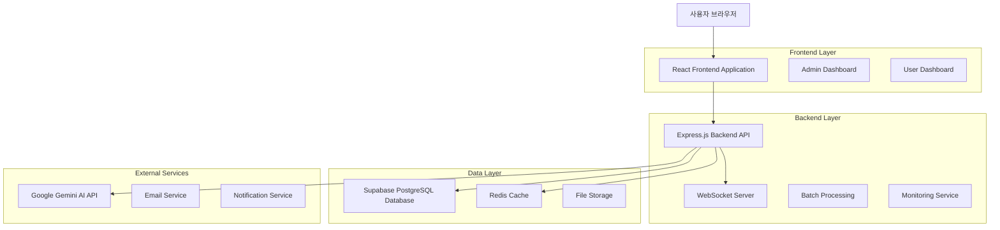
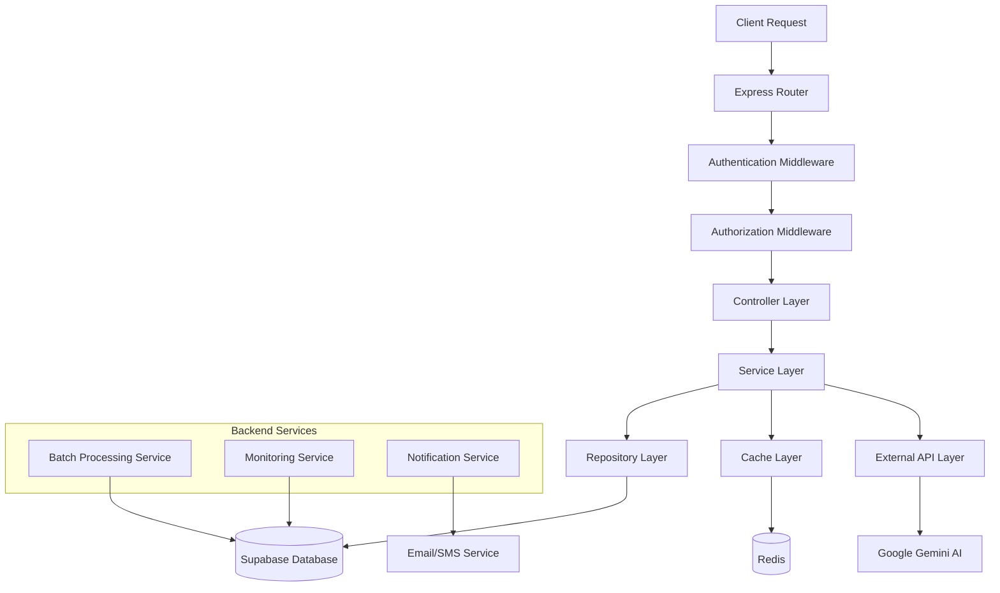
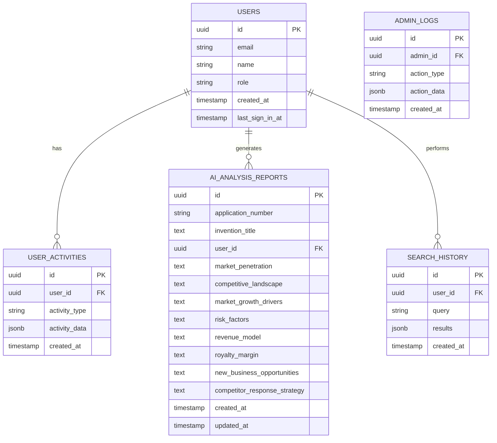

# Patent-AI 시스템 개선 기술 아키텍처 문서

## 1. 아키텍처 설계



## 2. 기술 스택

### 2.1 프론트엔드

* **React\@18** + **TypeScript** + **Vite**

* **TailwindCSS\@3** (스타일링)

* **Zustand** (상태 관리)

* **React Query** (서버 상태 관리)

* **Recharts** (차트 및 시각화)

* **Lucide React** (아이콘)

### 2.2 백엔드

* **Express.js\@4** (API 서버)

* **Node.js\@22** (런타임)

* **WebSocket** (실시간 통신)

* **Node-cron** (스케줄링)

### 2.3 데이터베이스 및 캐시

* **Supabase PostgreSQL** (주 데이터베이스)

* **Redis** (캐싱 및 세션 관리)

### 2.4 외부 서비스

* **Google Gemini AI** (AI 분석)

* **Vercel** (배포 플랫폼)

## 3. 라우트 정의

| Route             | Purpose             |
| ----------------- | ------------------- |
| `/`               | 홈페이지, 메인 검색 인터페이스   |
| `/search`         | 특허 검색 결과 페이지        |
| `/patent/:id`     | 특허 상세 정보 및 AI 분석    |
| `/dashboard`      | 사용자 대시보드, 최근 리포트 표시 |
| `/admin`          | 관리자 대시보드 홈          |
| `/admin/users`    | 사용자 관리 페이지          |
| `/admin/reports`  | 리포트 관리 페이지          |
| `/admin/system`   | 시스템 모니터링 페이지        |
| `/admin/settings` | 시스템 설정 페이지          |
| `/login`          | 사용자 로그인 페이지         |
| `/register`       | 사용자 회원가입 페이지        |

## 4. API 정의

### 4.1 AI 분석 리포트 API

**리포트 생성 및 저장**

```
POST /api/ai-analysis
```

Request:

| Param Name   | Param Type | isRequired | Description                                |
| ------------ | ---------- | ---------- | ------------------------------------------ |
| patentData   | object     | true       | 특허 데이터 객체                                  |
| analysisType | string     | true       | 'market\_analysis' 또는 'business\_insights' |
| userId       | string     | false      | 사용자 ID (게스트의 경우 null)                      |

Response:

| Param Name | Param Type | Description |
| ---------- | ---------- | ----------- |
| success    | boolean    | 요청 성공 여부    |
| data       | object     | 분석 결과 데이터   |
| reportId   | string     | 저장된 리포트 ID  |

Example:

```json
{
  "success": true,
  "data": {
    "analysisType": "market_analysis",
    "patentNumber": "KR1020230001234",
    "analysis": {
      "sections": [...]
    }
  },
  "reportId": "uuid-string"
}
```

**사용자 리포트 목록 조회**

```
GET /api/users/reports
```

Request Headers:

| Header Name | Description |
| ----------- | ----------- |
| x-user-id   | 사용자 ID      |

Response:

| Param Name | Param Type | Description   |
| ---------- | ---------- | ------------- |
| reports    | array      | 최근 20개 리포트 목록 |
| pagination | object     | 페이지네이션 정보     |

### 4.2 관리자 대시보드 API

**대시보드 통계 조회**

```
GET /api/admin/dashboard-stats
```

Response:

| Param Name | Param Type | Description |
| ---------- | ---------- | ----------- |
| summary    | object     | 핵심 통계 요약    |
| charts     | object     | 차트 데이터      |
| alerts     | array      | 시스템 알림 목록   |

**사용자 관리**

```
GET /api/admin/users
POST /api/admin/users/:id/status
GET /api/admin/users/:id/activities
```

**시스템 모니터링**

```
GET /api/admin/system-health
GET /api/admin/error-logs
```

### 4.3 실시간 통신 API

**WebSocket 연결**

```
WS /ws/admin
```

Events:

* `stats-update`: 실시간 통계 업데이트

* `user-activity`: 사용자 활동 알림

* `system-alert`: 시스템 경고 알림

## 5. 서버 아키텍처



## 6. 데이터 모델

### 6.1 데이터 모델 정의



### 6.2 데이터 정의 언어 (DDL)

**AI 분석 리포트 테이블 개선**

```sql
-- 기존 테이블에 인덱스 추가
CREATE INDEX IF NOT EXISTS idx_ai_analysis_reports_user_created 
ON ai_analysis_reports(user_id, created_at DESC);

CREATE INDEX IF NOT EXISTS idx_ai_analysis_reports_created_at 
ON ai_analysis_reports(created_at DESC);

CREATE INDEX IF NOT EXISTS idx_ai_analysis_reports_application_number 
ON ai_analysis_reports(application_number);

-- 자동 정리를 위한 함수
CREATE OR REPLACE FUNCTION cleanup_old_reports()
RETURNS void AS $$
BEGIN
    DELETE FROM ai_analysis_reports 
    WHERE created_at < NOW() - INTERVAL '100 days'
    AND user_id IS NULL; -- 게스트 사용자 리포트만 삭제
    
    -- 로그 기록
    INSERT INTO admin_logs (admin_id, action_type, action_data)
    VALUES (
        NULL, 
        'auto_cleanup', 
        jsonb_build_object('deleted_reports', ROW_COUNT, 'cleanup_date', NOW())
    );
END;
$$ LANGUAGE plpgsql;

-- 매일 자정에 실행되는 스케줄러 (Supabase Edge Function으로 구현)
```

**관리자 로그 테이블**

```sql
CREATE TABLE IF NOT EXISTS admin_logs (
    id UUID DEFAULT gen_random_uuid() PRIMARY KEY,
    admin_id UUID REFERENCES users(id),
    action_type VARCHAR(50) NOT NULL,
    action_data JSONB,
    ip_address INET,
    user_agent TEXT,
    created_at TIMESTAMP WITH TIME ZONE DEFAULT NOW()
);

CREATE INDEX idx_admin_logs_admin_created ON admin_logs(admin_id, created_at DESC);
CREATE INDEX idx_admin_logs_action_type ON admin_logs(action_type);
CREATE INDEX idx_admin_logs_created_at ON admin_logs(created_at DESC);
```

**시스템 메트릭 테이블**

```sql
CREATE TABLE IF NOT EXISTS system_metrics (
    id UUID DEFAULT gen_random_uuid() PRIMARY KEY,
    metric_type VARCHAR(50) NOT NULL,
    metric_value NUMERIC NOT NULL,
    metadata JSONB,
    recorded_at TIMESTAMP WITH TIME ZONE DEFAULT NOW()
);

CREATE INDEX idx_system_metrics_type_recorded ON system_metrics(metric_type, recorded_at DESC);

-- 초기 데이터
INSERT INTO system_metrics (metric_type, metric_value, metadata) VALUES
('api_response_time', 250, '{"endpoint": "/api/ai-analysis", "method": "POST"}'),
('active_users', 45, '{"period": "current"}'),
('error_rate', 0.02, '{"period": "last_hour"}'),
('database_connections', 12, '{"max_connections": 100}');
```

## 7. 보안 및 성능 최적화

### 7.1 보안 조치

* **JWT 토큰 기반 인증**: 안전한 사용자 인증

* **RBAC 권한 관리**: 역할 기반 접근 제어

* **API Rate Limiting**: DDoS 공격 방어

* **SQL Injection 방어**: 매개변수화된 쿼리 사용

* **XSS 방어**: 입력 데이터 검증 및 이스케이프

### 7.2 성능 최적화

* **Redis 캐싱**: 자주 조회되는 데이터 캐싱

* **데이터베이스 인덱싱**: 쿼리 성능 최적화

* **API 응답 압축**: Gzip 압축 적용

* **이미지 최적화**: WebP 포맷 사용

* **코드 스플리팅**: 번들 크기 최적화

### 7.3 모니터링 및 로깅

* **실시간 모니터링**: 시스템 상태 실시간 추적

* **에러 추적**: 상세한 에러 로그 및 알림

* **성능 메트릭**: API 응답시간, 처리량 모니터링

* **사용자 행동 분석**: 사용 패턴 및 개선점 도출

## 8. 배포 및 운영

### 8.1 배포 전략

* **Vercel 배포**: 프론트엔드 자동 배포

* **환경 분리**: 개발/스테이징/프로덕션 환경

* **CI/CD 파이프라인**: GitHub Actions 기반 자동 배포

* **롤백 계획**: 문제 발생 시 즉시 이전 버전 복구

### 8.2 운영 모니터링

* **헬스 체크**: 정기적인 시스템 상태 확인

* **백업 전략**: 일일 자동 백업 및 복구 테스트

* **알림 시스템**: 장애 발생 시 즉시 알림

* **용량 계획**: 사용량 증가에 따른 확장 계획

## 9. 개발 가이드라인

### 9.1 코딩 표준

* **TypeScript**: 타입 안전성 보장

* **ESLint + Prettier**: 코드 품질 및 일관성

* **컴포넌트 설계**: 재사용 가능한 컴포넌트 개발

* **API 설계**: RESTful API 원칙 준수

### 9.2 테스트 전략

* **단위 테스트**: Jest + React Testing Library

* **통합 테스트**: API 엔드포인트 테스트

* **E2E 테스트**: Playwright 기반 시나리오 테스트

* **성능 테스트**: 부하 테스트 및 최적화

### 9.3 문서화

* **API 문서**: OpenAPI/Swagger 스펙

* **컴포넌트 문서**: Storybook 기반 문서화

* **운영 가이드**: 배포 및 운영 매뉴얼

* **사용자 가이드**: 기능별 사용법 안내

