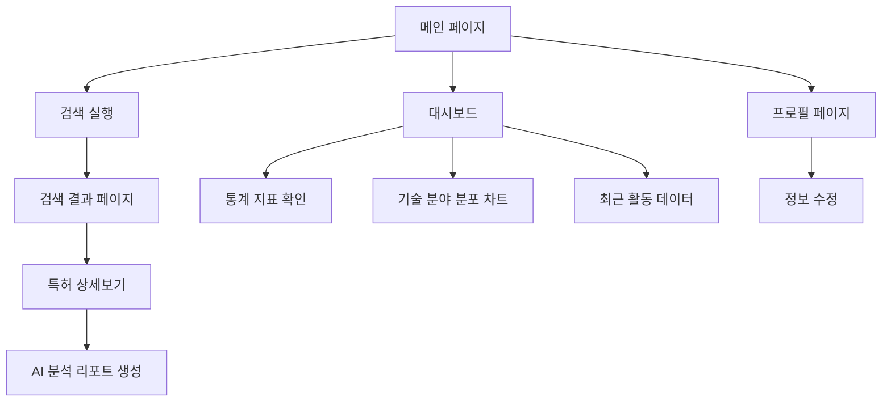

# Patent AI 검색 및 대시보드 개선 요구사항 문서

## 1. Product Overview
특허 AI 시스템의 검색 기능 정확성 개선 및 사용자 대시보드의 데이터 정합성과 UI/UX 향상을 통해 사용자 경험을 최적화하고 실제 사용 데이터 기반의 인사이트를 제공합니다.

메인 페이지 검색 결과 오류 해결, 대시보드 색상 테마 변경, Supabase DB 기반 정확한 지표 표시, 기술 분야 분포 시각화, 최근 활동 데이터 확장을 통해 사용자의 특허 분석 업무 효율성을 극대화합니다.

## 2. Core Features

### 2.1 User Roles
| Role | Registration Method | Core Permissions |
|------|---------------------|------------------|
| 일반 사용자 | 이메일 회원가입 | 특허 검색, 대시보드 조회, 프로필 관리 |
| 프리미엄 사용자 | 구독 업그레이드 | AI 분석 리포트 생성, 고급 통계 조회 |

### 2.2 Feature Module
우리의 특허 AI 시스템 개선 요구사항은 다음 주요 페이지들로 구성됩니다:
1. **메인 페이지**: 검색창 기능 개선, 올리브 색상 테마 적용
2. **검색 결과 페이지**: 정확한 검색 결과 표시, 데이터 파싱 개선
3. **사용자 대시보드**: DB 기반 정확한 지표, 기술 분야 분포 차트, 확장된 최근 활동 데이터
4. **프로필 페이지**: 업데이트 기능 수정, 스키마 검증

### 2.3 Page Details
| Page Name | Module Name | Feature description |
|-----------|-------------|---------------------|
| 메인 페이지 | 검색창 | 검색 결과 페이지와 동일한 방식으로 동작하도록 수정, 올리브 색상 테마 적용 |
| 검색 결과 페이지 | 결과 표시 | 정확한 특허 정보 출력, KIPRIS API 응답 파싱 개선, 초록 내용 보강 |
| 사용자 대시보드 | 통계 지표 | 총 검색 수, 평균 검색 결과, 상세보기 수, AI 분석 수, 총 로그인 횟수, 총 사용비용 표시 |
| 사용자 대시보드 | 분야별 분포 | 최근 100일간 검색 키워드 기술 분야 분포를 파이차트로 시각화, 카테고리 텍스트 명시 |
| 사용자 대시보드 | 최근 검색 키워드 | DB에서 최근 20개 키워드 조회 및 표시 |
| 사용자 대시보드 | 최근 보고서 | 최근 20개 시장분석/비즈니스 인사이트 리포트 목록 (특허제목, 특허번호, 리포트 유형, 날짜) |
| 프로필 페이지 | 정보 수정 | Supabase 테이블 스키마 검증 및 업데이트 기능 수정 |

## 3. Core Process
**일반 사용자 플로우:**
1. 메인 페이지에서 키워드 검색 → 검색 결과 페이지로 이동하여 정확한 특허 정보 확인
2. 대시보드 접속 → DB 기반 정확한 통계 지표 및 기술 분야 분포 차트 확인
3. 최근 검색 키워드 20개 및 최근 보고서 20개 목록 조회
4. 프로필 페이지에서 개인정보 수정

## 4. User Interface Design
### 4.1 Design Style
- **Primary Color**: 올리브 그린 (#6B7280, #10B981 계열)
- **Secondary Color**: 화이트, 라이트 그레이
- **Button Style**: 둥근 모서리, 호버 효과가 있는 올리브 색상
- **Font**: 시스템 기본 폰트, 14-16px 기본 크기
- **Layout Style**: 카드 기반 레이아웃, 상단 네비게이션
- **Chart Style**: 파이차트는 올리브 계열 색상 팔레트 사용

### 4.2 Page Design Overview
| Page Name | Module Name | UI Elements |
|-----------|-------------|-------------|
| 메인 페이지 | 검색창 | 올리브 색상 검색 버튼, 플레이스홀더 텍스트 개선 |
| 사용자 대시보드 | 통계 카드 | 올리브 색상 아이콘, 카드 형태 레이아웃, 명확한 지표 라벨 |
| 사용자 대시보드 | 분야별 분포 | 파이차트 중앙 배치, 범례 우측 정렬, 올리브 계열 색상 팔레트 |
| 사용자 대시보드 | 최근 활동 | 리스트 형태, 날짜 정보 포함, 스크롤 가능한 영역 |

### 4.3 Responsiveness
데스크톱 우선 설계이며 모바일 적응형 레이아웃을 지원합니다. 터치 인터랙션 최적화를 고려하여 버튼 크기와 간격을 조정합니다.