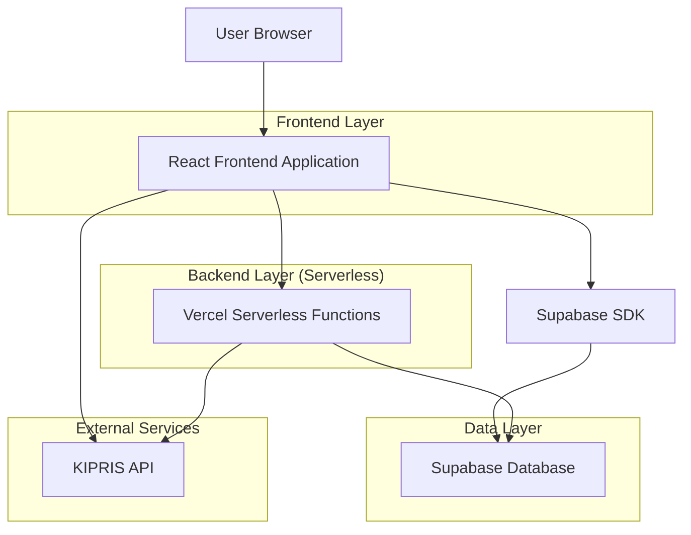
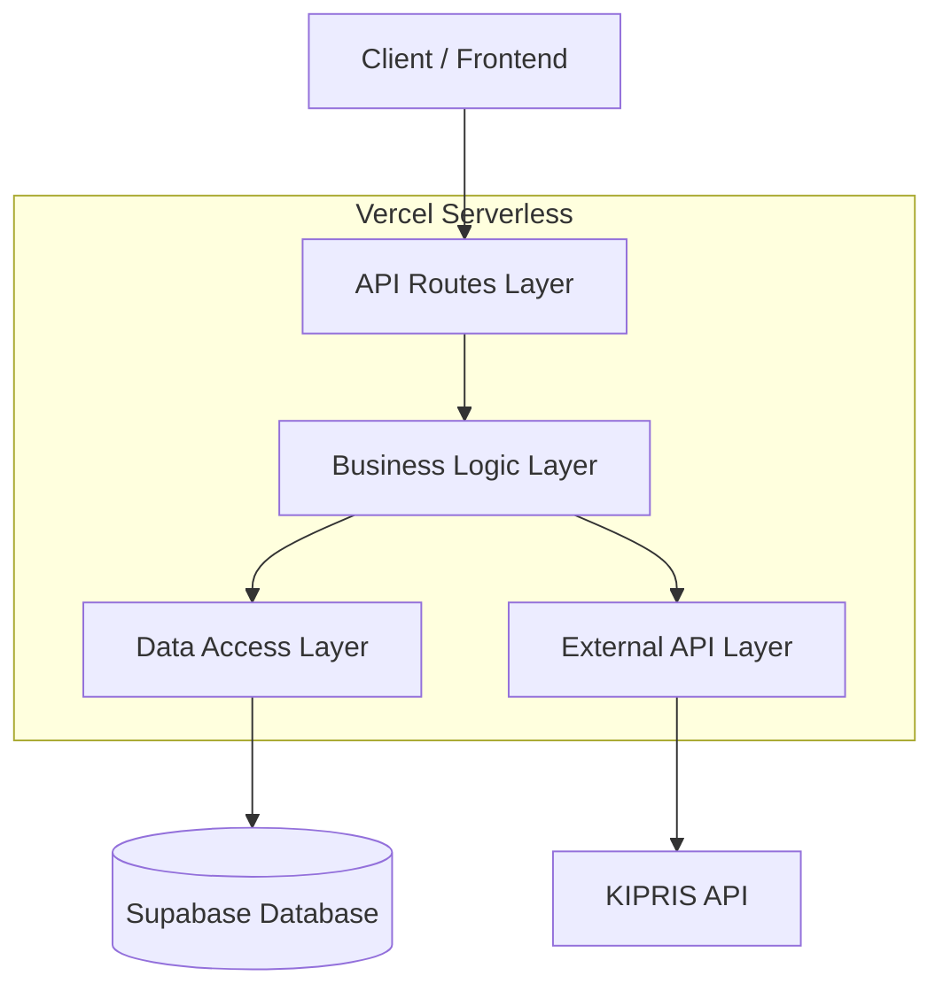
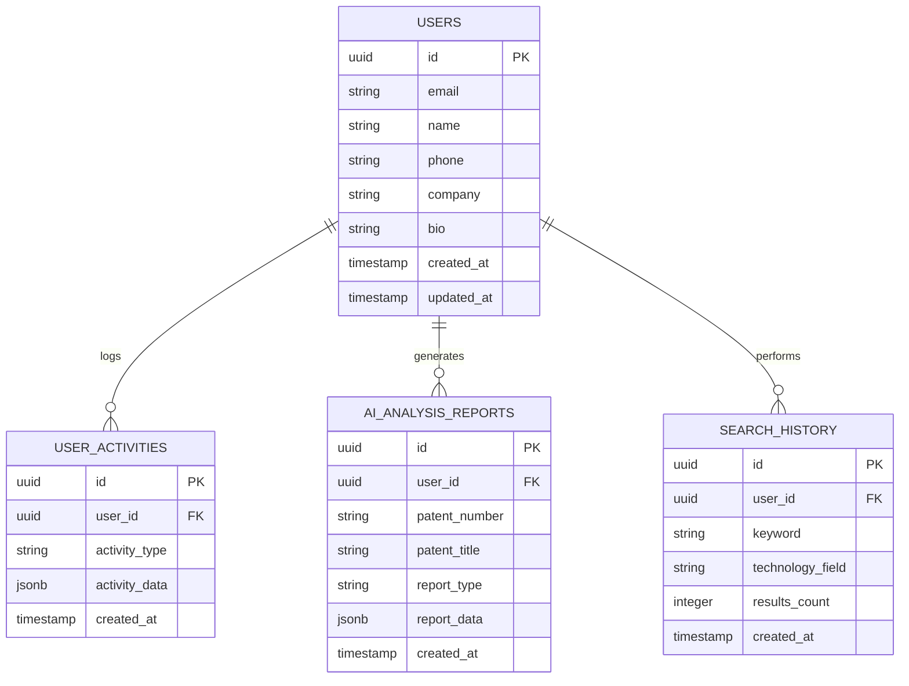

# Patent AI 검색 및 대시보드 개선 기술 아키텍처 문서

## 1. Architecture design



## 2. Technology Description
- Frontend: React@18 + TypeScript + TailwindCSS@3 + Vite + Recharts (파이차트)
- Backend: Vercel Serverless Functions + Supabase
- Database: Supabase (PostgreSQL)
- External API: KIPRIS 특허정보 API

## 3. Route definitions
| Route | Purpose |
|-------|---------|
| / | 메인 페이지, 개선된 검색창과 올리브 테마 |
| /search | 검색 결과 페이지, 정확한 특허 정보 표시 |
| /dashboard | 사용자 대시보드, DB 기반 정확한 지표와 차트 |
| /profile | 프로필 페이지, 수정된 업데이트 기능 |
| /patent/:id | 특허 상세 페이지, AI 분석 리포트 생성 |

## 4. API definitions

### 4.1 Core API

검색 기능 개선
```
POST /api/search
```

Request:
| Param Name| Param Type  | isRequired  | Description |
|-----------|-------------|-------------|-------------|
| word      | string      | false       | 자유검색 키워드 |
| inventionTitle | string | false    | 발명의명칭 검색 |
| userId    | string      | true        | 사용자 ID (활동 로그용) |
| pageNo    | number      | false       | 페이지 번호 (기본: 1) |
| numOfRows | number      | false       | 페이지당 결과 수 (기본: 30) |

Response:
| Param Name| Param Type  | Description |
|-----------|-------------|-------------|
| success   | boolean     | 요청 성공 여부 |
| data      | object      | 검색 결과 데이터 |
| data.body.items | array | 특허 목록 |
| data.body.count | object | 페이지네이션 정보 |

사용자 통계 조회
```
GET /api/users/stats?userId={userId}
```

Response:
| Param Name| Param Type  | Description |
|-----------|-------------|-------------|
| totalSearches | number | 총 검색 수 |
| avgSearchResults | number | 평균 검색 결과 수 |
| detailViews | number | 상세보기 수 |
| aiAnalyses | number | AI 분석 수 |
| totalLogins | number | 총 로그인 횟수 |
| totalCost | number | 총 사용비용 |
| recentKeywords | array | 최근 20개 검색 키워드 |
| recentReports | array | 최근 20개 리포트 |
| fieldDistribution | array | 기술 분야 분포 데이터 |

프로필 업데이트
```
PUT /api/users/profile
```

Request:
| Param Name| Param Type  | isRequired  | Description |
|-----------|-------------|-------------|-------------|
| userId    | string      | true        | 사용자 ID |
| name      | string      | true        | 사용자 이름 |
| phone     | string      | true        | 전화번호 |
| company   | string      | false       | 회사명 |
| bio       | string      | false       | 자기소개 |

## 5. Server architecture diagram



## 6. Data model

### 6.1 Data model definition



### 6.2 Data Definition Language

사용자 활동 테이블 (user_activities)
```sql
-- 기존 테이블 확인 및 수정
ALTER TABLE user_activities 
ADD COLUMN IF NOT EXISTS activity_type VARCHAR(50),
ADD COLUMN IF NOT EXISTS results_count INTEGER DEFAULT 0,
ADD COLUMN IF NOT EXISTS technology_field VARCHAR(100);

-- 인덱스 생성
CREATE INDEX IF NOT EXISTS idx_user_activities_user_id_type ON user_activities(user_id, activity_type);
CREATE INDEX IF NOT EXISTS idx_user_activities_created_at ON user_activities(created_at DESC);

-- AI 분석 리포트 테이블
CREATE TABLE IF NOT EXISTS ai_analysis_reports (
    id UUID PRIMARY KEY DEFAULT gen_random_uuid(),
    user_id UUID REFERENCES auth.users(id) ON DELETE CASCADE,
    patent_number VARCHAR(50) NOT NULL,
    patent_title TEXT NOT NULL,
    report_type VARCHAR(20) CHECK (report_type IN ('market', 'business')),
    report_data JSONB,
    created_at TIMESTAMP WITH TIME ZONE DEFAULT NOW()
);

-- 검색 히스토리 테이블
CREATE TABLE IF NOT EXISTS search_history (
    id UUID PRIMARY KEY DEFAULT gen_random_uuid(),
    user_id UUID REFERENCES auth.users(id) ON DELETE CASCADE,
    keyword VARCHAR(200) NOT NULL,
    technology_field VARCHAR(100),
    results_count INTEGER DEFAULT 0,
    created_at TIMESTAMP WITH TIME ZONE DEFAULT NOW()
);

-- 권한 설정
GRANT SELECT, INSERT, UPDATE ON ai_analysis_reports TO authenticated;
GRANT SELECT, INSERT, UPDATE ON search_history TO authenticated;

-- RLS 정책
ALTER TABLE ai_analysis_reports ENABLE ROW LEVEL SECURITY;
ALTER TABLE search_history ENABLE ROW LEVEL SECURITY;

CREATE POLICY "Users can view own reports" ON ai_analysis_reports
    FOR SELECT USING (auth.uid() = user_id);

CREATE POLICY "Users can insert own reports" ON ai_analysis_reports
    FOR INSERT WITH CHECK (auth.uid() = user_id);

CREATE POLICY "Users can view own search history" ON search_history
    FOR SELECT USING (auth.uid() = user_id);

CREATE POLICY "Users can insert own search history" ON search_history
    FOR INSERT WITH CHECK (auth.uid() = user_id);
```