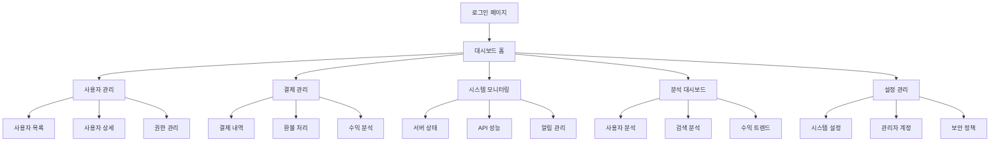

# Python 기반 관리자 대시보드 제품 요구사항 문서

## 1. Product Overview
기존 Node.js/React 기반 관리자 대시보드를 완전히 대체하는 Python 기반의 현대적이고 효율적인 관리자 대시보드 시스템을 구축합니다.
시스템 관리자가 사용자, 결제, 시스템 모니터링을 통합적으로 관리할 수 있는 웹 기반 관리 플랫폼을 제공하여 운영 효율성을 극대화합니다.
특허 AI 서비스의 핵심 비즈니스 메트릭과 사용자 활동을 실시간으로 모니터링하고 관리할 수 있는 종합적인 관리 도구를 목표로 합니다.

## 2. Core Features

### 2.1 User Roles

| Role | Registration Method | Core Permissions |
|------|---------------------|------------------|
| Super Admin | 시스템 초기 설정 시 생성 | 모든 시스템 기능 접근, 관리자 계정 생성/삭제 |
| Admin | Super Admin 초대 | 사용자 관리, 결제 관리, 분석 데이터 조회 |
| Operator | Admin 초대 | 제한된 사용자 지원, 기본 통계 조회 |

### 2.2 Feature Module

Python 기반 관리자 대시보드는 다음과 같은 핵심 페이지들로 구성됩니다:

1. **로그인 페이지**: 관리자 인증, 2FA 지원, 세션 관리
2. **대시보드 홈**: 실시간 메트릭, 핵심 KPI, 시스템 상태 모니터링
3. **사용자 관리**: 사용자 목록, 상세 정보, 권한 관리, 활동 로그
4. **결제 관리**: 결제 내역, 환불 처리, 구독 관리, 수익 분석
5. **시스템 모니터링**: 서버 상태, API 성능, 에러 로그, 알림 설정
6. **분석 대시보드**: 사용자 행동 분석, 검색 패턴, 수익 트렌드
7. **설정 관리**: 시스템 설정, 관리자 계정, 보안 정책

### 2.3 Page Details

| Page Name | Module Name | Feature description |
|-----------|-------------|---------------------|
| 로그인 페이지 | 인증 시스템 | 이메일/비밀번호 로그인, 2FA 인증, 세션 토큰 관리, 로그인 시도 제한 |
| 대시보드 홈 | 실시간 메트릭 | 일일/월간 사용자 수, 수익 현황, 시스템 상태, 최근 활동 피드 |
| 대시보드 홈 | KPI 위젯 | 핵심 성과 지표 카드, 트렌드 차트, 목표 대비 달성률 표시 |
| 사용자 관리 | 사용자 목록 | 페이지네이션, 검색/필터링, 정렬, 사용자 상태 관리 |
| 사용자 관리 | 사용자 상세 | 프로필 정보, 결제 이력, 활동 로그, 포인트 관리 |
| 사용자 관리 | 권한 관리 | 역할 할당, 접근 권한 설정, 계정 활성화/비활성화 |
| 결제 관리 | 결제 내역 | 전체 거래 내역, 결제 상태 추적, 수수료 계산 |
| 결제 관리 | 환불 처리 | 환불 요청 관리, 승인/거부 처리, 환불 내역 추적 |
| 결제 관리 | 수익 분석 | 일/월/년 수익 차트, 결제 방법별 분석, 수익 예측 |
| 시스템 모니터링 | 서버 상태 | CPU/메모리 사용률, 디스크 용량, 네트워크 상태 |
| 시스템 모니터링 | API 성능 | 응답 시간, 에러율, 요청 수, 엔드포인트별 통계 |
| 시스템 모니터링 | 알림 관리 | 임계값 설정, 알림 규칙, 이메일/SMS 발송 |
| 분석 대시보드 | 사용자 분석 | 신규/활성 사용자, 이탈률, 사용 패턴 분석 |
| 분석 대시보드 | 검색 분석 | 인기 키워드, 검색 트렌드, 성공률 분석 |
| 분석 대시보드 | 수익 트렌드 | 매출 성장률, 고객 생애 가치, 구독 전환율 |
| 설정 관리 | 시스템 설정 | 기본 설정, 기능 토글, 유지보수 모드 |
| 설정 관리 | 관리자 계정 | 관리자 목록, 권한 설정, 계정 생성/삭제 |
| 설정 관리 | 보안 정책 | 비밀번호 정책, 세션 타임아웃, IP 화이트리스트 |

## 3. Core Process

### Super Admin Flow
Super Admin은 시스템 최고 권한자로서 모든 기능에 접근할 수 있습니다. 로그인 후 대시보드에서 전체 시스템 상태를 확인하고, 필요에 따라 새로운 관리자 계정을 생성하거나 시스템 설정을 변경할 수 있습니다.

### Admin Flow  
Admin은 일반적인 관리 업무를 담당합니다. 로그인 후 대시보드에서 핵심 메트릭을 확인하고, 사용자 관리 페이지에서 고객 지원 업무를 처리하며, 결제 관리에서 거래 내역과 환불을 관리합니다.

### Operator Flow
Operator는 제한된 권한으로 기본적인 고객 지원 업무를 수행합니다. 사용자 정보 조회와 기본 통계 확인이 주요 업무이며, 중요한 변경 사항은 상위 관리자의 승인이 필요합니다.

## 4. User Interface Design

### 4.1 Design Style
- **Primary Colors**: #2563eb (Blue 600), #1e40af (Blue 700)
- **Secondary Colors**: #64748b (Slate 500), #f8fafc (Slate 50)
- **Accent Colors**: #10b981 (Emerald 500), #ef4444 (Red 500), #f59e0b (Amber 500)
- **Button Style**: 둥근 모서리 (border-radius: 6px), 그림자 효과, 호버 상태 변화
- **Font**: Inter, -apple-system, BlinkMacSystemFont, 'Segoe UI', sans-serif
- **Font Sizes**: 제목 24px, 부제목 18px, 본문 14px, 캡션 12px
- **Layout Style**: 사이드바 네비게이션, 카드 기반 컨텐츠, 그리드 레이아웃
- **Icon Style**: Heroicons, Lucide React 스타일의 선형 아이콘

### 4.2 Page Design Overview

| Page Name | Module Name | UI Elements |
|-----------|-------------|-------------|
| 로그인 페이지 | 인증 폼 | 중앙 정렬 카드, 파란색 그라데이션 배경, 로고, 입력 필드, 2FA 토글 |
| 대시보드 홈 | 메트릭 카드 | 4열 그리드 레이아웃, 아이콘과 숫자, 전일 대비 변화율 표시 |
| 대시보드 홈 | 차트 영역 | 반응형 차트 컨테이너, Chart.js 기반, 시간 범위 선택기 |
| 사용자 관리 | 데이터 테이블 | 정렬 가능한 헤더, 페이지네이션, 검색 바, 액션 버튼 |
| 사용자 관리 | 필터 사이드바 | 접을 수 있는 필터 패널, 체크박스, 날짜 선택기 |
| 결제 관리 | 거래 목록 | 상태별 색상 코딩, 금액 하이라이트, 상세 보기 모달 |
| 시스템 모니터링 | 상태 위젯 | 실시간 업데이트, 진행률 바, 경고 알림 배지 |
| 분석 대시보드 | 차트 대시보드 | 다양한 차트 타입, 드릴다운 기능, 데이터 내보내기 |
| 설정 관리 | 설정 폼 | 탭 기반 네비게이션, 토글 스위치, 저장 확인 모달 |

### 4.3 Responsiveness
데스크톱 우선 설계로 1920x1080 해상도에 최적화되어 있으며, 태블릿(768px 이상)과 모바일(480px 이상)에서도 사용 가능하도록 반응형 디자인을 적용합니다. 터치 인터페이스를 고려한 버튼 크기와 간격을 설정하고, 모바일에서는 사이드바가 오버레이 형태로 표시됩니다.