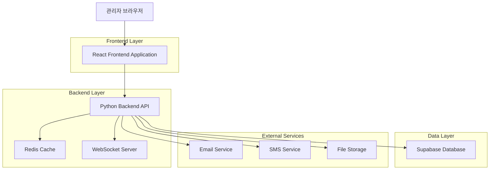
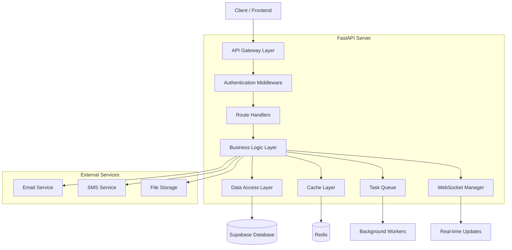
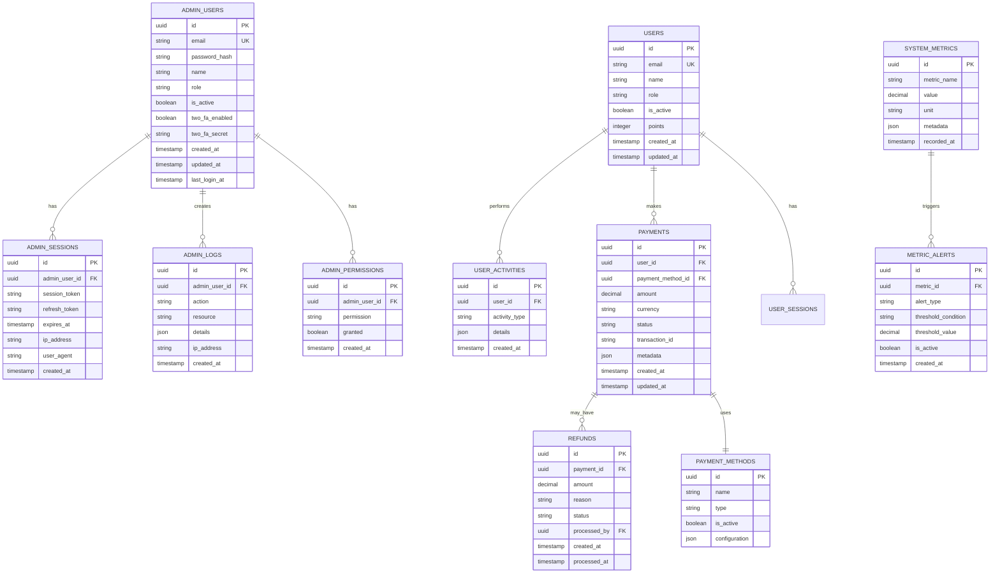

# Python 기반 관리자 대시보드 기술 아키텍처 문서

## 1. Architecture Design



## 2. Technology Description

- **Frontend**: React@18 + TypeScript + Tailwind CSS + Vite + Chart.js
- **Backend**: FastAPI@0.104 + Python@3.11 + Pydantic + SQLAlchemy
- **Database**: Supabase (PostgreSQL) + Redis@7.0
- **Authentication**: JWT + 2FA (TOTP)
- **Real-time**: WebSocket + Server-Sent Events
- **Caching**: Redis + In-memory caching
- **Task Queue**: Celery + Redis broker

## 3. Route Definitions

| Route | Purpose |
|-------|---------|
| /admin/login | 관리자 로그인 페이지, 2FA 인증 지원 |
| /admin/dashboard | 메인 대시보드, 실시간 메트릭 및 KPI 표시 |
| /admin/users | 사용자 관리 페이지, 목록/상세/권한 관리 |
| /admin/payments | 결제 관리 페이지, 거래 내역 및 환불 처리 |
| /admin/monitoring | 시스템 모니터링 페이지, 서버 상태 및 성능 |
| /admin/analytics | 분석 대시보드, 사용자 행동 및 비즈니스 메트릭 |
| /admin/settings | 설정 관리 페이지, 시스템 및 보안 설정 |

## 4. API Definitions

### 4.1 Core API

#### 관리자 인증 관련
```
POST /api/admin/auth/login
```

Request:
| Param Name | Param Type | isRequired | Description |
|------------|------------|------------|-------------|
| email | string | true | 관리자 이메일 주소 |
| password | string | true | 비밀번호 |
| totp_code | string | false | 2FA 인증 코드 (활성화된 경우) |

Response:
| Param Name | Param Type | Description |
|------------|------------|-------------|
| access_token | string | JWT 액세스 토큰 |
| refresh_token | string | JWT 리프레시 토큰 |
| user | object | 관리자 사용자 정보 |
| expires_in | integer | 토큰 만료 시간 (초) |

Example:
```json
{
  "email": "admin@example.com",
  "password": "securepassword123",
  "totp_code": "123456"
}
```

#### 대시보드 메트릭 조회
```
GET /api/admin/dashboard/metrics
```

Request:
| Param Name | Param Type | isRequired | Description |
|------------|------------|------------|-------------|
| period | string | false | 조회 기간 (day, week, month, year) |
| start_date | string | false | 시작 날짜 (YYYY-MM-DD) |
| end_date | string | false | 종료 날짜 (YYYY-MM-DD) |

Response:
| Param Name | Param Type | Description |
|------------|------------|-------------|
| total_users | integer | 전체 사용자 수 |
| active_users | integer | 활성 사용자 수 |
| total_revenue | float | 총 수익 |
| daily_signups | array | 일별 가입자 수 |

#### 사용자 관리
```
GET /api/admin/users
```

Request:
| Param Name | Param Type | isRequired | Description |
|------------|------------|------------|-------------|
| page | integer | false | 페이지 번호 (기본값: 1) |
| limit | integer | false | 페이지당 항목 수 (기본값: 20) |
| search | string | false | 검색 키워드 |
| status | string | false | 사용자 상태 필터 |
| role | string | false | 사용자 역할 필터 |

Response:
| Param Name | Param Type | Description |
|------------|------------|-------------|
| users | array | 사용자 목록 |
| total | integer | 전체 사용자 수 |
| page | integer | 현재 페이지 |
| pages | integer | 전체 페이지 수 |

#### 결제 관리
```
GET /api/admin/payments
```

Request:
| Param Name | Param Type | isRequired | Description |
|------------|------------|------------|-------------|
| page | integer | false | 페이지 번호 |
| limit | integer | false | 페이지당 항목 수 |
| status | string | false | 결제 상태 필터 |
| payment_method | string | false | 결제 방법 필터 |

Response:
| Param Name | Param Type | Description |
|------------|------------|-------------|
| payments | array | 결제 내역 목록 |
| total_amount | float | 총 결제 금액 |
| total | integer | 전체 결제 건수 |

#### 시스템 모니터링
```
GET /api/admin/monitoring/system
```

Response:
| Param Name | Param Type | Description |
|------------|------------|-------------|
| cpu_usage | float | CPU 사용률 (%) |
| memory_usage | float | 메모리 사용률 (%) |
| disk_usage | float | 디스크 사용률 (%) |
| active_connections | integer | 활성 연결 수 |
| api_response_time | float | 평균 API 응답 시간 (ms) |

## 5. Server Architecture Diagram



## 6. Data Model

### 6.1 Data Model Definition



### 6.2 Data Definition Language

#### Admin Users Table (admin_users)
```sql
-- 관리자 사용자 테이블 생성
CREATE TABLE admin_users (
    id UUID PRIMARY KEY DEFAULT gen_random_uuid(),
    email VARCHAR(255) UNIQUE NOT NULL,
    password_hash VARCHAR(255) NOT NULL,
    name VARCHAR(100) NOT NULL,
    role VARCHAR(20) DEFAULT 'admin' CHECK (role IN ('super_admin', 'admin', 'operator')),
    is_active BOOLEAN DEFAULT true,
    two_fa_enabled BOOLEAN DEFAULT false,
    two_fa_secret VARCHAR(32),
    created_at TIMESTAMP WITH TIME ZONE DEFAULT NOW(),
    updated_at TIMESTAMP WITH TIME ZONE DEFAULT NOW(),
    last_login_at TIMESTAMP WITH TIME ZONE
);

-- 인덱스 생성
CREATE INDEX idx_admin_users_email ON admin_users(email);
CREATE INDEX idx_admin_users_role ON admin_users(role);
CREATE INDEX idx_admin_users_is_active ON admin_users(is_active);

-- RLS 정책 설정
ALTER TABLE admin_users ENABLE ROW LEVEL SECURITY;
GRANT SELECT, INSERT, UPDATE, DELETE ON admin_users TO authenticated;
```

#### Admin Sessions Table (admin_sessions)
```sql
-- 관리자 세션 테이블 생성
CREATE TABLE admin_sessions (
    id UUID PRIMARY KEY DEFAULT gen_random_uuid(),
    admin_user_id UUID NOT NULL REFERENCES admin_users(id) ON DELETE CASCADE,
    session_token VARCHAR(255) UNIQUE NOT NULL,
    refresh_token VARCHAR(255) UNIQUE NOT NULL,
    expires_at TIMESTAMP WITH TIME ZONE NOT NULL,
    ip_address INET,
    user_agent TEXT,
    created_at TIMESTAMP WITH TIME ZONE DEFAULT NOW()
);

-- 인덱스 생성
CREATE INDEX idx_admin_sessions_admin_user_id ON admin_sessions(admin_user_id);
CREATE INDEX idx_admin_sessions_session_token ON admin_sessions(session_token);
CREATE INDEX idx_admin_sessions_expires_at ON admin_sessions(expires_at);

-- RLS 정책 설정
ALTER TABLE admin_sessions ENABLE ROW LEVEL SECURITY;
GRANT SELECT, INSERT, UPDATE, DELETE ON admin_sessions TO authenticated;
```

#### Admin Logs Table (admin_logs)
```sql
-- 관리자 활동 로그 테이블 생성
CREATE TABLE admin_logs (
    id UUID PRIMARY KEY DEFAULT gen_random_uuid(),
    admin_user_id UUID NOT NULL REFERENCES admin_users(id) ON DELETE CASCADE,
    action VARCHAR(100) NOT NULL,
    resource VARCHAR(100) NOT NULL,
    details JSONB,
    ip_address INET,
    created_at TIMESTAMP WITH TIME ZONE DEFAULT NOW()
);

-- 인덱스 생성
CREATE INDEX idx_admin_logs_admin_user_id ON admin_logs(admin_user_id);
CREATE INDEX idx_admin_logs_action ON admin_logs(action);
CREATE INDEX idx_admin_logs_created_at ON admin_logs(created_at DESC);

-- RLS 정책 설정
ALTER TABLE admin_logs ENABLE ROW LEVEL SECURITY;
GRANT SELECT, INSERT ON admin_logs TO authenticated;
```

#### System Metrics Table (system_metrics)
```sql
-- 시스템 메트릭 테이블 생성
CREATE TABLE system_metrics (
    id UUID PRIMARY KEY DEFAULT gen_random_uuid(),
    metric_name VARCHAR(100) NOT NULL,
    value DECIMAL(15,4) NOT NULL,
    unit VARCHAR(20),
    metadata JSONB,
    recorded_at TIMESTAMP WITH TIME ZONE DEFAULT NOW()
);

-- 인덱스 생성
CREATE INDEX idx_system_metrics_metric_name ON system_metrics(metric_name);
CREATE INDEX idx_system_metrics_recorded_at ON system_metrics(recorded_at DESC);

-- RLS 정책 설정
ALTER TABLE system_metrics ENABLE ROW LEVEL SECURITY;
GRANT SELECT, INSERT ON system_metrics TO authenticated;
```

#### 초기 데이터 삽입
```sql
-- Super Admin 계정 생성
INSERT INTO admin_users (email, password_hash, name, role, is_active)
VALUES (
    'admin@p-ai.co.kr',
    '$2b$12$LQv3c1yqBWVHxkd0LHAkCOYz6TtxMQJqhN8/LewdBPj/RK.s5uO.O', -- admin123456
    'System Administrator',
    'super_admin',
    true
);

-- 기본 결제 방법 설정
INSERT INTO payment_methods (name, type, is_active, configuration)
VALUES 
    ('신용카드', 'card', true, '{"provider": "nicepay", "supported_cards": ["visa", "mastercard", "amex"]}'),
    ('계좌이체', 'bank_transfer', true, '{"provider": "nicepay", "supported_banks": ["kb", "shinhan", "woori"]}'),
    ('카카오페이', 'kakao_pay', true, '{"provider": "kakao", "app_id": "your_app_id"}');

-- 시스템 메트릭 초기화
INSERT INTO system_metrics (metric_name, value, unit)
VALUES 
    ('total_users', 0, 'count'),
    ('active_users', 0, 'count'),
    ('total_revenue', 0, 'KRW'),
    ('api_response_time', 0, 'ms'),
    ('system_uptime', 0, 'seconds');
```