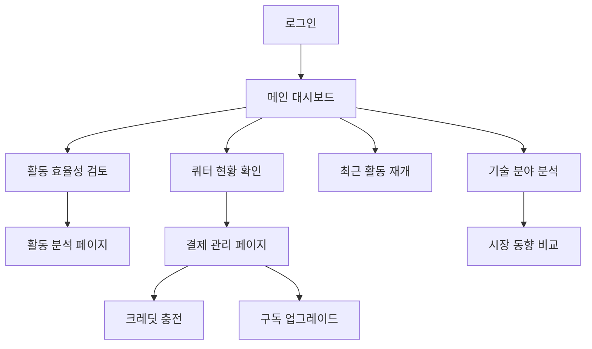

# 사용자 대시보드 제품 요구사항 문서 (PRD)

## 1. Product Overview

미니멀 스트래티지스트 컨셉의 사용자 대시보드로, 특허 분석 활동의 효율성을 측정하고 전략적 통찰력을 제공하는 개인화된 인텔리전스 플랫폼입니다.

사용자의 분석 행동 패턴을 시각화하여 낭비를 줄이고, 쿼터 관리를 통한 손실 회피 심리를 활용하여 리포트 발행을 유도하며, 개인의 기술 관심사를 시장 동향과 연결하여 전략적 의사결정을 지원합니다.

## 2. Core Features

### 2.1 User Roles

| Role | Registration Method | Core Permissions |
|------|---------------------|------------------|
| 일반 사용자 | 기존 계정 로그인 | 개인 대시보드 접근, 활동 통계 조회, 개인화된 인사이트 확인 |
| 프리미엄 사용자 | 유료 구독 업그레이드 | 고급 분석 기능, 상세 시장 인텔리전스, 무제한 리포트 생성 |

### 2.2 Feature Module

사용자 대시보드는 다음 핵심 페이지들로 구성됩니다:

1. **메인 대시보드 페이지**: 쿼터 현황, 활동 요약, 개인화된 인사이트를 한눈에 볼 수 있는 통합 뷰
2. **활동 분석 페이지**: 상세한 사용 패턴 분석 및 효율성 지표
3. **결제 관리 페이지**: 구독 정보, 충전 옵션, 사용량 추적

### 2.3 Page Details

| Page Name | Module Name | Feature description |
|-----------|-------------|---------------------|
| 메인 대시보드 | 쿼터 현황 카드 | 잔여 크레딧 및 리포트 횟수를 진행률 바로 표시. 소멸 기한 임박 시 경고 색상 적용 |
| 메인 대시보드 | 활동 효율성 요약 | 로그인 대비 리포트 발행률, 검색 대비 리포트 발행률을 KPI 카드로 표시 |
| 메인 대시보드 | 최근 활동 리스트 | 최근 리포트 Top 5, 최근 검색어 Top 5를 볼드체로 강조하여 표시 |
| 메인 대시보드 | 기술 분야 분석 | 사용자 관심 기술 분야 Top 3를 도넛 차트로 시각화 |
| 메인 대시보드 | 시장 동향 비교 | 개인 vs 시장 분석 추이를 라인 차트로 비교 표시 |
| 활동 분석 | 상세 통계 | 일별/주별/월별 활동 패턴 분석 및 트렌드 시각화 |
| 활동 분석 | 효율성 지표 | 분석 행동률, 아이디어 전환율 등 핵심 지표의 상세 분석 |
| 결제 관리 | 구독 정보 | 현재 요금제, 다음 결제일, 주요 혜택 요약 표시 |
| 결제 관리 | 충전 옵션 | 금액별 충전 옵션과 10% 보너스 크레딧 혜택 안내 |
| 결제 관리 | 사용량 추적 | 서비스별 상세 사용량 및 비용 내역 조회 |

## 3. Core Process

### 일반 사용자 플로우

사용자는 로그인 후 메인 대시보드에서 쿼터 현황을 즉시 확인하고, 활동 효율성 지표를 통해 분석 행동 개선점을 파악합니다. 최근 활동 리스트에서 이전 작업을 빠르게 재개하거나, 기술 분야 분석을 통해 관심사의 편중도를 확인할 수 있습니다. 필요시 결제 관리 페이지에서 크레딧을 충전하거나 구독을 업그레이드합니다.

### 프리미엄 사용자 플로우

프리미엄 사용자는 기본 기능에 더해 고급 시장 인텔리전스 기능을 활용하여 개인 분석 패턴을 시장 동향과 비교 분석하고, 상세한 활동 분석 페이지에서 전략적 인사이트를 얻습니다.

## 4. User Interface Design

### 4.1 Design Style

- **Primary Colors**: 
  - 주색상: #1f2937 (Gray-800) - 전문성과 신뢰감
  - 보조색상: #3b82f6 (Blue-500) - 액션 및 강조
  - 경고색상: #ef4444 (Red-500) - 쿼터 부족 알림
  - 성공색상: #10b981 (Emerald-500) - 긍정적 지표

- **Button Style**: 
  - 둥근 모서리 (rounded-lg)
  - 미니멀한 그림자 효과
  - 호버 시 부드러운 전환 애니메이션

- **Font**: 
  - 기본: Inter, system-ui, sans-serif
  - 제목: font-semibold (600)
  - 본문: font-normal (400)
  - 강조: font-bold (700)

- **Layout Style**: 
  - 카드 기반 레이아웃
  - 넓은 여백 (p-6, gap-6)
  - 저대비 배경 (bg-gray-50)
  - 그리드 시스템 활용

- **Icon Style**: 
  - Heroicons 라이브러리 사용
  - 24px 기본 크기
  - 일관된 스트로크 두께

### 4.2 Page Design Overview

| Page Name | Module Name | UI Elements |
|-----------|-------------|-------------|
| 메인 대시보드 | 쿼터 현황 카드 | 대형 진행률 바, 잔여 금액 강조 텍스트, 소멸 기한 카운트다운, 경고 색상 적용 |
| 메인 대시보드 | KPI 카드 그리드 | 2x2 그리드 레이아웃, 각 카드는 아이콘+수치+설명 구조, 호버 효과 |
| 메인 대시보드 | 최근 활동 섹션 | 볼드 제목, 클릭 가능한 리스트 아이템, 날짜 표시 |
| 메인 대시보드 | 차트 영역 | Recharts 도넛차트 및 라인차트, 범례 포함, 반응형 크기 |
| 활동 분석 | 상세 차트 | Tremor 차트 컴포넌트, 필터링 옵션, 데이터 테이블 |
| 결제 관리 | 구독 카드 | 현재 플랜 강조, 혜택 리스트, 업그레이드 버튼 |
| 결제 관리 | 충전 옵션 | 금액별 버튼 그리드, 보너스 혜택 배지, 즉시 충전 기능 |

### 4.3 Responsiveness

데스크톱 우선 설계로 1280px 이상에서 최적화되며, 태블릿(768px)과 모바일(640px)에서 적응형 레이아웃을 제공합니다. 터치 인터랙션 최적화를 통해 모바일에서도 원활한 사용 경험을 보장합니다.