# 사용자 대시보드 기술 아키텍처 문서

## 1. Architecture design

```mermaid
graph TD
  A[User Browser] --> B[Next.js Frontend Application]
  B --> C[Supabase Client SDK]
  C --> D[Supabase Database]
  C --> E[Supabase Auth]
  
  subgraph "Frontend Layer"
    B
    F[Tailwind CSS]
    G[Recharts/Tremor]
    H[TypeScript]
  end
  
  subgraph "Data Layer (Supabase)"
    D
    E
    I[Real-time Subscriptions]
  end
  
  subgraph "External Services"
    J[Payment Gateway]
  end
  
  B --> F
  B --> G
  B --> H
  C --> I
  D --> J
```



## 2. Technology Description

- **Frontend**: Next.js@14 + TypeScript@5 + Tailwind CSS@3 + Recharts@2 + Tremor@3
- **Backend**: Supabase (PostgreSQL + Auth + Real-time)
- **State Management**: Zustand@4
- **Charts**: Recharts (도넛차트, 라인차트) + Tremor (KPI 카드, 진행률 바)

## 3. Route definitions

| Route | Purpose |
|-------|---------|
| /dashboard | 메인 대시보드 페이지, 쿼터 현황 및 핵심 지표 표시 |
| /dashboard/activity | 활동 분석 페이지, 상세 사용 패턴 및 효율성 지표 |
| /dashboard/billing | 결제 관리 페이지, 구독 정보 및 충전 옵션 |
| /dashboard/settings | 대시보드 설정 페이지, 알림 및 개인화 옵션 |

## 4. API definitions

### 4.1 Core API

대시보드 통계 조회
```
GET /api/dashboard/stats
```

Request:
| Param Name | Param Type | isRequired | Description |
|------------|------------|------------|-------------|
| user_id | string | true | 사용자 ID (JWT에서 추출) |
| period | string | false | 조회 기간 (7d, 30d, 90d) |

Response:
| Param Name | Param Type | Description |
|------------|------------|-------------|
| quota_status | object | 잔여 크레딧 및 소멸 기한 정보 |
| efficiency_metrics | object | 로그인/검색 대비 리포트 발행률 |
| recent_activities | array | 최근 리포트 및 검색어 목록 |
| technology_fields | array | 관심 기술 분야 Top 3 |

Example Response:
```json
{
  "quota_status": {
    "remaining_credits": 15000,
    "remaining_reports": 10,
    "expiry_date": "2024-02-15T00:00:00Z",
    "days_until_expiry": 7
  },
  "efficiency_metrics": {
    "login_to_report_rate": 65.5,
    "search_to_report_rate": 42.3
  },
  "recent_activities": {
    "reports": [
      {
        "title": "AI 음성인식 시장분석",
        "created_at": "2024-01-08T10:30:00Z",
        "patent_id": "1020230001234"
      }
    ],
    "searches": [
      {
        "keyword": "인공지능 음성인식",
        "searched_at": "2024-01-08T09:15:00Z"
      }
    ]
  },
  "technology_fields": [
    {
      "field": "Physics",
      "percentage": 45.2,
      "ipc_code": "G"
    }
  ]
}
```

사용량 비용 추적 조회
```
GET /api/dashboard/usage-costs
```

Request:
| Param Name | Param Type | isRequired | Description |
|------------|------------|------------|-------------|
| user_id | string | true | 사용자 ID |
| start_date | string | false | 시작 날짜 (ISO 8601) |
| end_date | string | false | 종료 날짜 (ISO 8601) |

Response:
| Param Name | Param Type | Description |
|------------|------------|-------------|
| total_cost | number | 총 사용 비용 |
| cost_breakdown | array | 서비스별 비용 내역 |
| daily_usage | array | 일별 사용량 데이터 |

구독 정보 조회
```
GET /api/dashboard/subscription
```

Response:
| Param Name | Param Type | Description |
|------------|------------|-------------|
| current_plan | string | 현재 구독 플랜 |
| next_billing_date | string | 다음 결제일 |
| billing_amount | number | 결제 예정 금액 |
| features | array | 플랜별 혜택 목록 |

크레딧 충전
```
POST /api/dashboard/charge-credits
```

Request:
| Param Name | Param Type | isRequired | Description |
|------------|------------|------------|-------------|
| amount | number | true | 충전 금액 (KRW) |
| payment_method | string | true | 결제 수단 |

Response:
| Param Name | Param Type | Description |
|------------|------------|-------------|
| success | boolean | 충전 성공 여부 |
| new_balance | number | 충전 후 잔액 |
| bonus_credits | number | 보너스 크레딧 |

## 5. Server architecture diagram


## 6. Data model

### 6.1 Data model definition


### 6.2 Data Definition Language

대시보드 통계를 위한 뷰 생성
```sql
-- 사용자별 효율성 지표 뷰
CREATE OR REPLACE VIEW user_efficiency_metrics AS
SELECT 
  u.id as user_id,
  u.email,
  u.total_logins,
  u.total_searches,
  u.total_reports,
  CASE 
    WHEN u.total_logins > 0 THEN (u.total_reports::float / u.total_logins * 100)
    ELSE 0 
  END as login_to_report_rate,
  CASE 
    WHEN u.total_searches > 0 THEN (u.total_reports::float / u.total_searches * 100)
    ELSE 0 
  END as search_to_report_rate
FROM users u
WHERE u.role = 'user';

-- 사용자별 기술 분야 관심도 뷰
CREATE OR REPLACE VIEW user_technology_interests AS
SELECT 
  ska.user_id,
  ska.technology_field,
  ska.ipc_main_class,
  SUM(ska.search_count) as total_searches,
  COUNT(DISTINCT ska.keyword) as unique_keywords,
  MAX(ska.last_searched_at) as last_activity
FROM search_keyword_analytics ska
GROUP BY ska.user_id, ska.technology_field, ska.ipc_main_class
ORDER BY total_searches DESC;

-- 사용자별 월별 사용량 통계 뷰
CREATE OR REPLACE VIEW user_monthly_usage AS
SELECT 
  uct.user_id,
  DATE_TRUNC('month', uct.created_at) as month,
  uct.service_type,
  SUM(uct.cost_amount) as total_cost,
  SUM(uct.quantity) as total_quantity,
  COUNT(*) as transaction_count
FROM usage_cost_tracking uct
GROUP BY uct.user_id, DATE_TRUNC('month', uct.created_at), uct.service_type
ORDER BY month DESC;

-- 대시보드 데이터 조회 함수
CREATE OR REPLACE FUNCTION get_dashboard_stats(p_user_id UUID, p_period TEXT DEFAULT '30d')
RETURNS JSON AS $$
DECLARE
  result JSON;
  period_interval INTERVAL;
BEGIN
  -- 기간 설정
  CASE p_period
    WHEN '7d' THEN period_interval := INTERVAL '7 days';
    WHEN '30d' THEN period_interval := INTERVAL '30 days';
    WHEN '90d' THEN period_interval := INTERVAL '90 days';
    ELSE period_interval := INTERVAL '30 days';
  END CASE;
  
  -- 통계 데이터 조합
  SELECT json_build_object(
    'quota_status', (
      SELECT json_build_object(
        'remaining_credits', COALESCE(u.total_usage_cost, 0),
        'subscription_plan', u.subscription_plan,
        'last_login', u.last_login_at
      )
      FROM users u WHERE u.id = p_user_id
    ),
    'efficiency_metrics', (
      SELECT json_build_object(
        'login_to_report_rate', COALESCE(uem.login_to_report_rate, 0),
        'search_to_report_rate', COALESCE(uem.search_to_report_rate, 0)
      )
      FROM user_efficiency_metrics uem WHERE uem.user_id = p_user_id
    ),
    'recent_activities', (
      SELECT json_build_object(
        'reports', COALESCE(
          (SELECT json_agg(
            json_build_object(
              'title', activity_data->>'title',
              'created_at', created_at,
              'patent_id', activity_data->>'patent_id'
            )
          )
          FROM user_activities 
          WHERE user_id = p_user_id 
            AND activity_type = 'report_generate'
            AND created_at >= NOW() - period_interval
          ORDER BY created_at DESC 
          LIMIT 5), '[]'::json
        ),
        'searches', COALESCE(
          (SELECT json_agg(
            json_build_object(
              'keyword', keyword,
              'searched_at', last_searched_at,
              'technology_field', technology_field
            )
          )
          FROM search_keyword_analytics 
          WHERE user_id = p_user_id
            AND last_searched_at >= NOW() - period_interval
          ORDER BY last_searched_at DESC 
          LIMIT 5), '[]'::json
        )
      )
    ),
    'technology_fields', (
      SELECT COALESCE(json_agg(
        json_build_object(
          'field', technology_field,
          'percentage', ROUND((total_searches::float / SUM(total_searches) OVER() * 100)::numeric, 1),
          'ipc_code', ipc_main_class,
          'search_count', total_searches
        )
      ), '[]'::json)
      FROM (
        SELECT technology_field, ipc_main_class, total_searches
        FROM user_technology_interests 
        WHERE user_id = p_user_id
        ORDER BY total_searches DESC 
        LIMIT 3
      ) top_fields
    )
  ) INTO result;
  
  RETURN result;
END;
$$ LANGUAGE plpgsql SECURITY DEFINER;

-- 권한 설정
GRANT EXECUTE ON FUNCTION get_dashboard_stats(UUID, TEXT) TO authenticated;
GRANT SELECT ON user_efficiency_metrics TO authenticated;
GRANT SELECT ON user_technology_interests TO authenticated;
GRANT SELECT ON user_monthly_usage TO authenticated;
```