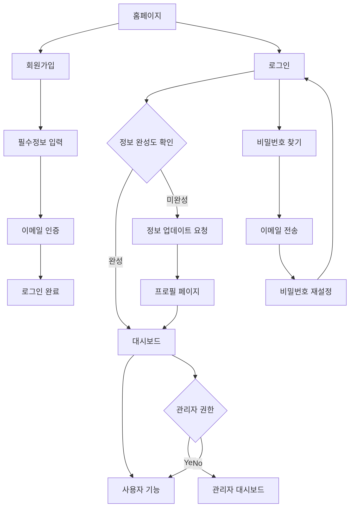

# 회원가입 개선 및 사용자 관리 시스템 강화 PRD

## 1. Product Overview

IP-Insight AI 플랫폼의 사용자 등록 프로세스를 개선하고, 기존 사용자의 정보 완성도를 높이며, 비밀번호 재설정 기능을 추가하여 전반적인 사용자 경험을 향상시킵니다.
사용자 대시보드와 관리자 대시보드의 데이터 연동을 강화하여 실시간 통계 및 분석 기능을 제공합니다.

## 2. Core Features

### 2.1 User Roles

| Role | Registration Method | Core Permissions |
|------|---------------------|------------------|
| Normal User | 이메일 + 이름 + 전화번호 필수 입력 | 특허 검색, AI 분석, 리포트 생성 |
| Premium User | 일반 사용자 + 구독 업그레이드 | 무제한 검색, 고급 AI 분석, 우선 지원 |
| Admin | 시스템 관리자 초대 | 사용자 관리, 시스템 통계, 전체 데이터 접근 |

### 2.2 Feature Module

회원가입 개선 및 사용자 관리 시스템은 다음 주요 페이지들로 구성됩니다:

1. **개선된 회원가입 페이지**: 이름과 전화번호 필수 입력, 실시간 유효성 검사
2. **사용자 정보 완성 알림**: 기존 사용자 로그인 시 정보 업데이트 요청
3. **비밀번호 재설정 페이지**: 이메일 기반 비밀번호 재설정 프로세스
4. **강화된 사용자 대시보드**: 실시간 Supabase 데이터 연동
5. **개선된 관리자 대시보드**: 전체 사용자 통계 및 분석 기능

### 2.3 Page Details

| Page Name | Module Name | Feature description |
|-----------|-------------|---------------------|
| 회원가입 페이지 | 필수 정보 입력 | 이름, 이메일, 전화번호(000-0000-0000 형식) 필수 입력, 실시간 유효성 검사, 중복 확인 |
| 회원가입 페이지 | 선택 정보 입력 | 회사명, 자기소개 선택 입력, 비밀번호 강도 검사 |
| 로그인 페이지 | 정보 완성 알림 | 기존 사용자 이름/전화번호 미입력 시 업데이트 요청 모달 표시 |
| 비밀번호 찾기 페이지 | 이메일 전송 | 등록된 이메일로 재설정 링크 전송, 전송 상태 피드백 |
| 비밀번호 재설정 페이지 | 새 비밀번호 설정 | 토큰 검증, 새 비밀번호 입력, 강도 검사, 확인 입력 |
| 사용자 대시보드 | 실시간 통계 | Supabase DB 연동 검색 횟수, AI 분석 횟수, 리포트 생성 수 |
| 사용자 대시보드 | 활동 내역 | 최근 검색 키워드, 생성된 리포트 목록, 월별 활동 차트 |
| 관리자 대시보드 | 사용자 관리 | 전체 사용자 목록, 상태 관리, 구독 플랜 변경 |
| 관리자 대시보드 | 시스템 통계 | 일일/월별 사용자 활동, 검색 트렌드, 수익 분석 |

## 3. Core Process

### 신규 사용자 등록 프로세스
1. 사용자가 회원가입 페이지 접속
2. 필수 정보 입력 (이름, 이메일, 전화번호)
3. 실시간 유효성 검사 및 중복 확인
4. 선택 정보 입력 (회사명, 자기소개)
5. 비밀번호 설정 및 강도 검사
6. 이메일 인증 링크 전송
7. 이메일 인증 완료 후 로그인 가능

### 기존 사용자 정보 완성 프로세스
1. 기존 사용자 로그인 시도
2. 시스템에서 이름/전화번호 누락 확인
3. 정보 업데이트 요청 모달 표시
4. 사용자가 정보 입력 또는 나중에 하기 선택
5. 정보 입력 시 프로필 페이지로 이동
6. 정보 저장 후 대시보드로 이동

### 비밀번호 재설정 프로세스
1. 로그인 페이지에서 "비밀번호 찾기" 클릭
2. 이메일 주소 입력
3. 재설정 링크 이메일 전송
4. 이메일의 링크 클릭
5. 새 비밀번호 입력 및 확인
6. 비밀번호 업데이트 완료

## 4. User Interface Design

### 4.1 Design Style

- **Primary Colors**: MS Burgundy (#722F37), MS Olive (#6B8E23)
- **Secondary Colors**: Slate Gray (#64748B), Green (#10B981), Red (#EF4444)
- **Button Style**: 둥근 모서리 (rounded-lg), 호버 효과, 로딩 상태 표시
- **Font**: Inter, system-ui, sans-serif / 크기: 14px-16px (본문), 18px-24px (제목)
- **Layout Style**: 카드 기반 레이아웃, 상단 네비게이션, 반응형 그리드
- **Icon Style**: Lucide React 아이콘, 일관된 크기 (16px, 20px, 24px)

### 4.2 Page Design Overview

| Page Name | Module Name | UI Elements |
|-----------|-------------|-------------|
| 회원가입 페이지 | 필수 정보 입력 | 카드 레이아웃, 단계별 폼, 실시간 유효성 검사 표시, 진행률 바 |
| 회원가입 페이지 | 전화번호 입력 | 마스크 입력 (000-0000-0000), 자동 포맷팅, 에러 메시지 |
| 로그인 페이지 | 정보 완성 알림 | 모달 오버레이, 부드러운 애니메이션, 액션 버튼 (업데이트/나중에) |
| 비밀번호 재설정 | 이메일 입력 | 중앙 정렬 카드, 로딩 스피너, 성공/에러 상태 표시 |
| 비밀번호 재설정 | 새 비밀번호 | 비밀번호 강도 표시기, 실시간 검증, 확인 입력 매칭 |
| 사용자 대시보드 | 통계 카드 | 그리드 레이아웃, 아이콘 + 숫자, 트렌드 표시, 애니메이션 카운터 |
| 사용자 대시보드 | 차트 영역 | Chart.js 기반, 반응형 차트, 툴팁, 범례 |
| 관리자 대시보드 | 사용자 테이블 | 페이지네이션, 정렬, 필터링, 인라인 편집, 상태 배지 |

### 4.3 Responsiveness

- **Desktop-first 접근**: 1200px 이상 기본 레이아웃
- **Tablet 최적화**: 768px-1199px 반응형 그리드 조정
- **Mobile 적응**: 640px 이하 스택 레이아웃, 터치 최적화
- **Touch 인터랙션**: 44px 이상 터치 타겟, 스와이프 제스처 지원