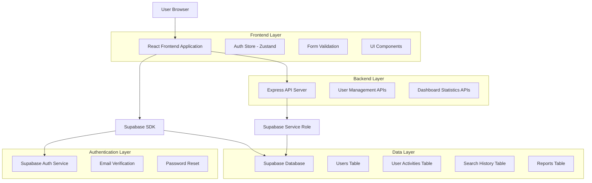
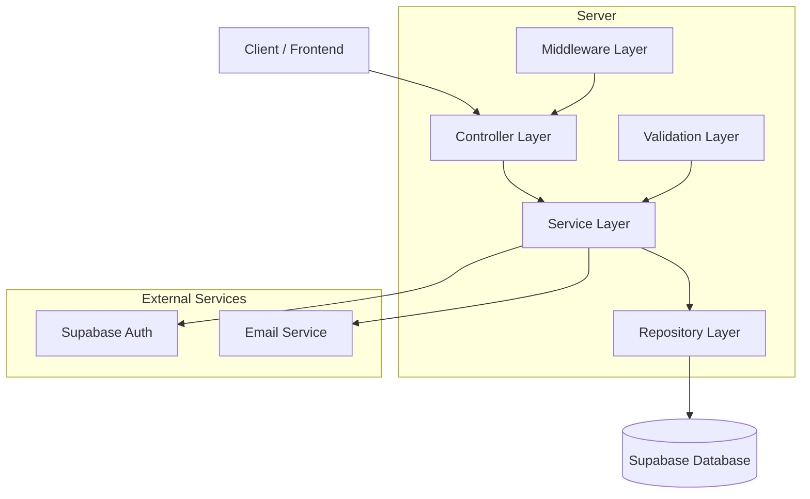
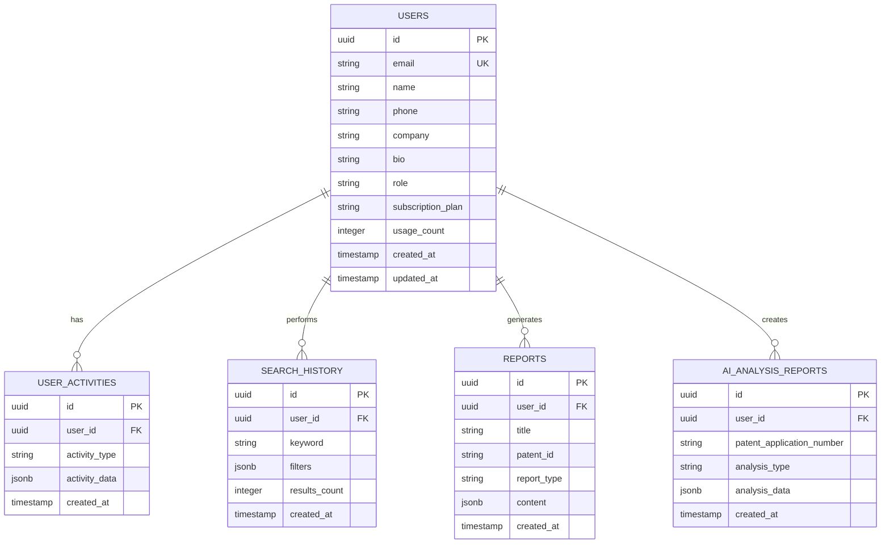

# 회원가입 개선 및 사용자 관리 시스템 기술 아키텍처

## 1. Architecture design



## 2. Technology Description

- **Frontend**: React@18 + TypeScript + Tailwind CSS@3 + Vite
- **State Management**: Zustand (Auth Store, Admin Store)
- **Backend**: Express@4 + Node.js
- **Database**: Supabase (PostgreSQL)
- **Authentication**: Supabase Auth
- **Form Validation**: Custom validation + React Hook Form
- **Charts**: Chart.js + React-Chartjs-2
- **Icons**: Lucide React

## 3. Route definitions

| Route | Purpose |
|-------|---------|
| /register | 개선된 회원가입 페이지 (이름, 전화번호 필수) |
| /login | 로그인 페이지 + 정보 완성 알림 |
| /forgot-password | 비밀번호 찾기 (이메일 전송) |
| /reset-password | 비밀번호 재설정 (토큰 기반) |
| /profile | 사용자 프로필 관리 |
| /dashboard | 강화된 사용자 대시보드 |
| /admin/dashboard | 관리자 대시보드 |
| /admin/users | 사용자 관리 페이지 |

## 4. API definitions

### 4.1 Core API

사용자 등록 관련
```
POST /api/users/register
```

Request:
| Param Name| Param Type  | isRequired  | Description |
|-----------|-------------|-------------|-------------|
| email     | string      | true        | 사용자 이메일 |
| password  | string      | true        | 비밀번호 (8자 이상) |
| name      | string      | true        | 사용자 이름 |
| phone     | string      | true        | 전화번호 (000-0000-0000) |
| company   | string      | false       | 회사명 |

Response:
| Param Name| Param Type  | Description |
|-----------|-------------|-------------|
| success   | boolean     | 등록 성공 여부 |
| message   | string      | 응답 메시지 |
| user      | object      | 사용자 정보 |

사용자 정보 업데이트
```
PUT /api/users/profile
```

Request:
| Param Name| Param Type  | isRequired  | Description |
|-----------|-------------|-------------|-------------|
| name      | string      | true        | 사용자 이름 |
| phone     | string      | true        | 전화번호 |
| company   | string      | false       | 회사명 |
| bio       | string      | false       | 자기소개 |

사용자 대시보드 통계
```
GET /api/users/stats
```

Response:
| Param Name| Param Type  | Description |
|-----------|-------------|-------------|
| totalSearches | number | 총 검색 횟수 |
| reportsGenerated | number | 생성된 리포트 수 |
| aiAnalysisCount | number | AI 분석 횟수 |
| recentSearches | array | 최근 검색 목록 |
| recentReports | array | 최근 리포트 목록 |

관리자 대시보드 통계
```
GET /api/admin/dashboard-stats
```

Response:
| Param Name| Param Type  | Description |
|-----------|-------------|-------------|
| totalUsers | number | 전체 사용자 수 |
| activeUsers | number | 활성 사용자 수 |
| totalSearches | number | 전체 검색 횟수 |
| totalReports | number | 전체 리포트 수 |
| userGrowth | array | 사용자 증가 추이 |
| searchTrends | array | 검색 트렌드 |

비밀번호 재설정 요청
```
POST /api/auth/forgot-password
```

Request:
| Param Name| Param Type  | isRequired  | Description |
|-----------|-------------|-------------|-------------|
| email     | string      | true        | 등록된 이메일 |

비밀번호 재설정 실행
```
POST /api/auth/reset-password
```

Request:
| Param Name| Param Type  | isRequired  | Description |
|-----------|-------------|-------------|-------------|
| token     | string      | true        | 재설정 토큰 |
| password  | string      | true        | 새 비밀번호 |

## 5. Server architecture diagram



## 6. Data model

### 6.1 Data model definition



### 6.2 Data Definition Language

Users Table 확장
```sql
-- 기존 users 테이블에 필수 필드 추가
ALTER TABLE users 
ADD COLUMN IF NOT EXISTS name VARCHAR(100) NOT NULL DEFAULT '',
ADD COLUMN IF NOT EXISTS phone VARCHAR(20),
ADD COLUMN IF NOT EXISTS company VARCHAR(200),
ADD COLUMN IF NOT EXISTS bio TEXT,
ADD COLUMN IF NOT EXISTS role TEXT DEFAULT 'user' CHECK (role IN ('user', 'admin', 'super_admin'));

-- 전화번호 형식 검증 제약조건 추가
ALTER TABLE users 
ADD CONSTRAINT phone_format_check 
CHECK (phone IS NULL OR phone ~ '^[0-9]{3}-[0-9]{4}-[0-9]{4}$');

-- 인덱스 생성
CREATE INDEX IF NOT EXISTS idx_users_role ON users(role);
CREATE INDEX IF NOT EXISTS idx_users_phone ON users(phone);
CREATE INDEX IF NOT EXISTS idx_users_created_at ON users(created_at);

-- RLS 정책 업데이트
ALTER TABLE users ENABLE ROW LEVEL SECURITY;

-- 사용자는 자신의 정보만 조회/수정 가능
CREATE POLICY "Users can view own profile" ON users
  FOR SELECT USING (auth.uid() = id);

CREATE POLICY "Users can update own profile" ON users
  FOR UPDATE USING (auth.uid() = id);

-- 관리자는 모든 사용자 정보 조회 가능
CREATE POLICY "Admin can view all users" ON users
  FOR SELECT USING (
    EXISTS (
      SELECT 1 FROM users 
      WHERE users.id = auth.uid() 
      AND users.role IN ('admin', 'super_admin')
    )
  );
```

User Activities Table 최적화
```sql
-- 사용자 활동 추적 테이블 인덱스 최적화
CREATE INDEX IF NOT EXISTS idx_user_activities_user_created 
ON user_activities(user_id, created_at DESC);

CREATE INDEX IF NOT EXISTS idx_user_activities_type_created 
ON user_activities(activity_type, created_at DESC);

-- 자동 정리 함수 (100일 이상 된 활동 삭제)
CREATE OR REPLACE FUNCTION cleanup_old_activities()
RETURNS void
LANGUAGE plpgsql
SECURITY DEFINER
AS $$
BEGIN
    DELETE FROM user_activities 
    WHERE created_at < NOW() - INTERVAL '100 days';
END;
$$;

-- 매일 자정에 자동 정리 실행
SELECT cron.schedule('cleanup-activities', '0 0 * * *', 'SELECT cleanup_old_activities();');
```

Dashboard Statistics Views
```sql
-- 사용자 대시보드 통계 뷰
CREATE OR REPLACE VIEW user_dashboard_stats AS
SELECT 
    u.id as user_id,
    u.name,
    u.email,
    u.subscription_plan,
    COUNT(DISTINCT sh.id) as total_searches,
    COUNT(DISTINCT r.id) as total_reports,
    COUNT(DISTINCT aar.id) as ai_analysis_count,
    COUNT(DISTINCT ua.id) FILTER (WHERE ua.created_at >= NOW() - INTERVAL '30 days') as monthly_activity
FROM users u
LEFT JOIN search_history sh ON u.id = sh.user_id
LEFT JOIN reports r ON u.id = r.user_id
LEFT JOIN ai_analysis_reports aar ON u.id = aar.user_id
LEFT JOIN user_activities ua ON u.id = ua.user_id
GROUP BY u.id, u.name, u.email, u.subscription_plan;

-- 관리자 대시보드 통계 뷰
CREATE OR REPLACE VIEW admin_dashboard_stats AS
SELECT 
    COUNT(DISTINCT u.id) as total_users,
    COUNT(DISTINCT u.id) FILTER (WHERE u.created_at >= NOW() - INTERVAL '30 days') as new_users_month,
    COUNT(DISTINCT sh.id) as total_searches,
    COUNT(DISTINCT r.id) as total_reports,
    COUNT(DISTINCT aar.id) as total_ai_analysis,
    AVG(u.usage_count) as avg_usage_per_user
FROM users u
LEFT JOIN search_history sh ON u.id = sh.user_id
LEFT JOIN reports r ON u.id = r.user_id
LEFT JOIN ai_analysis_reports aar ON u.id = aar.user_id;
```