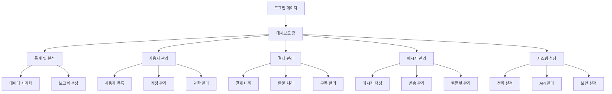

# 관리자 대시보드 완전 재구축 - 제품 요구사항 문서

## 1. Product Overview

Node.js 기반의 현대적이고 포괄적인 관리자 대시보드 시스템으로, 기존 Python 관리 도구들의 모든 기능을 통합하여 웹 기반 인터페이스로 제공합니다.
실시간 데이터 시각화, 사용자 관리, 결제 관리, 시스템 메시지 관리 등 모든 관리 기능을 하나의 통합된 플랫폼에서 제공하여 관리 효율성을 극대화합니다.
특허 AI 서비스의 전체 운영을 효과적으로 관리하고 모니터링할 수 있는 중앙 집중식 관리 시스템을 목표로 합니다.

## 2. Core Features

### 2.1 User Roles

| Role | Registration Method | Core Permissions |
|------|---------------------|------------------|
| Super Admin | 시스템 직접 생성 | 모든 시스템 기능 접근, 관리자 계정 생성/삭제 |
| Admin | Super Admin 초대 | 사용자 관리, 결제 관리, 통계 조회, 메시지 관리 |
| Moderator | Admin 초대 | 사용자 지원, 기본 통계 조회, 메시지 발송 |

### 2.2 Feature Module

우리의 관리자 대시보드는 다음과 같은 주요 페이지들로 구성됩니다:

1. **대시보드 홈**: 실시간 통계, 시스템 상태, 주요 지표 요약
2. **통계 및 분석**: 상세 통계, 데이터 시각화, 보고서 생성, 데이터 내보내기
3. **사용자 관리**: 사용자 목록, 계정 관리, 권한 설정, 사용자 활동 모니터링
4. **결제 관리**: 결제 내역, 환불 처리, 구독 관리, 수익 분석
5. **메시지 관리**: 시스템 공지, 알림 발송, 메시지 템플릿, 스케줄링
6. **시스템 설정**: 전역 설정, API 키 관리, 보안 설정, 감사 로그
7. **로그인/인증**: 관리자 로그인, 2FA 인증, 세션 관리

### 2.3 Page Details

| Page Name | Module Name | Feature description |
|-----------|-------------|---------------------|
| 대시보드 홈 | 실시간 통계 | 실시간 사용자 수, API 호출량, 수익 현황, 시스템 상태 표시 |
| 대시보드 홈 | 주요 지표 | 일일/월간 주요 KPI, 성장률, 알림 및 경고 표시 |
| 대시보드 홈 | 빠른 액션 | 자주 사용하는 관리 기능 바로가기, 최근 활동 표시 |
| 통계 및 분석 | 데이터 시각화 | 차트, 그래프를 통한 데이터 시각화, 필터링 및 기간 선택 |
| 통계 및 분석 | 보고서 생성 | 사용자 정의 보고서 생성, PDF/Excel 내보내기, 자동 보고서 스케줄링 |
| 통계 및 분석 | 실시간 모니터링 | 실시간 API 성능, 오류율, 응답시간 모니터링 |
| 사용자 관리 | 사용자 목록 | 페이지네이션, 검색, 필터링이 가능한 사용자 목록 표시 |
| 사용자 관리 | 계정 관리 | 사용자 정보 수정, 계정 활성화/비활성화, 비밀번호 재설정 |
| 사용자 관리 | 권한 관리 | 역할 기반 권한 설정, 특별 권한 부여, 접근 제어 |
| 사용자 관리 | 활동 모니터링 | 사용자 로그인 기록, API 사용량, 활동 패턴 분석 |
| 결제 관리 | 결제 내역 | 모든 결제 거래 내역, 상태별 필터링, 상세 정보 조회 |
| 결제 관리 | 환불 처리 | 환불 요청 관리, 자동/수동 환불 처리, 환불 내역 추적 |
| 결제 관리 | 구독 관리 | 구독 플랜 관리, 업그레이드/다운그레이드, 구독 통계 |
| 결제 관리 | 수익 분석 | 일일/월간 수익 분석, 수익 예측, 결제 방법별 통계 |
| 메시지 관리 | 메시지 작성 | 공지사항, 알림 메시지 작성, 리치 텍스트 에디터 |
| 메시지 관리 | 발송 관리 | 대상 선택, 즉시/예약 발송, 발송 결과 추적 |
| 메시지 관리 | 템플릿 관리 | 메시지 템플릿 생성/수정, 변수 치환, 템플릿 라이브러리 |
| 메시지 관리 | 알림 설정 | 사용자별 알림 설정, 알림 채널 관리, 자동 알림 규칙 |
| 시스템 설정 | 전역 설정 | 시스템 전반 설정, 기능 활성화/비활성화, 제한값 설정 |
| 시스템 설정 | API 관리 | API 키 생성/관리, 사용량 제한, API 문서 |
| 시스템 설정 | 보안 설정 | 보안 정책, IP 화이트리스트, 로그인 제한 |
| 시스템 설정 | 감사 로그 | 모든 관리자 활동 로그, 시스템 변경 이력, 보안 이벤트 |
| 로그인/인증 | 관리자 로그인 | 이메일/비밀번호 로그인, 2FA 인증, 세션 관리 |
| 로그인/인증 | 계정 관리 | 관리자 프로필 수정, 비밀번호 변경, 보안 설정 |

## 3. Core Process

### Super Admin Flow
1. 시스템 로그인 → 대시보드 홈에서 전체 시스템 상태 확인
2. 사용자 관리에서 사용자 계정 생성/수정/삭제 및 권한 관리
3. 결제 관리에서 결제 내역 조회 및 환불 처리
4. 메시지 관리에서 시스템 공지사항 및 알림 발송
5. 시스템 설정에서 전역 설정 및 보안 정책 관리
6. 통계 및 분석에서 상세 보고서 생성 및 데이터 분석

### Admin Flow
1. 관리자 로그인 → 대시보드에서 담당 영역 상태 확인
2. 사용자 관리에서 사용자 지원 및 계정 관리
3. 결제 관리에서 결제 문의 처리 및 환불 승인
4. 메시지 관리에서 사용자 알림 및 공지사항 발송
5. 통계 조회 및 기본 보고서 생성

### Moderator Flow
1. 제한된 관리자 로그인 → 기본 대시보드 확인
2. 사용자 지원 및 기본적인 계정 문의 처리
3. 승인된 메시지 템플릿을 사용한 알림 발송
4. 기본 통계 조회 및 활동 모니터링

## 4. User Interface Design

### 4.1 Design Style

- **Primary Colors**: #2563eb (파란색), #1e40af (진한 파란색)
- **Secondary Colors**: #64748b (회색), #f8fafc (연한 회색), #ef4444 (빨간색 - 경고)
- **Button Style**: 둥근 모서리 (rounded-lg), 그라데이션 효과, 호버 애니메이션
- **Font**: Inter, -apple-system, BlinkMacSystemFont (14px 기본, 16px 제목)
- **Layout Style**: 사이드바 네비게이션, 카드 기반 레이아웃, 그리드 시스템
- **Icons**: Heroicons, Lucide React (일관된 아이콘 스타일)

### 4.2 Page Design Overview

| Page Name | Module Name | UI Elements |
|-----------|-------------|-------------|
| 대시보드 홈 | 실시간 통계 | 4x2 그리드 카드 레이아웃, 실시간 업데이트 애니메이션, 컬러 코딩된 지표 |
| 대시보드 홈 | 차트 영역 | Chart.js 기반 반응형 차트, 드롭다운 필터, 시간 범위 선택기 |
| 통계 및 분석 | 데이터 테이블 | 정렬 가능한 테이블, 페이지네이션, 검색 필터, 내보내기 버튼 |
| 통계 및 분석 | 시각화 | 인터랙티브 차트, 범례, 툴팁, 확대/축소 기능 |
| 사용자 관리 | 사용자 목록 | 아바타 이미지, 상태 배지, 액션 드롭다운, 벌크 액션 |
| 사용자 관리 | 상세 모달 | 슬라이드 오버 패널, 탭 네비게이션, 폼 검증 |
| 결제 관리 | 결제 내역 | 상태별 컬러 코딩, 금액 하이라이트, 필터 사이드바 |
| 결제 관리 | 환불 처리 | 단계별 프로세스 표시, 승인 버튼, 이유 입력 필드 |
| 메시지 관리 | 메시지 에디터 | 리치 텍스트 에디터, 미리보기, 템플릿 선택 드롭다운 |
| 메시지 관리 | 발송 설정 | 대상 선택 체크박스, 날짜/시간 피커, 발송 예약 |
| 시스템 설정 | 설정 패널 | 토글 스위치, 슬라이더, 입력 필드, 저장 확인 |

### 4.3 Responsiveness

데스크톱 우선 설계로 1920x1080 해상도에 최적화되어 있으며, 태블릿(768px 이상)에서는 사이드바가 축소되고 모바일(640px 이하)에서는 햄버거 메뉴로 전환됩니다. 터치 인터랙션을 고려한 버튼 크기와 간격을 적용하여 모든 디바이스에서 원활한 관리 작업이 가능합니다.