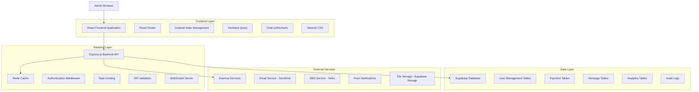
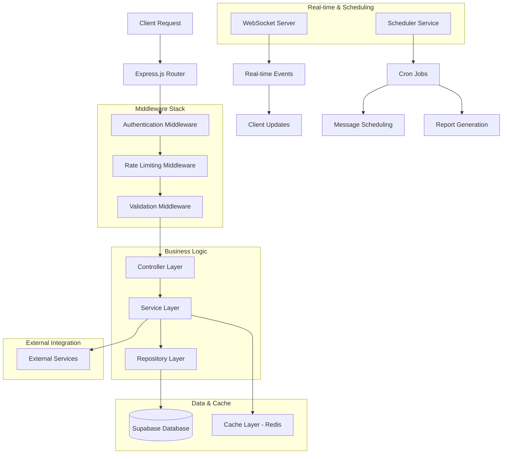
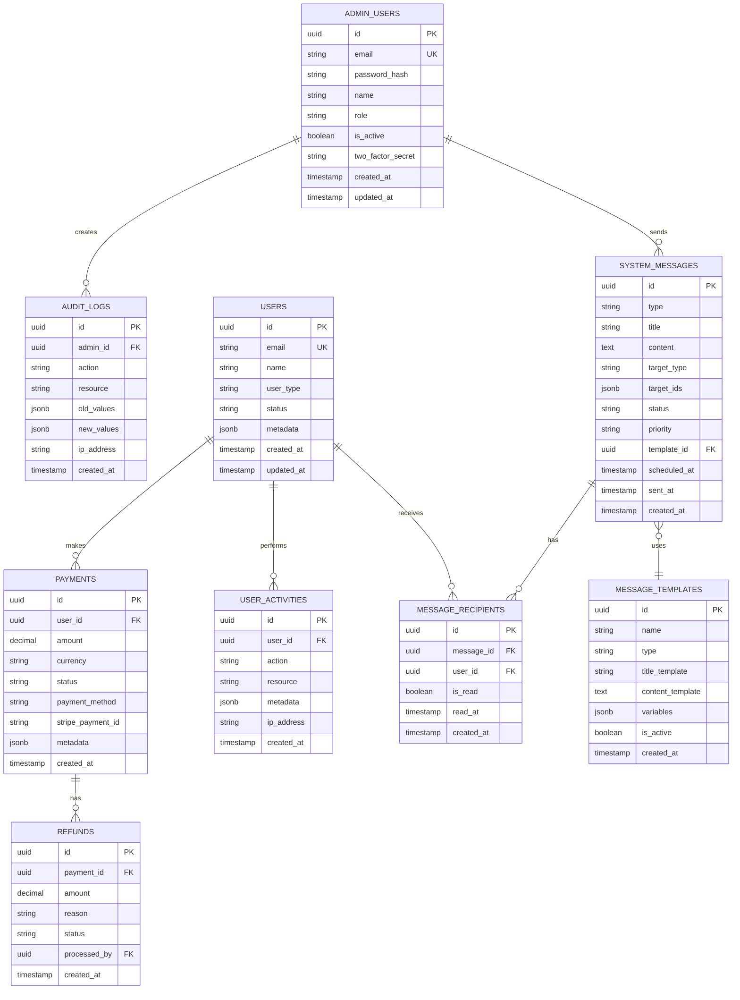

# 관리자 대시보드 기술 아키텍처 문서

## 1. Architecture design



## 2. Technology Description

- Frontend: React@18 + TypeScript + Vite + Tailwind CSS@3 + Zustand + TanStack Query + Chart.js
- Backend: Express.js@4 + TypeScript + Socket.io + Node-cron + Multer
- Database: Supabase (PostgreSQL) + Redis
- Authentication: Supabase Auth + JWT
- Real-time: WebSocket (Socket.io)
- External Services: SendGrid (Email), Twilio (SMS), Supabase Storage

## 3. Route definitions

| Route | Purpose |
|-------|---------|
| /admin/login | 관리자 로그인 페이지, 2FA 인증 지원 |
| /admin/dashboard | 메인 대시보드, 실시간 통계 및 주요 지표 표시 |
| /admin/analytics | 상세 분석 페이지, 데이터 시각화 및 보고서 생성 |
| /admin/users | 사용자 관리 페이지, 사용자 목록 및 계정 관리 |
| /admin/users/:id | 사용자 상세 정보 및 편집 페이지 |
| /admin/payments | 결제 관리 페이지, 결제 내역 및 환불 처리 |
| /admin/payments/:id | 결제 상세 정보 및 환불 처리 페이지 |
| /admin/messages | 메시지 관리 페이지, 공지사항 및 알림 관리 |
| /admin/messages/compose | 새 메시지 작성 페이지 |
| /admin/messages/templates | 메시지 템플릿 관리 페이지 |
| /admin/settings | 시스템 설정 페이지, 전역 설정 및 보안 관리 |
| /admin/settings/api | API 키 및 외부 서비스 설정 |
| /admin/logs | 감사 로그 및 시스템 활동 기록 |
| /admin/profile | 관리자 프로필 및 계정 설정 |

## 4. API definitions

### 4.1 Core API

#### Authentication APIs
```
POST /api/admin/auth/login
```
Request:
| Param Name | Param Type | isRequired | Description |
|------------|------------|------------|-------------|
| email | string | true | 관리자 이메일 |
| password | string | true | 비밀번호 |
| twoFactorCode | string | false | 2FA 인증 코드 |

Response:
| Param Name | Param Type | Description |
|------------|------------|-------------|
| success | boolean | 로그인 성공 여부 |
| token | string | JWT 액세스 토큰 |
| refreshToken | string | 리프레시 토큰 |
| user | AdminUser | 관리자 정보 |

#### Dashboard Statistics APIs
```
GET /api/admin/dashboard/stats
```
Response:
| Param Name | Param Type | Description |
|------------|------------|-------------|
| totalUsers | number | 전체 사용자 수 |
| activeUsers | number | 활성 사용자 수 |
| totalRevenue | number | 총 수익 |
| monthlyRevenue | number | 월간 수익 |
| apiCalls | number | API 호출 수 |
| systemStatus | string | 시스템 상태 |

#### User Management APIs
```
GET /api/admin/users
```
Query Parameters:
| Param Name | Param Type | Description |
|------------|------------|-------------|
| page | number | 페이지 번호 |
| limit | number | 페이지당 항목 수 |
| search | string | 검색 키워드 |
| status | string | 사용자 상태 필터 |
| role | string | 역할 필터 |

```
PUT /api/admin/users/:id
```
Request:
| Param Name | Param Type | isRequired | Description |
|------------|------------|------------|-------------|
| name | string | false | 사용자 이름 |
| email | string | false | 이메일 주소 |
| status | string | false | 계정 상태 |
| role | string | false | 사용자 역할 |

#### Payment Management APIs
```
GET /api/admin/payments
```
Query Parameters:
| Param Name | Param Type | Description |
|------------|------------|-------------|
| page | number | 페이지 번호 |
| limit | number | 페이지당 항목 수 |
| status | string | 결제 상태 필터 |
| dateFrom | string | 시작 날짜 |
| dateTo | string | 종료 날짜 |

```
POST /api/admin/payments/:id/refund
```
Request:
| Param Name | Param Type | isRequired | Description |
|------------|------------|------------|-------------|
| amount | number | true | 환불 금액 |
| reason | string | true | 환불 사유 |
| notifyUser | boolean | false | 사용자 알림 여부 |

#### Message Management APIs
```
POST /api/admin/messages
```
Request:
| Param Name | Param Type | isRequired | Description |
|------------|------------|------------|-------------|
| type | string | true | 메시지 타입 |
| title | string | true | 메시지 제목 |
| content | string | true | 메시지 내용 |
| targetType | string | true | 대상 타입 (all, user, role) |
| targetIds | string[] | false | 대상 ID 목록 |
| scheduledAt | string | false | 예약 발송 시간 |

```
GET /api/admin/messages/templates
```
Response:
| Param Name | Param Type | Description |
|------------|------------|-------------|
| templates | MessageTemplate[] | 메시지 템플릿 목록 |

### 4.2 WebSocket Events

Real-time updates for dashboard:
- `dashboard:stats` - 실시간 통계 업데이트
- `user:activity` - 사용자 활동 알림
- `payment:new` - 새 결제 알림
- `system:alert` - 시스템 경고
- `message:sent` - 메시지 발송 완료

## 5. Server architecture diagram



## 6. Data model

### 6.1 Data model definition



### 6.2 Data Definition Language

#### Admin Users Table
```sql
-- Admin users table
CREATE TABLE admin_users (
    id UUID PRIMARY KEY DEFAULT gen_random_uuid(),
    email VARCHAR(255) UNIQUE NOT NULL,
    password_hash VARCHAR(255) NOT NULL,
    name VARCHAR(100) NOT NULL,
    role VARCHAR(20) DEFAULT 'admin' CHECK (role IN ('super_admin', 'admin', 'moderator')),
    is_active BOOLEAN DEFAULT true,
    two_factor_secret VARCHAR(255),
    created_at TIMESTAMP WITH TIME ZONE DEFAULT NOW(),
    updated_at TIMESTAMP WITH TIME ZONE DEFAULT NOW()
);

-- Indexes
CREATE INDEX idx_admin_users_email ON admin_users(email);
CREATE INDEX idx_admin_users_role ON admin_users(role);
CREATE INDEX idx_admin_users_active ON admin_users(is_active);

-- RLS Policies
ALTER TABLE admin_users ENABLE ROW LEVEL SECURITY;
GRANT SELECT, INSERT, UPDATE, DELETE ON admin_users TO authenticated;
```

#### System Messages Table
```sql
-- System messages table
CREATE TABLE system_messages (
    id UUID PRIMARY KEY DEFAULT gen_random_uuid(),
    type VARCHAR(50) NOT NULL CHECK (type IN ('notification', 'announcement', 'alert', 'email', 'sms')),
    title VARCHAR(255) NOT NULL,
    content TEXT NOT NULL,
    target_type VARCHAR(20) DEFAULT 'all' CHECK (target_type IN ('all', 'user', 'role', 'group')),
    target_ids JSONB DEFAULT '[]',
    status VARCHAR(20) DEFAULT 'draft' CHECK (status IN ('draft', 'scheduled', 'sent', 'failed')),
    priority VARCHAR(20) DEFAULT 'normal' CHECK (priority IN ('low', 'normal', 'high', 'urgent')),
    template_id UUID REFERENCES message_templates(id),
    scheduled_at TIMESTAMP WITH TIME ZONE,
    sent_at TIMESTAMP WITH TIME ZONE,
    created_at TIMESTAMP WITH TIME ZONE DEFAULT NOW(),
    updated_at TIMESTAMP WITH TIME ZONE DEFAULT NOW()
);

-- Indexes
CREATE INDEX idx_system_messages_type ON system_messages(type);
CREATE INDEX idx_system_messages_status ON system_messages(status);
CREATE INDEX idx_system_messages_scheduled_at ON system_messages(scheduled_at);
CREATE INDEX idx_system_messages_created_at ON system_messages(created_at DESC);

-- RLS Policies
ALTER TABLE system_messages ENABLE ROW LEVEL SECURITY;
GRANT ALL PRIVILEGES ON system_messages TO authenticated;
```

#### Message Templates Table
```sql
-- Message templates table
CREATE TABLE message_templates (
    id UUID PRIMARY KEY DEFAULT gen_random_uuid(),
    name VARCHAR(100) UNIQUE NOT NULL,
    type VARCHAR(50) NOT NULL,
    title_template VARCHAR(255) NOT NULL,
    content_template TEXT NOT NULL,
    variables JSONB DEFAULT '[]',
    description TEXT,
    is_active BOOLEAN DEFAULT true,
    created_at TIMESTAMP WITH TIME ZONE DEFAULT NOW(),
    updated_at TIMESTAMP WITH TIME ZONE DEFAULT NOW()
);

-- Indexes
CREATE INDEX idx_message_templates_type ON message_templates(type);
CREATE INDEX idx_message_templates_active ON message_templates(is_active);

-- RLS Policies
ALTER TABLE message_templates ENABLE ROW LEVEL SECURITY;
GRANT ALL PRIVILEGES ON message_templates TO authenticated;
```

#### Payments and Refunds Tables
```sql
-- Enhanced payments table
CREATE TABLE payments (
    id UUID PRIMARY KEY DEFAULT gen_random_uuid(),
    user_id UUID REFERENCES users(id) ON DELETE CASCADE,
    amount DECIMAL(10,2) NOT NULL,
    currency VARCHAR(3) DEFAULT 'KRW',
    status VARCHAR(20) DEFAULT 'pending' CHECK (status IN ('pending', 'completed', 'failed', 'refunded', 'partially_refunded')),
    payment_method VARCHAR(50),
    stripe_payment_id VARCHAR(255),
    description TEXT,
    metadata JSONB DEFAULT '{}',
    created_at TIMESTAMP WITH TIME ZONE DEFAULT NOW(),
    updated_at TIMESTAMP WITH TIME ZONE DEFAULT NOW()
);

-- Refunds table
CREATE TABLE refunds (
    id UUID PRIMARY KEY DEFAULT gen_random_uuid(),
    payment_id UUID REFERENCES payments(id) ON DELETE CASCADE,
    amount DECIMAL(10,2) NOT NULL,
    reason TEXT NOT NULL,
    status VARCHAR(20) DEFAULT 'pending' CHECK (status IN ('pending', 'approved', 'rejected', 'processed')),
    processed_by UUID REFERENCES admin_users(id),
    stripe_refund_id VARCHAR(255),
    created_at TIMESTAMP WITH TIME ZONE DEFAULT NOW(),
    updated_at TIMESTAMP WITH TIME ZONE DEFAULT NOW()
);

-- Indexes
CREATE INDEX idx_payments_user_id ON payments(user_id);
CREATE INDEX idx_payments_status ON payments(status);
CREATE INDEX idx_payments_created_at ON payments(created_at DESC);
CREATE INDEX idx_refunds_payment_id ON refunds(payment_id);
CREATE INDEX idx_refunds_status ON refunds(status);

-- RLS Policies
ALTER TABLE payments ENABLE ROW LEVEL SECURITY;
ALTER TABLE refunds ENABLE ROW LEVEL SECURITY;
GRANT ALL PRIVILEGES ON payments TO authenticated;
GRANT ALL PRIVILEGES ON refunds TO authenticated;
```

#### Audit Logs Table
```sql
-- Audit logs table
CREATE TABLE audit_logs (
    id UUID PRIMARY KEY DEFAULT gen_random_uuid(),
    admin_id UUID REFERENCES admin_users(id),
    action VARCHAR(100) NOT NULL,
    resource VARCHAR(100) NOT NULL,
    resource_id UUID,
    old_values JSONB,
    new_values JSONB,
    ip_address INET,
    user_agent TEXT,
    created_at TIMESTAMP WITH TIME ZONE DEFAULT NOW()
);

-- Indexes
CREATE INDEX idx_audit_logs_admin_id ON audit_logs(admin_id);
CREATE INDEX idx_audit_logs_action ON audit_logs(action);
CREATE INDEX idx_audit_logs_resource ON audit_logs(resource);
CREATE INDEX idx_audit_logs_created_at ON audit_logs(created_at DESC);

-- RLS Policies
ALTER TABLE audit_logs ENABLE ROW LEVEL SECURITY;
GRANT ALL PRIVILEGES ON audit_logs TO authenticated;
```

#### Initial Data
```sql
-- Insert default admin user
INSERT INTO admin_users (email, password_hash, name, role) VALUES 
('admin@patent-ai.com', '$2b$10$example_hash', 'System Administrator', 'super_admin');

-- Insert default message templates
INSERT INTO message_templates (name, type, title_template, content_template, variables) VALUES 
('welcome', 'email', '환영합니다, {{name}}님!', '특허 AI 서비스에 가입해주셔서 감사합니다.', '["name"]'),
('payment_success', 'notification', '결제가 완료되었습니다', '{{amount}}원 결제가 성공적으로 처리되었습니다.', '["amount"]'),
('system_maintenance', 'announcement', '시스템 점검 안내', '{{date}}에 시스템 점검이 예정되어 있습니다.', '["date"]');
```