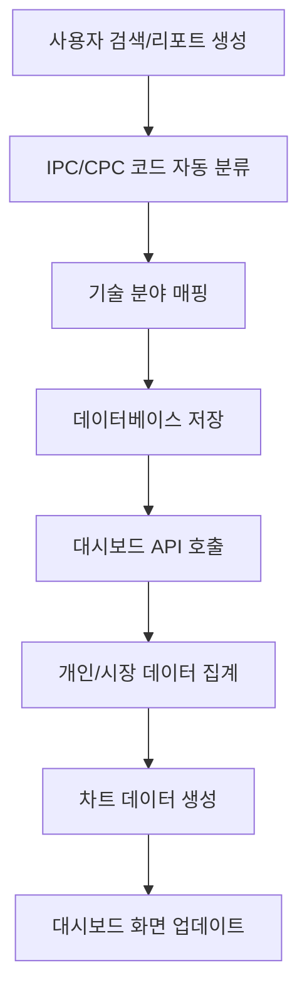

# 대시보드 IPC/CPC 기술 분야 분석 시스템 요구사항 문서

## 1. Product Overview
특허 분석 플랫폼의 대시보드에서 사용자의 검색 및 리포트 활동을 IPC/CPC 기술 분야별로 분석하고 시각화하는 시스템입니다.
개인 데이터와 시장 전체 데이터를 비교 분석하여 기술 동향과 개인 활동 패턴을 파악할 수 있도록 지원합니다.
특허 검색 및 AI 분석 리포트 생성 시 자동으로 IPC/CPC 코드를 기반으로 기술 분야를 분류하고 저장하여 실시간 분석 데이터를 제공합니다.

## 2. Core Features

### 2.1 User Roles
| Role | Registration Method | Core Permissions |
|------|---------------------|------------------|
| 일반 사용자 | 이메일 회원가입 | 개인 검색/리포트 데이터 조회, IPC/CPC 분석 차트 확인 |
| 관리자 | 관리자 권한 부여 | 전체 시장 데이터 관리, 시스템 통계 조회 |

### 2.2 Feature Module
대시보드 IPC/CPC 분석 시스템은 다음 주요 페이지로 구성됩니다:
1. **대시보드 메인 페이지**: IPC/CPC 분석 차트, 최근 활동 데이터, 효율성 지표
2. **검색 활동 분석 페이지**: 개인 및 시장 검색 데이터의 기술 분야별 분포 분석
3. **리포트 활동 분석 페이지**: 개인 및 시장 리포트 데이터의 기술 분야별 분포 분석

### 2.3 Page Details

| Page Name | Module Name | Feature description |
|-----------|-------------|---------------------|
| 대시보드 메인 페이지 | 검색 IPC/CPC 분석 (개인) | 사용자의 검색 기록에서 기술 분야별 분포를 도넛 차트로 표시. 검색 키워드의 IPC/CPC 코드 기반 자동 분류 |
| 대시보드 메인 페이지 | 검색 IPC/CPC 분석 (시장) | 전체 시장의 검색 데이터에서 기술 분야별 분포를 도넛 차트로 표시. 시장 트렌드 파악 |
| 대시보드 메인 페이지 | 리포트 IPC/CPC 분석 (개인) | 사용자의 AI 분석 리포트에서 기술 분야별 분포를 도넛 차트로 표시. 리포트 주제의 IPC/CPC 코드 기반 자동 분류 |
| 대시보드 메인 페이지 | 리포트 IPC/CPC 분석 (시장) | 전체 시장의 리포트 데이터에서 기술 분야별 분포를 도넛 차트로 표시. 시장 관심 분야 파악 |
| 대시보드 메인 페이지 | 최근 검색어 목록 | 사용자의 최근 검색어 10개를 시간순으로 표시. 각 검색어의 기술 분야 태그 포함 |
| 대시보드 메인 페이지 | 최근 리포트 목록 | 사용자의 최근 생성 리포트 제목 10개를 시간순으로 표시. 각 리포트의 기술 분야 태그 포함 |
| 대시보드 메인 페이지 | 데이터 자동 저장 | 검색 및 리포트 생성 시 IPC/CPC 코드 기반 기술 분야 자동 분류 및 데이터베이스 저장 |
| 대시보드 메인 페이지 | 실시간 동기화 | 새로운 검색/리포트 활동 시 대시보드 데이터 실시간 업데이트 |

## 3. Core Process

### 일반 사용자 플로우
1. 사용자가 특허 검색을 수행하면 검색 키워드가 IPC/CPC 코드로 자동 분류되어 search_history 테이블에 저장
2. 사용자가 AI 분석 리포트를 생성하면 리포트 내용이 IPC/CPC 코드로 자동 분류되어 ai_analysis_reports 테이블에 저장
3. 대시보드 접속 시 개인 데이터와 시장 데이터를 기반으로 IPC/CPC 분석 차트 생성
4. 최근 검색어 및 리포트 목록을 기술 분야 태그와 함께 표시
5. 실시간으로 새로운 활동 데이터가 대시보드에 반영

### 데이터 처리 플로우

## 4. User Interface Design

### 4.1 Design Style
- **Primary Colors**: Blue (#3B82F6), Emerald (#10B981)
- **Secondary Colors**: Violet (#8B5CF6), Amber (#F59E0B), Rose (#F43F5E)
- **Button Style**: 둥근 모서리 (rounded-lg), 그라데이션 효과
- **Font**: Inter, 기본 크기 14px, 제목 18-24px
- **Layout Style**: 카드 기반 레이아웃, 그리드 시스템 활용
- **Icon Style**: Heroicons 라이브러리, 24px 크기

### 4.2 Page Design Overview

| Page Name | Module Name | UI Elements |
|-----------|-------------|-------------|
| 대시보드 메인 페이지 | 검색 IPC/CPC 분석 차트 | Tremor DonutChart 컴포넌트, 10가지 색상 팔레트, 범례 포함, 카드 형태 레이아웃 |
| 대시보드 메인 페이지 | 리포트 IPC/CPC 분석 차트 | Tremor DonutChart 컴포넌트, 동일한 색상 팔레트, 백분율 표시 |
| 대시보드 메인 페이지 | 최근 활동 목록 | 리스트 형태, 각 항목에 기술 분야 Badge, 시간 정보 표시 |
| 대시보드 메인 페이지 | 통계 카드 | 숫자 강조 표시, 아이콘 포함, 그라데이션 배경 |

### 4.3 Responsiveness
데스크톱 우선 설계, 태블릿 및 모바일에서 반응형 그리드 레이아웃 적용. 차트는 화면 크기에 따라 자동 조정되며, 터치 인터랙션 최적화 포함.