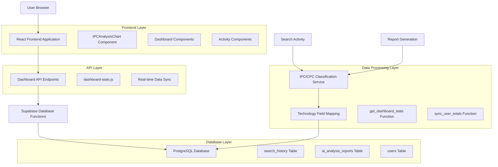
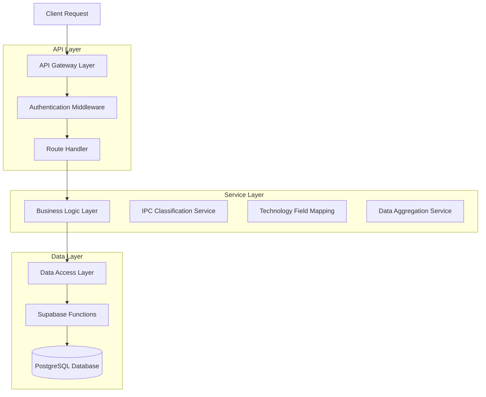
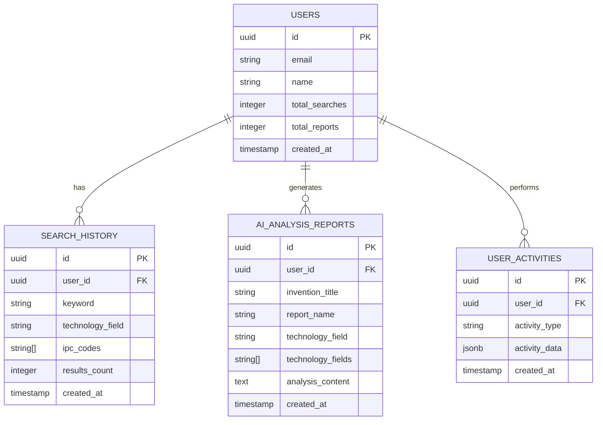

# 대시보드 IPC/CPC 기술 분야 분석 시스템 기술 아키텍처

## 1. Architecture design



## 2. Technology Description

- **Frontend**: React@18 + TypeScript + Tremor UI + Tailwind CSS + Vite
- **Backend**: Node.js + Express (Vercel Serverless Functions)
- **Database**: Supabase (PostgreSQL) + Real-time subscriptions
- **Charts**: Tremor React (DonutChart)
- **Icons**: Heroicons
- **State Management**: React Hooks + Context API

## 3. Route definitions

| Route | Purpose |
|-------|---------|
| /dashboard | 메인 대시보드 페이지, IPC/CPC 분석 차트 및 최근 활동 데이터 표시 |
| /api/dashboard-stats | 대시보드 통계 데이터 API, 개인/시장 IPC/CPC 분석 데이터 제공 |
| /api/search | 특허 검색 API, 검색 시 기술 분야 자동 분류 및 저장 |
| /api/generate-report | AI 분석 리포트 생성 API, 리포트 생성 시 기술 분야 자동 분류 및 저장 |

## 4. API definitions

### 4.1 Core API

대시보드 통계 데이터 조회
```
GET /api/dashboard-stats?period=100d
```

Request:
| Param Name | Param Type | isRequired | Description |
|------------|------------|------------|-------------|
| period | string | false | 조회 기간 (기본값: 100d) |

Response:
| Param Name | Param Type | Description |
|------------|------------|-------------|
| search_fields_top10 | TechnologyField[] | 개인 검색 데이터의 기술 분야별 상위 10개 |
| report_fields_top10 | TechnologyField[] | 개인 리포트 데이터의 기술 분야별 상위 10개 |
| search_market_fields | TechnologyField[] | 시장 검색 데이터의 기술 분야별 분포 |
| report_market_fields | TechnologyField[] | 시장 리포트 데이터의 기술 분야별 분포 |
| recent_searches | RecentActivity[] | 최근 검색어 10개 |
| recent_reports | RecentActivity[] | 최근 리포트 10개 |

TechnologyField 타입:
```typescript
interface TechnologyField {
  field: string;        // 기술 분야명
  count: number;        // 개수
  percentage: number;   // 백분율
}
```

RecentActivity 타입:
```typescript
interface RecentActivity {
  id: string;
  title: string;           // 검색어 또는 리포트 제목
  technology_field: string; // 기술 분야
  created_at: string;      // 생성 시간
}
```

검색 활동 저장
```
POST /api/search
```

Request:
| Param Name | Param Type | isRequired | Description |
|------------|------------|------------|-------------|
| keyword | string | true | 검색 키워드 |
| ipc_codes | string[] | false | IPC 코드 배열 |

Response:
| Param Name | Param Type | Description |
|------------|------------|-------------|
| success | boolean | 저장 성공 여부 |
| technology_field | string | 자동 분류된 기술 분야 |

## 5. Server architecture diagram



## 6. Data model

### 6.1 Data model definition



### 6.2 Data Definition Language

Users Table (users)
```sql
-- 사용자 테이블 (기존)
CREATE TABLE users (
    id UUID PRIMARY KEY DEFAULT gen_random_uuid(),
    email VARCHAR(255) UNIQUE NOT NULL,
    name VARCHAR(100) NOT NULL,
    total_searches INTEGER DEFAULT 0,
    total_reports INTEGER DEFAULT 0,
    created_at TIMESTAMP WITH TIME ZONE DEFAULT NOW(),
    updated_at TIMESTAMP WITH TIME ZONE DEFAULT NOW()
);
```

Search History Table (search_history)
```sql
-- 검색 기록 테이블
CREATE TABLE search_history (
    id UUID PRIMARY KEY DEFAULT gen_random_uuid(),
    user_id UUID REFERENCES users(id) ON DELETE CASCADE,
    keyword TEXT NOT NULL,
    technology_field VARCHAR(100),
    ipc_codes TEXT[],
    results_count INTEGER DEFAULT 0,
    search_type VARCHAR(50) DEFAULT 'general',
    created_at TIMESTAMP WITH TIME ZONE DEFAULT NOW()
);

-- 인덱스 생성
CREATE INDEX idx_search_history_user_id ON search_history(user_id);
CREATE INDEX idx_search_history_created_at ON search_history(created_at DESC);
CREATE INDEX idx_search_history_technology_field ON search_history(technology_field);
```

AI Analysis Reports Table (ai_analysis_reports)
```sql
-- AI 분석 리포트 테이블
CREATE TABLE ai_analysis_reports (
    id UUID PRIMARY KEY DEFAULT gen_random_uuid(),
    user_id UUID REFERENCES users(id) ON DELETE CASCADE,
    application_number VARCHAR(50),
    invention_title TEXT NOT NULL,
    report_name VARCHAR(255) NOT NULL,
    technology_field VARCHAR(100),
    technology_fields TEXT[],
    analysis_type VARCHAR(50) DEFAULT 'general',
    analysis_content TEXT,
    created_at TIMESTAMP WITH TIME ZONE DEFAULT NOW()
);

-- 인덱스 생성
CREATE INDEX idx_ai_analysis_reports_user_id ON ai_analysis_reports(user_id);
CREATE INDEX idx_ai_analysis_reports_created_at ON ai_analysis_reports(created_at DESC);
CREATE INDEX idx_ai_analysis_reports_technology_field ON ai_analysis_reports(technology_field);
```

Dashboard Statistics Function
```sql
-- 대시보드 통계 조회 함수
CREATE OR REPLACE FUNCTION get_dashboard_stats(
    p_user_id UUID,
    p_period TEXT DEFAULT '100d'
)
RETURNS JSON AS $$
DECLARE
    period_interval INTERVAL;
    result JSON;
BEGIN
    -- 기간 설정
    period_interval := (p_period || ' days')::INTERVAL;
    
    -- 통계 데이터 집계
    SELECT json_build_object(
        'search_fields_top10', (
            SELECT COALESCE(json_agg(
                json_build_object(
                    'field', technology_field,
                    'count', count,
                    'percentage', ROUND((count * 100.0 / SUM(count) OVER())::numeric, 1)
                )
            ), '[]'::json)
            FROM (
                SELECT 
                    COALESCE(technology_field, 'General') as technology_field,
                    COUNT(*) as count
                FROM search_history
                WHERE user_id = p_user_id
                    AND created_at >= NOW() - period_interval
                GROUP BY technology_field
                ORDER BY count DESC
                LIMIT 10
            ) search_stats
        ),
        'report_fields_top10', (
            SELECT COALESCE(json_agg(
                json_build_object(
                    'field', technology_field,
                    'count', count,
                    'percentage', ROUND((count * 100.0 / SUM(count) OVER())::numeric, 1)
                )
            ), '[]'::json)
            FROM (
                SELECT 
                    COALESCE(technology_field, 'General') as technology_field,
                    COUNT(*) as count
                FROM ai_analysis_reports
                WHERE user_id = p_user_id
                    AND created_at >= NOW() - period_interval
                GROUP BY technology_field
                ORDER BY count DESC
                LIMIT 10
            ) report_stats
        ),
        'search_market_fields', (
            SELECT COALESCE(json_agg(
                json_build_object(
                    'field', technology_field,
                    'count', count,
                    'percentage', ROUND((count * 100.0 / SUM(count) OVER())::numeric, 1)
                )
            ), '[]'::json)
            FROM (
                SELECT 
                    COALESCE(technology_field, 'General') as technology_field,
                    COUNT(*) as count
                FROM search_history
                WHERE created_at >= NOW() - period_interval
                GROUP BY technology_field
                ORDER BY count DESC
                LIMIT 10
            ) market_search_stats
        ),
        'report_market_fields', (
            SELECT COALESCE(json_agg(
                json_build_object(
                    'field', technology_field,
                    'count', count,
                    'percentage', ROUND((count * 100.0 / SUM(count) OVER())::numeric, 1)
                )
            ), '[]'::json)
            FROM (
                SELECT 
                    COALESCE(technology_field, 'General') as technology_field,
                    COUNT(*) as count
                FROM ai_analysis_reports
                WHERE created_at >= NOW() - period_interval
                GROUP BY technology_field
                ORDER BY count DESC
                LIMIT 10
            ) market_report_stats
        ),
        'recent_searches', (
            SELECT COALESCE(json_agg(
                json_build_object(
                    'id', id,
                    'title', keyword,
                    'technology_field', COALESCE(technology_field, 'General'),
                    'created_at', created_at
                )
            ), '[]'::json)
            FROM (
                SELECT id, keyword, technology_field, created_at
                FROM search_history
                WHERE user_id = p_user_id
                ORDER BY created_at DESC
                LIMIT 10
            ) recent_search_data
        ),
        'recent_reports', (
            SELECT COALESCE(json_agg(
                json_build_object(
                    'id', id,
                    'title', report_name,
                    'technology_field', COALESCE(technology_field, 'General'),
                    'created_at', created_at
                )
            ), '[]'::json)
            FROM (
                SELECT id, report_name, technology_field, created_at
                FROM ai_analysis_reports
                WHERE user_id = p_user_id
                ORDER BY created_at DESC
                LIMIT 10
            ) recent_report_data
        )
    ) INTO result;
    
    RETURN result;
END;
$$ LANGUAGE plpgsql;
```

Technology Field Classification Function
```sql
-- 기술 분야 자동 분류 함수
CREATE OR REPLACE FUNCTION classify_technology_field(
    p_text TEXT,
    p_ipc_codes TEXT[] DEFAULT NULL
)
RETURNS VARCHAR(100) AS $$
DECLARE
    tech_field VARCHAR(100);
BEGIN
    -- IPC 코드 기반 분류
    IF p_ipc_codes IS NOT NULL AND array_length(p_ipc_codes, 1) > 0 THEN
        CASE 
            WHEN p_ipc_codes && ARRAY['G06F', 'G06N', 'H04L'] THEN
                tech_field := 'Information Technology';
            WHEN p_ipc_codes && ARRAY['A61K', 'A61P', 'C07D'] THEN
                tech_field := 'Biotechnology';
            WHEN p_ipc_codes && ARRAY['H01L', 'H01M', 'H02J'] THEN
                tech_field := 'Electronics';
            WHEN p_ipc_codes && ARRAY['B60W', 'B62D', 'G08G'] THEN
                tech_field := 'Automotive';
            WHEN p_ipc_codes && ARRAY['F03D', 'H02S', 'F24S'] THEN
                tech_field := 'Energy';
            ELSE
                tech_field := 'General';
        END CASE;
    ELSE
        -- 텍스트 기반 분류
        CASE 
            WHEN p_text ILIKE ANY(ARRAY['%AI%', '%인공지능%', '%머신러닝%', '%딥러닝%']) THEN
                tech_field := 'Artificial Intelligence';
            WHEN p_text ILIKE ANY(ARRAY['%IoT%', '%센서%', '%스마트%']) THEN
                tech_field := 'IoT/Sensors';
            WHEN p_text ILIKE ANY(ARRAY['%블록체인%', '%blockchain%', '%암호화%']) THEN
                tech_field := 'Blockchain';
            WHEN p_text ILIKE ANY(ARRAY['%바이오%', '%의료%', '%제약%']) THEN
                tech_field := 'Biotechnology';
            WHEN p_text ILIKE ANY(ARRAY['%자동차%', '%자율주행%', '%전기차%']) THEN
                tech_field := 'Automotive';
            WHEN p_text ILIKE ANY(ARRAY['%에너지%', '%태양광%', '%배터리%']) THEN
                tech_field := 'Energy';
            WHEN p_text ILIKE ANY(ARRAY['%반도체%', '%전자%', '%칩%']) THEN
                tech_field := 'Electronics';
            ELSE
                tech_field := 'General';
        END CASE;
    END IF;
    
    RETURN tech_field;
END;
$$ LANGUAGE plpgsql;
```

권한 설정
```sql
-- Supabase 권한 설정
GRANT SELECT ON search_history TO anon;
GRANT ALL PRIVILEGES ON search_history TO authenticated;

GRANT SELECT ON ai_analysis_reports TO anon;
GRANT ALL PRIVILEGES ON ai_analysis_reports TO authenticated;

GRANT EXECUTE ON FUNCTION get_dashboard_stats(UUID, TEXT) TO authenticated;
GRANT EXECUTE ON FUNCTION classify_technology_field(TEXT, TEXT[]) TO authenticated;
```