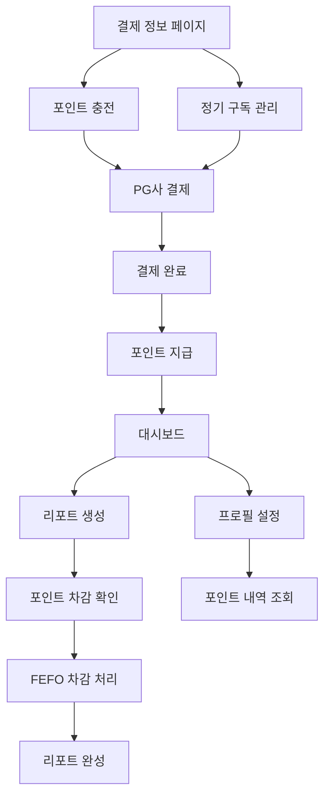

# Patent-AI 핵심 결제 시스템 제품 요구사항 문서

## 1. Product Overview

Patent-AI의 포인트 기반 결제 시스템으로, 정기 구독과 추가 충전을 통해 안정적인 현금 흐름을 확보하고 사용자 행동을 유도합니다.

FEFO(First-Expired, First-Out) 원칙을 적용하여 포인트 소멸 기한을 엄격하게 관리하며, 사용자에게 투명한 포인트 사용 내역과 만료 예정 정보를 제공합니다.

시장 분석 및 비즈니스 인사이트 리포트 생성 시 포인트를 차감하는 종량제 모델로, 사용자의 실제 사용량에 따른 합리적인 과금 체계를 구축합니다.

## 2. Core Features

### 2.1 User Roles

| Role | Registration Method | Core Permissions |
|------|---------------------|------------------|
| 일반 사용자 | 이메일 회원가입 | 포인트 충전, 리포트 생성, 잔액 조회 |
| 관리자 | 시스템 관리자 권한 | 전체 포인트 내역 조회, 시스템 설정 관리 |

### 2.2 Feature Module

포인트 기반 결제 시스템의 핵심 페이지들:

1. **결제 정보 페이지**: 포인트 충전, 정기 구독 관리, 결제 내역 조회
2. **대시보드**: 포인트 잔액 표시, 만료 예정 포인트 경고, 사용 통계
3. **프로필 설정**: 포인트 잔액 표시, 결제 설정 관리
4. **리포트 생성**: 포인트 차감 안내, 잔액 부족 경고

### 2.3 Page Details

| Page Name | Module Name | Feature description |
|-----------|-------------|---------------------|
| 결제 정보 페이지 | 포인트 충전 | 금액 선택, 10% 보너스 혜택 강조, PG사 연동 결제 |
| 결제 정보 페이지 | 정기 구독 관리 | 월 11,000원 구독 설정, 자동 갱신 관리, 구독 해지 |
| 결제 정보 페이지 | 결제 내역 | 충전/차감 내역 조회, 필터링, 상세 정보 표시 |
| 대시보드 | 포인트 잔액 표시 | 현재 잔액 원화 표시, 만료 예정 포인트 경고 |
| 대시보드 | 사용 통계 | 월별 사용량, 리포트 생성 횟수, 절약 금액 |
| 프로필 설정 | 포인트 정보 | 상단 메뉴 잔액 표시, 포인트 히스토리 링크 |
| 리포트 생성 | 포인트 차감 안내 | 차감 포인트 표시, 잔액 확인, 부족 시 충전 유도 |
| 리포트 생성 | 생성 확인 | FEFO 차감 처리, 거래 내역 기록, 잔액 업데이트 |

## 3. Core Process

### 정기 구독 사용자 플로우
1. 사용자가 결제 정보 페이지에서 월 구독 선택
2. PG사 결제 페이지로 이동하여 11,000원 결제
3. 결제 완료 시 10,000 포인트 자동 충전 (1개월 만료)
4. 매월 1일 자동으로 1,500 보너스 포인트 지급 (1개월 만료)

### 추가 충전 사용자 플로우
1. 사용자가 충전 금액 선택 (10,000원 이상 시 10% 보너스 강조)
2. PG사 결제 진행
3. 결제 완료 시 기본 포인트 + 보너스 포인트 충전 (3개월 만료)
4. 충전 완료 알림 및 잔액 업데이트

### 리포트 생성 플로우
1. 사용자가 시장 분석(400P) 또는 비즈니스 인사이트(600P) 선택
2. 차감 포인트 및 현재 잔액 확인 표시
3. 생성 확인 시 FEFO 방식으로 포인트 차감
4. 리포트 생성 및 거래 내역 기록

## 4. User Interface Design

### 4.1 Design Style

- **Primary Colors**: 올리브 그린 (#6B7280), 화이트 (#FFFFFF)
- **Secondary Colors**: 경고 빨강 (#EF4444), 성공 초록 (#10B981)
- **Button Style**: 둥근 모서리, 그라데이션 효과, 호버 애니메이션
- **Font**: Pretendard, 14px-18px 기본, 24px-32px 제목
- **Layout Style**: 카드 기반 레이아웃, 상단 고정 네비게이션
- **Icon Style**: Lucide React 아이콘, 일관된 스타일

### 4.2 Page Design Overview

| Page Name | Module Name | UI Elements |
|-----------|-------------|-------------|
| 결제 정보 페이지 | 포인트 충전 | 금액 선택 카드, 보너스 혜택 배지, 결제 버튼 강조 |
| 결제 정보 페이지 | 정기 구독 | 구독 상태 토글, 혜택 설명 카드, 자동 갱신 안내 |
| 대시보드 | 포인트 잔액 | 대형 숫자 표시, 원화 환산, 만료 경고 배너 |
| 대시보드 | 만료 예정 포인트 | 빨간색 경고 카드, 남은 일수 카운트다운, 충전 유도 버튼 |
| 프로필 설정 | 상단 메뉴 잔액 | 작은 포인트 표시, 클릭 시 상세 페이지 이동 |
| 리포트 생성 | 차감 안내 | 차감 포인트 강조 표시, 잔액 부족 시 빨간색 경고 |

### 4.3 Responsiveness

데스크톱 우선 설계로 모바일 적응형 레이아웃을 제공합니다. 터치 인터랙션 최적화를 고려하여 버튼 크기와 간격을 조정하고, 포인트 정보는 모든 화면 크기에서 명확하게 표시됩니다.

## 5. 핵심 비즈니스 로직

### 5.1 포인트 차감 기준

| 서비스 | 차감 포인트 | 설명 |
|--------|-------------|------|
| 시장 분석 리포트 | 400 포인트 | 특허 시장 동향 분석 |
| 비즈니스 인사이트 리포트 | 600 포인트 | 심화 비즈니스 분석 |

### 5.2 포인트 충전 정책

| 충전 유형 | 금액 | 포인트 | 보너스 | 만료 기한 |
|-----------|------|--------|--------|----------|
| 정기 구독 | 11,000원 | 10,000P | - | 1개월 |
| 월간 보너스 | - | 1,500P | - | 1개월 |
| 추가 충전 | 변동 | VAT 제외 금액 | 10,000원 이상 시 10% | 3개월 |

### 5.3 FEFO 차감 원칙

포인트 사용 시 가장 빨리 만료되는 포인트부터 차감하여 사용자의 포인트 손실을 최소화합니다.

1. 만료 일시가 가장 가까운 포인트 묶음부터 차감
2. 동일 만료일의 경우 생성 시간이 빠른 순서로 차감
3. 차감 내역을 거래 테이블에 투명하게 기록
4. 실시간 잔액 업데이트 및 사용자 알림

### 5.4 포인트 만료 관리

- **만료 예정 알림**: 7일 전부터 대시보드에 경고 표시
- **자동 만료 처리**: 매일 자정 Cron Job으로 만료 포인트 정리
- **만료 내역 기록**: 모든 만료 처리를 거래 내역에 기록
- **사용자 알림**: 만료 시 이메일 또는 앱 내 알림 발송

## 6. 성공 지표 (KPI)

### 6.1 비즈니스 지표
- **월간 반복 수익 (MRR)**: 정기 구독 수익
- **평균 사용자 수익 (ARPU)**: 사용자당 월평균 수익
- **포인트 전환율**: 충전 포인트 대비 실제 사용률
- **구독 유지율**: 월간 구독 갱신 비율

### 6.2 사용자 경험 지표
- **포인트 만료율**: 전체 포인트 대비 만료 포인트 비율
- **충전 완료율**: 충전 시도 대비 완료 비율
- **리포트 생성 성공률**: 포인트 차감 후 리포트 생성 성공률
- **사용자 만족도**: 결제 시스템 관련 고객 만족도 점수

### 6.3 기술 지표
- **결제 처리 시간**: PG사 연동 후 포인트 지급까지 소요 시간
- **시스템 가용성**: 결제 시스템 다운타임 최소화
- **데이터 정합성**: 포인트 잔액과 거래 내역 일치율
- **보안 사고**: 결제 관련 보안 이슈 발생 건수

이 제품 요구사항 문서는 Patent-AI의 핵심 결제 시스템 구축을 위한 완전한 가이드를 제공하며, 사용자 경험과 비즈니스 목표를 모두 고려한 설계를 담고 있습니다.