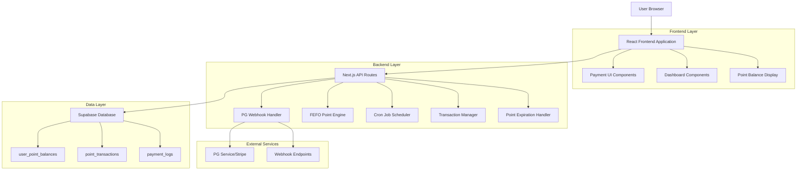
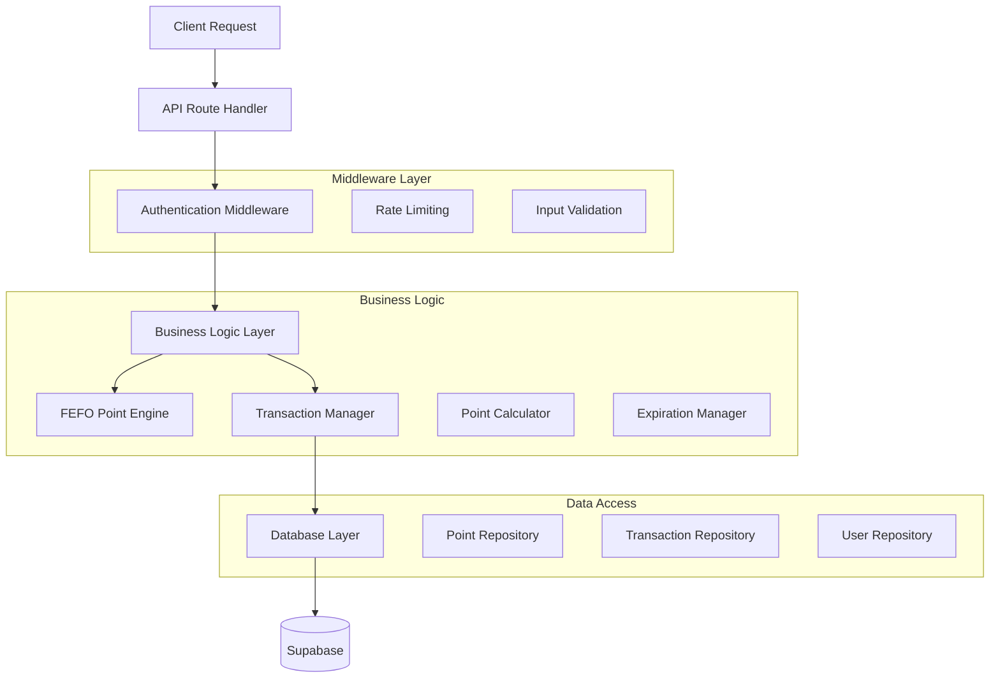
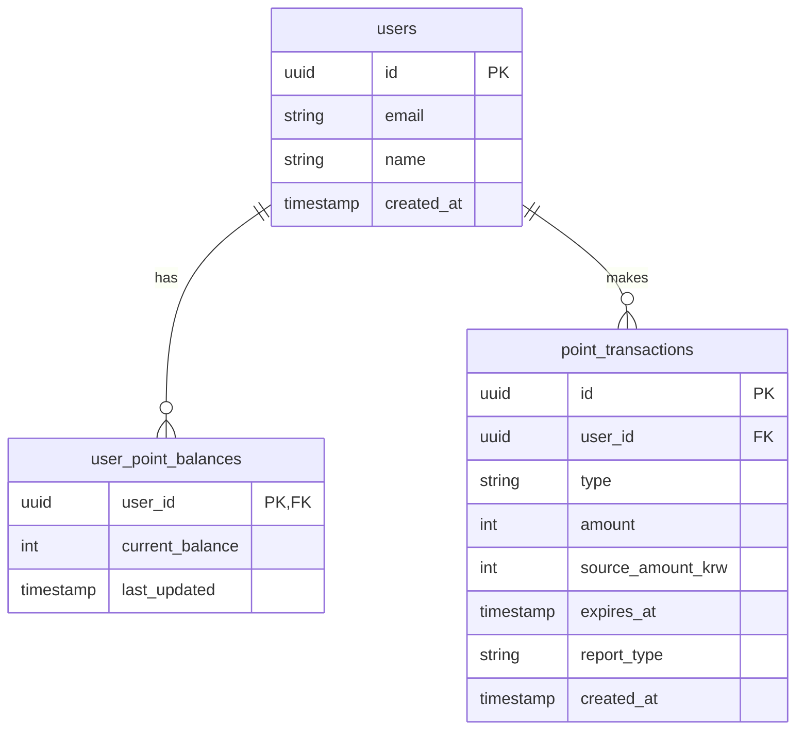

# Patent-AI 핵심 결제 시스템 기술 아키텍처 문서

## 1. Architecture design



## 2. Technology Description

- Frontend: React@18 + TypeScript + TailwindCSS + Vite
- Backend: Next.js API Routes + Node.js
- Database: Supabase (PostgreSQL)
- Payment: PG Webhook Integration (Stripe 준비)
- Scheduling: Node-cron for point expiration
- State Management: Zustand
- Authentication: Supabase Auth

## 3. Route definitions

| Route | Purpose |
|-------|---------|
| /profile | 사용자 프로필 설정 및 포인트 잔액 표시 |
| /billing | 결제 정보 및 포인트 충전 페이지 |
| /dashboard | 대시보드 - 포인트 사용 내역 및 만료 예정 포인트 표시 |
| /payment/success | 결제 성공 후 리다이렉트 페이지 |
| /payment/cancel | 결제 취소 후 리다이렉트 페이지 |

## 4. API definitions

### 4.1 Core Payment APIs

**포인트 잔액 조회**
```
GET /api/points/balance
```

Response:
| Param Name | Param Type | Description |
|-----------|-------------|-------------|
| current_balance | number | 현재 사용 가능한 총 포인트 |
| expiring_soon | object | 가장 빨리 만료될 포인트 정보 |
| expiring_soon.amount | number | 만료 예정 포인트 금액 |
| expiring_soon.days_left | number | 만료까지 남은 일수 |

**정기 구독 결제 처리**
```
POST /api/billing/handle-monthly-subscription
```

Request:
| Param Name | Param Type | isRequired | Description |
|-----------|-------------|-------------|-------------|
| payment_id | string | true | PG사에서 제공하는 결제 ID |
| amount_krw | number | true | 결제 금액 (11,000원) |
| user_id | string | true | 사용자 ID |

Response:
| Param Name | Param Type | Description |
|-----------|-------------|-------------|
| success | boolean | 처리 성공 여부 |
| points_added | number | 추가된 포인트 (10,000) |
| expires_at | string | 포인트 만료 일시 |

**추가 충전 처리**
```
POST /api/billing/handle-addon-charge
```

Request:
| Param Name | Param Type | isRequired | Description |
|-----------|-------------|-------------|-------------|
| payment_id | string | true | PG사에서 제공하는 결제 ID |
| amount_krw | number | true | 결제 금액 (VAT 포함) |
| user_id | string | true | 사용자 ID |

Response:
| Param Name | Param Type | Description |
|-----------|-------------|-------------|
| success | boolean | 처리 성공 여부 |
| base_points | number | 기본 포인트 (VAT 제외) |
| bonus_points | number | 보너스 포인트 (10% 추가) |
| total_points | number | 총 추가된 포인트 |
| expires_at | string | 포인트 만료 일시 (3개월 후) |

**리포트 발행 및 포인트 차감**
```
POST /api/report/issue-and-charge
```

Request:
| Param Name | Param Type | isRequired | Description |
|-----------|-------------|-------------|-------------|
| report_type | string | true | 리포트 유형 (market_analysis, business_insight) |
| user_id | string | true | 사용자 ID |
| report_data | object | true | 리포트 생성 데이터 |

Response:
| Param Name | Param Type | Description |
|-----------|-------------|-------------|
| success | boolean | 처리 성공 여부 |
| points_deducted | number | 차감된 포인트 |
| remaining_balance | number | 남은 포인트 잔액 |
| report_id | string | 생성된 리포트 ID |

**포인트 거래 내역 조회**
```
GET /api/points/transactions?page=1&limit=20
```

Response:
| Param Name | Param Type | Description |
|-----------|-------------|-------------|
| transactions | array | 거래 내역 배열 |
| pagination | object | 페이지네이션 정보 |

### 4.2 Webhook APIs

**PG사 결제 완료 Webhook**
```
POST /api/webhook/payment-completed
```

Request:
| Param Name | Param Type | isRequired | Description |
|-----------|-------------|-------------|-------------|
| payment_id | string | true | 결제 ID |
| amount | number | true | 결제 금액 |
| status | string | true | 결제 상태 |
| user_id | string | true | 사용자 ID |
| payment_type | string | true | 결제 유형 (monthly, addon) |

## 5. Server architecture diagram



## 6. Data model

### 6.1 Data model definition



### 6.2 Data Definition Language

**사용자 포인트 잔액 테이블 (user_point_balances)**
```sql
-- create table
CREATE TABLE user_point_balances (
    user_id UUID PRIMARY KEY REFERENCES auth.users(id) ON DELETE CASCADE,
    current_balance INTEGER NOT NULL DEFAULT 0 CHECK (current_balance >= 0),
    last_updated TIMESTAMP WITH TIME ZONE DEFAULT NOW()
);

-- create index
CREATE INDEX idx_user_point_balances_user_id ON user_point_balances(user_id);

-- Row Level Security
ALTER TABLE user_point_balances ENABLE ROW LEVEL SECURITY;

-- 정책: 사용자는 자신의 포인트 잔액만 조회 가능
CREATE POLICY "Users can view own point balance" ON user_point_balances
    FOR SELECT USING (auth.uid() = user_id);

-- 정책: 인증된 사용자만 포인트 잔액 업데이트 가능 (서버에서만)
CREATE POLICY "Authenticated users can update point balance" ON user_point_balances
    FOR ALL USING (auth.uid() = user_id);

-- Grant permissions
GRANT SELECT ON user_point_balances TO anon;
GRANT ALL PRIVILEGES ON user_point_balances TO authenticated;
```

**포인트 거래 내역 테이블 (point_transactions)**
```sql
-- create table
CREATE TABLE point_transactions (
    id UUID PRIMARY KEY DEFAULT gen_random_uuid(),
    user_id UUID NOT NULL REFERENCES auth.users(id) ON DELETE CASCADE,
    type TEXT NOT NULL CHECK (type IN ('charge_monthly', 'charge_addon', 'bonus', 'usage', 'expiration')),
    amount INTEGER NOT NULL,
    source_amount_krw INTEGER DEFAULT 0,
    expires_at TIMESTAMP WITH TIME ZONE NOT NULL,
    report_type TEXT CHECK (report_type IN ('market_analysis', 'business_insight') OR report_type IS NULL),
    created_at TIMESTAMP WITH TIME ZONE DEFAULT NOW()
);

-- create indexes
CREATE INDEX idx_point_transactions_user_id ON point_transactions(user_id);
CREATE INDEX idx_point_transactions_expires_at ON point_transactions(expires_at);
CREATE INDEX idx_point_transactions_type ON point_transactions(type);
CREATE INDEX idx_point_transactions_created_at ON point_transactions(created_at DESC);

-- Row Level Security
ALTER TABLE point_transactions ENABLE ROW LEVEL SECURITY;

-- 정책: 사용자는 자신의 거래 내역만 조회 가능
CREATE POLICY "Users can view own transactions" ON point_transactions
    FOR SELECT USING (auth.uid() = user_id);

-- 정책: 인증된 사용자만 거래 내역 생성 가능 (서버에서만)
CREATE POLICY "Authenticated users can insert transactions" ON point_transactions
    FOR INSERT WITH CHECK (auth.uid() = user_id);

-- Grant permissions
GRANT SELECT ON point_transactions TO anon;
GRANT ALL PRIVILEGES ON point_transactions TO authenticated;
```

**결제 로그 테이블 (payment_logs)**
```sql
-- create table
CREATE TABLE payment_logs (
    id UUID PRIMARY KEY DEFAULT gen_random_uuid(),
    user_id UUID NOT NULL REFERENCES auth.users(id) ON DELETE CASCADE,
    payment_id TEXT NOT NULL,
    pg_provider TEXT NOT NULL DEFAULT 'stripe',
    amount_krw INTEGER NOT NULL,
    status TEXT NOT NULL CHECK (status IN ('pending', 'completed', 'failed', 'cancelled')),
    payment_type TEXT NOT NULL CHECK (payment_type IN ('monthly', 'addon')),
    webhook_data JSONB,
    processed_at TIMESTAMP WITH TIME ZONE,
    created_at TIMESTAMP WITH TIME ZONE DEFAULT NOW()
);

-- create indexes
CREATE INDEX idx_payment_logs_user_id ON payment_logs(user_id);
CREATE INDEX idx_payment_logs_payment_id ON payment_logs(payment_id);
CREATE INDEX idx_payment_logs_status ON payment_logs(status);
CREATE INDEX idx_payment_logs_created_at ON payment_logs(created_at DESC);

-- Row Level Security
ALTER TABLE payment_logs ENABLE ROW LEVEL SECURITY;

-- 정책: 사용자는 자신의 결제 로그만 조회 가능
CREATE POLICY "Users can view own payment logs" ON payment_logs
    FOR SELECT USING (auth.uid() = user_id);

-- Grant permissions
GRANT SELECT ON payment_logs TO anon;
GRANT ALL PRIVILEGES ON payment_logs TO authenticated;
```

**초기 데이터 및 함수**
```sql
-- FEFO 포인트 차감 함수
CREATE OR REPLACE FUNCTION deduct_points_fefo(
    p_user_id UUID,
    p_amount INTEGER,
    p_report_type TEXT
) RETURNS TABLE(
    success BOOLEAN,
    remaining_balance INTEGER,
    transactions_created INTEGER
) AS $$
DECLARE
    v_current_balance INTEGER;
    v_remaining_to_deduct INTEGER := p_amount;
    v_transaction_count INTEGER := 0;
    v_transaction RECORD;
BEGIN
    -- 현재 잔액 확인
    SELECT current_balance INTO v_current_balance
    FROM user_point_balances
    WHERE user_id = p_user_id;
    
    -- 잔액 부족 확인
    IF v_current_balance < p_amount THEN
        RETURN QUERY SELECT FALSE, v_current_balance, 0;
        RETURN;
    END IF;
    
    -- FEFO 방식으로 포인트 차감
    FOR v_transaction IN
        SELECT id, amount, expires_at
        FROM point_transactions
        WHERE user_id = p_user_id
        AND amount > 0
        AND expires_at > NOW()
        ORDER BY expires_at ASC, created_at ASC
    LOOP
        IF v_remaining_to_deduct <= 0 THEN
            EXIT;
        END IF;
        
        DECLARE
            v_deduct_amount INTEGER;
        BEGIN
            v_deduct_amount := LEAST(v_transaction.amount, v_remaining_to_deduct);
            
            -- 차감 거래 기록
            INSERT INTO point_transactions (
                user_id, type, amount, expires_at, report_type
            ) VALUES (
                p_user_id, 'usage', -v_deduct_amount, v_transaction.expires_at, p_report_type
            );
            
            v_remaining_to_deduct := v_remaining_to_deduct - v_deduct_amount;
            v_transaction_count := v_transaction_count + 1;
        END;
    END LOOP;
    
    -- 잔액 업데이트
    UPDATE user_point_balances
    SET current_balance = current_balance - p_amount,
        last_updated = NOW()
    WHERE user_id = p_user_id;
    
    RETURN QUERY SELECT TRUE, v_current_balance - p_amount, v_transaction_count;
END;
$$ LANGUAGE plpgsql;

-- 포인트 만료 처리 함수
CREATE OR REPLACE FUNCTION expire_points() RETURNS INTEGER AS $$
DECLARE
    v_expired_count INTEGER := 0;
    v_user RECORD;
BEGIN
    -- 만료된 포인트 처리
    FOR v_user IN
        SELECT user_id, SUM(amount) as expired_amount
        FROM point_transactions
        WHERE expires_at <= NOW()
        AND amount > 0
        GROUP BY user_id
    LOOP
        -- 만료 거래 기록
        INSERT INTO point_transactions (
            user_id, type, amount, expires_at
        ) VALUES (
            v_user.user_id, 'expiration', -v_user.expired_amount, NOW()
        );
        
        -- 잔액 업데이트
        UPDATE user_point_balances
        SET current_balance = current_balance - v_user.expired_amount,
            last_updated = NOW()
        WHERE user_id = v_user.user_id;
        
        v_expired_count := v_expired_count + 1;
    END LOOP;
    
    RETURN v_expired_count;
END;
$$ LANGUAGE plpgsql;
```

## 7. 핵심 구현 가이드

### 7.1 FEFO 포인트 차감 알고리즘

```typescript
// /api/points/deduct.ts
export async function deductPointsFEFO(
  userId: string,
  amount: number,
  reportType: 'market_analysis' | 'business_insight'
) {
  const { data, error } = await supabase.rpc('deduct_points_fefo', {
    p_user_id: userId,
    p_amount: amount,
    p_report_type: reportType
  });
  
  if (error) throw error;
  return data[0];
}
```

### 7.2 포인트 충전 로직

```typescript
// /api/billing/charge-points.ts
export async function chargePoints(
  userId: string,
  amountKrw: number,
  paymentType: 'monthly' | 'addon',
  paymentId: string
) {
  const basePoints = Math.floor(amountKrw / 1.1); // VAT 제외
  const bonusPoints = paymentType === 'addon' && amountKrw >= 10000 
    ? Math.floor(basePoints * 0.1) 
    : 0;
  
  const expiresAt = paymentType === 'monthly' 
    ? new Date(Date.now() + 30 * 24 * 60 * 60 * 1000) // 1개월
    : new Date(Date.now() + 90 * 24 * 60 * 60 * 1000); // 3개월
  
  // 거래 기록 및 잔액 업데이트
  const { error } = await supabase.from('point_transactions').insert([
    {
      user_id: userId,
      type: paymentType === 'monthly' ? 'charge_monthly' : 'charge_addon',
      amount: basePoints,
      source_amount_krw: amountKrw,
      expires_at: expiresAt
    },
    ...(bonusPoints > 0 ? [{
      user_id: userId,
      type: 'bonus',
      amount: bonusPoints,
      source_amount_krw: 0,
      expires_at: expiresAt
    }] : [])
  ]);
  
  if (error) throw error;
  
  // 잔액 업데이트
  await updateUserBalance(userId);
  
  return { basePoints, bonusPoints, totalPoints: basePoints + bonusPoints };
}
```

### 7.3 프론트엔드 포인트 표시 컴포넌트

```typescript
// components/PointBalance.tsx
export function PointBalance() {
  const [balance, setBalance] = useState(null);
  const [expiringSoon, setExpiringSoon] = useState(null);
  
  useEffect(() => {
    fetchPointBalance();
  }, []);
  
  const fetchPointBalance = async () => {
    const response = await fetch('/api/points/balance');
    const data = await response.json();
    setBalance(data.current_balance);
    setExpiringSoon(data.expiring_soon);
  };
  
  return (
    <div className="point-balance">
      <div className="current-balance">
        현재 잔액: {balance?.toLocaleString()}P
      </div>
      {expiringSoon && expiringSoon.days_left <= 7 && (
        <div className="expiring-warning text-red-500">
          {expiringSoon.days_left}일 후 {expiringSoon.amount.toLocaleString()}P 만료
        </div>
      )}
    </div>
  );
}
```

### 7.4 보안 및 에러 처리

```typescript
// middleware/security.ts
export function validatePaymentWebhook(req: Request) {
  // PG사 서명 검증
  const signature = req.headers['stripe-signature'];
  const payload = req.body;
  
  // Stripe webhook 서명 검증 로직
  const isValid = stripe.webhooks.constructEvent(
    payload,
    signature,
    process.env.STRIPE_WEBHOOK_SECRET
  );
  
  if (!isValid) {
    throw new Error('Invalid webhook signature');
  }
  
  return true;
}

// 이중 차감 방지
export async function preventDoubleDeduction(
  userId: string,
  reportType: string,
  requestId: string
) {
  const existing = await supabase
    .from('point_transactions')
    .select('id')
    .eq('user_id', userId)
    .eq('report_type', reportType)
    .eq('request_id', requestId)
    .single();
    
  if (existing.data) {
    throw new Error('Duplicate request detected');
  }
}
```

이 기술 아키텍처 문서는 Patent-AI 시스템에 통합될 핵심 결제 시스템의 완전한 구현 가이드를 제공합니다. FEFO 원칙, 포인트 만료 관리, PG사 연동 준비, 그리고 보안 요구사항을 모두 포함하고 있습니다.