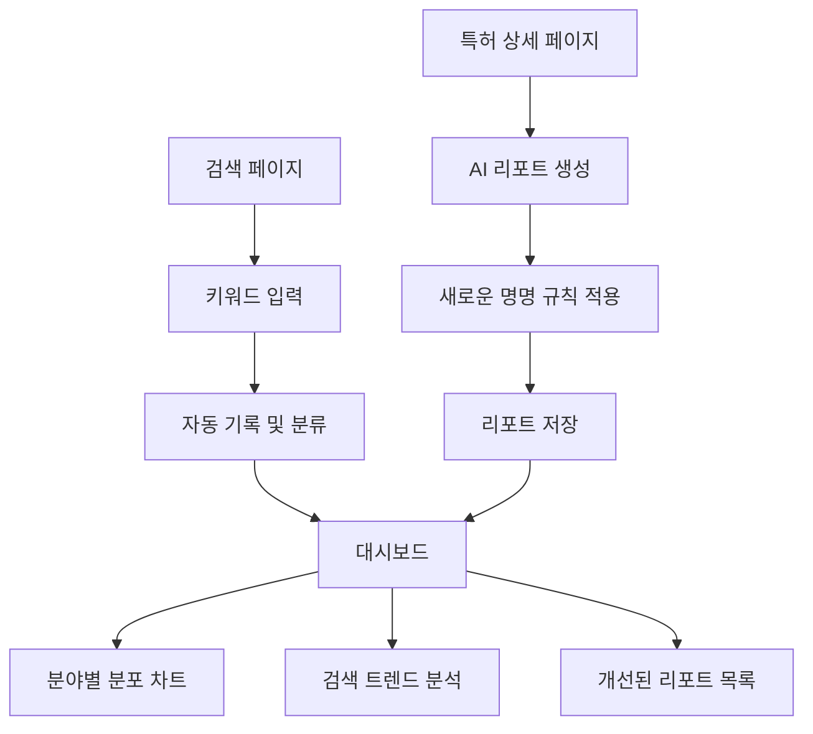

# 검색 키워드 분석 및 AI 리포트 개선 PRD

## 1. Product Overview
특허 검색 키워드의 기술 분야별 분석과 AI 리포트 명명 규칙을 개선하여 사용자의 검색 패턴 인사이트를 제공하고 리포트 관리 효율성을 향상시키는 기능입니다.
- 실제 검색 키워드를 자동 분류하여 기술 분야별 트렌드를 시각화하고, AI 리포트를 체계적인 명명 규칙으로 관리하여 사용자 경험을 개선합니다.
- 특허 검색 플랫폼의 데이터 인텔리전스 강화를 통해 사용자의 연구 방향성과 관심 분야를 파악할 수 있는 가치를 제공합니다.

## 2. Core Features

### 2.1 User Roles
기존 사용자 역할을 유지하며 모든 로그인 사용자에게 제공되는 기능입니다.

| Role | Registration Method | Core Permissions |
|------|---------------------|------------------|
| 일반 사용자 | 이메일 회원가입 | 검색 키워드 분석 조회, AI 리포트 생성 및 관리 |
| 프리미엄 사용자 | 구독 업그레이드 | 고급 키워드 분석, 무제한 리포트 생성 |

### 2.2 Feature Module
검색 키워드 분석 및 AI 리포트 개선 요구사항은 다음 주요 페이지들로 구성됩니다:
1. **대시보드 페이지**: 키워드 분야별 분포 차트, 최근 검색 트렌드, 개선된 리포트 목록
2. **검색 페이지**: 키워드 자동 기록 및 분류 시스템
3. **리포트 상세 페이지**: 새로운 명명 규칙 적용된 리포트 표시

### 2.3 Page Details

| Page Name | Module Name | Feature description |
|-----------|-------------|---------------------|
| 대시보드 페이지 | 키워드 분야별 분포 차트 | 검색한 키워드를 AI/IoT/바이오/자동차/반도체 등 기술 분야로 자동 분류하여 도넛 차트로 시각화. 최근 30일간 검색 패턴 분석 |
| 대시보드 페이지 | 최근 검색 트렌드 | 시간대별 검색 키워드 빈도를 라인 차트로 표시. 인기 키워드 TOP 10 목록 제공 |
| 대시보드 페이지 | 개선된 리포트 목록 | "특허제목_시장분석/인사이트_특허번호_날짜" 형식의 리포트명으로 최근 생성된 리포트 표시. 리포트 타입별 필터링 |
| 검색 페이지 | 키워드 자동 기록 | 검색창에 입력된 모든 키워드를 데이터베이스에 자동 저장. 검색 시점, 사용자 ID, 결과 수와 함께 기록 |
| 검색 페이지 | 실시간 분야 분류 | 입력된 키워드를 머신러닝 기반으로 기술 분야 자동 분류. 분류 결과를 search_history 테이블에 저장 |
| 리포트 상세 페이지 | 체계적 리포트 명명 | AI 리포트 생성 시 "특허제목_시장분석_특허번호_YYYYMMDD" 또는 "특허제목_인사이트_특허번호_YYYYMMDD" 형식으로 자동 명명 |
| 리포트 상세 페이지 | 리포트 다운로드 개선 | PDF 다운로드 시 새로운 명명 규칙 적용. 파일명에 특허 정보와 분석 타입 포함 |

## 3. Core Process

### 일반 사용자 플로우
1. 사용자가 검색 페이지에서 키워드 입력 → 자동으로 키워드 기록 및 분야 분류
2. 대시보드에서 자신의 검색 패턴 확인 → 분야별 분포 차트와 트렌드 분석 조회
3. 특허 상세 페이지에서 AI 리포트 생성 → 새로운 명명 규칙으로 리포트 저장
4. 대시보드에서 생성된 리포트 확인 → 체계적인 이름으로 리포트 관리

### 키워드 분석 플로우
1. 검색 실행 → 키워드 자동 기록 → AI 기반 분야 분류 → 데이터베이스 저장
2. 대시보드 접속 → 분야별 통계 조회 → 차트 렌더링 → 트렌드 분석 표시

## 4. User Interface Design

### 4.1 Design Style
- Primary Color: #0066CC (Microsoft Blue), Secondary Color: #F3F4F6 (Light Gray)
- Button Style: 둥근 모서리 (border-radius: 8px), 그라데이션 효과
- Font: Pretendard 또는 Inter, 제목 18px, 본문 14px, 캡션 12px
- Layout Style: 카드 기반 레이아웃, 상단 네비게이션 유지
- 차트 스타일: Chart.js 기반 인터랙티브 차트, 부드러운 애니메이션

### 4.2 Page Design Overview

| Page Name | Module Name | UI Elements |
|-----------|-------------|-------------|
| 대시보드 페이지 | 키워드 분야별 분포 차트 | 도넛 차트 (Chart.js), 색상 코딩된 범례, 호버 시 상세 정보 툴팁. 카드 컨테이너 내 중앙 정렬 |
| 대시보드 페이지 | 최근 검색 트렌드 | 라인 차트 (Chart.js), 시간축 X축, 검색 빈도 Y축. 그리드 라인과 데이터 포인트 강조 |
| 대시보드 페이지 | 개선된 리포트 목록 | 테이블 형태, 리포트명/생성일/타입 컬럼. 각 행에 다운로드 버튼, 호버 시 하이라이트 효과 |
| 검색 페이지 | 키워드 입력창 | 기존 디자인 유지, 입력 시 실시간 분야 분류 결과를 작은 태그로 표시 |
| 리포트 상세 페이지 | 리포트 헤더 | 새로운 명명 규칙이 적용된 제목을 큰 폰트로 표시. 생성일과 특허 정보 메타데이터 포함 |

### 4.3 Responsiveness
데스크톱 우선 설계이며 태블릿과 모바일에서도 차트와 테이블이 적절히 축소되어 표시됩니다. 터치 인터랙션 최적화를 고려하여 버튼 크기와 간격을 조정합니다.