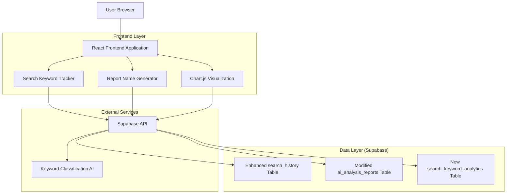
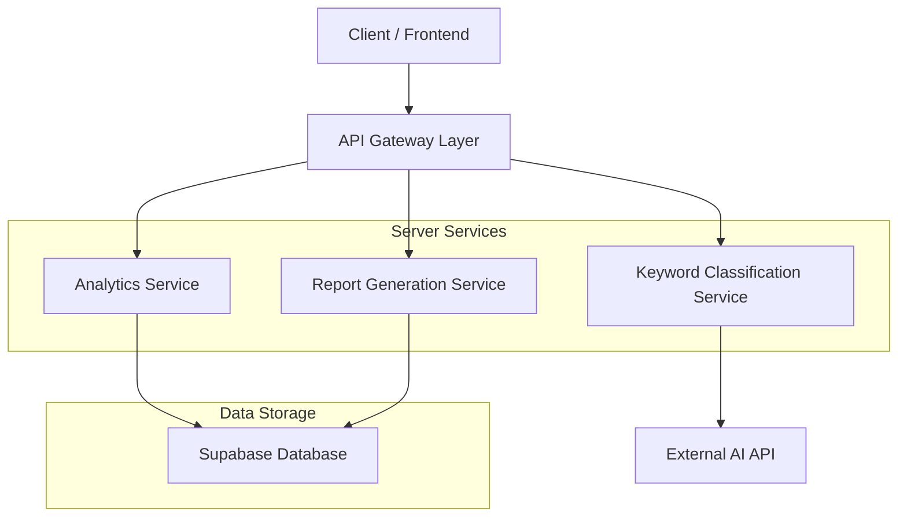
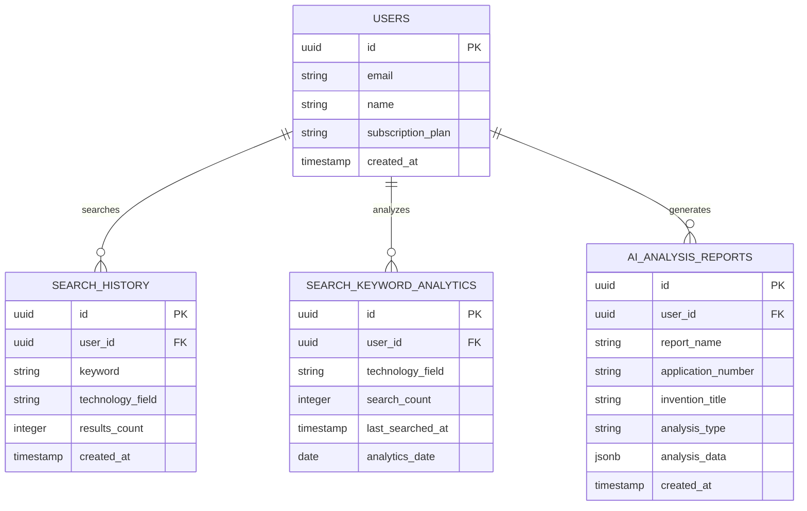

# 검색 키워드 분석 및 AI 리포트 개선 기술 아키텍처

## 1. Architecture design



## 2. Technology Description
- Frontend: React@18 + TypeScript + Chart.js@4 + tailwindcss@3 + vite
- Backend: Supabase (PostgreSQL + Real-time + Auth)
- Visualization: Chart.js for interactive charts
- Classification: OpenAI/Gemini API for keyword field classification

## 3. Route definitions

| Route | Purpose |
|-------|---------|
| /dashboard | 개선된 대시보드 - 키워드 분야별 분포 차트, 검색 트렌드, 새로운 리포트 목록 |
| /search | 키워드 자동 기록 및 분류 기능이 추가된 검색 페이지 |
| /reports/:id | 새로운 명명 규칙이 적용된 리포트 상세 페이지 |
| /reports | 체계적인 이름으로 정리된 리포트 목록 페이지 |

## 4. API definitions

### 4.1 Core API

키워드 분야 분류 API
```
POST /api/classify-keyword
```

Request:
| Param Name| Param Type  | isRequired  | Description |
|-----------|-------------|-------------|-------------|
| keyword   | string      | true        | 분류할 검색 키워드 |
| context   | string      | false       | 추가 컨텍스트 정보 |

Response:
| Param Name| Param Type  | Description |
|-----------|-------------|-------------|
| field     | string      | 분류된 기술 분야 (AI, IoT, Bio, Auto, Semiconductor 등) |
| confidence| number      | 분류 신뢰도 (0-1) |

Example
```json
{
  "keyword": "딥러닝 알고리즘",
  "context": "특허 검색"
}
```

검색 키워드 통계 API
```
GET /api/users/keyword-analytics
```

Request:
| Param Name| Param Type  | isRequired  | Description |
|-----------|-------------|-------------|-------------|
| period    | string      | false       | 조회 기간 (7d, 30d, 90d) |
| field     | string      | false       | 특정 기술 분야 필터 |

Response:
| Param Name| Param Type  | Description |
|-----------|-------------|-------------|
| fieldDistribution | object | 분야별 키워드 분포 |
| trendData | array       | 시간별 검색 트렌드 |
| topKeywords | array     | 인기 키워드 TOP 10 |

AI 리포트 생성 (개선된 명명)
```
POST /api/generate-report
```

Request:
| Param Name| Param Type  | isRequired  | Description |
|-----------|-------------|-------------|-------------|
| patentData| object      | true        | 특허 정보 객체 |
| reportType| string      | true        | 'market' 또는 'business' |
| userId    | string      | true        | 사용자 ID |

Response:
| Param Name| Param Type  | Description |
|-----------|-------------|-------------|
| reportName| string      | 새로운 명명 규칙 적용된 리포트명 |
| reportId  | string      | 생성된 리포트 ID |
| downloadUrl| string     | 다운로드 URL |

## 5. Server architecture diagram



## 6. Data model

### 6.1 Data model definition



### 6.2 Data Definition Language

Enhanced search_history Table
```sql
-- 기존 search_history 테이블에 기술 분야 컬럼 추가
ALTER TABLE search_history 
ADD COLUMN IF NOT EXISTS technology_field VARCHAR(50),
ADD COLUMN IF NOT EXISTS field_confidence DECIMAL(3,2);

-- 기술 분야별 인덱스 추가
CREATE INDEX IF NOT EXISTS idx_search_history_technology_field 
ON search_history(technology_field);

CREATE INDEX IF NOT EXISTS idx_search_history_user_field_date 
ON search_history(user_id, technology_field, created_at DESC);
```

New search_keyword_analytics Table
```sql
-- 키워드 분석 통계 테이블 생성
CREATE TABLE IF NOT EXISTS search_keyword_analytics (
    id UUID PRIMARY KEY DEFAULT gen_random_uuid(),
    user_id UUID REFERENCES auth.users(id) ON DELETE CASCADE,
    technology_field VARCHAR(50) NOT NULL,
    keyword VARCHAR(255) NOT NULL,
    search_count INTEGER DEFAULT 1,
    last_searched_at TIMESTAMP WITH TIME ZONE DEFAULT NOW(),
    analytics_date DATE DEFAULT CURRENT_DATE,
    created_at TIMESTAMP WITH TIME ZONE DEFAULT NOW(),
    updated_at TIMESTAMP WITH TIME ZONE DEFAULT NOW(),
    
    UNIQUE(user_id, technology_field, keyword, analytics_date)
);

-- 인덱스 생성
CREATE INDEX idx_search_keyword_analytics_user_field 
ON search_keyword_analytics(user_id, technology_field);

CREATE INDEX idx_search_keyword_analytics_date 
ON search_keyword_analytics(analytics_date DESC);

CREATE INDEX idx_search_keyword_analytics_count 
ON search_keyword_analytics(search_count DESC);
```

Modified ai_analysis_reports Table
```sql
-- AI 분석 리포트 테이블에 리포트명 컬럼 추가
ALTER TABLE ai_analysis_reports 
ADD COLUMN IF NOT EXISTS report_name VARCHAR(500),
ADD COLUMN IF NOT EXISTS original_filename VARCHAR(500);

-- 리포트명 생성 함수
CREATE OR REPLACE FUNCTION generate_report_name(
    p_invention_title TEXT,
    p_analysis_type TEXT,
    p_application_number TEXT,
    p_created_date DATE DEFAULT CURRENT_DATE
) RETURNS TEXT AS $$
DECLARE
    clean_title TEXT;
    type_suffix TEXT;
    date_suffix TEXT;
    final_name TEXT;
BEGIN
    -- 특허 제목 정리 (특수문자 제거, 길이 제한)
    clean_title := REGEXP_REPLACE(
        SUBSTRING(COALESCE(p_invention_title, '제목없음'), 1, 50), 
        '[^\w가-힣]', '_', 'g'
    );
    
    -- 분석 타입에 따른 접미사
    type_suffix := CASE 
        WHEN p_analysis_type = 'market' THEN '시장분석'
        WHEN p_analysis_type = 'business' THEN '인사이트'
        ELSE '분석'
    END;
    
    -- 날짜 형식 (YYYYMMDD)
    date_suffix := TO_CHAR(p_created_date, 'YYYYMMDD');
    
    -- 최종 리포트명 생성
    final_name := clean_title || '_' || type_suffix || '_' || 
                  COALESCE(p_application_number, 'NO_NUMBER') || '_' || date_suffix;
    
    RETURN final_name;
END;
$$ LANGUAGE plpgsql;

-- 기존 리포트에 대한 리포트명 업데이트
UPDATE ai_analysis_reports 
SET report_name = generate_report_name(
    invention_title, 
    analysis_type, 
    application_number, 
    created_at::date
)
WHERE report_name IS NULL;
```

RLS Policies
```sql
-- search_keyword_analytics 테이블 RLS 정책
ALTER TABLE search_keyword_analytics ENABLE ROW LEVEL SECURITY;

CREATE POLICY "Users can view own keyword analytics" 
ON search_keyword_analytics FOR SELECT 
USING (auth.uid() = user_id);

CREATE POLICY "Users can insert own keyword analytics" 
ON search_keyword_analytics FOR INSERT 
WITH CHECK (auth.uid() = user_id);

CREATE POLICY "Users can update own keyword analytics" 
ON search_keyword_analytics FOR UPDATE 
USING (auth.uid() = user_id);
```

Sample Data
```sql
-- 샘플 키워드 분석 데이터
INSERT INTO search_keyword_analytics (user_id, technology_field, keyword, search_count, analytics_date)
VALUES 
    ('550e8400-e29b-41d4-a716-446655440000', 'AI', '딥러닝', 15, CURRENT_DATE - 1),
    ('550e8400-e29b-41d4-a716-446655440000', 'AI', '머신러닝', 12, CURRENT_DATE - 1),
    ('550e8400-e29b-41d4-a716-446655440000', 'IoT', '센서', 8, CURRENT_DATE - 2),
    ('550e8400-e29b-41d4-a716-446655440000', 'Bio', '유전자', 5, CURRENT_DATE - 3),
    ('550e8400-e29b-41d4-a716-446655440000', 'Auto', '자율주행', 10, CURRENT_DATE - 1);
```