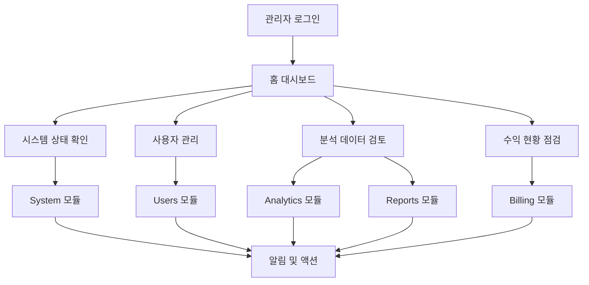

# 관리자 대시보드 UI/UX 재설계 PRD

## 1. 프로젝트 개요

Patent-AI 관리자 대시보드의 사용자 경험을 혁신적으로 개선하여 직관적이고 효율적인 관리 인터페이스를 제공합니다.
현재 시스템의 복잡한 네비게이션과 일관성 없는 디자인을 해결하고, 모던한 디자인 시스템을 적용하여 관리자의 업무 효율성을 극대화합니다.

## 2. 핵심 기능

### 2.1 사용자 역할
| 역할 | 접근 방법 | 핵심 권한 |
|------|-----------|----------|
| Super Admin | 직접 계정 생성 | 모든 모듈 접근, 시스템 설정 변경 |
| Admin | Super Admin 초대 | 사용자 관리, 분석 데이터 조회 |
| Viewer | Admin 초대 | 읽기 전용 대시보드 접근 |

### 2.2 페이지 모듈
관리자 대시보드는 다음 6개의 핵심 모듈로 구성됩니다:

1. **홈 대시보드**: 전체 시스템 개요, 핵심 메트릭, 빠른 액션 버튼
2. **Analytics**: 검색 분석, 키워드 트렌드, 사용자 행동 분석
3. **Reports**: 리포트 통계, 품질 분석, 성능 메트릭
4. **Users**: 사용자 관리, 활동 추적, 권한 설정
5. **Billing**: 수익 분석, 결제 내역, 구독 관리
6. **System**: 시스템 모니터링, 성능 지표, 설정 관리

### 2.3 페이지 상세 설계

| 페이지명 | 모듈명 | 기능 설명 |
|---------|--------|----------|
| 홈 대시보드 | 개요 카드 | 사용자 수, 매출, 검색량, 리포트 수 등 핵심 지표 표시 |
| 홈 대시보드 | 활동 차트 | 주간/월간 활동 트렌드, 사용자 증가율 시각화 |
| 홈 대시보드 | 빠른 액션 | 사용자 추가, 공지사항 작성, 시스템 점검 등 |
| Analytics | 검색 분석 | 인기 키워드, 검색 트렌드, 기술 분야별 분석 |
| Analytics | 사용자 행동 | 페이지 체류시간, 이탈률, 전환율 분석 |
| Analytics | 시장 인텔리전스 | 특허 동향, 기술 트렌드, 경쟁사 분석 |
| Reports | 리포트 통계 | 생성된 리포트 수, 타입별 분포, 품질 점수 |
| Reports | 성능 분석 | 리포트 생성 시간, 사용자 만족도, 오류율 |
| Reports | 내보내기 | 통계 데이터 CSV/PDF 내보내기, 스케줄링 |
| Users | 사용자 목록 | 검색, 필터링, 정렬 기능이 있는 사용자 테이블 |
| Users | 사용자 상세 | 프로필 정보, 활동 내역, 결제 정보, 권한 관리 |
| Users | 대량 작업 | 일괄 이메일 발송, 권한 변경, 계정 상태 관리 |
| Billing | 수익 대시보드 | 총 매출, 월간 수익, 플랜별 분석, 성장률 |
| Billing | 결제 내역 | 거래 목록, 환불 관리, 결제 실패 추적 |
| Billing | 구독 관리 | 플랜 변경, 할인 적용, 청구서 관리 |
| System | 시스템 상태 | 서버 상태, API 응답시간, 에러율 모니터링 |
| System | 성능 지표 | LLM 비용, 캐시 효율성, 데이터베이스 성능 |
| System | 설정 관리 | 시스템 설정, 알림 설정, 백업 관리 |

## 3. 핵심 프로세스

### 관리자 워크플로우
1. **로그인** → 홈 대시보드에서 전체 현황 파악
2. **일일 점검** → 시스템 상태 확인 → 이상 징후 발견 시 알림
3. **사용자 관리** → 신규 가입자 승인 → 문제 사용자 처리
4. **분석 검토** → 주요 지표 확인 → 트렌드 분석 → 의사결정 지원
5. **수익 관리** → 결제 현황 점검 → 환불 처리 → 플랜 최적화

## 4. 사용자 인터페이스 디자인

### 4.1 디자인 시스템

**색상 팔레트:**
- Primary: #2563eb (Blue-600) - 메인 액션, 네비게이션
- Secondary: #64748b (Slate-500) - 보조 텍스트, 아이콘
- Success: #059669 (Emerald-600) - 성공 상태, 긍정적 지표
- Warning: #d97706 (Amber-600) - 주의 상태, 중요 알림
- Error: #dc2626 (Red-600) - 오류 상태, 위험 지표
- Background: #f8fafc (Slate-50) - 페이지 배경
- Surface: #ffffff (White) - 카드, 모달 배경
- Border: #e2e8f0 (Slate-200) - 구분선, 테두리

**타이포그래피:**
- 헤딩 1: 32px, font-bold, text-slate-900
- 헤딩 2: 24px, font-semibold, text-slate-800
- 헤딩 3: 20px, font-medium, text-slate-700
- 본문: 16px, font-normal, text-slate-600
- 캡션: 14px, font-normal, text-slate-500
- 라벨: 12px, font-medium, text-slate-600

**컴포넌트 스타일:**
- 버튼: 둥근 모서리 (8px), 그림자 효과, 호버 상태 변화
- 카드: 흰색 배경, 미묘한 그림자, 16px 패딩
- 입력 필드: 테두리 스타일, 포커스 시 파란색 테두리
- 아이콘: 20px 크기, 일관된 스트로크 두께

### 4.2 페이지 디자인 개요

| 페이지명 | 모듈명 | UI 요소 |
|---------|--------|---------|
| 홈 대시보드 | 메트릭 카드 | 4열 그리드, 아이콘 + 숫자 + 변화율, 색상 코딩 |
| 홈 대시보드 | 차트 영역 | 2열 그리드, Line/Bar 차트, 인터랙티브 툴팁 |
| 홈 대시보드 | 빠른 액션 | 버튼 그룹, 아이콘 + 라벨, 드롭다운 메뉴 |
| Analytics | 필터 바 | 날짜 선택기, 카테고리 필터, 검색 입력 |
| Analytics | 데이터 테이블 | 정렬 가능한 헤더, 페이지네이션, 행 선택 |
| Analytics | 차트 컨테이너 | 탭 네비게이션, 풀스크린 모드, 내보내기 버튼 |
| Reports | 통계 카드 | 3열 그리드, 진행률 바, 트렌드 화살표 |
| Reports | 리포트 목록 | 카드 레이아웃, 썸네일, 메타데이터 표시 |
| Users | 검색 헤더 | 검색 바, 필터 드롭다운, 추가 버튼 |
| Users | 사용자 테이블 | 아바타, 상태 배지, 액션 메뉴 |
| Billing | 수익 차트 | 대시보드 스타일, 드릴다운 기능 |
| Billing | 거래 내역 | 타임라인 뷰, 상태별 색상 구분 |
| System | 상태 모니터 | 실시간 업데이트, 경고 알림, 상태 표시등 |
| System | 성능 그래프 | 실시간 차트, 임계값 표시, 알람 설정 |

### 4.3 반응형 디자인

**데스크톱 우선 설계:**
- 1920px 이상: 풀 레이아웃, 사이드바 고정
- 1440px-1919px: 표준 레이아웃, 적응형 그리드
- 1024px-1439px: 컴팩트 레이아웃, 사이드바 축소
- 768px-1023px: 태블릿 레이아웃, 사이드바 오버레이
- 768px 미만: 모바일 레이아웃, 햄버거 메뉴

**터치 인터랙션 최적화:**
- 최소 터치 영역: 44px × 44px
- 스와이프 제스처 지원 (테이블 스크롤)
- 롱 프레스 컨텍스트 메뉴

## 5. 사용자 경험 개선사항

### 5.1 네비게이션 개선
- **브레드크럼**: 현재 위치 표시, 빠른 이동 지원
- **검색 기능**: 전역 검색, 자동완성, 최근 검색어
- **즐겨찾기**: 자주 사용하는 페이지 북마크
- **키보드 단축키**: 주요 기능 빠른 접근

### 5.2 인터랙션 피드백
- **로딩 상태**: 스켈레톤 UI, 진행률 표시
- **성공/오류 알림**: 토스트 메시지, 인라인 검증
- **호버 효과**: 버튼, 링크, 카드 상호작용
- **애니메이션**: 부드러운 전환, 마이크로 인터랙션

### 5.3 접근성 고려사항
- **키보드 네비게이션**: Tab 순서, Focus 표시
- **스크린 리더**: ARIA 라벨, 의미적 HTML
- **색상 대비**: WCAG 2.1 AA 준수
- **텍스트 크기**: 확대/축소 지원

### 5.4 성능 최적화
- **지연 로딩**: 차트, 이미지, 테이블 데이터
- **캐싱 전략**: API 응답, 정적 자원
- **번들 최적화**: 코드 분할, 트리 쉐이킹
- **CDN 활용**: 정적 자원 배포

## 6. 기술 구현 가이드라인

### 6.1 컴포넌트 아키텍처
- **재사용 가능한 UI 컴포넌트**: Button, Card, Table, Chart
- **레이아웃 컴포넌트**: Sidebar, Header, Container
- **비즈니스 컴포넌트**: UserCard, MetricCard, ChartWidget

### 6.2 상태 관리
- **전역 상태**: 사용자 인증, 테마 설정
- **로컬 상태**: 폼 데이터, UI 상태
- **서버 상태**: API 데이터, 캐싱

### 6.3 데이터 시각화
- **Chart.js 활용**: Line, Bar, Doughnut, Radar 차트
- **실시간 업데이트**: WebSocket 연결
- **인터랙티브 기능**: 줌, 필터링, 드릴다운

이 재설계를 통해 관리자들이 더욱 효율적으로 시스템을 관리하고, 데이터 기반 의사결정을 내릴 수 있는 직관적인 인터페이스를 제공합니다.