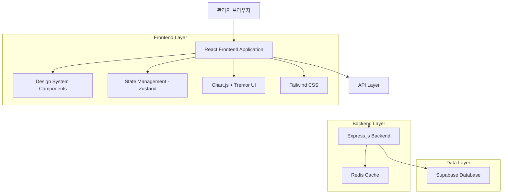
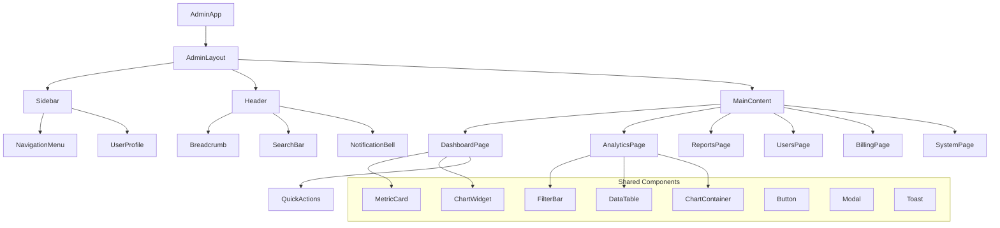

# 관리자 대시보드 UI/UX 재설계 기술 아키텍처

## 1. 아키텍처 설계



## 2. 기술 스택

- **Frontend**: React@18 + TypeScript + Vite + Tailwind CSS@3
- **UI Components**: Tremor UI + Headless UI + Chart.js
- **State Management**: Zustand + React Query
- **Backend**: Express.js + Node.js
- **Database**: Supabase (PostgreSQL)
- **Cache**: Redis
- **Authentication**: Supabase Auth

## 3. 라우트 정의

| 라우트 | 목적 |
|--------|------|
| /admin/login | 관리자 로그인 페이지 |
| /admin | 홈 대시보드, 전체 시스템 개요 및 핵심 메트릭 |
| /admin/analytics | 검색 분석, 키워드 트렌드, 사용자 행동 분석 |
| /admin/reports | 리포트 통계, 품질 분석, 성능 메트릭 |
| /admin/users | 사용자 관리, 활동 추적, 권한 설정 |
| /admin/billing | 수익 분석, 결제 내역, 구독 관리 |
| /admin/system | 시스템 모니터링, 성능 지표, 설정 관리 |

## 4. API 정의

### 4.1 핵심 API

**대시보드 메트릭 조회**
```
GET /api/admin/dashboard/metrics
```

Request:
| 파라미터명 | 타입 | 필수여부 | 설명 |
|-----------|------|----------|------|
| period | string | false | 조회 기간 (7d, 30d, 90d) |
| timezone | string | false | 시간대 설정 |

Response:
| 파라미터명 | 타입 | 설명 |
|-----------|------|------|
| totalUsers | number | 전체 사용자 수 |
| activeUsers | number | 활성 사용자 수 |
| totalRevenue | number | 총 매출 |
| monthlyRevenue | number | 월간 매출 |
| searchCount | number | 검색 횟수 |
| reportCount | number | 리포트 생성 수 |
| growthRate | number | 성장률 (%) |

**사용자 분석 데이터**
```
GET /api/admin/analytics/users
```

Request:
| 파라미터명 | 타입 | 필수여부 | 설명 |
|-----------|------|----------|------|
| startDate | string | true | 시작 날짜 (YYYY-MM-DD) |
| endDate | string | true | 종료 날짜 (YYYY-MM-DD) |
| groupBy | string | false | 그룹화 기준 (day, week, month) |

Response:
| 파라미터명 | 타입 | 설명 |
|-----------|------|------|
| userGrowth | array | 사용자 증가 추이 |
| userActivity | array | 사용자 활동 데이터 |
| retentionRate | number | 사용자 유지율 |

**검색 분석 데이터**
```
GET /api/admin/analytics/search
```

Request:
| 파라미터명 | 타입 | 필수여부 | 설명 |
|-----------|------|----------|------|
| period | string | false | 조회 기간 |
| category | string | false | 기술 분야 필터 |

Response:
| 파라미터명 | 타입 | 설명 |
|-----------|------|------|
| topKeywords | array | 인기 키워드 목록 |
| searchTrends | array | 검색 트렌드 데이터 |
| categoryDistribution | array | 분야별 검색 분포 |

**사용자 관리 API**
```
GET /api/admin/users
POST /api/admin/users/:id/actions
```

**수익 분석 API**
```
GET /api/admin/billing/revenue
GET /api/admin/billing/transactions
```

**시스템 모니터링 API**
```
GET /api/admin/system/status
GET /api/admin/system/performance
```

## 5. 컴포넌트 아키텍처



## 6. 디자인 시스템 구현

### 6.1 Tailwind CSS 설정

```javascript
// tailwind.config.js
module.exports = {
  content: ['./src/**/*.{js,jsx,ts,tsx}'],
  theme: {
    extend: {
      colors: {
        primary: {
          50: '#eff6ff',
          500: '#3b82f6',
          600: '#2563eb',
          700: '#1d4ed8',
        },
        gray: {
          50: '#f8fafc',
          100: '#f1f5f9',
          200: '#e2e8f0',
          500: '#64748b',
          600: '#475569',
          900: '#0f172a',
        }
      },
      fontFamily: {
        sans: ['Inter', 'system-ui', 'sans-serif'],
      },
      boxShadow: {
        'card': '0 1px 3px 0 rgba(0, 0, 0, 0.1), 0 1px 2px 0 rgba(0, 0, 0, 0.06)',
        'card-hover': '0 4px 6px -1px rgba(0, 0, 0, 0.1), 0 2px 4px -1px rgba(0, 0, 0, 0.06)',
      }
    }
  },
  plugins: [
    require('@tailwindcss/forms'),
    require('@tailwindcss/typography'),
  ]
}
```

### 6.2 컴포넌트 라이브러리

**기본 컴포넌트**
```typescript
// Button Component
interface ButtonProps {
  variant: 'primary' | 'secondary' | 'outline' | 'ghost';
  size: 'sm' | 'md' | 'lg';
  icon?: React.ReactNode;
  loading?: boolean;
  children: React.ReactNode;
}

// Card Component
interface CardProps {
  title?: string;
  subtitle?: string;
  actions?: React.ReactNode;
  children: React.ReactNode;
  className?: string;
}

// MetricCard Component
interface MetricCardProps {
  title: string;
  value: string | number;
  change?: number;
  changeType?: 'increase' | 'decrease';
  icon?: React.ReactNode;
  color?: 'blue' | 'green' | 'yellow' | 'red';
}
```

### 6.3 차트 컴포넌트

```typescript
// ChartWidget Component
interface ChartWidgetProps {
  type: 'line' | 'bar' | 'doughnut' | 'radar';
  data: ChartData;
  options?: ChartOptions;
  title?: string;
  subtitle?: string;
  height?: number;
  loading?: boolean;
}

// Chart.js 설정
const chartDefaults = {
  responsive: true,
  maintainAspectRatio: false,
  plugins: {
    legend: {
      position: 'bottom',
    },
    tooltip: {
      backgroundColor: 'rgba(0, 0, 0, 0.8)',
      titleColor: '#ffffff',
      bodyColor: '#ffffff',
    }
  }
};
```

## 7. 상태 관리 아키텍처

### 7.1 Zustand Store 구조

```typescript
// Admin Store
interface AdminState {
  user: AdminUser | null;
  permissions: string[];
  theme: 'light' | 'dark';
  sidebarCollapsed: boolean;
  
  // Actions
  setUser: (user: AdminUser) => void;
  setTheme: (theme: 'light' | 'dark') => void;
  toggleSidebar: () => void;
}

// Dashboard Store
interface DashboardState {
  metrics: DashboardMetrics | null;
  loading: boolean;
  error: string | null;
  lastUpdated: Date | null;
  
  // Actions
  fetchMetrics: (period?: string) => Promise<void>;
  refreshMetrics: () => Promise<void>;
}

// Analytics Store
interface AnalyticsState {
  searchData: SearchAnalytics | null;
  userData: UserAnalytics | null;
  filters: AnalyticsFilters;
  
  // Actions
  fetchSearchAnalytics: (filters: AnalyticsFilters) => Promise<void>;
  fetchUserAnalytics: (filters: AnalyticsFilters) => Promise<void>;
  updateFilters: (filters: Partial<AnalyticsFilters>) => void;
}
```

### 7.2 React Query 설정

```typescript
// API Hooks
export const useDashboardMetrics = (period?: string) => {
  return useQuery({
    queryKey: ['dashboard', 'metrics', period],
    queryFn: () => fetchDashboardMetrics(period),
    staleTime: 5 * 60 * 1000, // 5분
    refetchInterval: 30 * 1000, // 30초마다 자동 갱신
  });
};

export const useSearchAnalytics = (filters: AnalyticsFilters) => {
  return useQuery({
    queryKey: ['analytics', 'search', filters],
    queryFn: () => fetchSearchAnalytics(filters),
    enabled: !!filters.startDate && !!filters.endDate,
  });
};
```

## 8. 성능 최적화

### 8.1 코드 분할

```typescript
// Lazy Loading
const DashboardPage = lazy(() => import('./pages/DashboardPage'));
const AnalyticsPage = lazy(() => import('./pages/AnalyticsPage'));
const ReportsPage = lazy(() => import('./pages/ReportsPage'));
const UsersPage = lazy(() => import('./pages/UsersPage'));
const BillingPage = lazy(() => import('./pages/BillingPage'));
const SystemPage = lazy(() => import('./pages/SystemPage'));

// Route Configuration
const adminRoutes = [
  { path: '/', component: DashboardPage },
  { path: '/analytics', component: AnalyticsPage },
  { path: '/reports', component: ReportsPage },
  { path: '/users', component: UsersPage },
  { path: '/billing', component: BillingPage },
  { path: '/system', component: SystemPage },
];
```

### 8.2 메모이제이션

```typescript
// Chart Component Optimization
const ChartWidget = memo(({ data, options, type }: ChartWidgetProps) => {
  const chartData = useMemo(() => {
    return processChartData(data, type);
  }, [data, type]);
  
  const chartOptions = useMemo(() => {
    return { ...chartDefaults, ...options };
  }, [options]);
  
  return (
    <div className="chart-container">
      <Chart type={type} data={chartData} options={chartOptions} />
    </div>
  );
});
```

### 8.3 가상화

```typescript
// Large Table Virtualization
import { FixedSizeList as List } from 'react-window';

const VirtualizedTable = ({ data, height = 400 }: VirtualizedTableProps) => {
  const Row = ({ index, style }: { index: number; style: React.CSSProperties }) => (
    <div style={style}>
      <TableRow data={data[index]} />
    </div>
  );
  
  return (
    <List
      height={height}
      itemCount={data.length}
      itemSize={60}
      width="100%"
    >
      {Row}
    </List>
  );
};
```

## 9. 접근성 구현

### 9.1 키보드 네비게이션

```typescript
// Keyboard Navigation Hook
const useKeyboardNavigation = () => {
  useEffect(() => {
    const handleKeyDown = (event: KeyboardEvent) => {
      // Ctrl/Cmd + K: Global Search
      if ((event.ctrlKey || event.metaKey) && event.key === 'k') {
        event.preventDefault();
        openGlobalSearch();
      }
      
      // Ctrl/Cmd + /: Show Shortcuts
      if ((event.ctrlKey || event.metaKey) && event.key === '/') {
        event.preventDefault();
        showKeyboardShortcuts();
      }
    };
    
    document.addEventListener('keydown', handleKeyDown);
    return () => document.removeEventListener('keydown', handleKeyDown);
  }, []);
};
```

### 9.2 ARIA 라벨링

```typescript
// Accessible Components
const MetricCard = ({ title, value, change }: MetricCardProps) => (
  <div
    role="region"
    aria-labelledby={`metric-${title}`}
    className="metric-card"
  >
    <h3 id={`metric-${title}`} className="metric-title">
      {title}
    </h3>
    <div
      aria-label={`Current value: ${value}`}
      className="metric-value"
    >
      {value}
    </div>
    {change && (
      <div
        aria-label={`Change: ${change > 0 ? 'increased' : 'decreased'} by ${Math.abs(change)}%`}
        className={`metric-change ${change > 0 ? 'positive' : 'negative'}`}
      >
        {change > 0 ? '↗' : '↘'} {Math.abs(change)}%
      </div>
    )}
  </div>
);
```

## 10. 배포 및 모니터링

### 10.1 빌드 최적화

```javascript
// Vite 설정
export default defineConfig({
  build: {
    rollupOptions: {
      output: {
        manualChunks: {
          vendor: ['react', 'react-dom'],
          charts: ['chart.js', 'react-chartjs-2'],
          ui: ['@tremor/react', '@headlessui/react'],
        }
      }
    },
    chunkSizeWarningLimit: 1000,
  },
  plugins: [
    react(),
    // Bundle Analyzer
    process.env.ANALYZE && bundleAnalyzer(),
  ]
});
```

### 10.2 성능 모니터링

```typescript
// Performance Monitoring
const usePerformanceMonitoring = () => {
  useEffect(() => {
    // Core Web Vitals
    getCLS(console.log);
    getFID(console.log);
    getFCP(console.log);
    getLCP(console.log);
    getTTFB(console.log);
  }, []);
};

// Error Boundary
class AdminErrorBoundary extends Component {
  componentDidCatch(error: Error, errorInfo: ErrorInfo) {
    // Log to monitoring service
    console.error('Admin Dashboard Error:', error, errorInfo);
  }
  
  render() {
    if (this.state.hasError) {
      return <ErrorFallback />;
    }
    return this.props.children;
  }
}
```

이 기술 아키텍처를 통해 현대적이고 확장 가능한 관리자 대시보드 UI/UX를 구현할 수 있습니다.