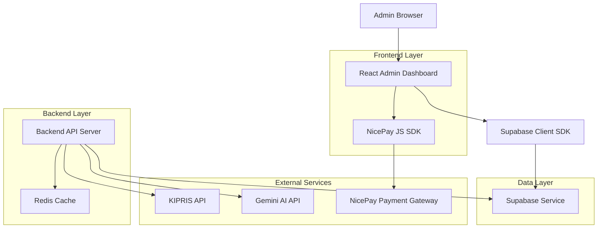
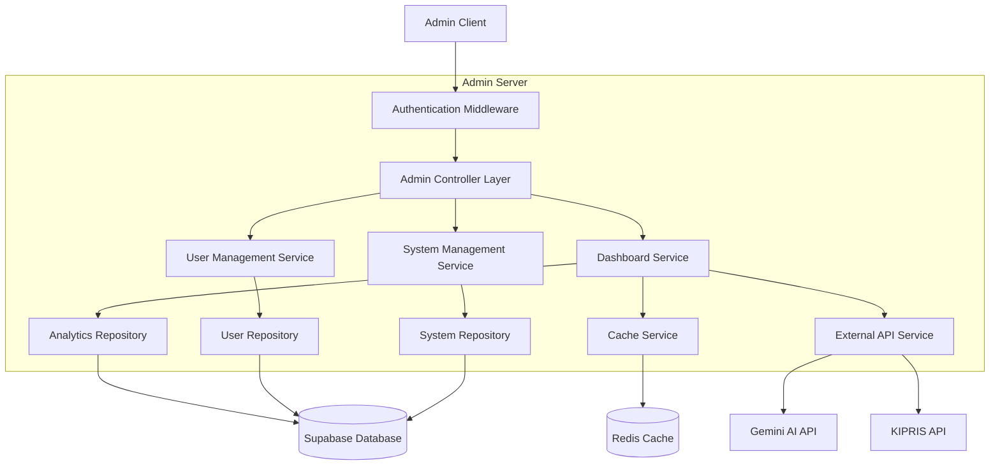
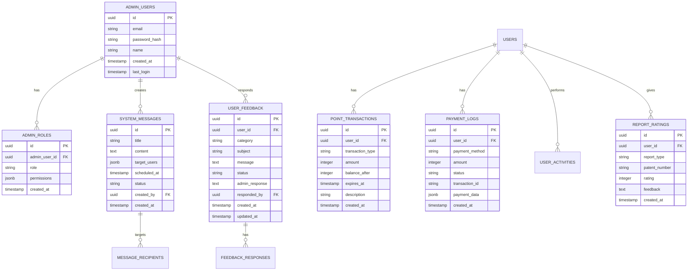
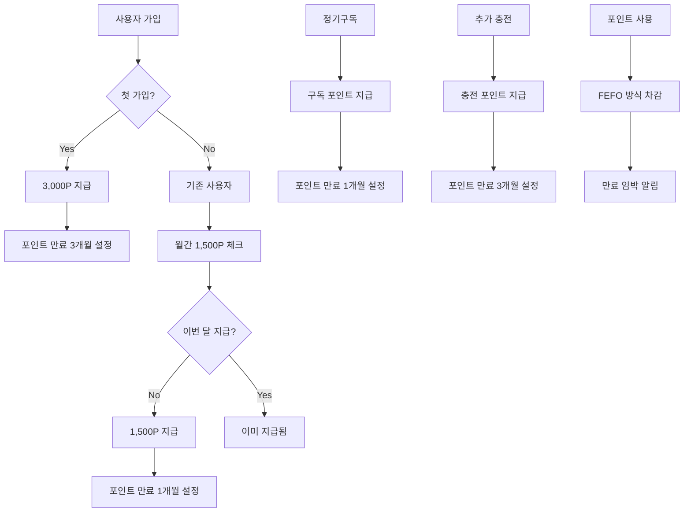
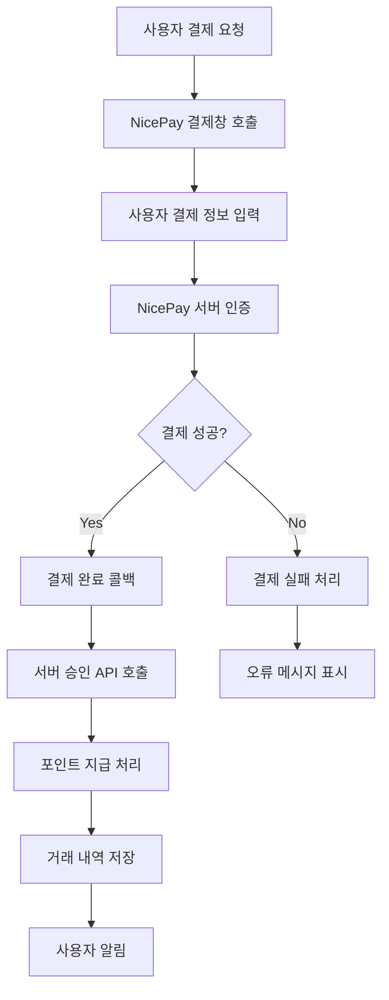
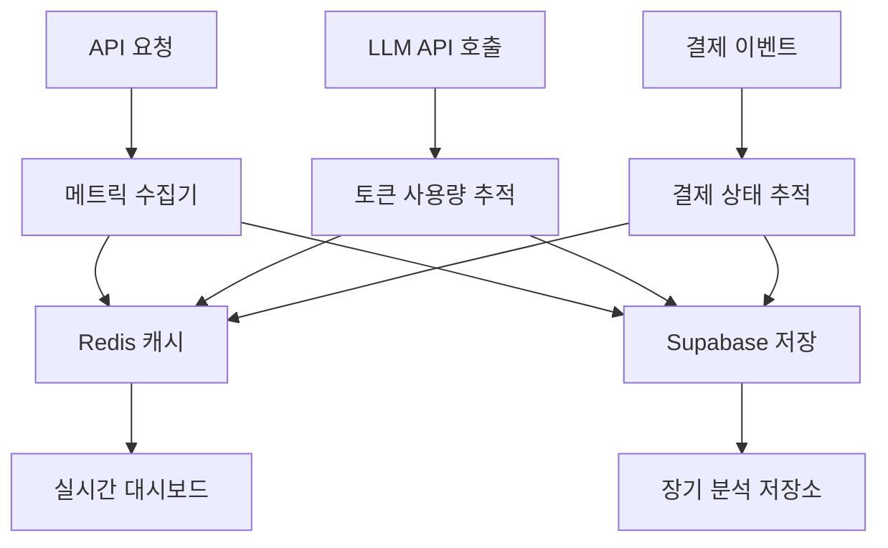

# 관리자 대시보드 기술 아키텍처

## 1. Architecture Design



## 2. Technology Description

- **Frontend**: React@18 + TypeScript + Tailwind CSS + Vite + Recharts + Tremor UI
- **Backend**: Node.js + Express + Supabase Client SDK
- **Database**: Supabase (PostgreSQL)
- **Cache**: Redis
- **Payment**: NicePay PG Integration
- **AI Services**: Google Gemini API
- **External APIs**: KIPRIS Patent API

## 3. Route Definitions

| Route | Purpose |
|-------|---------|
| /admin | 관리자 로그인 페이지 |
| /admin/dashboard | 홈 대시보드 - 운영 효율 및 비용 통제 |
| /admin/analytics | 통계 페이지 - 시장 인텔리전스 및 콘텐츠 분석 |
| /admin/users | 사용자 관리 페이지 - 회원 및 결제 관리 |
| /admin/system | 시스템 관리 페이지 - 공지사항 및 피드백 관리 |
| /admin/settings | 관리자 설정 페이지 - 권한 및 시스템 설정 |

## 4. API Definitions

### 4.1 Admin Authentication APIs

**관리자 로그인**
```
POST /api/admin/auth/login
```

Request:
| Param Name | Param Type | isRequired | Description |
|------------|------------|------------|-------------|
| email | string | true | 관리자 이메일 |
| password | string | true | 관리자 비밀번호 |

Response:
| Param Name | Param Type | Description |
|------------|------------|-------------|
| success | boolean | 로그인 성공 여부 |
| token | string | JWT 인증 토큰 |
| user | object | 관리자 정보 및 권한 |

### 4.2 Dashboard Analytics APIs

**운영 지표 조회**
```
GET /api/admin/dashboard/metrics
```

Request:
| Param Name | Param Type | isRequired | Description |
|------------|------------|------------|-------------|
| period | string | false | 조회 기간 (day/week/month) |
| metrics | string[] | false | 조회할 지표 목록 |

Response:
| Param Name | Param Type | Description |
|------------|------------|-------------|
| llm_costs | object | LLM 비용 및 사용량 데이터 |
| api_performance | object | API 성능 및 오류율 데이터 |
| cache_efficiency | object | 캐싱 효율성 데이터 |

### 4.3 User Management APIs

**사용자 목록 조회**
```
GET /api/admin/users
```

Request:
| Param Name | Param Type | isRequired | Description |
|------------|------------|------------|-------------|
| page | number | false | 페이지 번호 |
| limit | number | false | 페이지당 항목 수 |
| search | string | false | 검색 키워드 |
| filter | object | false | 필터 조건 |

Response:
| Param Name | Param Type | Description |
|------------|------------|-------------|
| users | array | 사용자 목록 |
| total | number | 전체 사용자 수 |
| pagination | object | 페이지네이션 정보 |

**포인트 거래 내역 조회**
```
GET /api/admin/users/{userId}/points/transactions
```

Request:
| Param Name | Param Type | isRequired | Description |
|------------|------------|------------|-------------|
| userId | string | true | 사용자 ID |
| startDate | string | false | 시작 날짜 |
| endDate | string | false | 종료 날짜 |

Response:
| Param Name | Param Type | Description |
|------------|------------|-------------|
| transactions | array | 포인트 거래 내역 |
| summary | object | 거래 요약 정보 |

### 4.4 System Management APIs

**시스템 메시지 관리**
```
POST /api/admin/system/messages
```

Request:
| Param Name | Param Type | isRequired | Description |
|------------|------------|------------|-------------|
| title | string | true | 메시지 제목 |
| content | string | true | 메시지 내용 |
| target_users | array | false | 대상 사용자 그룹 |
| scheduled_at | string | false | 예약 발송 시간 |

Response:
| Param Name | Param Type | Description |
|------------|------------|-------------|
| success | boolean | 생성 성공 여부 |
| message_id | string | 생성된 메시지 ID |

## 5. Server Architecture Diagram



## 6. Data Model

### 6.1 Data Model Definition



### 6.2 Data Definition Language

**관리자 사용자 테이블 (admin_users)**
```sql
-- 관리자 사용자 테이블 생성
CREATE TABLE admin_users (
    id UUID PRIMARY KEY DEFAULT gen_random_uuid(),
    email VARCHAR(255) UNIQUE NOT NULL,
    password_hash VARCHAR(255) NOT NULL,
    name VARCHAR(100) NOT NULL,
    created_at TIMESTAMP WITH TIME ZONE DEFAULT NOW(),
    last_login TIMESTAMP WITH TIME ZONE,
    is_active BOOLEAN DEFAULT true
);

-- 관리자 역할 테이블 생성
CREATE TABLE admin_roles (
    id UUID PRIMARY KEY DEFAULT gen_random_uuid(),
    admin_user_id UUID REFERENCES admin_users(id) ON DELETE CASCADE,
    role VARCHAR(50) NOT NULL CHECK (role IN ('super_admin', 'operations_manager', 'business_analyst', 'customer_support')),
    permissions JSONB DEFAULT '{}',
    created_at TIMESTAMP WITH TIME ZONE DEFAULT NOW()
);

-- 시스템 메시지 테이블 생성
CREATE TABLE system_messages (
    id UUID PRIMARY KEY DEFAULT gen_random_uuid(),
    title VARCHAR(200) NOT NULL,
    content TEXT NOT NULL,
    target_users JSONB DEFAULT '[]',
    scheduled_at TIMESTAMP WITH TIME ZONE,
    status VARCHAR(20) DEFAULT 'draft' CHECK (status IN ('draft', 'scheduled', 'sent', 'cancelled')),
    created_by UUID REFERENCES admin_users(id),
    created_at TIMESTAMP WITH TIME ZONE DEFAULT NOW(),
    updated_at TIMESTAMP WITH TIME ZONE DEFAULT NOW()
);

-- 사용자 피드백 테이블 생성
CREATE TABLE user_feedback (
    id UUID PRIMARY KEY DEFAULT gen_random_uuid(),
    user_id UUID REFERENCES auth.users(id),
    category VARCHAR(50) DEFAULT 'general',
    subject VARCHAR(200) NOT NULL,
    message TEXT NOT NULL,
    status VARCHAR(20) DEFAULT 'pending' CHECK (status IN ('pending', 'in_progress', 'resolved', 'closed')),
    admin_response TEXT,
    responded_by UUID REFERENCES admin_users(id),
    priority VARCHAR(10) DEFAULT 'medium' CHECK (priority IN ('low', 'medium', 'high', 'urgent')),
    created_at TIMESTAMP WITH TIME ZONE DEFAULT NOW(),
    updated_at TIMESTAMP WITH TIME ZONE DEFAULT NOW()
);

-- 리포트 평가 테이블 생성
CREATE TABLE report_ratings (
    id UUID PRIMARY KEY DEFAULT gen_random_uuid(),
    user_id UUID REFERENCES auth.users(id),
    report_type VARCHAR(50) NOT NULL CHECK (report_type IN ('market_analysis', 'business_insight')),
    patent_number VARCHAR(100),
    rating INTEGER NOT NULL CHECK (rating >= 1 AND rating <= 5),
    feedback TEXT,
    created_at TIMESTAMP WITH TIME ZONE DEFAULT NOW()
);

-- 시스템 메트릭 테이블 생성
CREATE TABLE system_metrics (
    id UUID PRIMARY KEY DEFAULT gen_random_uuid(),
    metric_type VARCHAR(50) NOT NULL,
    metric_name VARCHAR(100) NOT NULL,
    metric_value DECIMAL(15,4),
    metadata JSONB DEFAULT '{}',
    recorded_at TIMESTAMP WITH TIME ZONE DEFAULT NOW()
);

-- 인덱스 생성
CREATE INDEX idx_admin_users_email ON admin_users(email);
CREATE INDEX idx_admin_roles_user_id ON admin_roles(admin_user_id);
CREATE INDEX idx_system_messages_status ON system_messages(status);
CREATE INDEX idx_system_messages_scheduled ON system_messages(scheduled_at);
CREATE INDEX idx_user_feedback_status ON user_feedback(status);
CREATE INDEX idx_user_feedback_user_id ON user_feedback(user_id);
CREATE INDEX idx_report_ratings_user_id ON report_ratings(user_id);
CREATE INDEX idx_report_ratings_type ON report_ratings(report_type);
CREATE INDEX idx_system_metrics_type_name ON system_metrics(metric_type, metric_name);
CREATE INDEX idx_system_metrics_recorded_at ON system_metrics(recorded_at DESC);

-- Row Level Security 정책 설정
ALTER TABLE admin_users ENABLE ROW LEVEL SECURITY;
ALTER TABLE admin_roles ENABLE ROW LEVEL SECURITY;
ALTER TABLE system_messages ENABLE ROW LEVEL SECURITY;
ALTER TABLE user_feedback ENABLE ROW LEVEL SECURITY;
ALTER TABLE report_ratings ENABLE ROW LEVEL SECURITY;
ALTER TABLE system_metrics ENABLE ROW LEVEL SECURITY;

-- 관리자 권한 정책
CREATE POLICY "Admin users can view all admin data" ON admin_users
    FOR ALL USING (auth.jwt() ->> 'role' = 'admin');

CREATE POLICY "Admin users can manage roles" ON admin_roles
    FOR ALL USING (auth.jwt() ->> 'role' = 'admin');

-- 초기 데이터 삽입
INSERT INTO admin_users (email, password_hash, name) VALUES
('admin@patent-ai.com', '$2b$10$example_hash', 'System Administrator');

INSERT INTO admin_roles (admin_user_id, role, permissions) VALUES
((SELECT id FROM admin_users WHERE email = 'admin@patent-ai.com'), 'super_admin', '{"all": true}');
```

## 7. Enhanced Point System Architecture

### 7.1 포인트 시스템 데이터 플로우



### 7.2 NicePay 결제 플로우



## 8. Real-time Monitoring Architecture

### 8.1 실시간 데이터 수집



### 8.2 알림 시스템

- **임계값 모니터링**: LLM 비용, API 오류율, 시스템 성능
- **실시간 알림**: WebSocket을 통한 즉시 알림
- **이메일 알림**: 중요 이벤트 발생 시 관리자 이메일 발송
- **슬랙 통합**: 운영팀 슬랙 채널 알림 연동

이 기술 아키텍처는 Patent-AI 관리자 대시보드의 안정적이고 확장 가능한 구현을 위한 상세한 설계 가이드를 제공합니다.