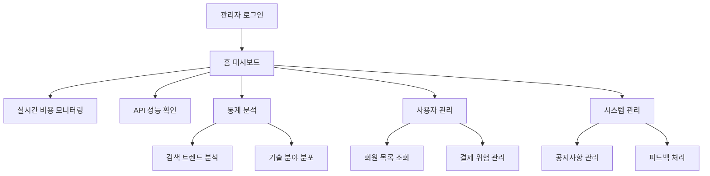

# 관리자 대시보드 완전 구현 PRD

## 1. Product Overview

Patent-AI 관리자 대시보드의 4개 핵심 모듈(홈, 통계, 사용자 관리, 시스템 관리)을 완전히 구현하여 실시간 운영 관리, 시장 인텔리전스, 사용자/결제 관리, 시스템 커뮤니케이션 기능을 제공합니다.

- 서비스의 안정적인 현금 흐름과 운영 비용을 실시간으로 모니터링하고, 사용자 행동 패턴을 분석하여 비즈니스 인사이트를 제공합니다.
- 관리자가 효율적으로 서비스를 운영하고 사용자 만족도를 향상시킬 수 있는 통합 관리 시스템을 구축합니다.

## 2. Core Features

### 2.1 User Roles

| Role | Registration Method | Core Permissions |
|------|---------------------|------------------|
| Super Admin | 시스템 직접 생성 | 모든 모듈 접근, 사용자 권한 관리, 시스템 설정 변경 |
| Operations Admin | Super Admin 초대 | 홈, 통계, 사용자 관리 모듈 접근 |
| Support Admin | Super Admin 초대 | 사용자 관리, 시스템 관리 모듈 접근 |

### 2.2 Feature Module

관리자 대시보드는 다음 4개의 핵심 페이지로 구성됩니다:

1. **홈 페이지**: 운영 효율 및 비용 통제 대시보드, 실시간 KPI 모니터링, 비용 추적 차트
2. **통계 페이지**: 시장 인텔리전스 분석, 검색 트렌드 분석, 기술 분야별 분포 차트
3. **사용자 관리 페이지**: 회원 목록 관리, 결제 관리, 포인트 거래 내역 조회
4. **시스템 관리 페이지**: 공지사항 관리, 피드백 관리, 시스템 메시지 발송

### 2.3 Page Details

| Page Name | Module Name | Feature description |
|-----------|-------------|---------------------|
| 홈 페이지 | LLM 비용 모니터링 | Gemini 토큰 사용량 및 추정 비용 실시간 표시, 누적 비용 라인 차트, 비용 임계값 알림 |
| 홈 페이지 | API 성능 대시보드 | KIPRIS/Gemini API 평균 지연시간 및 오류율 실시간 모니터링, 경고 색상 표시 |
| 홈 페이지 | 캐싱 효율성 분석 | LLM 분석 결과 캐시 히트율 표시, 비용 절감 효과 계산 |
| 통계 페이지 | 검색 키워드 분석 | Top 10 검색 키워드 순위, 주간 성장률 테이블, 트렌드 시각화 |
| 통계 페이지 | 기술 분야 분포 | IPC/CPC 코드별 특허 분석 건수 도넛 차트, Top 5 산업 섹터 |
| 통계 페이지 | 리포트 선호도 분석 | 시장 분석 vs 비즈니스 인사이트 리포트 생성 비율 막대 차트 |
| 통계 페이지 | 인기 특허 분석 | LLM 분석 요청이 많은 특허 번호 목록, 업계 관심사 파악 |
| 사용자 관리 페이지 | 회원 목록 관리 | 사용자 ID, 이메일, 구독 등급, 최종 로그인, 포인트 잔액 검색/정렬 테이블 |
| 사용자 관리 페이지 | 수익 지표 모니터링 | MRR(월간 반복 수익), Churn Rate(이탈률) KPI 카드 표시 |
| 사용자 관리 페이지 | 결제 위험 관리 | 결제 실패, 카드 만료 임박 사용자 목록, 이탈 방지 알림 |
| 사용자 관리 페이지 | 포인트 거래 내역 | 사용자별 포인트 충전/차감/소멸 상세 내역 조회, 투명성 확보 |
| 시스템 관리 페이지 | 시스템 메시지 관리 | 공지사항, 이벤트, 시스템 업데이트 메시지 생성/편집/예약 발송 |
| 시스템 관리 페이지 | 피드백 관리 | Contact Us 피드백 수집, 처리 상태 추적, 회신 기능 |
| 시스템 관리 페이지 | 리포트 품질 분석 | LLM 생성 리포트 사용자 만족도 통계, 품질 개선 데이터 |

## 3. Core Process

### 관리자 운영 플로우

1. **일일 운영 모니터링**: 홈 페이지에서 LLM 비용, API 성능, 캐시 효율성 확인
2. **주간 트렌드 분석**: 통계 페이지에서 검색 키워드 트렌드, 기술 분야 분포 분석
3. **사용자 관리**: 사용자 관리 페이지에서 회원 상태, 결제 위험 사용자 관리
4. **시스템 운영**: 시스템 관리 페이지에서 공지사항 발송, 피드백 처리

## 4. User Interface Design

### 4.1 Design Style

- **Primary Colors**: Blue (#3B82F6), Green (#10B981), Red (#EF4444)
- **Secondary Colors**: Gray (#6B7280), Light Blue (#DBEAFE)
- **Button Style**: 둥근 모서리 (rounded-lg), 그라데이션 효과
- **Font**: Inter, Pretendard (한글), 14px-16px 기본 크기
- **Layout Style**: 카드 기반 레이아웃, 좌측 네비게이션, 반응형 그리드
- **Icon Style**: Lucide React 아이콘, 일관된 스타일

### 4.2 Page Design Overview

| Page Name | Module Name | UI Elements |
|-----------|-------------|-------------|
| 홈 페이지 | LLM 비용 모니터링 | KPI 카드 (파란색 테마), 라인 차트 (Chart.js), 실시간 업데이트 인디케이터 |
| 홈 페이지 | API 성능 대시보드 | 상태 표시등 (녹색/노란색/빨간색), 지연시간 게이지 차트, 오류율 백분율 표시 |
| 통계 페이지 | 검색 키워드 분석 | 순위 테이블 (정렬 가능), 성장률 화살표 아이콘, 트렌드 스파크라인 |
| 통계 페이지 | 기술 분야 분포 | 도넛 차트 (Chart.js), 범례 테이블, 색상 코딩 |
| 사용자 관리 페이지 | 회원 목록 관리 | 데이터 테이블 (검색/필터/정렬), 페이지네이션, 액션 버튼 |
| 시스템 관리 페이지 | 메시지 관리 | 리치 텍스트 에디터, 예약 발송 달력, 미리보기 모달 |

### 4.3 Responsiveness

- **Desktop-first 설계**: 1920px 기준 최적화
- **Tablet 적응**: 768px 이상에서 사이드바 축소
- **Mobile 지원**: 640px 이하에서 햄버거 메뉴 전환
- **Touch 최적화**: 버튼 최소 44px 크기, 스와이프 제스처 지원