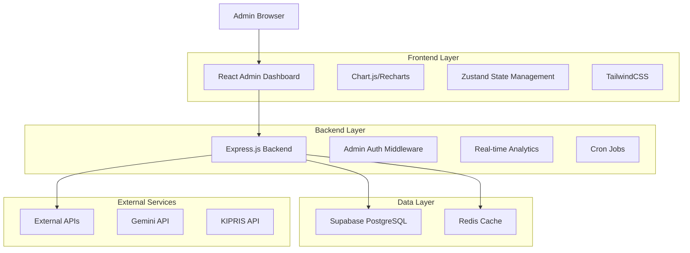
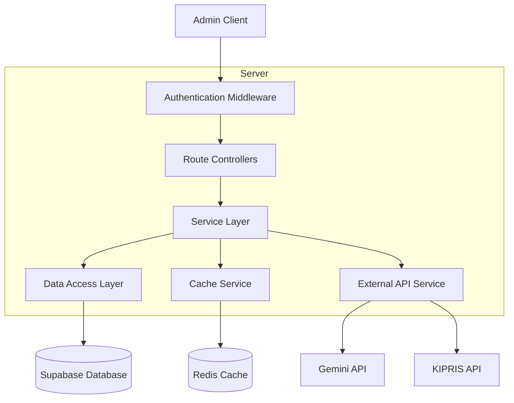
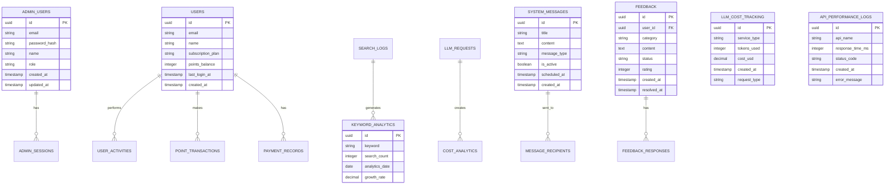

# 관리자 대시보드 완전 구현 기술 아키텍처

## 1. Architecture design



## 2. Technology Description

- **Frontend**: React@18 + TypeScript + TailwindCSS + Vite
- **Backend**: Express.js@4 + Node.js
- **Database**: Supabase (PostgreSQL)
- **Cache**: Redis (for API response caching)
- **Charts**: Chart.js + React-Chartjs-2
- **State Management**: Zustand
- **Authentication**: JWT + Supabase Auth

## 3. Route definitions

| Route | Purpose |
|-------|---------|
| /admin | 관리자 대시보드 홈 (리다이렉트) |
| /admin/login | 관리자 로그인 페이지 |
| /admin/dashboard | 홈 - 운영 효율 및 비용 통제 대시보드 |
| /admin/analytics | 통계 - 시장 인텔리전스 및 콘텐츠 분석 |
| /admin/users | 사용자 관리 - 회원 및 결제 관리 |
| /admin/system | 시스템 관리 - 공지사항 및 피드백 관리 |

## 4. API definitions

### 4.1 Core API

**관리자 인증 관련**
```
POST /api/admin/auth/login
```

Request:
| Param Name| Param Type  | isRequired  | Description |
|-----------|-------------|-------------|-------------|
| email     | string      | true        | 관리자 이메일 |
| password  | string      | true        | 비밀번호 |

Response:
| Param Name| Param Type  | Description |
|-----------|-------------|-------------|
| success   | boolean     | 로그인 성공 여부 |
| token     | string      | JWT 토큰 |
| admin     | object      | 관리자 정보 |

**홈 대시보드 메트릭**
```
GET /api/admin/dashboard/metrics
```

Response:
| Param Name| Param Type  | Description |
|-----------|-------------|-------------|
| llmCosts  | object      | LLM 비용 및 사용량 데이터 |
| apiPerformance | object | API 성능 및 오류율 데이터 |
| cacheStats | object     | 캐시 히트율 통계 |

**통계 분석 데이터**
```
GET /api/admin/analytics/keywords
GET /api/admin/analytics/technology-distribution
GET /api/admin/analytics/report-preferences
GET /api/admin/analytics/top-patents
```

**사용자 관리**
```
GET /api/admin/users/list
GET /api/admin/users/revenue-metrics
GET /api/admin/users/payment-risks
GET /api/admin/users/point-transactions
```

**시스템 관리**
```
GET /api/admin/system/messages
POST /api/admin/system/messages
GET /api/admin/system/feedback
PUT /api/admin/system/feedback/:id
GET /api/admin/system/report-ratings
```

## 5. Server architecture diagram



## 6. Data model

### 6.1 Data model definition



### 6.2 Data Definition Language

**LLM 비용 추적 테이블**
```sql
-- LLM 비용 추적
CREATE TABLE llm_cost_tracking (
    id UUID PRIMARY KEY DEFAULT gen_random_uuid(),
    service_type VARCHAR(50) NOT NULL, -- 'gemini', 'openai', etc.
    tokens_used INTEGER NOT NULL,
    cost_usd DECIMAL(10,4) NOT NULL,
    request_type VARCHAR(50), -- 'analysis', 'search', 'report'
    created_at TIMESTAMP WITH TIME ZONE DEFAULT NOW()
);

-- API 성능 로그
CREATE TABLE api_performance_logs (
    id UUID PRIMARY KEY DEFAULT gen_random_uuid(),
    api_name VARCHAR(100) NOT NULL, -- 'kipris', 'gemini', 'internal'
    response_time_ms INTEGER NOT NULL,
    status_code VARCHAR(10) NOT NULL,
    error_message TEXT,
    created_at TIMESTAMP WITH TIME ZONE DEFAULT NOW()
);

-- 캐시 통계
CREATE TABLE cache_statistics (
    id UUID PRIMARY KEY DEFAULT gen_random_uuid(),
    cache_type VARCHAR(50) NOT NULL, -- 'llm_analysis', 'search_results'
    hit_count INTEGER DEFAULT 0,
    miss_count INTEGER DEFAULT 0,
    analytics_date DATE NOT NULL,
    created_at TIMESTAMP WITH TIME ZONE DEFAULT NOW()
);

-- 키워드 분석
CREATE TABLE keyword_analytics (
    id UUID PRIMARY KEY DEFAULT gen_random_uuid(),
    keyword VARCHAR(255) NOT NULL,
    search_count INTEGER NOT NULL,
    analytics_date DATE NOT NULL,
    growth_rate DECIMAL(5,2), -- 주간 성장률 (%)
    created_at TIMESTAMP WITH TIME ZONE DEFAULT NOW()
);

-- 기술 분야 분석
CREATE TABLE technology_field_analytics (
    id UUID PRIMARY KEY DEFAULT gen_random_uuid(),
    ipc_code VARCHAR(20) NOT NULL,
    cpc_code VARCHAR(20),
    field_name VARCHAR(255) NOT NULL,
    analysis_count INTEGER NOT NULL,
    analytics_date DATE NOT NULL,
    created_at TIMESTAMP WITH TIME ZONE DEFAULT NOW()
);

-- 시스템 메시지
CREATE TABLE system_messages (
    id UUID PRIMARY KEY DEFAULT gen_random_uuid(),
    title VARCHAR(255) NOT NULL,
    content TEXT NOT NULL,
    message_type VARCHAR(50) NOT NULL, -- 'announcement', 'maintenance', 'feature'
    is_active BOOLEAN DEFAULT true,
    scheduled_at TIMESTAMP WITH TIME ZONE,
    created_at TIMESTAMP WITH TIME ZONE DEFAULT NOW(),
    updated_at TIMESTAMP WITH TIME ZONE DEFAULT NOW()
);

-- 피드백 관리
CREATE TABLE feedback (
    id UUID PRIMARY KEY DEFAULT gen_random_uuid(),
    user_id UUID REFERENCES users(id),
    category VARCHAR(50) NOT NULL, -- 'bug', 'feature', 'general'
    content TEXT NOT NULL,
    status VARCHAR(20) DEFAULT 'pending', -- 'pending', 'in_progress', 'resolved'
    rating INTEGER CHECK (rating >= 1 AND rating <= 5),
    admin_response TEXT,
    created_at TIMESTAMP WITH TIME ZONE DEFAULT NOW(),
    resolved_at TIMESTAMP WITH TIME ZONE
);

-- 리포트 평가
CREATE TABLE report_ratings (
    id UUID PRIMARY KEY DEFAULT gen_random_uuid(),
    user_id UUID REFERENCES users(id),
    report_type VARCHAR(50) NOT NULL, -- 'market_analysis', 'business_insight'
    rating INTEGER CHECK (rating >= 1 AND rating <= 5),
    feedback_text TEXT,
    created_at TIMESTAMP WITH TIME ZONE DEFAULT NOW()
);

-- 인덱스 생성
CREATE INDEX idx_llm_cost_tracking_created_at ON llm_cost_tracking(created_at DESC);
CREATE INDEX idx_api_performance_logs_created_at ON api_performance_logs(created_at DESC);
CREATE INDEX idx_keyword_analytics_date ON keyword_analytics(analytics_date DESC);
CREATE INDEX idx_feedback_status ON feedback(status);
CREATE INDEX idx_system_messages_active ON system_messages(is_active, scheduled_at);

-- 초기 데이터 삽입
INSERT INTO system_messages (title, content, message_type, is_active) VALUES
('시스템 점검 안내', '매주 일요일 새벽 2시-4시 정기 점검이 진행됩니다.', 'maintenance', true),
('Gemini 2.5 업데이트 완료', '더욱 정확한 특허 분석 서비스를 제공합니다.', 'feature', true);

-- 샘플 LLM 비용 데이터
INSERT INTO llm_cost_tracking (service_type, tokens_used, cost_usd, request_type) VALUES
('gemini', 15000, 0.045, 'analysis'),
('gemini', 8500, 0.025, 'search'),
('gemini', 12000, 0.036, 'report');
```