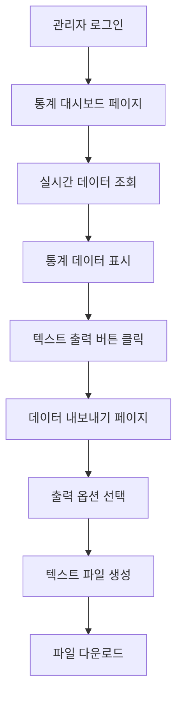

# 관리자 대시보드 통계 텍스트 출력 시스템 PRD

## 1. Product Overview
관리자가 대시보드의 모든 통계 데이터를 실시간으로 조회하고 구조화된 텍스트 파일로 출력할 수 있는 시스템입니다.
- 현재 0으로 표시되는 통계 데이터를 실제 데이터베이스에서 정확히 조회하여 관리자에게 제공
- 데이터 분석 및 보고서 작성을 위한 텍스트 파일 다운로드 기능 제공

## 2. Core Features

### 2.1 User Roles
| Role | Registration Method | Core Permissions |
|------|---------------------|------------------|
| 관리자 | 기존 관리자 계정 | 모든 통계 데이터 조회, 텍스트 파일 다운로드 |

### 2.2 Feature Module
관리자 대시보드 통계 텍스트 출력 시스템은 다음 주요 페이지로 구성됩니다:
1. **통계 대시보드 페이지**: 실시간 통계 데이터 표시, 텍스트 출력 버튼
2. **데이터 내보내기 페이지**: 통계 데이터 선택, 파일 형식 설정, 다운로드 실행

### 2.3 Page Details
| Page Name | Module Name | Feature description |
|-----------|-------------|---------------------|
| 통계 대시보드 페이지 | 실시간 통계 표시 | 평균 로그인 수, 검색 수, 리포트 생성 수 등 모든 통계 데이터를 실시간으로 조회하여 표시 |
| 통계 대시보드 페이지 | 전환율 계산 | 로그인→리포트 전환율, 검색→리포트 전환율 자동 계산 및 표시 |
| 통계 대시보드 페이지 | 사용자 분포 분석 | 무료회원/유료회원 분포, 활성 사용자 비율 분석 |
| 통계 대시보드 페이지 | 키워드 및 리포트 패턴 | 전체 회원의 키워드 사용 패턴, 리포트 생성 패턴 분석 |
| 데이터 내보내기 페이지 | 텍스트 파일 생성 | 조회된 통계 데이터를 구조화된 텍스트 형식으로 변환 |
| 데이터 내보내기 페이지 | 파일 다운로드 | 생성된 텍스트 파일을 관리자 로컬 시스템으로 다운로드 |
| 데이터 내보내기 페이지 | 데이터 필터링 | 특정 기간, 사용자 그룹별 통계 데이터 선택적 출력 |

## 3. Core Process

**관리자 통계 조회 및 출력 Flow**
1. 관리자가 통계 대시보드 페이지 접속
2. 시스템이 Supabase 데이터베이스에서 실시간 통계 데이터 조회
3. 조회된 데이터를 대시보드에 표시 (평균값, 비율, 전환율 등)
4. 관리자가 "텍스트 파일 출력" 버튼 클릭
5. 데이터 내보내기 페이지로 이동
6. 출력할 데이터 범위 및 형식 선택
7. 텍스트 파일 생성 및 다운로드 실행

## 4. User Interface Design

### 4.1 Design Style
- **Primary Color**: #2563eb (파란색) - 신뢰성과 전문성 표현
- **Secondary Color**: #64748b (회색) - 데이터 표시용
- **Accent Color**: #10b981 (녹색) - 성공/완료 상태 표시
- **Button Style**: 둥근 모서리, 그림자 효과가 있는 현대적 스타일
- **Font**: Inter, 14px-16px 기본 크기, 데이터 표시용 모노스페이스 폰트
- **Layout Style**: 카드 기반 레이아웃, 좌측 네비게이션
- **Icon Style**: Heroicons 또는 Lucide 아이콘 세트 사용

### 4.2 Page Design Overview
| Page Name | Module Name | UI Elements |
|-----------|-------------|-------------|
| 통계 대시보드 페이지 | 실시간 통계 표시 | 그리드 레이아웃의 통계 카드들, 각 카드는 제목, 수치, 비율을 포함. 배경색 #f8fafc, 테두리 #e2e8f0 |
| 통계 대시보드 페이지 | 텍스트 출력 버튼 | 우측 상단에 위치한 파란색 버튼, "📄 텍스트 파일 출력" 텍스트와 다운로드 아이콘 |
| 데이터 내보내기 페이지 | 옵션 선택 패널 | 체크박스 그룹으로 출력할 데이터 선택, 날짜 범위 선택기, 파일명 입력 필드 |
| 데이터 내보내기 페이지 | 미리보기 영역 | 생성될 텍스트 파일의 내용을 미리 보여주는 코드 블록 스타일 영역 |
| 데이터 내보내기 페이지 | 다운로드 버튼 | 중앙 하단에 위치한 큰 녹색 버튼, "⬇️ 텍스트 파일 다운로드" 텍스트 |

### 4.3 Responsiveness
데스크톱 우선 설계로, 관리자 업무 특성상 모바일 최적화는 고려하지 않음. 최소 1024px 이상의 화면에서 최적화된 경험 제공.