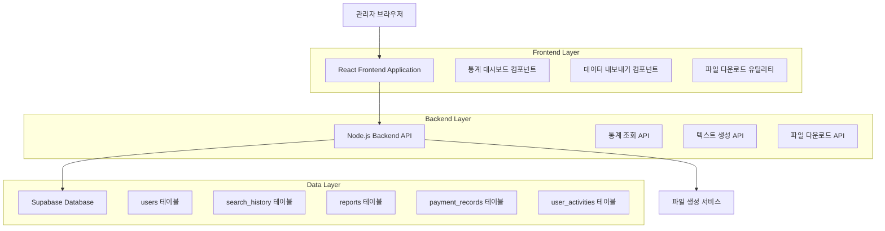
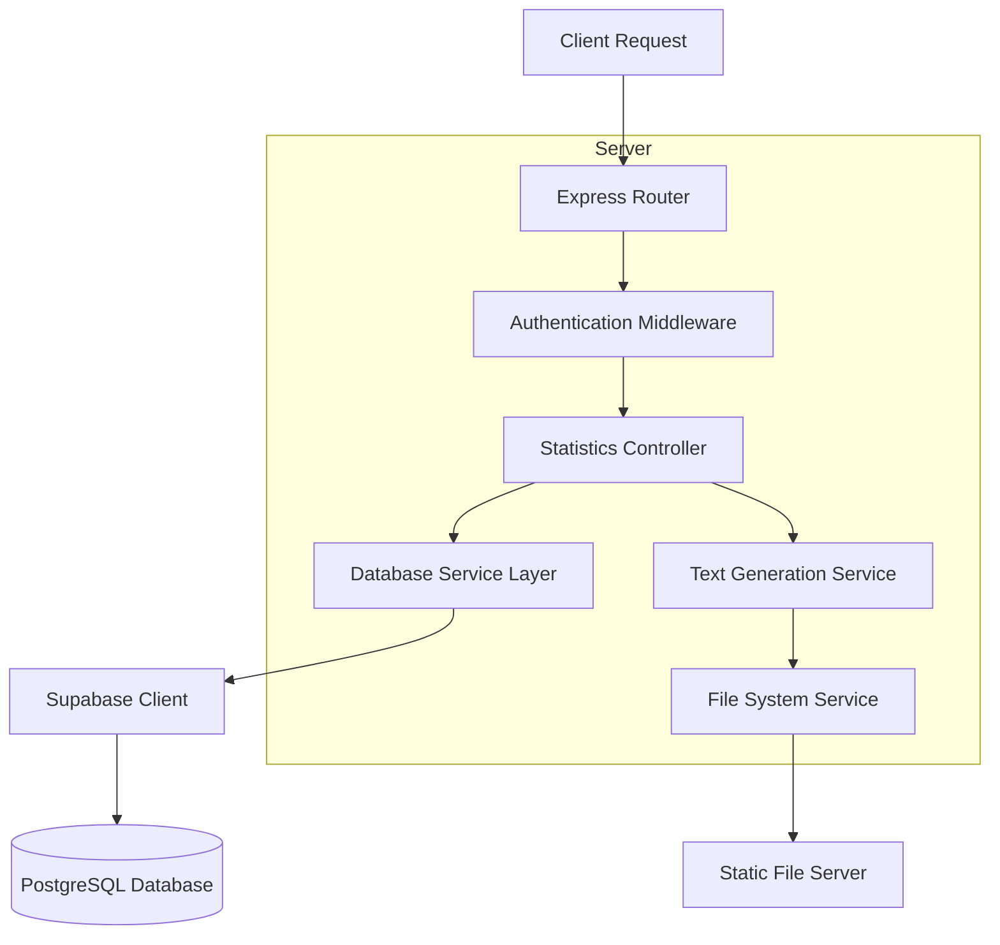
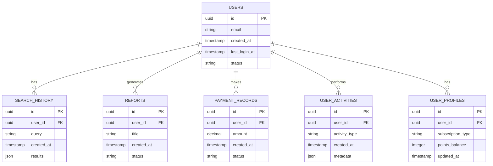

# 관리자 대시보드 통계 텍스트 출력 시스템 기술 아키텍처

## 1. Architecture design



## 2. Technology Description
- Frontend: React@18 + TypeScript + TailwindCSS@3 + Vite
- Backend: Node.js + Express@4
- Database: Supabase (PostgreSQL)
- File Processing: Node.js fs module + text formatting utilities

## 3. Route definitions
| Route | Purpose |
|-------|---------|
| /admin/dashboard/stats | 통계 대시보드 페이지, 실시간 통계 데이터 표시 |
| /admin/dashboard/export | 데이터 내보내기 페이지, 텍스트 파일 생성 및 다운로드 |

## 4. API definitions

### 4.1 Core API

통계 데이터 조회
```
GET /api/admin/dashboard/statistics
```

Request:
| Param Name | Param Type | isRequired | Description |
|------------|------------|------------|-------------|
| startDate | string | false | 조회 시작 날짜 (YYYY-MM-DD) |
| endDate | string | false | 조회 종료 날짜 (YYYY-MM-DD) |
| userType | string | false | 사용자 유형 필터 (all, free, premium) |

Response:
| Param Name | Param Type | Description |
|------------|------------|-------------|
| totalUsers | number | 총 회원 수 |
| totalLogins | number | 총 로그인 수 |
| totalSearches | number | 총 검색 수 |
| totalReports | number | 총 리포트 수 |
| avgLoginsPerUser | number | 사용자당 평균 로그인 수 |
| avgSearchesPerUser | number | 사용자당 평균 검색 수 |
| avgReportsPerUser | number | 사용자당 평균 리포트 수 |
| loginToReportRate | number | 로그인→리포트 전환율 (%) |
| searchToReportRate | number | 검색→리포트 전환율 (%) |
| freeUsers | number | 무료 회원 수 |
| premiumUsers | number | 유료 회원 수 |
| keywordPatterns | object | 키워드 사용 패턴 분석 |
| reportPatterns | object | 리포트 생성 패턴 분석 |

Example Response:
```json
{
  "success": true,
  "data": {
    "totalUsers": 15,
    "totalLogins": 45,
    "totalSearches": 131,
    "totalReports": 8,
    "avgLoginsPerUser": 3.0,
    "avgSearchesPerUser": 8.7,
    "avgReportsPerUser": 0.5,
    "loginToReportRate": 17.8,
    "searchToReportRate": 6.1,
    "freeUsers": 15,
    "premiumUsers": 0,
    "keywordPatterns": {
      "topKeywords": ["특허", "검색", "분석"],
      "totalKeywords": 45
    },
    "reportPatterns": {
      "dailyAverage": 0.3,
      "peakHours": [14, 15, 16]
    }
  }
}
```

텍스트 파일 생성 및 다운로드
```
POST /api/admin/dashboard/export-text
```

Request:
| Param Name | Param Type | isRequired | Description |
|------------|------------|------------|-------------|
| includeStats | array | true | 포함할 통계 항목 배열 |
| dateRange | object | false | 날짜 범위 객체 |
| fileName | string | false | 생성할 파일명 |
| format | string | false | 출력 형식 (detailed, summary) |

Response:
| Param Name | Param Type | Description |
|------------|------------|-------------|
| downloadUrl | string | 생성된 파일 다운로드 URL |
| fileName | string | 생성된 파일명 |
| fileSize | number | 파일 크기 (bytes) |

Example Request:
```json
{
  "includeStats": ["users", "searches", "reports", "conversions"],
  "dateRange": {
    "start": "2024-01-01",
    "end": "2024-12-31"
  },
  "fileName": "dashboard_stats_2024",
  "format": "detailed"
}
```

## 5. Server architecture diagram



## 6. Data model

### 6.1 Data model definition



### 6.2 Data Definition Language

통계 조회를 위한 뷰 생성
```sql
-- 사용자 통계 뷰
CREATE OR REPLACE VIEW user_statistics AS
SELECT 
    COUNT(*) as total_users,
    COUNT(CASE WHEN last_login_at IS NOT NULL THEN 1 END) as users_with_login,
    COUNT(CASE WHEN status = 'active' THEN 1 END) as active_users
FROM auth.users;

-- 검색 통계 뷰  
CREATE OR REPLACE VIEW search_statistics AS
SELECT 
    COUNT(*) as total_searches,
    COUNT(DISTINCT user_id) as users_with_searches,
    AVG(searches_per_user) as avg_searches_per_user
FROM (
    SELECT user_id, COUNT(*) as searches_per_user
    FROM search_history 
    GROUP BY user_id
) subquery;

-- 리포트 통계 뷰
CREATE OR REPLACE VIEW report_statistics AS
SELECT 
    COUNT(*) as total_reports,
    COUNT(DISTINCT user_id) as users_with_reports,
    AVG(reports_per_user) as avg_reports_per_user
FROM (
    SELECT user_id, COUNT(*) as reports_per_user
    FROM reports 
    WHERE status = 'completed'
    GROUP BY user_id
) subquery;

-- 결제 통계 뷰
CREATE OR REPLACE VIEW payment_statistics AS
SELECT 
    COUNT(*) as total_payments,
    SUM(amount) as total_revenue,
    COUNT(DISTINCT user_id) as paying_users
FROM payment_records 
WHERE status = 'completed';

-- 사용자 프로필 통계 뷰
CREATE OR REPLACE VIEW profile_statistics AS
SELECT 
    COUNT(CASE WHEN subscription_type = 'free' THEN 1 END) as free_users,
    COUNT(CASE WHEN subscription_type = 'premium' THEN 1 END) as premium_users,
    SUM(points_balance) as total_points
FROM user_profiles;

-- 통계 데이터 조회 함수
CREATE OR REPLACE FUNCTION get_dashboard_statistics(
    start_date DATE DEFAULT NULL,
    end_date DATE DEFAULT NULL
)
RETURNS JSON AS $$
DECLARE
    result JSON;
BEGIN
    SELECT json_build_object(
        'users', (SELECT row_to_json(user_statistics.*) FROM user_statistics),
        'searches', (SELECT row_to_json(search_statistics.*) FROM search_statistics),
        'reports', (SELECT row_to_json(report_statistics.*) FROM report_statistics),
        'payments', (SELECT row_to_json(payment_statistics.*) FROM payment_statistics),
        'profiles', (SELECT row_to_json(profile_statistics.*) FROM profile_statistics),
        'generated_at', NOW()
    ) INTO result;
    
    RETURN result;
END;
$$ LANGUAGE plpgsql;

-- 권한 설정
GRANT SELECT ON user_statistics TO authenticated;
GRANT SELECT ON search_statistics TO authenticated;
GRANT SELECT ON report_statistics TO authenticated;
GRANT SELECT ON payment_statistics TO authenticated;
GRANT SELECT ON profile_statistics TO authenticated;
GRANT EXECUTE ON FUNCTION get_dashboard_statistics TO authenticated;
```