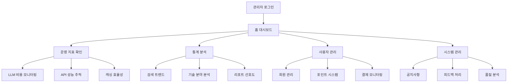

# 관리자 대시보드 통합 시스템 PRD

## 1. Product Overview

Patent-AI 서비스의 운영 효율성과 사용자 관리를 위한 종합적인 관리자 대시보드 시스템입니다. 실시간 모니터링, 포인트 시스템 관리, 결제 추적, 그리고 시장 인텔리전스 분석을 통합하여 제공합니다.

- **핵심 목적**: 서비스 운영 비용 최적화, 사용자 경험 품질 관리, 수익 모델 안정성 확보
- **대상 사용자**: 시스템 관리자, 운영팀, 비즈니스 분석팀
- **시장 가치**: 데이터 기반 의사결정을 통한 운영 효율성 극대화 및 수익성 개선

## 2. Core Features

### 2.1 User Roles

| Role | Registration Method | Core Permissions |
|------|---------------------|------------------|
| Super Admin | 시스템 직접 등록 | 모든 모듈 접근, 사용자 관리, 시스템 설정 변경 |
| Operations Manager | Super Admin 초대 | 운영 모니터링, 비용 관리, API 성능 추적 |
| Business Analyst | Super Admin 초대 | 시장 분석, 사용자 통계, 리포트 품질 분석 |
| Customer Support | Super Admin 초대 | 사용자 관리, 포인트 거래 내역, 피드백 관리 |

### 2.2 Feature Module

관리자 대시보드는 다음 4개의 핵심 페이지로 구성됩니다:

1. **홈 (운영 효율 및 비용 통제)**: 실시간 운영 지표, LLM 비용 모니터링, API 성능 추적
2. **통계 (시장 인텔리전스)**: 검색 트렌드 분석, 기술 분야별 분포, 리포트 선호도 분석
3. **사용자 관리 (User & Billing Control)**: 회원 관리, 포인트 시스템, 결제 모니터링
4. **시스템 관리 (System & Communication)**: 공지사항 관리, 피드백 처리, 시스템 알림

### 2.3 Page Details

| Page Name | Module Name | Feature Description |
|-----------|-------------|---------------------|
| 홈 | LLM 비용 및 사용량 | Gemini 토큰 사용량 실시간 추적, 일일/월간 비용 분석, 비용 임계값 알림 설정 |
| 홈 | API 성능 모니터링 | KIPRIS/Gemini API 응답시간 측정, 오류율 실시간 표시, 성능 저하 알림 |
| 홈 | 캐싱 효율성 분석 | 캐시 히트율 추적, 비용 절감 효과 계산, 캐시 정책 최적화 제안 |
| 통계 | 검색 키워드 분석 | Top 10 검색어 순위, 주간 성장률 계산, 트렌드 변화 시각화 |
| 통계 | 기술 분야별 분포 | IPC/CPC 코드별 분석 건수, 산업 섹터 집중도 분석, 도넛 차트 시각화 |
| 통계 | 리포트 유형 선호도 | 시장분석 vs 비즈니스 인사이트 생성 비율, 사용자 선호도 트렌드 분석 |
| 통계 | 인기 특허 분석 | 가장 많이 분석된 특허 목록, 업계 관심사 파악, 경쟁 구도 분석 |
| 사용자 관리 | 회원 목록 관리 | 사용자 검색/정렬, 구독 상태 변경, 포인트 수동 조정, 계정 상태 관리 |
| 사용자 관리 | 수익 지표 추적 | MRR 계산, Churn Rate 분석, 수익 성장률 모니터링, 예측 분석 |
| 사용자 관리 | 결제 위험 관리 | 결제 실패 알림, 카드 만료 예정 사용자, 이탈 위험 사용자 식별 |
| 사용자 관리 | 포인트 거래 내역 | 사용자별 포인트 충전/차감/소멸 추적, 만료 예정 포인트 알림, 거래 상세 조회 |
| 시스템 관리 | 공지사항 관리 | 시스템 메시지 생성/편집, 예약 발송, 사용자 그룹별 타겟팅 |
| 시스템 관리 | 피드백 관리 | Contact Us 접수 내역, 처리 상태 추적, 사용자 회신 기능 |
| 시스템 관리 | 리포트 품질 분석 | 사용자 만족도 통계, 별점 평가 분석, LLM 프롬프트 개선 제안 |

## 3. Core Process

### Admin 운영 Flow
관리자는 대시보드 로그인 후 홈에서 전체 운영 상태를 확인하고, 각 모듈별로 세부 관리 작업을 수행합니다. 비용 임계값 초과나 시스템 오류 발생 시 실시간 알림을 받아 즉시 대응할 수 있습니다.

### 포인트 시스템 관리 Flow
신규 사용자 가입 시 3,000포인트 자동 지급, 매월 1,500포인트 정기 지급, 추가 충전 시 3개월 만료 기한 설정 등의 복잡한 포인트 로직을 관리자가 모니터링하고 수동 조정할 수 있습니다.



## 4. User Interface Design

### 4.1 Design Style

- **Primary Colors**: #1f2937 (Dark Gray), #3b82f6 (Blue)
- **Secondary Colors**: #f8fafc (Light Gray), #10b981 (Green), #ef4444 (Red)
- **Button Style**: 미니멀 라운드 버튼, 호버 시 subtle shadow 효과
- **Font**: Inter 폰트, 제목 600-700 weight, 본문 400-500 weight
- **Layout Style**: 고정 사이드바 + 카드 기반 모듈, 넓은 여백과 저대비 배경
- **Icon Style**: Heroicons 또는 Lucide React, 일관된 선 굵기와 크기

### 4.2 Page Design Overview

| Page Name | Module Name | UI Elements |
|-----------|-------------|-------------|
| 홈 | LLM 비용 모니터링 | KPI 카드 (토큰 사용량, 일일 비용), 라인 차트 (누적 비용), 알림 배지 |
| 홈 | API 성능 추적 | 실시간 상태 인디케이터 (Green/Yellow/Red), 평균 응답시간 게이지, 오류율 백분율 |
| 홈 | 캐싱 효율성 | 원형 프로그레스 바 (히트율), 절감 비용 KPI 카드, 효율성 트렌드 차트 |
| 통계 | 검색 트렌드 | 순위 테이블 (검색어, 횟수, 성장률), 트렌드 라인 차트, 필터링 옵션 |
| 통계 | 기술 분야 분포 | 도넛 차트 (IPC/CPC 분포), 범례 테이블, 상세 드릴다운 기능 |
| 통계 | 리포트 선호도 | 막대 차트 (유형별 비율), 시간별 트렌드, 사용자 세그먼트 분석 |
| 사용자 관리 | 회원 목록 | 검색/정렬 가능한 데이터 테이블, 상태 배지, 액션 버튼 (편집/비활성화) |
| 사용자 관리 | 수익 지표 | MRR/Churn Rate KPI 카드, 수익 성장 차트, 예측 분석 그래프 |
| 사용자 관리 | 포인트 거래 | 거래 내역 테이블, 만료 예정 알림, 포인트 유형별 필터링 |
| 시스템 관리 | 공지사항 관리 | 메시지 에디터 (Rich Text), 예약 발송 캘린더, 타겟 그룹 선택기 |
| 시스템 관리 | 피드백 관리 | 티켓 목록 테이블, 상태 변경 드롭다운, 회신 작성 모달 |

### 4.3 Responsiveness

- **Desktop-first 설계**: 1920x1080 해상도 최적화
- **Tablet 적응**: 1024px 이하에서 사이드바 축소, 카드 레이아웃 조정
- **Mobile 지원**: 768px 이하에서 햄버거 메뉴, 스택형 레이아웃 전환
- **Touch 최적화**: 버튼 최소 44px 크기, 스와이프 제스처 지원

## 5. Enhanced Point System Specifications

### 5.1 포인트 지급 정책

| 포인트 유형 | 지급량 | 만료 기한 | 지급 조건 |
|-------------|--------|-----------|-----------|
| 신규 가입 보너스 | 3,000P | 3개월 | 첫 회원가입 시 1회만 |
| 월간 무료 포인트 | 1,500P | 1개월 | 매월 자동 지급 |
| 정기구독 포인트 | 구독별 상이 | 1개월 | 구독 갱신 시 |
| 추가 충전 포인트 | 충전액별 상이 | 3개월 | 사용자 직접 충전 |

### 5.2 NicePay 결제 시스템 통합

- **Client Key**: R2_6496fd66ebc242b58ab7ef1722c9a92b (Server 승인)
- **Secret Key**: 101d2ae924fa4ae398c3b76a7ba62226 (Basic 인증)
- **결제 방식**: 카드 결제, 계좌이체, 간편결제 지원
- **보안**: SSL 암호화, 토큰 기반 인증, 결제 데이터 암호화 저장

### 5.3 포인트 만료 관리

- **FEFO 방식**: 먼저 만료되는 포인트부터 차감
- **만료 알림**: 7일, 3일, 1일 전 사용자 알림
- **관리자 모니터링**: 만료 예정 포인트 현황, 사용자별 포인트 잔액 추적

## 6. Technical Architecture Requirements

### 6.1 Technology Stack

- **Frontend**: React 18 + TypeScript + Tailwind CSS + Vite
- **Backend**: Supabase (Database + Auth + Real-time)
- **Charts**: Recharts + Tremor UI
- **State Management**: Zustand
- **UI Components**: Headless UI + Custom Components

### 6.2 Database Schema Extensions

```sql
-- 관리자 권한 테이블
CREATE TABLE admin_roles (
  id UUID PRIMARY KEY DEFAULT gen_random_uuid(),
  user_id UUID REFERENCES auth.users(id),
  role VARCHAR(50) NOT NULL,
  permissions JSONB,
  created_at TIMESTAMP WITH TIME ZONE DEFAULT NOW()
);

-- 시스템 메시지 테이블
CREATE TABLE system_messages (
  id UUID PRIMARY KEY DEFAULT gen_random_uuid(),
  title VARCHAR(200) NOT NULL,
  content TEXT NOT NULL,
  target_users JSONB,
  scheduled_at TIMESTAMP WITH TIME ZONE,
  status VARCHAR(20) DEFAULT 'draft',
  created_by UUID REFERENCES auth.users(id),
  created_at TIMESTAMP WITH TIME ZONE DEFAULT NOW()
);

-- 피드백 관리 테이블
CREATE TABLE user_feedback (
  id UUID PRIMARY KEY DEFAULT gen_random_uuid(),
  user_id UUID REFERENCES auth.users(id),
  category VARCHAR(50),
  subject VARCHAR(200),
  message TEXT,
  status VARCHAR(20) DEFAULT 'pending',
  admin_response TEXT,
  responded_by UUID REFERENCES auth.users(id),
  created_at TIMESTAMP WITH TIME ZONE DEFAULT NOW(),
  updated_at TIMESTAMP WITH TIME ZONE DEFAULT NOW()
);

-- 리포트 평가 테이블
CREATE TABLE report_ratings (
  id UUID PRIMARY KEY DEFAULT gen_random_uuid(),
  user_id UUID REFERENCES auth.users(id),
  report_type VARCHAR(50),
  patent_number VARCHAR(100),
  rating INTEGER CHECK (rating >= 1 AND rating <= 5),
  feedback TEXT,
  created_at TIMESTAMP WITH TIME ZONE DEFAULT NOW()
);
```

### 6.3 Real-time Monitoring Requirements

- **WebSocket 연결**: 실시간 지표 업데이트
- **알림 시스템**: 임계값 초과 시 즉시 알림
- **성능 메트릭**: API 응답시간, 오류율, 사용량 추적
- **비용 모니터링**: LLM 토큰 사용량 실시간 계산

## 7. Security & Compliance

### 7.1 접근 권한 관리

- **Role-based Access Control**: 역할별 세분화된 권한 설정
- **IP 제한**: 관리자 접속 IP 화이트리스트
- **세션 관리**: 자동 로그아웃, 동시 접속 제한
- **감사 로그**: 모든 관리자 활동 기록

### 7.2 데이터 보안

- **개인정보 보호**: 사용자 데이터 마스킹, 최소 권한 원칙
- **결제 정보 보안**: PCI DSS 준수, 토큰화 저장
- **백업 및 복구**: 일일 자동 백업, 재해 복구 계획

이 PRD는 Patent-AI 서비스의 운영 효율성과 사용자 만족도를 극대화하기 위한 종합적인 관리자 대시보드 시스템의 청사진을 제공합니다.