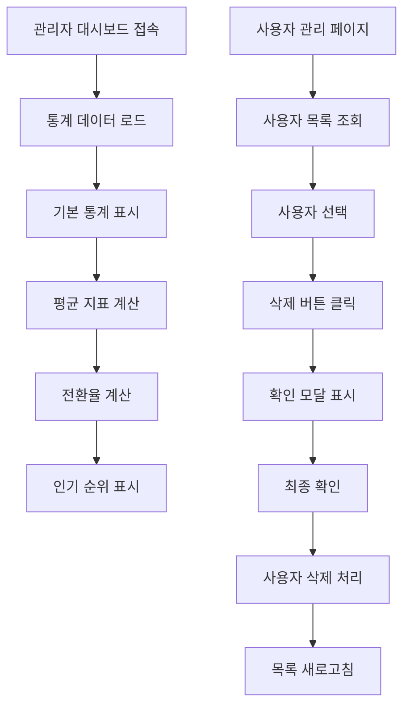

# 관리자 대시보드 확장 및 사용자 관리 기능 개선 PRD

## 1. Product Overview

기존 관리자 대시보드에 상세한 사용자 활동 통계와 분석 기능을 추가하여 관리자가 시스템 운영 현황을 더욱 정확하게 파악할 수 있도록 개선합니다. 또한 사용자 관리 기능의 안정성을 향상시켜 효율적인 사용자 관리를 지원합니다.

- 관리자가 사용자 행동 패턴과 시스템 사용률을 정확히 분석할 수 있도록 상세 통계 제공
- 사용자 삭제 기능의 안정성 개선으로 관리자 업무 효율성 향상

## 2. Core Features

### 2.1 User Roles

| Role | Registration Method | Core Permissions |
|------|---------------------|------------------|
| 시스템 관리자 | 기존 관리자 계정 | 모든 통계 조회, 사용자 관리, 시스템 설정 |

### 2.2 Feature Module

관리자 대시보드 확장 요구사항은 다음과 같은 주요 페이지로 구성됩니다:

1. **확장된 관리자 대시보드**: 상세 통계 카드, 사용자 활동 분석, 전환율 지표, 인기 검색어/특허 순위
2. **개선된 사용자 관리 페이지**: 안정적인 사용자 삭제 기능, 사용자 상태 관리

### 2.3 Page Details

| Page Name | Module Name | Feature description |
|-----------|-------------|---------------------|
| 확장된 관리자 대시보드 | 기본 통계 카드 | 총 사용자, 총 로그인수, 총 검색수, 총 리포트 생성수 표시 |
| 확장된 관리자 대시보드 | 평균 지표 카드 | 인당 평균 로그인수, 인당 평균 검색수, 인당 평균 리포트 생성수 계산 및 표시 |
| 확장된 관리자 대시보드 | 전환율 지표 카드 | 로그인→리포트 생성 전환율, 검색→리포트 생성 전환율 계산 및 표시 |
| 확장된 관리자 대시보드 | 인기 검색어 순위 | 상위 10개 검색어를 빈도순으로 표시, 검색 횟수 포함 |
| 확장된 관리자 대시보드 | 인기 특허 순위 | 상위 10개 분석된 특허를 분석 횟수순으로 표시, 특허 번호 및 제목 포함 |
| 개선된 사용자 관리 페이지 | 사용자 삭제 기능 | 사용자 선택, 삭제 확인 모달, 안전한 삭제 처리, 오류 핸들링 |

## 3. Core Process

### 관리자 통계 조회 Flow
관리자가 대시보드에 접속하면 자동으로 모든 통계 데이터를 로드하고 실시간으로 업데이트합니다. 기간 선택 기능을 통해 원하는 기간의 데이터를 조회할 수 있습니다.

### 사용자 삭제 Flow
관리자가 사용자 관리 페이지에서 사용자를 선택하고 삭제 버튼을 클릭하면, 확인 모달이 표시되고 최종 확인 후 안전하게 사용자를 삭제합니다.

## 4. User Interface Design

### 4.1 Design Style

- **Primary Colors**: Blue (#3B82F6), Green (#10B981), Red (#EF4444)
- **Secondary Colors**: Gray (#6B7280), Purple (#8B5CF6), Orange (#F59E0B)
- **Button Style**: 둥근 모서리 (rounded-md), 호버 효과 포함
- **Font**: Inter, system-ui, sans-serif / 기본 14px, 제목 18-24px
- **Layout Style**: 카드 기반 레이아웃, 그리드 시스템 활용
- **Icons**: Heroicons 라이브러리 사용

### 4.2 Page Design Overview

| Page Name | Module Name | UI Elements |
|-----------|-------------|-------------|
| 확장된 관리자 대시보드 | 통계 카드 그리드 | 4x3 그리드 레이아웃, 각 카드는 아이콘, 제목, 수치, 변화율 포함 |
| 확장된 관리자 대시보드 | 순위 테이블 | 2열 레이아웃, 검색어/특허 순위를 테이블 형태로 표시 |
| 개선된 사용자 관리 페이지 | 삭제 확인 모달 | 중앙 정렬 모달, 경고 아이콘, 확인/취소 버튼 |

### 4.3 Responsiveness

데스크톱 우선 설계로 태블릿과 모바일에서는 카드 그리드가 1-2열로 조정되며, 테이블은 스크롤 가능한 형태로 표시됩니다.