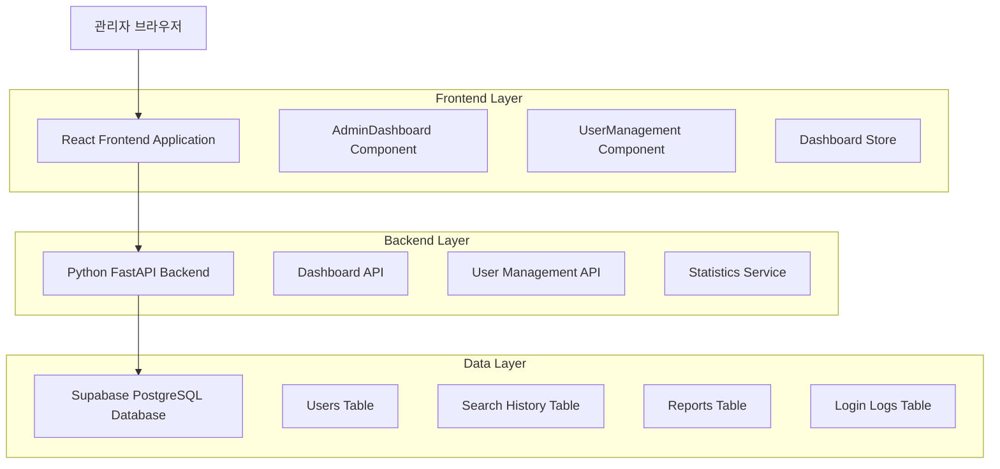
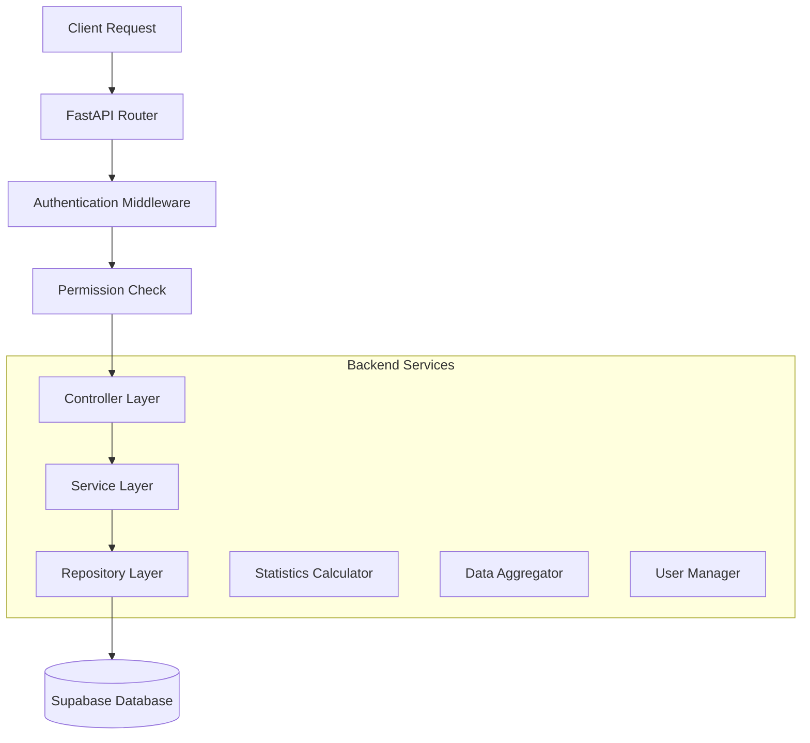
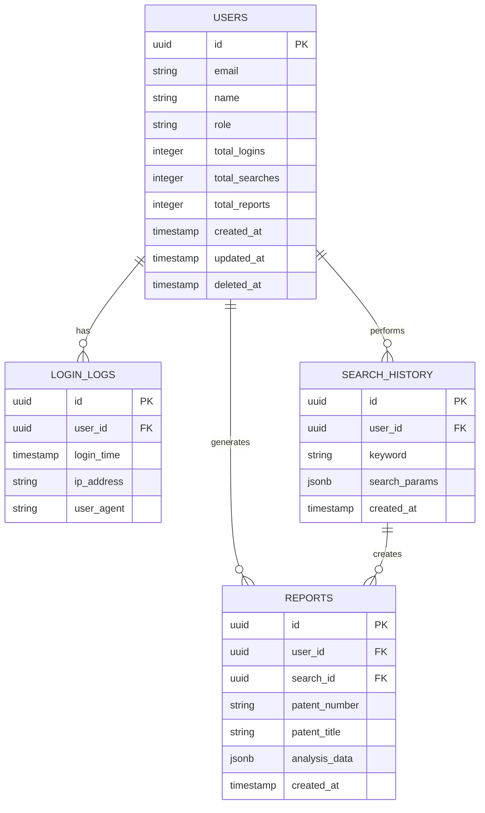

# 관리자 대시보드 확장 기술 아키텍처 문서

## 1. Architecture design



## 2. Technology Description

- Frontend: React@18 + TypeScript + TailwindCSS@3 + Vite
- Backend: Python FastAPI + Pydantic + SQLAlchemy
- Database: Supabase (PostgreSQL)
- State Management: Zustand
- UI Components: Heroicons + Custom Components

## 3. Route definitions

| Route | Purpose |
|-------|---------|
| /admin | 확장된 관리자 대시보드, 상세 통계 및 분석 표시 |
| /admin/users | 개선된 사용자 관리 페이지, 안전한 삭제 기능 포함 |
| /admin/settings | 관리자 설정 페이지 |

## 4. API definitions

### 4.1 Core API

확장된 대시보드 통계 조회
```
GET /api/v1/dashboard/extended-stats
```

Request:
| Param Name | Param Type | isRequired | Description |
|------------|------------|------------|-------------|
| period | string | false | 조회 기간 (1d, 7d, 30d, 90d) |

Response:
| Param Name | Param Type | Description |
|------------|------------|-------------|
| total_users | integer | 총 사용자 수 |
| total_logins | integer | 총 로그인 수 |
| total_searches | integer | 총 검색 수 |
| total_reports | integer | 총 리포트 생성 수 |
| avg_logins_per_user | float | 인당 평균 로그인 수 |
| avg_searches_per_user | float | 인당 평균 검색 수 |
| avg_reports_per_user | float | 인당 평균 리포트 생성 수 |
| login_to_report_conversion | float | 로그인→리포트 전환율 (%) |
| search_to_report_conversion | float | 검색→리포트 전환율 (%) |

인기 검색어 조회
```
GET /api/v1/dashboard/popular-keywords
```

Response:
| Param Name | Param Type | Description |
|------------|------------|-------------|
| keywords | array | 상위 10개 검색어 목록 |
| keyword | string | 검색어 |
| count | integer | 검색 횟수 |

인기 특허 조회
```
GET /api/v1/dashboard/popular-patents
```

Response:
| Param Name | Param Type | Description |
|------------|------------|-------------|
| patents | array | 상위 10개 분석 특허 목록 |
| patent_number | string | 특허 번호 |
| title | string | 특허 제목 |
| analysis_count | integer | 분석 횟수 |

사용자 삭제
```
DELETE /api/v1/users/{user_id}
```

Request:
| Param Name | Param Type | isRequired | Description |
|------------|------------|------------|-------------|
| user_id | string | true | 삭제할 사용자 ID |

Response:
| Param Name | Param Type | Description |
|------------|------------|-------------|
| success | boolean | 삭제 성공 여부 |
| message | string | 결과 메시지 |

## 5. Server architecture diagram



## 6. Data model

### 6.1 Data model definition



### 6.2 Data Definition Language

확장된 통계를 위한 뷰 생성
```sql
-- 대시보드 통계 뷰 생성
CREATE OR REPLACE VIEW dashboard_extended_stats AS
SELECT 
    COUNT(DISTINCT u.id) as total_users,
    COUNT(ll.id) as total_logins,
    COUNT(sh.id) as total_searches,
    COUNT(r.id) as total_reports,
    CASE 
        WHEN COUNT(DISTINCT u.id) > 0 
        THEN ROUND(COUNT(ll.id)::numeric / COUNT(DISTINCT u.id), 2)
        ELSE 0 
    END as avg_logins_per_user,
    CASE 
        WHEN COUNT(DISTINCT u.id) > 0 
        THEN ROUND(COUNT(sh.id)::numeric / COUNT(DISTINCT u.id), 2)
        ELSE 0 
    END as avg_searches_per_user,
    CASE 
        WHEN COUNT(DISTINCT u.id) > 0 
        THEN ROUND(COUNT(r.id)::numeric / COUNT(DISTINCT u.id), 2)
        ELSE 0 
    END as avg_reports_per_user,
    CASE 
        WHEN COUNT(ll.id) > 0 
        THEN ROUND((COUNT(r.id)::numeric / COUNT(ll.id)) * 100, 2)
        ELSE 0 
    END as login_to_report_conversion,
    CASE 
        WHEN COUNT(sh.id) > 0 
        THEN ROUND((COUNT(r.id)::numeric / COUNT(sh.id)) * 100, 2)
        ELSE 0 
    END as search_to_report_conversion
FROM users u
LEFT JOIN login_logs ll ON u.id = ll.user_id
LEFT JOIN search_history sh ON u.id = sh.user_id
LEFT JOIN reports r ON u.id = r.user_id
WHERE u.deleted_at IS NULL;

-- 인기 검색어 뷰 생성
CREATE OR REPLACE VIEW popular_keywords AS
SELECT 
    keyword,
    COUNT(*) as search_count
FROM search_history
WHERE created_at >= NOW() - INTERVAL '30 days'
GROUP BY keyword
ORDER BY search_count DESC
LIMIT 10;

-- 인기 특허 뷰 생성
CREATE OR REPLACE VIEW popular_patents AS
SELECT 
    patent_number,
    patent_title,
    COUNT(*) as analysis_count
FROM reports
WHERE created_at >= NOW() - INTERVAL '30 days'
GROUP BY patent_number, patent_title
ORDER BY analysis_count DESC
LIMIT 10;

-- 사용자 안전 삭제를 위한 함수
CREATE OR REPLACE FUNCTION safe_delete_user(user_id_param UUID)
RETURNS BOOLEAN AS $$
BEGIN
    -- 사용자 존재 확인
    IF NOT EXISTS (SELECT 1 FROM users WHERE id = user_id_param AND deleted_at IS NULL) THEN
        RETURN FALSE;
    END IF;
    
    -- 소프트 삭제 (deleted_at 설정)
    UPDATE users 
    SET deleted_at = NOW(), 
        updated_at = NOW()
    WHERE id = user_id_param;
    
    RETURN TRUE;
END;
$$ LANGUAGE plpgsql;

-- 권한 설정
GRANT SELECT ON dashboard_extended_stats TO authenticated;
GRANT SELECT ON popular_keywords TO authenticated;
GRANT SELECT ON popular_patents TO authenticated;
GRANT EXECUTE ON FUNCTION safe_delete_user(UUID) TO authenticated;
```