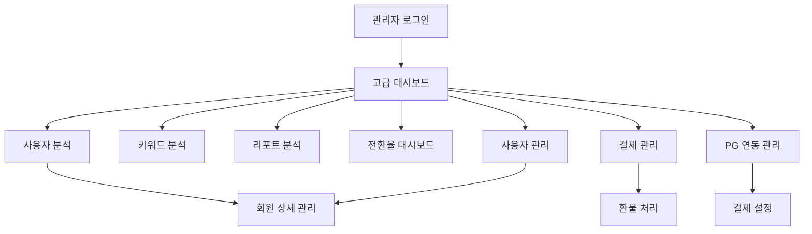

# 관리자 페이지 고급 분석 시스템 PRD

## 1. Product Overview

특허 AI 시스템의 관리자 페이지를 고급 데이터 분석 및 사용자 관리 기능으로 업그레이드하여, 데이터 기반 의사결정과 비즈니스 최적화를 지원하는 종합 관리 플랫폼을 구축합니다.

사용자 행동 패턴 분석, 전환율 추적, 키워드 및 리포트 분석을 통해 서비스 품질 향상과 수익 최적화를 달성하며, PG사 연동을 통한 통합 결제 관리 시스템을 제공합니다.

## 2. Core Features

### 2.1 User Roles

| Role | Registration Method | Core Permissions |
|------|---------------------|------------------|
| Super Admin | 시스템 직접 생성 | 모든 기능 접근, 시스템 설정 관리 |
| Admin Manager | Super Admin 초대 | 사용자 관리, 분석 데이터 조회, 결제 관리 |
| Analytics Viewer | Admin Manager 초대 | 분석 데이터 조회만 가능 |

### 2.2 Feature Module

관리자 페이지 고급 분석 시스템은 다음 주요 페이지들로 구성됩니다:

1. **고급 대시보드**: 핵심 지표 요약, 실시간 통계, 전환율 분석
2. **사용자 분석**: 회원 통계, 행동 패턴, 평균 활동 지표
3. **키워드 분석**: 검색 키워드 트렌드, 인기 키워드, 키워드 성과 분석
4. **리포트 분석**: 리포트 생성 패턴, 카테고리별 분석, 품질 지표
5. **전환율 대시보드**: 로그인-리포트 전환율, 검색-리포트 전환율
6. **사용자 관리**: 회원 상세 정보, 활동 이력, 구독 관리
7. **결제 관리**: 결제 내역, 수익 분석, 환불 처리
8. **PG 연동 관리**: 결제 게이트웨이 설정, 결제 방법 관리

### 2.3 Page Details

| Page Name | Module Name | Feature description |
|-----------|-------------|---------------------|
| 고급 대시보드 | 핵심 지표 요약 | 총 회원수, 평균 로그인/검색/리포트 생성 수, 실시간 활성 사용자 표시 |
| 고급 대시보드 | 전환율 위젯 | 로그인→리포트, 검색→리포트 전환율을 시각적 차트로 표시 |
| 고급 대시보드 | 사용자 분포 | 무료회원 vs 정기구독회원 비율을 도넛 차트로 표시 |
| 사용자 분석 | 회원 통계 | 신규 가입, 활성 사용자, 이탈률 등 주요 지표 분석 |
| 사용자 분석 | 행동 패턴 | 시간대별, 요일별 사용자 활동 패턴 히트맵 |
| 사용자 분석 | 평균 활동 지표 | 회원당 평균 로그인/검색/리포트 생성 수 계산 및 표시 |
| 키워드 분석 | 인기 키워드 | 검색 빈도 기준 상위 키워드 랭킹 및 트렌드 |
| 키워드 분석 | 키워드 성과 | 키워드별 리포트 생성률, 성공률 분석 |
| 키워드 분석 | 검색 트렌드 | 시간별, 월별 키워드 검색 패턴 분석 |
| 리포트 분석 | 생성 패턴 | 리포트 생성 시간대, 카테고리별 분포 분석 |
| 리포트 분석 | 품질 지표 | 리포트 완성도, 사용자 만족도, 재생성률 분석 |
| 리포트 분석 | 카테고리 분석 | 특허 분야별 리포트 생성 현황 및 성과 |
| 전환율 대시보드 | 로그인 전환율 | 로그인 대비 리포트 생성 전환율 추적 및 개선 제안 |
| 전환율 대시보드 | 검색 전환율 | 검색 대비 리포트 생성 전환율 분석 및 최적화 |
| 전환율 대시보드 | 퍼널 분석 | 사용자 여정별 이탈 지점 및 개선 포인트 식별 |
| 사용자 관리 | 회원 목록 | 전체 회원 검색, 필터링, 정렬 기능 |
| 사용자 관리 | 회원 상세 | 개별 회원 활동 이력, 결제 내역, 포인트 관리 |
| 사용자 관리 | 구독 관리 | 구독 상태 변경, 플랜 업그레이드/다운그레이드 |
| 결제 관리 | 결제 내역 | 전체 결제 거래 내역 조회 및 상태 관리 |
| 결제 관리 | 수익 분석 | 월별/연별 수익 추이, 플랜별 수익 분석 |
| 결제 관리 | 환불 처리 | 환불 요청 처리, 부분 환불, 환불 내역 관리 |
| PG 연동 관리 | 게이트웨이 설정 | 결제 PG사 연동 설정, API 키 관리 |
| PG 연동 관리 | 결제 방법 관리 | 신용카드, 계좌이체, 간편결제 등 결제 수단 설정 |

## 3. Core Process

### Admin Manager Flow
1. 관리자 로그인 → 고급 대시보드에서 핵심 지표 확인
2. 사용자 분석 페이지에서 회원 활동 패턴 분석
3. 키워드/리포트 분석을 통한 서비스 품질 모니터링
4. 전환율 대시보드에서 비즈니스 성과 추적
5. 사용자 관리에서 개별 회원 지원 및 관리
6. 결제 관리에서 수익 현황 및 결제 이슈 처리

### Analytics Viewer Flow
1. 관리자 로그인 → 분석 데이터 조회 권한으로 접근
2. 대시보드 및 분석 페이지에서 데이터 확인
3. 리포트 생성 및 데이터 내보내기

## 4. User Interface Design

### 4.1 Design Style

- **Primary Colors**: #2563eb (파란색), #059669 (초록색)
- **Secondary Colors**: #64748b (회색), #f1f5f9 (연한 회색)
- **Button Style**: 둥근 모서리 (rounded-lg), 그라데이션 효과
- **Font**: Inter, 본문 14px, 제목 18-24px
- **Layout Style**: 카드 기반 레이아웃, 좌측 사이드바 네비게이션
- **Icon Style**: Heroicons, 일관된 선 두께와 스타일

### 4.2 Page Design Overview

| Page Name | Module Name | UI Elements |
|-----------|-------------|-------------|
| 고급 대시보드 | 핵심 지표 카드 | 4x2 그리드 레이아웃, 숫자 강조 타이포그래피, 증감률 표시 |
| 고급 대시보드 | 전환율 차트 | Chart.js 기반 라인/바 차트, 인터랙티브 툴팁 |
| 사용자 분석 | 활동 히트맵 | D3.js 기반 히트맵, 시간대별 색상 그라데이션 |
| 키워드 분석 | 워드 클라우드 | 검색 빈도 기반 크기 조절, 클릭 가능한 키워드 |
| 리포트 분석 | 카테고리 차트 | 도넛 차트, 범례와 퍼센티지 표시 |
| 사용자 관리 | 데이터 테이블 | 정렬, 필터, 페이지네이션 기능, 액션 버튼 |
| 결제 관리 | 수익 대시보드 | 월별 수익 트렌드 차트, KPI 카드 |
| PG 연동 관리 | 설정 폼 | 탭 기반 설정 인터페이스, 실시간 연결 상태 표시 |

### 4.3 Responsiveness

데스크톱 우선 설계로 1920x1080 해상도에 최적화되며, 태블릿(768px 이상)에서도 완전한 기능을 제공합니다. 모바일에서는 핵심 지표 조회만 지원하며, 터치 인터랙션을 고려한 버튼 크기와 간격을 적용합니다.