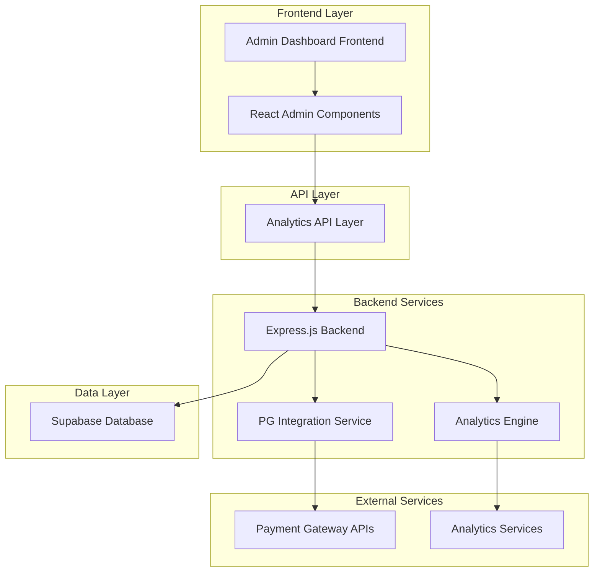
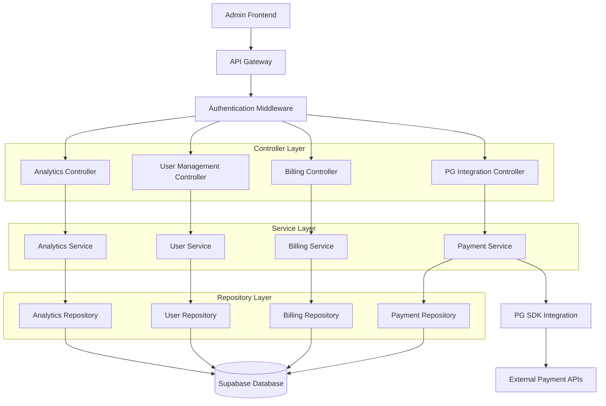
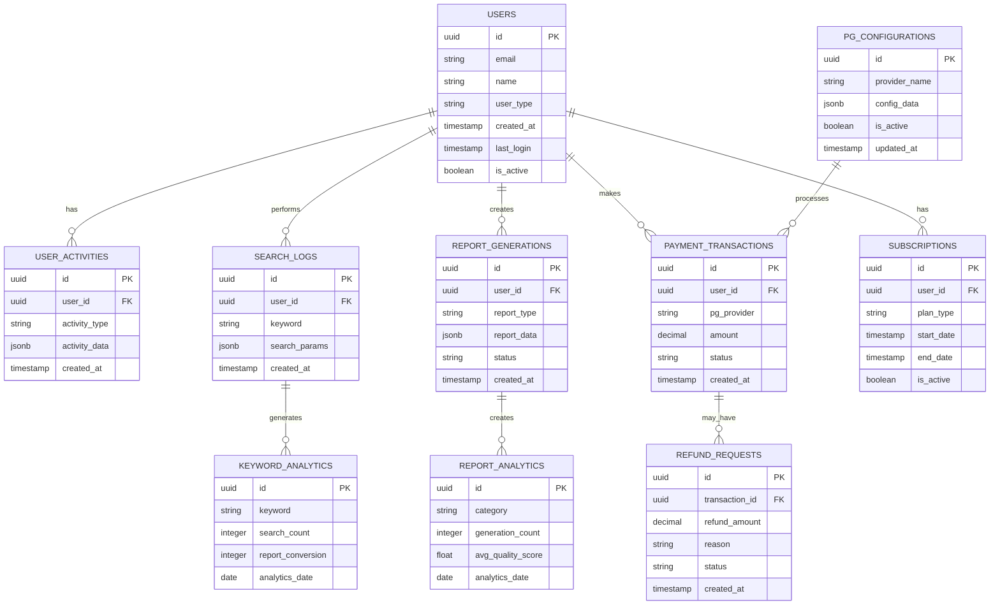

# 관리자 페이지 고급 분석 시스템 기술 아키텍처

## 1. Architecture design



## 2. Technology Description

* Frontend: React\@18 + TypeScript + TailwindCSS\@3 + Vite

* Backend: Express\@4 + Node.js\@18

* Database: Supabase (PostgreSQL)

* Charts: Chart.js + D3.js

* State Management: Zustand

* Authentication: Supabase Auth + JWT

* Payment: PG사 SDK (NicePay, KakaoPay, TossPay)

## 3. Route definitions

| Route                       | Purpose                      |
| --------------------------- | ---------------------------- |
| /admin                      | 관리자 메인 대시보드, 핵심 지표 및 전환율 표시  |
| /admin/analytics/users      | 사용자 분석 페이지, 회원 통계 및 행동 패턴    |
| /admin/analytics/keywords   | 키워드 분석 페이지, 검색 트렌드 및 성과 분석   |
| /admin/analytics/reports    | 리포트 분석 페이지, 생성 패턴 및 품질 지표    |
| /admin/analytics/conversion | 전환율 대시보드, 로그인/검색 전환율 분석      |
| /admin/users                | 사용자 관리 페이지, 회원 목록 및 상세 관리    |
| /admin/users/:id            | 개별 사용자 상세 페이지, 활동 이력 및 구독 관리 |
| /admin/billing              | 결제 관리 페이지, 결제 내역 및 수익 분석     |
| /admin/billing/refunds      | 환불 관리 페이지, 환불 요청 처리          |
| /admin/payments/gateway     | PG 연동 관리 페이지, 결제 게이트웨이 설정    |
| /admin/settings             | 시스템 설정 페이지, 관리자 권한 및 시스템 구성  |

## 4. API definitions

### 4.1 Core API

#### 고급 분석 데이터 조회

```
GET /api/admin/analytics/overview
```

Response:

| Param Name         | Param Type | Description                |
| ------------------ | ---------- | -------------------------- |
| totalUsers         | number     | 전체 회원 수                    |
| avgLogins          | number     | 평균 로그인 수 (총 로그인 / 총 회원)    |
| avgSearches        | number     | 평균 검색 수 (총 검색 / 총 회원)      |
| avgReports         | number     | 평균 리포트 생성 수 (총 리포트 / 총 회원) |
| loginToReportRate  | number     | 로그인→리포트 전환율 (%)            |
| searchToReportRate | number     | 검색→리포트 전환율 (%)             |
| userDistribution   | object     | 무료/유료 회원 분포                |

#### 사용자 행동 패턴 분석

```
GET /api/admin/analytics/user-patterns
```

Request:

| Param Name | Param Type | isRequired | Description                 |
| ---------- | ---------- | ---------- | --------------------------- |
| period     | string     | false      | 분석 기간 (7d, 30d, 90d)        |
| userType   | string     | false      | 사용자 타입 (free, premium, all) |

Response:

| Param Name     | Param Type | Description   |
| -------------- | ---------- | ------------- |
| hourlyActivity | array      | 시간대별 활동 패턴    |
| dailyActivity  | array      | 요일별 활동 패턴     |
| userJourney    | array      | 사용자 여정 분석 데이터 |

#### 키워드 분석 데이터

```
GET /api/admin/analytics/keywords
```

Response:

| Param Name         | Param Type | Description |
| ------------------ | ---------- | ----------- |
| topKeywords        | array      | 인기 키워드 순위   |
| keywordTrends      | array      | 키워드 트렌드 데이터 |
| keywordPerformance | array      | 키워드별 성과 지표  |

#### 리포트 분석 데이터

```
GET /api/admin/analytics/reports
```

Response:

| Param Name         | Param Type | Description |
| ------------------ | ---------- | ----------- |
| generationPatterns | array      | 리포트 생성 패턴   |
| categoryAnalysis   | array      | 카테고리별 분석    |
| qualityMetrics     | object     | 품질 지표       |

#### 사용자 관리

```
GET /api/admin/users
```

Request:

| Param Name | Param Type | isRequired | Description                       |
| ---------- | ---------- | ---------- | --------------------------------- |
| page       | number     | false      | 페이지 번호                            |
| limit      | number     | false      | 페이지당 항목 수                         |
| search     | string     | false      | 검색 키워드                            |
| filter     | string     | false      | 필터 조건 (active, inactive, premium) |

Response:

| Param Name | Param Type | Description |
| ---------- | ---------- | ----------- |
| users      | array      | 사용자 목록      |
| total      | number     | 전체 사용자 수    |
| pagination | object     | 페이지네이션 정보   |

#### 결제 관리

```
GET /api/admin/billing/overview
```

Response:

| Param Name     | Param Type | Description |
| -------------- | ---------- | ----------- |
| totalRevenue   | number     | 총 수익        |
| monthlyRevenue | array      | 월별 수익 데이터   |
| planRevenue    | array      | 플랜별 수익 분석   |
| refundRequests | array      | 환불 요청 목록    |

#### PG 연동 관리

```
POST /api/admin/payments/gateway/config
```

Request:

| Param Name  | Param Type | isRequired | Description                         |
| ----------- | ---------- | ---------- | ----------------------------------- |
| provider    | string     | true       | PG사 이름 (nicepay, kakaopay, tosspay) |
| apiKey      | string     | true       | API 키                               |
| secretKey   | string     | true       | 시크릿 키                               |
| environment | string     | true       | 환경 (sandbox, production)            |

Response:

| Param Name | Param Type | Description |
| ---------- | ---------- | ----------- |
| success    | boolean    | 설정 성공 여부    |
| message    | string     | 결과 메시지      |

## 5. Server architecture diagram



## 6. Data model

### 6.1 Data model definition



### 6.2 Data Definition Language

#### 사용자 활동 분석 테이블

```sql
-- 사용자 활동 로그 테이블
CREATE TABLE user_activities (
    id UUID PRIMARY KEY DEFAULT gen_random_uuid(),
    user_id UUID REFERENCES auth.users(id),
    activity_type VARCHAR(50) NOT NULL,
    activity_data JSONB,
    created_at TIMESTAMP WITH TIME ZONE DEFAULT NOW()
);

-- 검색 로그 테이블
CREATE TABLE search_logs (
    id UUID PRIMARY KEY DEFAULT gen_random_uuid(),
    user_id UUID REFERENCES auth.users(id),
    keyword VARCHAR(255) NOT NULL,
    search_params JSONB,
    created_at TIMESTAMP WITH TIME ZONE DEFAULT NOW()
);

-- 리포트 생성 로그 테이블
CREATE TABLE report_generations (
    id UUID PRIMARY KEY DEFAULT gen_random_uuid(),
    user_id UUID REFERENCES auth.users(id),
    report_type VARCHAR(50) NOT NULL,
    report_data JSONB,
    status VARCHAR(20) DEFAULT 'pending',
    created_at TIMESTAMP WITH TIME ZONE DEFAULT NOW()
);

-- 키워드 분석 집계 테이블
CREATE TABLE keyword_analytics (
    id UUID PRIMARY KEY DEFAULT gen_random_uuid(),
    keyword VARCHAR(255) NOT NULL,
    search_count INTEGER DEFAULT 0,
    report_conversion INTEGER DEFAULT 0,
    analytics_date DATE NOT NULL,
    created_at TIMESTAMP WITH TIME ZONE DEFAULT NOW(),
    UNIQUE(keyword, analytics_date)
);

-- 리포트 분석 집계 테이블
CREATE TABLE report_analytics (
    id UUID PRIMARY KEY DEFAULT gen_random_uuid(),
    category VARCHAR(100) NOT NULL,
    generation_count INTEGER DEFAULT 0,
    avg_quality_score DECIMAL(3,2),
    analytics_date DATE NOT NULL,
    created_at TIMESTAMP WITH TIME ZONE DEFAULT NOW(),
    UNIQUE(category, analytics_date)
);

-- 결제 거래 테이블
CREATE TABLE payment_transactions (
    id UUID PRIMARY KEY DEFAULT gen_random_uuid(),
    user_id UUID REFERENCES auth.users(id),
    pg_provider VARCHAR(50) NOT NULL,
    amount DECIMAL(10,2) NOT NULL,
    status VARCHAR(20) DEFAULT 'pending',
    transaction_id VARCHAR(255),
    created_at TIMESTAMP WITH TIME ZONE DEFAULT NOW()
);

-- 구독 관리 테이블
CREATE TABLE subscriptions (
    id UUID PRIMARY KEY DEFAULT gen_random_uuid(),
    user_id UUID REFERENCES auth.users(id),
    plan_type VARCHAR(50) NOT NULL,
    start_date TIMESTAMP WITH TIME ZONE NOT NULL,
    end_date TIMESTAMP WITH TIME ZONE,
    is_active BOOLEAN DEFAULT true,
    created_at TIMESTAMP WITH TIME ZONE DEFAULT NOW()
);

-- 환불 요청 테이블
CREATE TABLE refund_requests (
    id UUID PRIMARY KEY DEFAULT gen_random_uuid(),
    transaction_id UUID REFERENCES payment_transactions(id),
    refund_amount DECIMAL(10,2) NOT NULL,
    reason TEXT,
    status VARCHAR(20) DEFAULT 'pending',
    created_at TIMESTAMP WITH TIME ZONE DEFAULT NOW()
);

-- PG 설정 테이블
CREATE TABLE pg_configurations (
    id UUID PRIMARY KEY DEFAULT gen_random_uuid(),
    provider_name VARCHAR(50) UNIQUE NOT NULL,
    config_data JSONB NOT NULL,
    is_active BOOLEAN DEFAULT true,
    updated_at TIMESTAMP WITH TIME ZONE DEFAULT NOW()
);

-- 인덱스 생성
CREATE INDEX idx_user_activities_user_id ON user_activities(user_id);
CREATE INDEX idx_user_activities_type_date ON user_activities(activity_type, created_at DESC);
CREATE INDEX idx_search_logs_user_id ON search_logs(user_id);
CREATE INDEX idx_search_logs_keyword ON search_logs(keyword);
CREATE INDEX idx_search_logs_date ON search_logs(created_at DESC);
CREATE INDEX idx_report_generations_user_id ON report_generations(user_id);
CREATE INDEX idx_report_generations_date ON report_generations(created_at DESC);
CREATE INDEX idx_keyword_analytics_date ON keyword_analytics(analytics_date DESC);
CREATE INDEX idx_report_analytics_date ON report_analytics(analytics_date DESC);
CREATE INDEX idx_payment_transactions_user_id ON payment_transactions(user_id);
CREATE INDEX idx_payment_transactions_date ON payment_transactions(created_at DESC);

-- 권한 설정
GRANT SELECT ON user_activities TO authenticated;
GRANT SELECT ON search_logs TO authenticated;
GRANT SELECT ON report_generations TO authenticated;
GRANT SELECT ON keyword_analytics TO authenticated;
GRANT SELECT ON report_analytics TO authenticated;
GRANT SELECT ON payment_transactions TO authenticated;
GRANT SELECT ON subscriptions TO authenticated;
GRANT SELECT ON refund_requests TO authenticated;
GRANT SELECT ON pg_configurations TO authenticated;

-- 관리자 전용 권한
GRANT ALL PRIVILEGES ON ALL TABLES IN SCHEMA public TO service_role;

-- 분석 함수 생성
CREATE OR REPLACE FUNCTION get_user_analytics_overview()
RETURNS JSON AS $$
DECLARE
    result JSON;
BEGIN
    SELECT json_build_object(
        'totalUsers', (SELECT COUNT(*) FROM auth.users),
        'avgLogins', (
            SELECT ROUND(COUNT(*)::DECIMAL / NULLIF((SELECT COUNT(*) FROM auth.users), 0), 2)
            FROM user_activities 
            WHERE activity_type = 'login'
        ),
        'avgSearches', (
            SELECT ROUND(COUNT(*)::DECIMAL / NULLIF((SELECT COUNT(*) FROM auth.users), 0), 2)
            FROM search_logs
        ),
        'avgReports', (
            SELECT ROUND(COUNT(*)::DECIMAL / NULLIF((SELECT COUNT(*) FROM auth.users), 0), 2)
            FROM report_generations
        ),
        'loginToReportRate', (
            SELECT ROUND(
                (SELECT COUNT(*) FROM report_generations)::DECIMAL * 100 / 
                NULLIF((SELECT COUNT(*) FROM user_activities WHERE activity_type = 'login'), 0), 2
            )
        ),
        'searchToReportRate', (
            SELECT ROUND(
                (SELECT COUNT(*) FROM report_generations)::DECIMAL * 100 / 
                NULLIF((SELECT COUNT(*) FROM search_logs), 0), 2
            )
        )
    ) INTO result;
    
    RETURN result;
END;
$$ LANGUAGE plpgsql SECURITY DEFINER;
```

