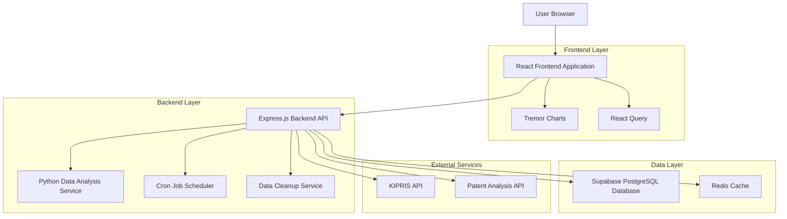
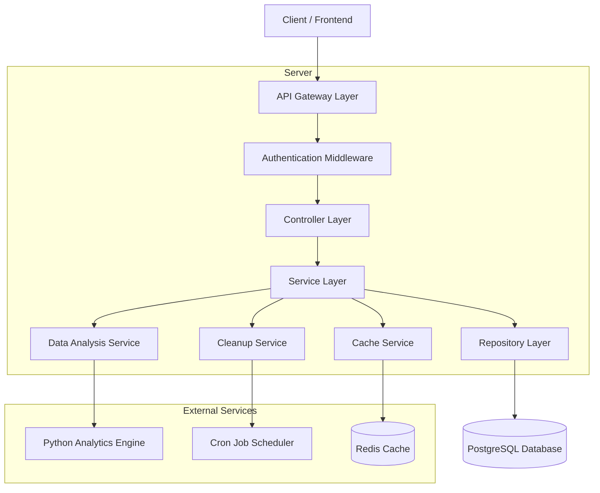
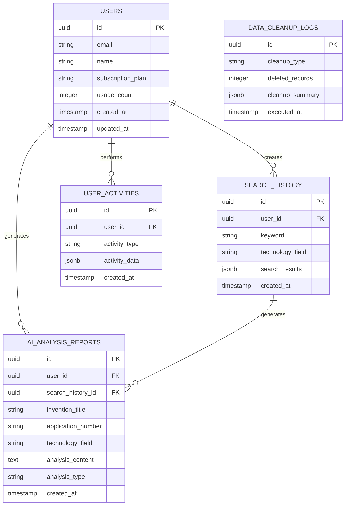

# 대시보드 데이터 관리 및 분석 시스템 기술 아키텍처

## 1. Architecture design



## 2. Technology Description

- **Frontend**: React@18 + TypeScript + Tremor@3 + TailwindCSS@3 + Vite
- **Backend**: Express@4 + Node.js@18
- **Database**: Supabase (PostgreSQL@15)
- **Data Analysis**: Python@3.11 + pandas + matplotlib + psycopg2
- **Caching**: Redis@7
- **Scheduling**: node-cron

## 3. Route definitions

| Route | Purpose |
|-------|---------|
| /dashboard | 메인 대시보드 페이지, 실시간 통계 및 IPC/CPC 분석 표시 |
| /dashboard/analytics | 상세 분석 리포트 페이지, 기술 분야별 심화 분석 |
| /dashboard/data-management | 데이터 관리 페이지, 보존 정책 및 정리 현황 |
| /dashboard/settings | 시스템 설정 페이지, 자동화 및 알림 설정 |
| /api/dashboard-stats | 대시보드 통계 데이터 API |
| /api/data-cleanup | 데이터 정리 작업 API |
| /api/analytics/export | 분석 데이터 내보내기 API |

## 4. API definitions

### 4.1 Core API

대시보드 통계 조회
```
GET /api/dashboard-stats
```

Request:
| Param Name | Param Type | isRequired | Description |
|------------|------------|------------|-------------|
| period | string | false | 조회 기간 (30d, 100d, 1y) |
| user_id | string | false | 특정 사용자 ID (관리자용) |

Response:
| Param Name | Param Type | Description |
|------------|------------|-------------|
| quota_status | object | 할당량 상태 정보 |
| efficiency_metrics | object | 효율성 지표 |
| recent_activities | object | 최근 활동 데이터 |
| technology_fields | object | IPC/CPC 분석 데이터 |
| search_trends | object | 검색 트렌드 데이터 |
| report_trends | object | 리포트 트렌드 데이터 |

데이터 정리 작업 실행
```
POST /api/data-cleanup
```

Request:
| Param Name | Param Type | isRequired | Description |
|------------|------------|------------|-------------|
| cleanup_type | string | true | 정리 유형 (auto, manual, selective) |
| retention_days | number | false | 보존 일수 (기본값: 100) |
| tables | array | false | 대상 테이블 목록 |

Response:
| Param Name | Param Type | Description |
|------------|------------|-------------|
| success | boolean | 작업 성공 여부 |
| deleted_records | number | 삭제된 레코드 수 |
| cleanup_summary | object | 정리 작업 요약 |

분석 데이터 내보내기
```
GET /api/analytics/export
```

Request:
| Param Name | Param Type | isRequired | Description |
|------------|------------|------------|-------------|
| format | string | true | 내보내기 형식 (csv, json, xlsx) |
| data_type | string | true | 데이터 유형 (search, report, combined) |
| date_range | object | true | 날짜 범위 |

Response:
| Param Name | Param Type | Description |
|------------|------------|-------------|
| download_url | string | 다운로드 URL |
| file_size | number | 파일 크기 (bytes) |
| expires_at | string | 만료 시간 |

## 5. Server architecture diagram



## 6. Data model

### 6.1 Data model definition



### 6.2 Data Definition Language

검색 기록 테이블 (search_history)
```sql
-- 기존 테이블에 technology_field 컬럼 추가
ALTER TABLE search_history 
ADD COLUMN IF NOT EXISTS technology_field VARCHAR(100);

-- 인덱스 생성
CREATE INDEX IF NOT EXISTS idx_search_history_technology_field 
ON search_history(technology_field);

CREATE INDEX IF NOT EXISTS idx_search_history_user_created 
ON search_history(user_id, created_at);
```

AI 분석 리포트 테이블 (ai_analysis_reports)
```sql
-- 기존 테이블에 필요한 컬럼들 추가
ALTER TABLE ai_analysis_reports 
ADD COLUMN IF NOT EXISTS technology_field VARCHAR(100),
ADD COLUMN IF NOT EXISTS application_number VARCHAR(50),
ADD COLUMN IF NOT EXISTS analysis_type VARCHAR(20) DEFAULT 'market';

-- 인덱스 생성
CREATE INDEX IF NOT EXISTS idx_ai_analysis_reports_technology_field 
ON ai_analysis_reports(technology_field);

CREATE INDEX IF NOT EXISTS idx_ai_analysis_reports_user_created 
ON ai_analysis_reports(user_id, created_at);
```

데이터 정리 로그 테이블 (data_cleanup_logs)
```sql
-- 데이터 정리 작업 로그 테이블 생성
CREATE TABLE IF NOT EXISTS data_cleanup_logs (
    id UUID PRIMARY KEY DEFAULT gen_random_uuid(),
    cleanup_type VARCHAR(20) NOT NULL CHECK (cleanup_type IN ('auto', 'manual', 'selective')),
    target_tables TEXT[] NOT NULL,
    retention_days INTEGER NOT NULL DEFAULT 100,
    deleted_records INTEGER NOT NULL DEFAULT 0,
    cleanup_summary JSONB DEFAULT '{}',
    executed_at TIMESTAMP WITH TIME ZONE DEFAULT NOW(),
    executed_by UUID REFERENCES users(id) ON DELETE SET NULL
);

-- 인덱스 생성
CREATE INDEX IF NOT EXISTS idx_data_cleanup_logs_executed_at 
ON data_cleanup_logs(executed_at DESC);

CREATE INDEX IF NOT EXISTS idx_data_cleanup_logs_cleanup_type 
ON data_cleanup_logs(cleanup_type);
```

데이터 자동 정리 함수
```sql
-- 100일 이상 된 데이터 자동 삭제 함수
CREATE OR REPLACE FUNCTION cleanup_old_data(
    p_retention_days INTEGER DEFAULT 100,
    p_cleanup_type VARCHAR(20) DEFAULT 'auto'
) RETURNS JSONB AS $$
DECLARE
    v_cutoff_date TIMESTAMP WITH TIME ZONE;
    v_deleted_searches INTEGER := 0;
    v_deleted_reports INTEGER := 0;
    v_deleted_activities INTEGER := 0;
    v_cleanup_summary JSONB;
BEGIN
    -- 기준 날짜 계산
    v_cutoff_date := NOW() - INTERVAL '1 day' * p_retention_days;
    
    -- 오래된 검색 기록 삭제
    DELETE FROM search_history 
    WHERE created_at < v_cutoff_date;
    GET DIAGNOSTICS v_deleted_searches = ROW_COUNT;
    
    -- 오래된 AI 분석 리포트 삭제
    DELETE FROM ai_analysis_reports 
    WHERE created_at < v_cutoff_date;
    GET DIAGNOSTICS v_deleted_reports = ROW_COUNT;
    
    -- 오래된 사용자 활동 삭제
    DELETE FROM user_activities 
    WHERE created_at < v_cutoff_date;
    GET DIAGNOSTICS v_deleted_activities = ROW_COUNT;
    
    -- 정리 요약 생성
    v_cleanup_summary := jsonb_build_object(
        'cutoff_date', v_cutoff_date,
        'deleted_searches', v_deleted_searches,
        'deleted_reports', v_deleted_reports,
        'deleted_activities', v_deleted_activities,
        'total_deleted', v_deleted_searches + v_deleted_reports + v_deleted_activities
    );
    
    -- 정리 로그 기록
    INSERT INTO data_cleanup_logs (
        cleanup_type, 
        target_tables, 
        retention_days, 
        deleted_records, 
        cleanup_summary
    ) VALUES (
        p_cleanup_type,
        ARRAY['search_history', 'ai_analysis_reports', 'user_activities'],
        p_retention_days,
        v_deleted_searches + v_deleted_reports + v_deleted_activities,
        v_cleanup_summary
    );
    
    RETURN v_cleanup_summary;
END;
$$ LANGUAGE plpgsql SECURITY DEFINER;

-- 함수 실행 권한 부여
GRANT EXECUTE ON FUNCTION cleanup_old_data TO authenticated;
```

자동 정리 스케줄러 설정
```sql
-- 매일 자정에 자동 정리 실행하는 cron job 설정
-- (실제 구현은 Node.js의 node-cron 사용)
SELECT cron.schedule(
    'daily-data-cleanup',
    '0 0 * * *',  -- 매일 자정
    'SELECT cleanup_old_data(100, ''auto'');'
);
```