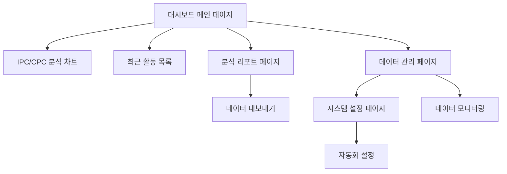

# 대시보드 데이터 관리 및 분석 시스템 개선 PRD

## 1. Product Overview

IP-Insight AI 플랫폼의 대시보드 데이터 관리 및 분석 시스템을 개선하여 실시간 데이터 기반의 정확한 통계 분석과 효율적인 데이터 관리를 제공합니다.
- 100일 데이터 보존 정책을 통한 자동화된 데이터 정리 시스템 구축
- 실제 검색/리포트 데이터 기반의 IPC/CPC 기술 분야 분석 및 시각화 제공

## 2. Core Features

### 2.1 User Roles
| Role | Registration Method | Core Permissions |
|------|---------------------|------------------|
| 일반 사용자 | 이메일 회원가입 | 개인 대시보드 조회, 검색/리포트 생성 |
| 프리미엄 사용자 | 구독 업그레이드 | 고급 분석 기능, 확장된 데이터 접근 |
| 관리자 | 시스템 권한 부여 | 전체 시스템 관리, 데이터 정리 작업 |

### 2.2 Feature Module

대시보드 데이터 관리 및 분석 시스템은 다음 주요 페이지들로 구성됩니다:

1. **대시보드 메인 페이지**: 실시간 통계, IPC/CPC 분석 차트, 최근 활동 목록
2. **데이터 관리 페이지**: 데이터 보존 정책 설정, 자동 정리 상태 모니터링
3. **분석 리포트 페이지**: 상세 기술 분야 분석, 트렌드 분석, 데이터 내보내기
4. **시스템 설정 페이지**: 데이터 정리 스케줄 관리, 알림 설정

### 2.3 Page Details

| Page Name | Module Name | Feature description |
|-----------|-------------|---------------------|
| 대시보드 메인 페이지 | 실시간 통계 대시보드 | 검색/리포트 통계, 효율성 지표, 할당량 상태 표시 |
| 대시보드 메인 페이지 | IPC/CPC 분석 차트 | 개인/시장 기술 분야 분포 분석, 인터랙티브 차트 표시 |
| 대시보드 메인 페이지 | 최근 활동 목록 | 최근 검색어 10개, 최근 리포트 10개 목록 표시 |
| 데이터 관리 페이지 | 데이터 보존 정책 | 100일 이상 데이터 자동 삭제, 정리 스케줄 관리 |
| 데이터 관리 페이지 | 데이터 모니터링 | 테이블별 데이터 현황, 저장 공간 사용량 표시 |
| 분석 리포트 페이지 | 기술 분야 분석 | 상세 IPC/CPC 분류별 통계, 트렌드 분석 |
| 분석 리포트 페이지 | 데이터 내보내기 | CSV/JSON 형태로 분석 데이터 내보내기 |
| 시스템 설정 페이지 | 자동화 설정 | 데이터 정리 주기 설정, 알림 임계값 설정 |

## 3. Core Process

### 일반 사용자 Flow
1. 대시보드 메인 페이지 접속
2. 실시간 통계 및 IPC/CPC 분석 차트 확인
3. 최근 검색어/리포트 목록 조회
4. 상세 분석이 필요한 경우 분석 리포트 페이지로 이동
5. 필요시 데이터 내보내기 기능 사용

### 관리자 Flow
1. 시스템 설정 페이지에서 데이터 관리 정책 설정
2. 데이터 관리 페이지에서 현황 모니터링
3. 필요시 수동 데이터 정리 작업 실행
4. 시스템 알림 및 로그 확인

## 4. User Interface Design

### 4.1 Design Style
- **Primary Colors**: #2563eb (파란색), #059669 (녹색)
- **Secondary Colors**: #64748b (회색), #f1f5f9 (연한 회색)
- **Button Style**: 둥근 모서리 (rounded-lg), 그라데이션 효과
- **Font**: Inter, Noto Sans KR (한글), 14px-16px 기본 크기
- **Layout Style**: 카드 기반 레이아웃, 좌측 네비게이션
- **Icon Style**: Heroicons, 일관된 선 굵기와 스타일

### 4.2 Page Design Overview

| Page Name | Module Name | UI Elements |
|-----------|-------------|-------------|
| 대시보드 메인 페이지 | 실시간 통계 | KPI 카드 그리드, 색상 코딩된 지표, 애니메이션 효과 |
| 대시보드 메인 페이지 | IPC/CPC 분석 차트 | 도넛 차트, 막대 차트, 호버 인터랙션, 범례 |
| 대시보드 메인 페이지 | 최근 활동 목록 | 타임라인 스타일, 아이콘 표시, 페이지네이션 |
| 데이터 관리 페이지 | 데이터 현황 | 프로그레스 바, 테이블 뷰, 상태 배지 |
| 분석 리포트 페이지 | 상세 분석 | 다중 차트 레이아웃, 필터 옵션, 드릴다운 기능 |

### 4.3 Responsiveness
- 데스크톱 우선 설계, 태블릿/모바일 적응형 레이아웃
- 터치 인터랙션 최적화, 스와이프 제스처 지원
- 반응형 차트 및 테이블 구현