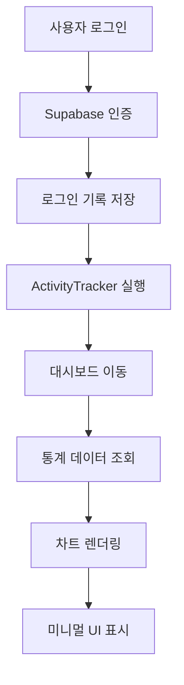

# 로그인 기록 수정 및 대시보드 재설계 요구사항 문서

## 1. 프로젝트 개요
특허 AI 플랫폼의 로그인 기록 시스템 오류 수정 및 대시보드 전면 재설계를 통한 사용자 경험 개선
현재 로그인 활동이 데이터베이스에 제대로 기록되지 않는 문제와 대시보드 데이터 표시 오류를 해결하고, 미니멀하고 고급스러운 디자인으로 전면 개편

## 2. 핵심 기능

### 2.1 사용자 역할
| 역할 | 등록 방법 | 핵심 권한 |
|------|-----------|----------|
| 일반 사용자 | 이메일 회원가입 | 검색, 리포트 생성, 대시보드 조회 |
| 관리자 | 초대 코드 업그레이드 | 전체 시스템 관리, 사용자 통계 조회 |

### 2.2 기능 모듈
프로젝트는 다음 주요 페이지들로 구성됩니다:
1. **로그인 페이지**: 사용자 인증, 로그인 기록 추적
2. **대시보드 페이지**: 통계 표시, 활동 추적, 성과 지표
3. **관리자 페이지**: 시스템 모니터링, 사용자 활동 분석

### 2.3 페이지 세부사항

| 페이지명 | 모듈명 | 기능 설명 |
|---------|--------|----------|
| 로그인 페이지 | 인증 시스템 | 사용자 로그인, 세션 관리, 로그인 기록 DB 저장 |
| 로그인 페이지 | 활동 추적 | 로그인 시간, IP 주소, 사용자 에이전트 기록 |
| 대시보드 페이지 | 통계 카드 | 총 로그인 수, 검색 수, 리포트 수, 사용자 효율성 지표 |
| 대시보드 페이지 | 차트 시각화 | 검색/리포트 트렌드, 기술 분야 분포, 활동 패턴 |
| 대시보드 페이지 | 최근 활동 | 최근 검색 기록, 최근 리포트, 실시간 활동 피드 |
| 관리자 페이지 | 시스템 모니터링 | 전체 사용자 통계, 시스템 성능, 오류 로그 |

## 3. 핵심 프로세스

### 로그인 기록 프로세스
1. 사용자가 로그인 페이지에서 인증 정보 입력
2. Supabase Auth를 통한 사용자 인증 처리
3. 인증 성공 시 user_activities 테이블에 로그인 기록 저장
4. user_login_logs 테이블에 상세 로그인 정보 저장 (IP, 시간, 브라우저 정보)
5. ActivityTracker를 통한 실시간 활동 추적
6. 대시보드로 리다이렉트

### 대시보드 데이터 표시 프로세스
1. 사용자 대시보드 접근
2. get_dashboard_stats RPC 함수 호출로 통계 데이터 조회
3. 실시간 데이터 가공 및 차트 데이터 생성
4. 미니멀 디자인의 카드 형태로 통계 표시
5. 반응형 차트 및 그래프 렌더링

## 4. 사용자 인터페이스 디자인

### 4.1 디자인 스타일
- **주요 색상**: #1f2937 (다크 그레이), #3b82f6 (블루), #10b981 (그린)
- **보조 색상**: #f8fafc (라이트 그레이), #ffffff (화이트)
- **버튼 스타일**: 둥근 모서리 (rounded-lg), 그라데이션 효과
- **폰트**: Inter, system-ui, 16px 기본 크기
- **레이아웃**: 카드 기반, 그리드 시스템, 최소 여백 24px
- **아이콘**: Heroicons, 일관된 스타일

### 4.2 페이지 디자인 개요

| 페이지명 | 모듈명 | UI 요소 |
|---------|--------|---------|
| 로그인 페이지 | 인증 폼 | 중앙 정렬 카드, 그라데이션 배경, 애니메이션 효과 |
| 대시보드 페이지 | 통계 카드 | 4열 그리드, 그림자 효과, 호버 애니메이션 |
| 대시보드 페이지 | 차트 영역 | 2열 그리드, 반응형 차트, 부드러운 색상 팔레트 |
| 대시보드 페이지 | 활동 피드 | 타임라인 스타일, 실시간 업데이트, 스크롤 가능 |

### 4.3 반응형 디자인
- **데스크톱 우선** 설계로 모바일 적응형 구현
- **터치 인터랙션** 최적화로 모바일 사용성 향상
- **브레이크포인트**: sm(640px), md(768px), lg(1024px), xl(1280px)
- **그리드 시스템**: 데스크톱 4열 → 태블릿 2열 → 모바일 1열