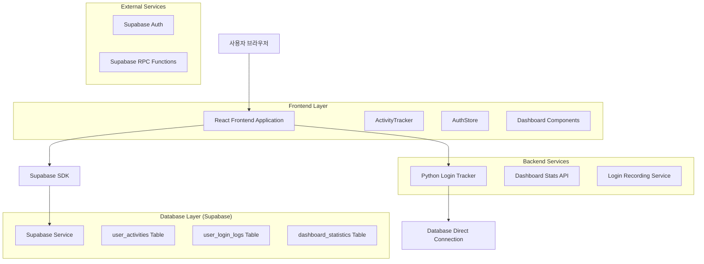
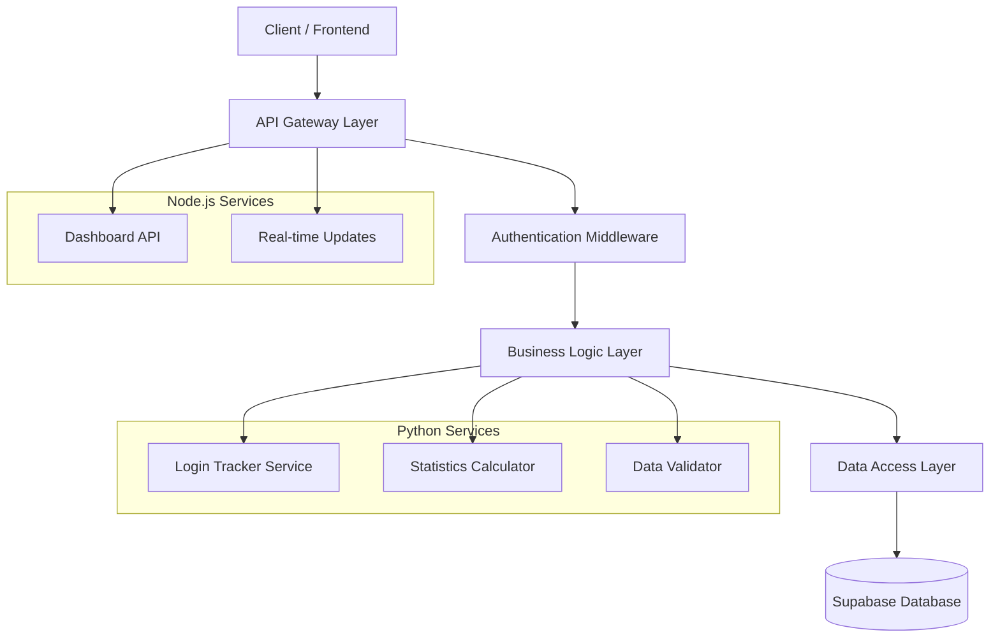
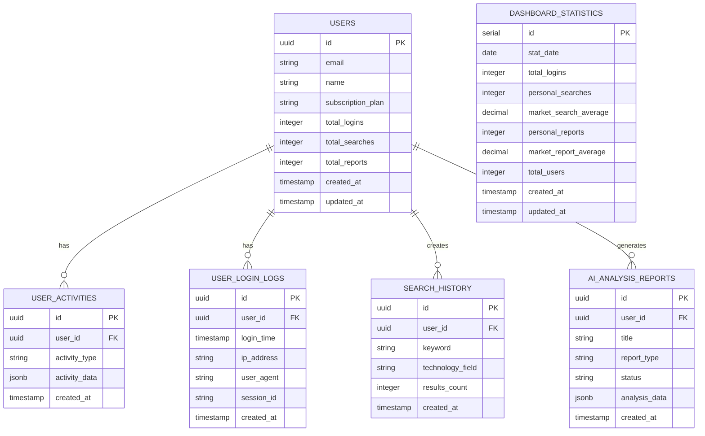

# 로그인 기록 수정 및 대시보드 재설계 기술 아키텍처

## 1. 아키텍처 설계



## 2. 기술 스택 설명

- **Frontend**: React@18 + TypeScript + Tailwind CSS + Vite
- **Backend**: Python@3.9 + Supabase SDK + Node.js Express
- **Database**: Supabase (PostgreSQL) + RLS Policies
- **Authentication**: Supabase Auth + JWT Tokens
- **Charts**: Chart.js + Recharts + Tremor
- **State Management**: Zustand

## 3. 라우트 정의

| 라우트 | 목적 |
|-------|------|
| /login | 로그인 페이지, 사용자 인증 및 로그인 기록 |
| /dashboard | 메인 대시보드, 통계 및 차트 표시 |
| /admin | 관리자 페이지, 시스템 모니터링 |

## 4. API 정의

### 4.1 로그인 기록 API

**로그인 기록 저장**
```
POST /api/login-tracking
```

Request:
| 파라미터명 | 파라미터 타입 | 필수여부 | 설명 |
|-----------|-------------|---------|------|
| user_id | string | true | 사용자 UUID |
| login_time | string | true | 로그인 시간 (ISO 8601) |
| ip_address | string | true | 사용자 IP 주소 |
| user_agent | string | true | 브라우저 정보 |

Response:
| 파라미터명 | 파라미터 타입 | 설명 |
|-----------|-------------|------|
| success | boolean | 기록 성공 여부 |
| login_id | string | 생성된 로그인 기록 ID |

Example:
```json
{
  "user_id": "550e8400-e29b-41d4-a716-446655440000",
  "login_time": "2024-01-15T09:30:00Z",
  "ip_address": "192.168.1.100",
  "user_agent": "Mozilla/5.0 (Windows NT 10.0; Win64; x64)"
}
```

**대시보드 통계 조회**
```
GET /api/dashboard-stats
```

Request:
| 파라미터명 | 파라미터 타입 | 필수여부 | 설명 |
|-----------|-------------|---------|------|
| user_id | string | true | 사용자 UUID |
| period | string | false | 조회 기간 (기본값: 100d) |

Response:
| 파라미터명 | 파라미터 타입 | 설명 |
|-----------|-------------|------|
| total_logins | number | 총 로그인 수 |
| personal_searches | number | 개인 검색 수 |
| personal_reports | number | 개인 리포트 수 |
| efficiency_metrics | object | 효율성 지표 |

## 5. 서버 아키텍처 다이어그램



## 6. 데이터 모델

### 6.1 데이터 모델 정의



### 6.2 데이터 정의 언어

**사용자 활동 테이블 (user_activities)**
```sql
-- 테이블 생성
CREATE TABLE user_activities (
    id UUID PRIMARY KEY DEFAULT gen_random_uuid(),
    user_id UUID NOT NULL REFERENCES auth.users(id) ON DELETE CASCADE,
    activity_type VARCHAR(50) NOT NULL,
    activity_data JSONB DEFAULT '{}',
    created_at TIMESTAMP WITH TIME ZONE DEFAULT NOW()
);

-- 인덱스 생성
CREATE INDEX idx_user_activities_user_id ON user_activities(user_id);
CREATE INDEX idx_user_activities_type ON user_activities(activity_type);
CREATE INDEX idx_user_activities_created_at ON user_activities(created_at DESC);

-- RLS 정책 설정
ALTER TABLE user_activities ENABLE ROW LEVEL SECURITY;

CREATE POLICY "사용자는 자신의 활동만 조회 가능" ON user_activities
    FOR SELECT USING (auth.uid() = user_id);

CREATE POLICY "사용자는 자신의 활동만 삽입 가능" ON user_activities
    FOR INSERT WITH CHECK (auth.uid() = user_id);

-- 권한 부여
GRANT SELECT, INSERT ON user_activities TO authenticated;
GRANT SELECT ON user_activities TO anon;
```

**로그인 기록 테이블 (user_login_logs)**
```sql
-- 테이블 생성
CREATE TABLE user_login_logs (
    id UUID PRIMARY KEY DEFAULT gen_random_uuid(),
    user_id UUID NOT NULL REFERENCES auth.users(id) ON DELETE CASCADE,
    login_time TIMESTAMP WITH TIME ZONE DEFAULT NOW(),
    ip_address INET,
    user_agent TEXT,
    session_id VARCHAR(255),
    created_at TIMESTAMP WITH TIME ZONE DEFAULT NOW()
);

-- 인덱스 생성
CREATE INDEX idx_user_login_logs_user_id ON user_login_logs(user_id);
CREATE INDEX idx_user_login_logs_login_time ON user_login_logs(login_time DESC);

-- RLS 정책 설정
ALTER TABLE user_login_logs ENABLE ROW LEVEL SECURITY;

CREATE POLICY "사용자는 자신의 로그인 기록만 조회 가능" ON user_login_logs
    FOR SELECT USING (auth.uid() = user_id);

CREATE POLICY "로그인 기록 삽입 허용" ON user_login_logs
    FOR INSERT WITH CHECK (true);

-- 권한 부여
GRANT SELECT, INSERT ON user_login_logs TO authenticated;
GRANT SELECT ON user_login_logs TO anon;
```

**대시보드 통계 RPC 함수**
```sql
-- 대시보드 통계 조회 함수
CREATE OR REPLACE FUNCTION get_dashboard_stats(
    p_user_id UUID,
    p_period TEXT DEFAULT '100d'
)
RETURNS JSONB
LANGUAGE plpgsql
SECURITY DEFINER
AS $$
DECLARE
    result JSONB;
    period_interval INTERVAL;
    start_date TIMESTAMP WITH TIME ZONE;
BEGIN
    -- 기간 설정
    CASE p_period
        WHEN '7d' THEN period_interval := INTERVAL '7 days';
        WHEN '30d' THEN period_interval := INTERVAL '30 days';
        WHEN '100d' THEN period_interval := INTERVAL '100 days';
        ELSE period_interval := INTERVAL '100 days';
    END CASE;
    
    start_date := NOW() - period_interval;
    
    -- 통계 데이터 수집
    SELECT jsonb_build_object(
        'total_logins', COALESCE((
            SELECT COUNT(*) FROM user_login_logs 
            WHERE user_id = p_user_id AND login_time >= start_date
        ), 0),
        'personal_searches', COALESCE((
            SELECT COUNT(*) FROM search_history 
            WHERE user_id = p_user_id AND created_at >= start_date
        ), 0),
        'personal_reports', COALESCE((
            SELECT COUNT(*) FROM ai_analysis_reports 
            WHERE user_id = p_user_id AND created_at >= start_date
        ), 0),
        'efficiency_metrics', jsonb_build_object(
            'login_to_report_rate', CASE 
                WHEN (SELECT COUNT(*) FROM user_login_logs WHERE user_id = p_user_id) > 0 
                THEN ROUND((SELECT COUNT(*) FROM ai_analysis_reports WHERE user_id = p_user_id)::DECIMAL / 
                          (SELECT COUNT(*) FROM user_login_logs WHERE user_id = p_user_id) * 100, 2)
                ELSE 0 
            END
        )
    ) INTO result;
    
    RETURN result;
END;
$$;

-- 함수 권한 부여
GRANT EXECUTE ON FUNCTION get_dashboard_stats(UUID, TEXT) TO authenticated;
```

**초기 데이터 삽입**
```sql
-- 대시보드 통계 테이블 초기 데이터
INSERT INTO dashboard_statistics (
    stat_date, total_logins, personal_searches, market_search_average,
    personal_reports, market_report_average, total_users
) VALUES (
    CURRENT_DATE, 0, 0, 0.00, 0, 0.00, 
    (SELECT COUNT(*) FROM auth.users WHERE email_confirmed_at IS NOT NULL)
) ON CONFLICT (stat_date) DO UPDATE SET
    updated_at = NOW();
```