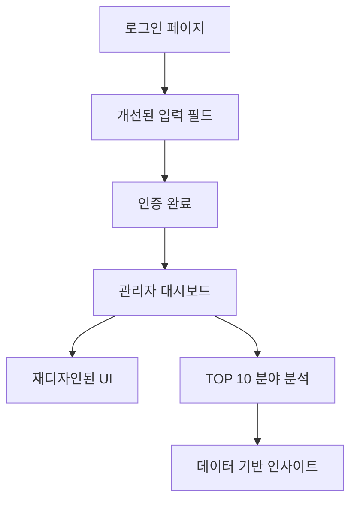

# 특허 AI 플랫폼 개선사항 PRD

## 1. Product Overview

특허 AI 플랫폼의 사용자 경험 개선 및 관리자 대시보드 기능 확장을 위한 3가지 핵심 개선사항을 구현합니다.
- 로그인 UI 개선을 통한 사용자 접근성 향상, 관리자 대시보드 디자인 현대화, 그리고 데이터 기반 인사이트 제공을 목표로 합니다.
- 기존 기능을 유지하면서 시각적 개선과 새로운 분석 기능을 추가하여 플랫폼의 전반적인 사용성과 관리 효율성을 높입니다.

## 2. Core Features

### 2.1 User Roles
기존 사용자 역할 구조를 유지합니다:

| Role | Registration Method | Core Permissions |
|------|---------------------|------------------|
| 일반 사용자 | 이메일 회원가입 | 특허 검색, 리포트 생성, 프로필 관리 |
| 관리자 | 관리자 계정 생성 | 전체 시스템 관리, 사용자 관리, 대시보드 접근 |

### 2.2 Feature Module
이번 개선사항은 다음 3개 주요 모듈에 집중됩니다:

1. **로그인 페이지**: 입력 필드 UI 개선, 반응형 레이아웃 최적화
2. **관리자 대시보드**: 시각적 디자인 재구성, 현대적 UI/UX 적용
3. **리포트 분석 모듈**: TOP 10 분야 분석 기능 추가

### 2.3 Page Details

| Page Name | Module Name | Feature description |
|-----------|-------------|---------------------|
| 로그인 페이지 | 입력 필드 개선 | 이메일/비밀번호 입력창 가로 확장, 반응형 레이아웃 적용, 시각적 일관성 개선 |
| 관리자 대시보드 | 디자인 재구성 | 기존 데이터 구조 유지하면서 현대적 디자인 적용, 색상 체계 개선, 타이포그래피 최적화 |
| 관리자 대시보드 | TOP 10 분야 분석 | DB 리포트 제목 분석을 통한 특허 분야 TOP 10 생성, 실시간 데이터 기반 인사이트 제공 |

## 3. Core Process

### 사용자 플로우
1. **로그인 개선**: 사용자가 더 넓은 입력 필드로 편리하게 로그인 정보 입력
2. **관리자 대시보드 접근**: 관리자가 새로운 디자인의 대시보드에서 개선된 시각적 경험 제공
3. **분야 분석 확인**: 관리자가 TOP 10 특허 분야 데이터를 통해 트렌드 파악

## 4. User Interface Design

### 4.1 Design Style
- **Primary Colors**: 기존 ms-olive (#6B7280) 유지, 보조 색상으로 현대적 그라데이션 추가
- **Button Style**: 둥근 모서리(rounded-lg), 그림자 효과, 호버 애니메이션
- **Font**: 기존 시스템 폰트 유지, 크기 계층 구조 개선 (text-responsive-* 클래스 활용)
- **Layout Style**: 카드 기반 레이아웃, 그리드 시스템, 반응형 디자인
- **Icon Style**: Lucide React 아이콘 세트 유지, 일관된 크기와 스타일

### 4.2 Page Design Overview

| Page Name | Module Name | UI Elements |
|-----------|-------------|-------------|
| 로그인 페이지 | 입력 필드 | 가로 확장된 Input 컴포넌트 (min-width: 320px), 개선된 패딩과 마진, 반응형 그리드 |
| 관리자 대시보드 | 전체 레이아웃 | 현대적 카드 디자인, 개선된 색상 팔레트, 그라데이션 배경, 향상된 타이포그래피 |
| 관리자 대시보드 | TOP 10 차트 | 새로운 차트 컴포넌트, 인터랙티브 요소, 데이터 시각화 개선 |

### 4.3 Responsiveness
- **Desktop-first** 접근 방식 유지
- **Mobile-adaptive** 디자인으로 태블릿과 모바일에서 최적화
- **Touch interaction** 최적화로 모바일 사용성 개선