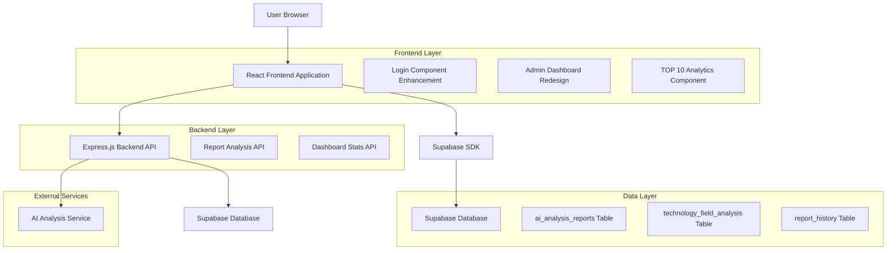
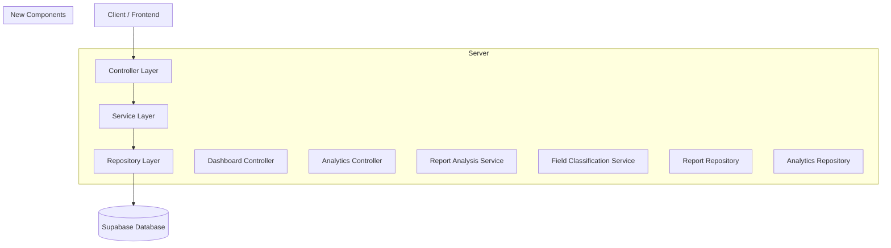
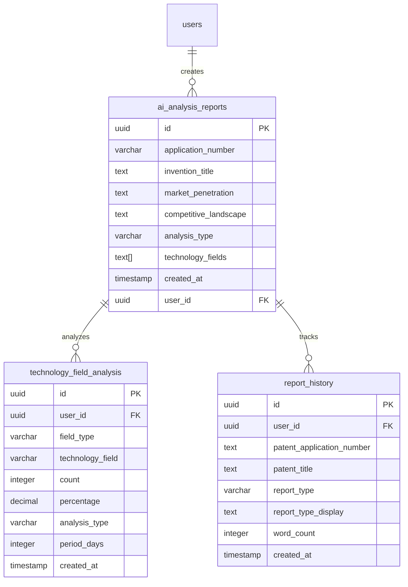

# 특허 AI 플랫폼 개선사항 기술 아키텍처

## 1. Architecture design



## 2. Technology Description

* Frontend: React\@18 + TypeScript + Tailwind CSS\@3 + Vite

* Backend: Express.js + Node.js

* Database: Supabase (PostgreSQL)

* UI Components: Custom UI 라이브러리 (Button, Input, Card 등)

* Charts: 기존 차트 라이브러리 + 새로운 TOP 10 차트 컴포넌트

* State Management: Zustand (authStore, adminStore)

## 3. Route definitions

| Route            | Purpose                         |
| ---------------- | ------------------------------- |
| /login           | 개선된 로그인 페이지, 확장된 입력 필드 UI       |
| /admin/dashboard | 재디자인된 관리자 대시보드, TOP 10 분야 분석 포함 |
| /admin/\*        | 기존 관리자 페이지들 (변경 없음)             |

## 4. API definitions

### 4.1 Core API

리포트 분야 분석 관련 새로운 API

```
GET /api/dashboard/top-patent-fields
```

Request:

| Param Name | Param Type | isRequired | Description                   |
| ---------- | ---------- | ---------- | ----------------------------- |
| period     | string     | false      | 분석 기간 (7d, 30d, 90d) 기본값: 30d |
| limit      | number     | false      | 결과 개수 제한, 기본값: 10             |

Response:

| Param Name | Param Type | Description      |
| ---------- | ---------- | ---------------- |
| success    | boolean    | API 호출 성공 여부     |
| data       | array      | TOP 10 특허 분야 데이터 |
| total      | number     | 전체 리포트 수         |

Example Response:

```json
{
  "success": true,
  "data": [
    {
      "rank": 1,
      "field": "인공지능/머신러닝",
      "count": 145,
      "percentage": 23.5,
      "ipc_code": "G06N"
    },
    {
      "rank": 2,
      "field": "바이오테크놀로지",
      "count": 98,
      "percentage": 15.9,
      "ipc_code": "A61B"
    }
  ],
  "total": 617
}
```

### 4.2 Enhanced Dashboard API

기존 대시보드 API 확장

```
GET /api/dashboard/extended-stats
```

Response에 새로운 필드 추가:

| Param Name               | Param Type | Description       |
| ------------------------ | ---------- | ----------------- |
| top\_patent\_fields      | array      | TOP 10 특허 분야 데이터  |
| field\_analysis\_updated | string     | 분야 분석 마지막 업데이트 시간 |

## 5. Server architecture diagram



## 6. Data model

### 6.1 Data model definition



### 6.2 Data Definition Language

새로운 분야 분석을 위한 뷰 생성:

```sql
-- TOP 10 특허 분야 분석 뷰
CREATE OR REPLACE VIEW v_top_patent_fields AS
SELECT 
    ROW_NUMBER() OVER (ORDER BY field_count DESC) as rank,
    CASE 
        WHEN invention_title ILIKE '%인공지능%' OR invention_title ILIKE '%AI%' OR invention_title ILIKE '%머신러닝%' THEN '인공지능/머신러닝'
        WHEN invention_title ILIKE '%바이오%' OR invention_title ILIKE '%bio%' OR invention_title ILIKE '%의료%' THEN '바이오테크놀로지'
        WHEN invention_title ILIKE '%반도체%' OR invention_title ILIKE '%칩%' OR invention_title ILIKE '%프로세서%' THEN '반도체/전자'
        WHEN invention_title ILIKE '%통신%' OR invention_title ILIKE '%네트워크%' OR invention_title ILIKE '%5G%' THEN '통신기술'
        WHEN invention_title ILIKE '%자동차%' OR invention_title ILIKE '%모빌리티%' OR invention_title ILIKE '%자율주행%' THEN '모빌리티/자동차'
        WHEN invention_title ILIKE '%에너지%' OR invention_title ILIKE '%배터리%' OR invention_title ILIKE '%태양광%' THEN '에너지/환경'
        WHEN invention_title ILIKE '%소프트웨어%' OR invention_title ILIKE '%앱%' OR invention_title ILIKE '%플랫폼%' THEN '소프트웨어/플랫폼'
        WHEN invention_title ILIKE '%화학%' OR invention_title ILIKE '%소재%' OR invention_title ILIKE '%나노%' THEN '화학/소재'
        WHEN invention_title ILIKE '%로봇%' OR invention_title ILIKE '%자동화%' OR invention_title ILIKE '%IoT%' THEN '로봇/자동화'
        ELSE '기타'
    END as field_name,
    field_count,
    ROUND((field_count::DECIMAL / total_reports.total) * 100, 1) as percentage,
    CASE 
        WHEN invention_title ILIKE '%인공지능%' OR invention_title ILIKE '%AI%' THEN 'G06N'
        WHEN invention_title ILIKE '%바이오%' OR invention_title ILIKE '%의료%' THEN 'A61B'
        WHEN invention_title ILIKE '%반도체%' THEN 'H01L'
        WHEN invention_title ILIKE '%통신%' THEN 'H04L'
        WHEN invention_title ILIKE '%자동차%' THEN 'B60W'
        WHEN invention_title ILIKE '%에너지%' THEN 'H01M'
        WHEN invention_title ILIKE '%소프트웨어%' THEN 'G06F'
        WHEN invention_title ILIKE '%화학%' THEN 'C07D'
        WHEN invention_title ILIKE '%로봇%' THEN 'B25J'
        ELSE 'G'
    END as ipc_code
FROM (
    SELECT 
        CASE 
            WHEN invention_title ILIKE '%인공지능%' OR invention_title ILIKE '%AI%' OR invention_title ILIKE '%머신러닝%' THEN '인공지능/머신러닝'
            WHEN invention_title ILIKE '%바이오%' OR invention_title ILIKE '%bio%' OR invention_title ILIKE '%의료%' THEN '바이오테크놀로지'
            WHEN invention_title ILIKE '%반도체%' OR invention_title ILIKE '%칩%' OR invention_title ILIKE '%프로세서%' THEN '반도체/전자'
            WHEN invention_title ILIKE '%통신%' OR invention_title ILIKE '%네트워크%' OR invention_title ILIKE '%5G%' THEN '통신기술'
            WHEN invention_title ILIKE '%자동차%' OR invention_title ILIKE '%모빌리티%' OR invention_title ILIKE '%자율주행%' THEN '모빌리티/자동차'
            WHEN invention_title ILIKE '%에너지%' OR invention_title ILIKE '%배터리%' OR invention_title ILIKE '%태양광%' THEN '에너지/환경'
            WHEN invention_title ILIKE '%소프트웨어%' OR invention_title ILIKE '%앱%' OR invention_title ILIKE '%플랫폼%' THEN '소프트웨어/플랫폼'
            WHEN invention_title ILIKE '%화학%' OR invention_title ILIKE '%소재%' OR invention_title ILIKE '%나노%' THEN '화학/소재'
            WHEN invention_title ILIKE '%로봇%' OR invention_title ILIKE '%자동화%' OR invention_title ILIKE '%IoT%' THEN '로봇/자동화'
            ELSE '기타'
        END as field_category,
        COUNT(*) as field_count
    FROM ai_analysis_reports 
    WHERE created_at >= NOW() - INTERVAL '30 days'
    GROUP BY field_category
) grouped_fields
CROSS JOIN (
    SELECT COUNT(*) as total 
    FROM ai_analysis_reports 
    WHERE created_at >= NOW() - INTERVAL '30 days'
) total_reports
ORDER BY field_count DESC
LIMIT 10;

-- 분야 분석 업데이트 함수
CREATE OR REPLACE FUNCTION update_patent_field_analysis()
RETURNS void AS $$
BEGIN
    -- technology_field_analysis 테이블 업데이트
    INSERT INTO technology_field_analysis (
        user_id, field_type, technology_field, count, percentage, analysis_type, period_days, created_at
    )
    SELECT 
        NULL as user_id,
        'global_report' as field_type,
        field_name as technology_field,
        field_count as count,
        percentage,
        'comprehensive' as analysis_type,
        30 as period_days,
        NOW() as created_at
    FROM v_top_patent_fields
    ON CONFLICT (user_id, field_type, technology_field, analysis_type, period_days) 
    DO UPDATE SET 
        count = EXCLUDED.count,
        percentage = EXCLUDED.percentage,
        created_at = EXCLUDED.created_at;
END;
$$ LANGUAGE plpgsql;

-- 인덱스 생성
CREATE INDEX IF NOT EXISTS idx_ai_analysis_reports_title_search 
ON ai_analysis_reports USING gin(to_tsvector('korean', invention_title));

CREATE INDEX IF NOT EXISTS idx_ai_analysis_reports_created_at_desc 
ON ai_analysis_reports(created_at DESC);

CREATE INDEX IF NOT EXISTS idx_technology_field_analysis_composite 
ON technology_field_analysis(field_type, analysis_type, period_days, created_at DESC);
```

